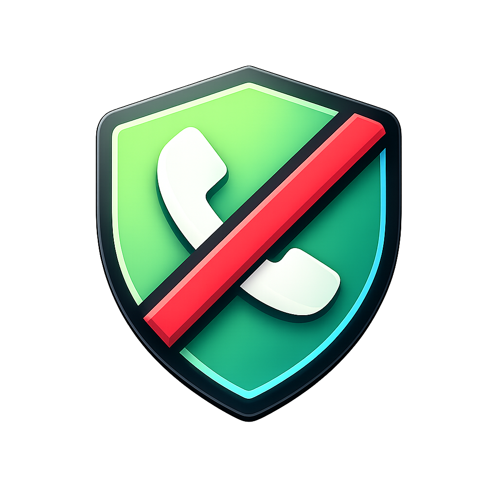

<p align="center">
  
</p>

<h1 align="center">CallShield</h1>

<p align="center">
  <strong>Open-source spam call and text blocker for Android</strong><br>
  11-layer detection engine | 32,933 spam numbers | No API keys | No tracking
</p>

<p align="center">
  <a href="https://github.com/SysAdminDoc/CallShield/releases/latest"></a>
  
  
  
  
</p>

---

CallShield blocks spam calls and texts using an **11-layer on-device detection engine** powered by a community-maintained spam database hosted right here on GitHub. Everything runs locally on your phone — no accounts, no cloud processing, no data collection.

## How It Works

1. **GitHub-hosted database** — spam numbers and prefix rules stored in `data/spam_numbers.json`
2. **App syncs locally** — fetches the database and caches it for instant offline lookups
3. **11-layer detection** — every call and SMS passes through multiple detection engines in order
4. **Contact safe** — numbers in your contacts are never blocked, regardless of other signals
5. **Community-driven** — report spam numbers via GitHub Issues to protect everyone

## 11 Detection Layers

Every incoming call and SMS is checked against these layers, in order. The first match wins.

| # | Layer | How It Works |
|---|-------|-------------|
| 1 | **Manual Whitelist** | Numbers you've explicitly marked as always-allow. Bypasses everything. |
| 2 | **Contact Whitelist** | Numbers in your phone's contacts always pass through. Zero false positives for people you know. |
| 3 | **User Blocklist** | Your personal block list — numbers you've manually blocked with descriptions. |
| 4 | **Database Match** | Exact number lookup against FTC/FCC complaint data and community reports synced from this repo. |
| 5 | **Prefix Rules** | 19 rules blocking entire number ranges — US premium rate (+1900), wangiri country codes (Sierra Leone, Somalia, Jamaica, Dominican Republic, Grenada, and more). |
| 6 | **Wildcard / Regex** | Custom pattern rules you define. Block patterns like `+1832555*` or full regex like `^\+1832\d{7}$`. |
| 7 | **Quiet Hours** | Block all non-contact calls during configurable hours (e.g., 10 PM - 7 AM). |
| 8 | **Frequency Auto-Block** | Numbers that appear 3+ times in your blocked log get automatically blocked. |
| 9 | **STIR/SHAKEN** | Blocks calls where the carrier's caller ID authentication fails — catches spoofed numbers. Android 11+ only. |
| 10 | **Heuristic Engine** | On-device scoring: VoIP spam ranges, international premium rate, rapid-fire calling (3+ calls/hour), neighbor spoofing, toll-free abuse patterns. Returns a confidence score. |
| 11 | **SMS Content Analysis** | 30+ regex patterns scanning message text for phishing links, URL shorteners (bit.ly, tinyurl), suspicious TLDs (.xyz, .top), urgency language, financial scam keywords, excessive caps. Plus your custom keyword rules. |

## Features

### Number Lookup
- **Instant spam check** — type or paste any number, get a verdict through all 11 layers
- **Spam Score Gauge** — animated 0-100 arc widget with color coding (green/yellow/orange/red)
- **Auto-paste clipboard** — opens with your clipboard number pre-filled
- **Area code lookup** — 330+ US/CA area codes mapped to city and state
- **Reverse web lookup** — scrapes public phone databases for community reports
- **Haptic feedback** — distinct vibration for spam vs clean results
- **Detection method icons** — unique icon per layer (database, heuristic, STIR/SHAKEN, keyword, etc.)

### Caller ID & Awareness
- **Caller ID overlay** — shows area code/location for ALL incoming non-contact calls, spam warning for suspicious ones
- **Google search button** — on the overlay, one-tap to search Google for the calling number
- **After-call spam rating** — "Was this spam?" notification for unknown callers after each call
- **Contact name resolution** — shows contact display name in number detail and recent calls
- **Notification deep link** — tap a blocked notification to open the number's full detail screen

### Recent Calls
- Pulls from your phone's actual call log with call type icons (incoming, outgoing, missed, rejected)
- Every number annotated with spam indicators, area code location, and contact name
- Tap any entry to open the full number detail screen

### Blocked Log
- **Swipe-to-dismiss** — swipe left to delete, right to block permanently
- **Log grouping** — toggle to collapse repeated numbers with count badges
- **Long-press to copy** — copy any number to clipboard
- **Filter chips** — filter by all, calls, or SMS with counts
- **Area code location** on every entry
- **Staggered entrance animations** — smooth reveal on scroll

### Scanners
- **Call log scanner** — scan your existing call history for known spam numbers
- **SMS inbox scanner** — scan existing text messages against all detection layers including keyword rules
- Results shown inline on dashboard with one-tap block buttons

### Rules Management (5 tabs)
- **Blocklist** — manually blocked numbers with descriptions, export/import as JSON
- **Wildcards** — glob patterns (`+1832555*`) or full regex with enable/disable toggle
- **Keywords** — SMS keyword blocking rules with case-sensitivity option
- **Whitelist** — always-allow numbers that bypass all 11 detection layers
- **Database** — browse the full synced spam database

### Statistics
- **Weekly bar chart** — spam trends over the last 7 days with spring-animated bars
- **Type breakdown** — which detection layers are catching the most spam, with progress bars
- **Top offenders** — ranked list of the most persistent spam numbers
- **Area code heatmap** — top 15 area codes by spam volume with city/state labels

### Smart Features
- **Smart suggestions** — detects area code patterns in your blocked calls. When 5+ spam calls share an area code, suggests blocking it with one tap
- **Blocking profiles** — one-tap presets: Work (allow unknowns), Personal (block unknowns), Sleep (contacts only + quiet hours), Maximum (aggressive + everything), Off
- **Frequency auto-escalation** — repeat callers automatically blocked after threshold
- **Aggressive mode** — lowers heuristic thresholds. Contacts always safe regardless

### Data & Backup
- **Full backup/restore** — all blocklist, whitelist, and wildcard rules in one JSON file
- **Export/import blocklist** — share blocklists with friends
- **CSV log export** — export entire blocked log as CSV for analysis or evidence
- **Auto-cleanup** — configurable log retention (7, 14, 30, or 90 days)
- **Auto-sync** — database syncs from GitHub every 6 hours via WorkManager
- **Daily digest notification** — 24-hour summary of blocked calls and texts

### Community
- **One-tap anonymous contribution** — tap "Report Spam" to anonymously submit a number to the community database. No account, no browser, one button. Powered by Cloudflare Workers.
- **False positive reporting** — tap "Not Spam" to whitelist a number locally AND report the false positive to the community. Numbers with enough "Not Spam" reports get removed from the database.
- **Live community endpoint** — [`callshield-reports.snafumatthew.workers.dev`](https://callshield-reports.snafumatthew.workers.dev)
- **Share as spam** — share a number as a warning to any app (messages, social media, email)
- **Home screen widget** — blocked count today + total, taps open the app
- **Global search** — search across the spam database from the top app bar
- **Deep link handling** — receive `tel:` intents to check any number

### System Integration
- **Quick Settings tile** — toggle protection on/off from the notification shade
- **App shortcuts** — long-press app icon for "Quick Lookup" and "Scan"
- **Notification grouping** — blocked notifications grouped under a summary, rate-limited (max 1 per 5 seconds)
- **Material You monochrome icon** — themed icon on Android 13+ launchers
- **Notification quick actions** — "Block forever" and "Report" buttons directly in notifications

### User Experience
- First-launch onboarding wizard with call screener setup
- Permission check banner when critical permissions are missing
- Phone number formatting — `(212) 555-1234` throughout the app
- AMOLED black theme with Catppuccin Mocha accents
- Animated dashboard — pulsing shield, counter rollup animations
- Sync freshness indicator with color coding
- 6-tab navigation: Home, Recent, Log, Lookup, Blocklist, More
- More hub: Statistics, Settings, Protection Test, What's New, Quick Links, About
- Protection test — validates all detection layers and permissions in one tap
- Full changelog with version history

## Requirements

- Android 10+ (API 29)
- STIR/SHAKEN requires Android 11+ (API 30)
- Caller ID overlay requires "Display over other apps" permission

## Report a Spam Number

1. [Open an Issue](../../issues/new?template=spam_report.md) with the phone number
2. Or submit a PR editing `data/spam_numbers.json` directly
3. Or tap "Report" on any blocked notification or number detail screen in the app

## Data Sources

- **FTC Do Not Call Complaints** — auto-imported from FTC public API via `scripts/update_ftc.py`
- **FCC Consumer Complaints** — aggregated via `scripts/import_blocklists.py`
- **Prefix Rules** — 19 curated rules for premium rate and wangiri scam country codes
- **Community Reports** — submitted via GitHub Issues and Pull Requests
- **On-Device Heuristics** — VoIP ranges, spam patterns, SMS content analysis, custom keyword rules

## Privacy

CallShield does not collect, transmit, or store any personal data on external servers. All detection runs entirely on-device. The only network requests are:
- Syncing the spam database from this GitHub repository (public, no auth)
- Optional reverse phone lookup via public web sources (user-initiated only)

No API keys. No accounts. No analytics. No ads.

## Building

```bash
./gradlew assembleRelease
```

Requires JDK 17+. Signed APK output at `app/build/outputs/apk/release/app-release.apk`.

## Tech Stack

| Component | Technology |
|-----------|-----------|
| Language | Kotlin |
| UI | Jetpack Compose + Material 3 |
| Theme | AMOLED black + Catppuccin Mocha |
| Database | Room (SQLite) — 6 entities |
| Networking | OkHttp |
| JSON | Moshi |
| Settings | DataStore Preferences |
| Background | WorkManager |
| Min SDK | 29 (Android 10) |
| Target SDK | 35 |

## License

MIT
