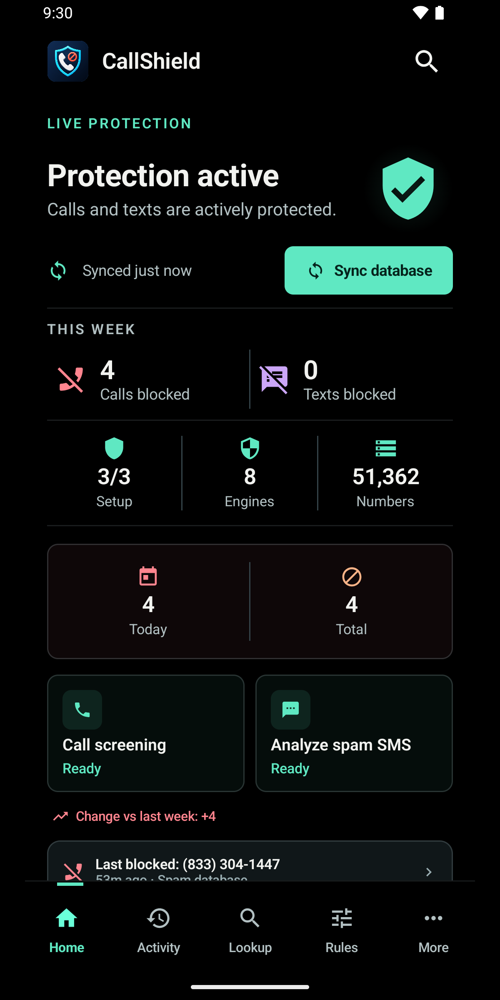
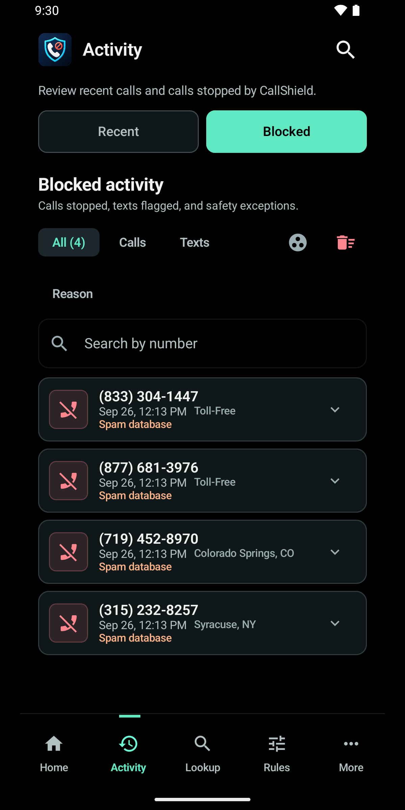
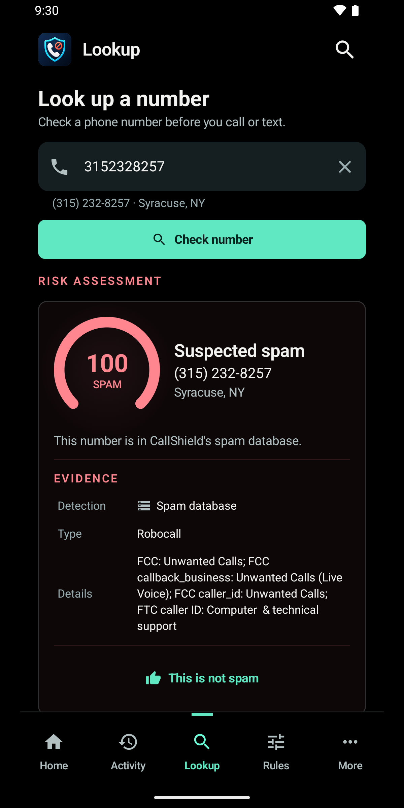
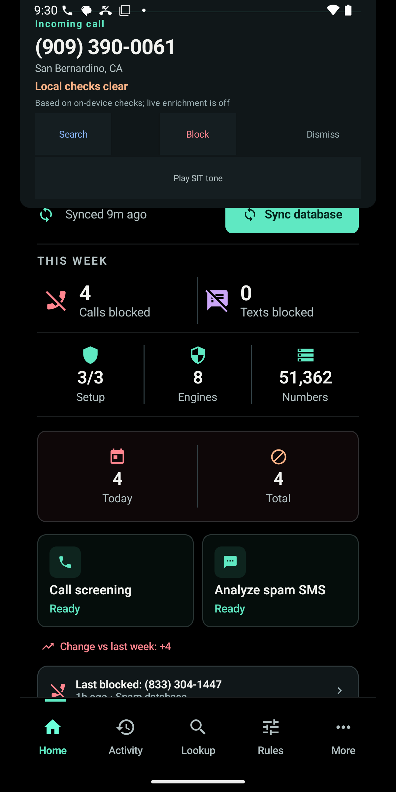
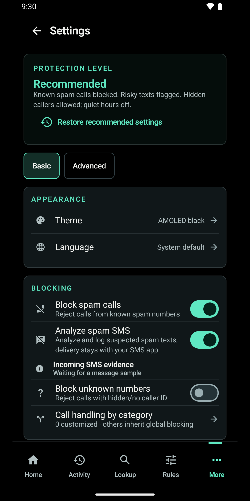
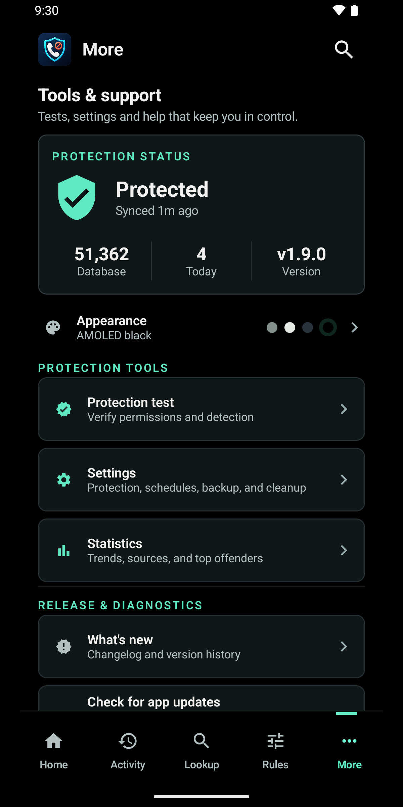

<p align="center">
  
</p>

<h1 align="center">CallShield</h1>

<p align="center">
  <strong>Open-source spam call and text blocker for Android</strong><br>
  15+ layer detection + Gradient-Boosted Tree ML | 51,463 spam numbers | Real-time caller ID | RCS filter | No required API keys
</p>

<p align="center">
  <a href="https://github.com/SysAdminDoc/CallShield/releases/latest"></a>
  
  
  
  
  
</p>

---

CallShield blocks spam calls and texts using a **15+ layer on-device detection engine** with a gradient-boosted tree ML scorer, campaign burst detection, RCS notification filter, and real-time caller ID overlay. Powered by a 51,463-number database with scheduled hot-list updates. Community-maintained, no accounts, no tracking.

## Screenshots

<p align="center">
  
  
  
</p>
<p align="center">
  
  
  
</p>

## v1.7.32 Highlights

- **Guided first-run setup** — CallShield walks through phone and message
  access, call screening, alerts, caller ID, and notification access one step
  at a time.
- **Direct Android handoffs** — every action opens the relevant system prompt
  or settings screen, explains how to return, and rechecks the result.
- **Verified before finish** — setup cannot be dismissed with missing supported
  access; revoked permissions route back to the exact incomplete step.

## v1.7.31 Highlights

- **One recognizable CallShield mark** — a luminous cyan shield, white handset,
  and coral block badge sit on a deep navy full-bleed tile.
- **Consistent branding everywhere** — adaptive, legacy, round, monochrome,
  splash, shortcut, notification, in-app, Play Store, and README surfaces now
  share the same logo system.
- **Built to own the icon** — the navy field fills every Android launcher
  mask while dedicated compact and monochrome marks stay clear at small sizes.

## v1.7.30 Highlights

- **Light-first themes** — new and legacy-default installs open in the warm
  light palette, while System, Graphite, and AMOLED remain one tap away from
  the new Appearance row in More.
- **A simpler five-destination shell** — Recent and Blocked are now persistent
  Activity tabs, and manual protection tools have a single Rules home.
- **Premium visual system** — larger type, compact headers, shorter copy,
  filled controls, fewer borders and pills, and a more consistent spacing
  rhythm across every primary destination.

## v1.7.29 Highlights

- **Reports land on the key a real call matches.** A number written in the local
  dialling form ("+86 **0**558 646 8536") kept its national trunk digit at the
  report endpoint, so the entry was stored but could never match the caller.
- **One reporter can no longer manufacture a trend.** Repeat submissions seconds
  apart were counted as independent corroboration, enough to push a number onto
  the trending list every device syncs — and enough to whittle a genuine entry
  off it with repeated "not spam" votes.
- **CallShield is open to translation.** `docs/TRANSLATING.md` plus a checker
  that catches the failures which only appear at runtime, in a language the
  maintainer may not read.
- **145 dead text resources removed**, including 70 accessibility labels that
  were never attached to anything.

## v1.7.28 Highlights

- **Report-pipeline integrity** — the community-report worker no longer
  fabricates US numbers out of ten-digit international reports, nine scam-prefix
  rows that collided with real country codes (blocking Auckland, Norwegian, and
  Eswatini callers) are fixed, spam-domain flagging needs three distinct
  reported numbers, and the HTTP-only import source is gated behind an explicit
  opt-in.
- **Detection correctness** — quiet hours is calls-only again (no more cancelled
  night-time OTP notifications) and start = end blocks all day as documented,
  "Allow temporarily" now beats downloaded prefix data, 23 missing in-service
  area codes no longer trip region blocking, midnight-wrapping schedules cover
  their after-midnight tail, and the screening budget uses the monotonic clock.
- **UI state that survives** — rotation keeps your tab, open dialogs, filters,
  and typed input; tab switches preserve every screen's scroll and state; the
  suspicion overlay is no longer replaced by the generic caller-ID panel; block
  reasons and report feedback are localized everywhere; and Light/Graphite users
  get a matching window with no black flashes.

## v1.7.26 Highlights

- **Audit-pass hardening** — a deep audit drained ~20 findings: every
  external/settings intent is crash-guarded on browserless devices, the caller-ID
  overlay is density-scaled, wildcard rules compile once on the hot path, and the
  post-call screen verifies a real recent call before any community spam report.
- **Fewer surprises, more polish** — "Block area code" now confirms before adding
  a ~7.9M-number rule, cold starts paint the real theme with no black flash, the
  home-screen widget follows the system light/dark theme, and list rows stop
  replaying their entrance animation on every scroll.
- **Localization and consistency** — schedule labels, rule descriptions, and
  restore/blocklist status use localized strings and a typed success flag instead
  of English-text sniffing; Settings capitalization is unified; backup exports are
  capped to the restore limit and no longer leak raw exception text.

## v1.7.25 Highlights

- **Roaming-safe number matching** — phone identities canonicalize under the
  SIM's home region instead of the visited network, so blocks and whitelists
  keep matching abroad and the one-time identity migration cannot bake in the
  wrong country.
- **Screening edge cases hardened** — unknown-direction calls fail open with an
  explicit response, the explicit-block guard for per-category actions matches
  the real system block-list source, duplicate call-log rows no longer defeat
  repeated-call urgency, and lettered SMS sender IDs can no longer opt out of
  keyword and content screening.
- **Backup and export reliability** — export failures report instead of
  crashing, blocklist imports are transactional, restores with a typed
  passphrase reject unauthenticated plaintext files, legacy backups no longer
  duplicate log rows on repeated merges, and encrypted backups stay restorable
  across future KDF strengthening.
- **Calmer, more accessible surfaces** — settings toggles are fully tappable
  single TalkBack nodes, informational captions meet WCAG AA contrast in every
  theme, the Lookup tab reads the clipboard only when Paste is tapped, the
  Lookup shortcut lands on the right tab, and the role-loss alert clears the
  moment protection is restored.

## v1.7.22 Highlights

- **Safer personal trust rules** — contact trust can cover every contact or
  only selected Android contact groups, with local-only identifiers and clear
  degraded behavior when contacts permission is unavailable.
- **More precise call control** — each detected call category can ring, go to
  voicemail, block, or inherit the global policy; known-risk outgoing calls can
  optionally show a local-only warning without interrupting the call.
- **Protected portable backups** — passphrase-encrypted exports use
  PBKDF2-HMAC-SHA256 and AES-256-GCM, while atomic restore preserves the prior
  settings and database state if any selected section fails.
- **Stronger protection recovery** — CallShield detects loss of Android's call
  screening role and provides a single actionable recovery notification.
- **Zero-baseline release gates** — ktlint and Detekt now pass without stored
  suppression baselines, release metadata is synchronized automatically, and
  signing-secret preflight rejects tracked credentials without echoing them.

## v1.7.21 Highlights

- **Four professional themes** — choose System, Light, Graphite, or true-black
  AMOLED from Settings. The selection persists across restarts and applies to
  the main app, onboarding, dialogs, and post-call surfaces.
- **Calmer visual hierarchy** — a tighter type scale, restrained semantic
  surfaces, quieter borders, and denser section rhythm replace decorative
  gradients and excess card framing.
- **Faster settings and navigation** — shorter descriptions, compact control
  rows, consolidated appearance options, and one shared header for nested More
  destinations reduce scrolling and duplicated chrome.
- **Contrast protected by tests** — text, secondary text, and primary actions
  meet WCAG AA contrast requirements in every named palette.
- **Category-level call control** — debt collection, political, robocall, scam,
  phishing, telemarketing, survey, and nonprofit calls can independently
  inherit the global policy, ring, go to voicemail, or be blocked.
- **Protected portable backups** — optionally encrypt exports with a passphrase
  using PBKDF2-HMAC-SHA256 and authenticated AES-256-GCM. CallShield never
  saves the passphrase, and existing plaintext JSON backups remain importable.

## v1.7.20 Highlights

- **Private Android backups** — cloud backup now excludes the Room database and
  its phone numbers, call history, and raw blocked-message bodies. Direct
  device transfer and explicit portable backups remain available.
- **Smaller, auditable APK assets** — builds package only the five runtime data
  feeds. Verification tasks fail if repository-only report payloads enter a
  debug or release APK.
- **Safer screening boundaries** — outgoing calls leave the inbound pipeline
  immediately, while malformed, text-only, or overlong caller IDs follow the
  user's unknown-caller rule instead of bypassing it.
- **More complete portable backups** — active temporary block/allow expiries
  and selected notification-screening apps now survive a validated v5 backup
  round trip; oversized restores are rejected before expensive processing.
- **Resilient local settings** — corrupt public or private DataStore files
  recover to safe defaults instead of repeatedly breaking startup and call
  screening.
- **Privacy-safe diagnostics** — shared crash reports redact phone-like values,
  credential fields, and private URL components, with bounded exception output.
- **Refined secondary flows** — language changes stay on the current nested
  screen, activity-log swipes recover correctly, and source/status labels are
  clear even when supported apps are not installed.

## v1.7.17 Highlights

- **Protection self-heals** — the RCS notification filter now rebinds itself if
  Android unbinds it (low memory, app update, OEM kill), and app updates without
  a reboot re-assert all background workers and the listener. A corrupt local
  database is now detected and rebuilt (re-syncing from the cloud) instead of
  silently letting every call ring through.
- **Leaner daily digest** — the 24-hour blocked-activity summary is computed with
  aggregate database queries instead of loading the full window into memory.
- **OEM battery-kill awareness** — the app can now detect when an aggressive
  battery manager is likely to kill background protection, and when the spam
  database has gone stale, so those risks can be surfaced.
- **More tested internals** — Robolectric now exercises notification actions,
  SMS reassembly, real call-screening allow/silence/reject outcomes, and the
  SMS phishing-warning entrypoint (831 tests total).

## v1.7.16 Highlights

- **Safer imports** — blocklist import and backup restore now read the selected
  file through a bounded reader (32 MB cap) and cap applied rows, guarding
  against out-of-memory on a huge or malformed file.
- **Android 16 notifications** — blocked-call alerts group and summarize cleanly
  so a burst stays visible instead of being cooldown-muted.
- **ML transparency** — the on-device model reports a health state, so a corrupt
  model that quietly falls back to the simpler scorer is now logged instead of
  silently degrading detection.

## v1.7.15 Highlights

- **Fewer false blocks** — legitimate US/Canada callers from area codes like 678
  (Atlanta), 267 (Philadelphia), 224 (Chicago), 385 (Salt Lake City) and others
  are no longer misblocked as international "wangiri" scams, and international
  numbers that merely share digits with US premium lines (e.g. Mongolia +976)
  are no longer flagged.
- **Safer data** — backup restore and hot-list refresh are now fully atomic (no
  half-applied state on failure); CSV log exports are hardened against
  spreadsheet formula injection; the phishing-URL check caps its response size.

## v1.7.14 Highlights

- **Correctness fixes** — the after-call "Was this spam?" notification now
  dismisses when you tap its buttons; phishing-URL (URLhaus) warnings no longer
  require SMS blocking to be on; and a burst of legitimate SMS from one carrier
  prefix can no longer trip campaign blocking of real voice calls.
- **Caller-ID overlay dismisses when the call ends** instead of lingering for a
  fixed 20 seconds.
- **RTL-safe numbers** — phone numbers are bidi-isolated in notifications so they
  render correctly inside Arabic/Hebrew text.
- **Hardening** — malformed ML fallback weights are rejected instead of silently
  zeroed; GitHub default-branch lookups are cached to avoid rate-limit
  exhaustion; RCS encrypted-message placeholders are detected across more
  languages; CVE-2026-53914 build-cache posture documented.

## v1.7.13 Highlights

- **Fully free, zero API keys** — the optional AbstractAPI key field has been
  removed from Settings. CallShield no longer has any manual credential entry;
  every lookup and enrichment source it uses is free and needs no sign-up. Any
  key saved by an earlier version is purged from the device on first launch.
- **Dead code removed** — the unused carrier/line-type network checker
  (`NumberTypeChecker`) and its certificate pin are gone.

## v1.7.12 Highlights

- **Durable blocked-call logging** - blocked-call decisions now enqueue an
  idempotent pending Room row before responding to Android, then a Hilt-backed
  retry worker flushes the row into the final call log without duplicating
  notifications or widget refreshes.
- **Room v10 migration** - `call_log` now carries a nullable unique `logKey`,
  `pending_blocked_call_logs` persists retry state, and migration/DAO tests
  cover duplicate suppression and retry windows.
- **Community-report abuse backoff** - the Cloudflare Worker rate-limit and
  dedup helpers now have local tests, and the Android client surfaces HTTP 429
  with the server-provided retry delay.
- **ASCII-only digit utility** - security-sensitive phone-number extraction
  and UI entry/review paths now share named ASCII-only helpers instead of
  Unicode digit matching.
- **External blocklist subscription guardrails** - custom HTTPS CSV/TXT/JSON
  feeds validate byte and row limits, preview add/remove/source impact before
  commit, and can be disabled or removed with feed-owned rows rolled back.

- **Compose BOM 2026.05.00 refresh** — UI dependencies now resolve on the
  current Compose 1.11.1 release train, with Material 3 1.4.0 and refreshed
  lifecycle/core/savedstate transitive locks across debug, release, and unit
  test configurations.
- **Configuration-aware Compose copy** — snackbar, toast, semantic, validation,
  and search-result count text now use Compose resource APIs instead of stale
  `LocalContext.getString` / `resources` reads inside composables.
- **WorkManager 2.11.2 refresh** — background sync, hot-list refresh, and
  daily digest jobs now run on the current WorkManager line with Android 15+
  network-constraint fixes.
- **Worker schedule contract tests** — sync, manual refresh, hot-list, and
  digest WorkRequests now have JVM coverage for repeat intervals, network
  constraints, initial delay, and retry backoff.
- **DataStore privacy hardening** — settings now run on DataStore 1.2.1, and
  the optional AbstractAPI enrichment key is stored in a private no-backup
  DataStore instead of the backed-up public settings file.
- **Safer backup boundary** — Android cloud backup preserves non-secret public
  preferences but excludes the Room database, which can contain call history,
  phone numbers, and SMS bodies. Direct device transfer and CallShield's
  explicit portable backup remain available for user-controlled migration.
- **Reproducible-build groundwork** — Gradle dependency locking is enabled,
  the resolved dependency graph is checked in, AGP VCS metadata is disabled for
  release APKs, and local release guards block wall-clock build metadata from
  being embedded into APK inputs.
- **Release hash sidecars** — release builds now produce SHA256 sidecars for
  APK artifact integrity, with Windows helpers for signed local releases and
  content-level APK rebuild comparisons.
- **Network hardening** — OkHttp is upgraded to 5.3.2 and all direct data,
  community-report, URL-safety, and caller-ID enrichment hosts are protected by
  centralized certificate pinning.
- **Modern Android build stack** — AGP is upgraded to 8.10.1, Kotlin/KSP are
  aligned on 2.2.21, and Room is upgraded to 2.8.4, keeping codegen and R8
  compatible with the current Kotlin metadata used by the networking stack.
- **Stats and scan feedback polish** — weekly activity labels now respect locale weekday names, Statistics detection-source labels are resource-backed, and scan permission/failure copy is consistent across call-log and SMS flows.
- **Settings credential polish** — the optional AbstractAPI key is masked by default, has explicit show/hide control, reports "Not configured", "Saved locally", and "Unsaved changes" states before saving, and is now kept out of backed-up public preferences.
- **Premium-polish UX refresh** — shared premium action, compact-action, icon-tile, and state-card treatments now unify dashboard, lookup, details, recent-call, blocklist, diagnostics, onboarding, and settings flows.
- **Clearer recovery states** — Blocked Log empty and filtered states now explain what happened and provide a direct "Show all activity" recovery action when filters hide records.
- **Trust-focused settings feedback** — the trusted push-alert source picker now shows installed-source coverage and skeleton loading while package labels resolve.
- **Hardening foundation from v1.7.2** — spoof-proof ASCII phone normalization, SMS size caps, regex ReDoS validation, LRU notice gates, separated PendingIntent IDs, and atomic crash-log writes.
- **STIR/SHAKEN Authenticated Allow** — carrier-authenticated caller ID can short-circuit weak heuristic / ML blocks while still yielding to every explicit user and system rule.
- **Answered-caller trust** — numbers answered repeatedly inside the configured lookback window can ring through lower-confidence heuristic/ML suspicion while explicit block rules still win first.
- **Emergency callback grace** — unknown callbacks can ring through after a local emergency call for a configurable window while explicit block rules still win first.
- **SMS burst protection** - repeated unknown SMS senders or same-prefix floods can be blocked as `sms_burst`, with blocked-SMS notification actions to mark safe or report.
- **952 total JVM unit tests** - the local unit suite covers detection, workers, utilities, repository contracts, and permission readiness before release.
- **Gradient-Boosted Tree ML model** — 20 features, pure Kotlin, no TFLite dependency.
- **Campaign burst detection** — NPA-NXX prefix clustering identifies coordinated spam waves.
- **Full accessibility** — content descriptions across Compose UI, 48dp minimum touch targets.

## How It Works

1. **51,463 imported spam numbers** — sourced from FCC consumer complaints (2+ reports each), FTC Do Not Call, ToastedSpam, and community reports
2. **15+ layer detection + ML** — database, heuristics, campaign burst detection, on-device gradient-boosted tree, SMS content/burst analysis, RCS filter, STIR/SHAKEN, and more
3. **Real-time caller ID overlay** — parallel lookups against SkipCalls, PhoneBlock, WhoCalledMe + OpenCNAM caller name, with SIT tone anti-autodialer
4. **Scheduled hot list** — trending spam numbers and campaign ranges refresh through the repository data pipeline
5. **Callback-aware** — won't block callbacks from numbers you recently called, answered repeatedly, after a local emergency call, or urgent repeated callers
6. **Community-driven** — one-tap anonymous contribution via Cloudflare Worker, merged into the database by the maintainer

## Detection Pipeline (v1.7.32)

All detection layers implement a shared `IChecker` interface and run in priority order via `CheckerPipeline.run` — first non-null result wins, every layer is testable in isolation. Priorities are stable numbers; the ladder below is the live order.

| Priority | Layer | Verdict | How It Works |
|---------:|-------|---------|-------------|
| 10000 | **Manual Whitelist** | Allow | Numbers you've explicitly marked as always-allow |
|  9000 | **Contact Whitelist** | Allow | Numbers in your phone's contacts always pass through |
|  8800 | **Contacts-Only Mode** | Block | Optional strict mode — everything not in your contacts is blocked |
|  8500 | **STIR/SHAKEN Failed** | Block | Carrier-authenticated caller ID failure gets blocked before heuristic layers |
|  7000 | **User Blocklist** | Block | Your own exact blocks, permanent or temporary |
|  6900 | **System Block List** (A4) | Block | Read-only bridge to Android's `BlockedNumberContract` — respects stock Phone/Messages blocks |
|  5500 | **Wildcard / Regex** | Block | Custom patterns like `+1832555*` or full regex, now with optional schedule |
|  5400 | **Range Patterns** (A5) | Block | Length-locked `#` patterns like `+33162######`, with schedule + coverage safety rail |
|  5350 | **Temporary Allow** | Allow | One-off false-positive recovery from the Blocked Log — beats all downloaded data, never your own rules |
|  5320 | **Prefix Rules** | Block | Downloaded wangiri country codes, US premium rate (+1900), international premium |
|  5300 | **STIR/SHAKEN Authenticated** | Allow | Carrier-authenticated caller ID can allow through lower-confidence heuristic/ML suspicion while explicit blocks still win first |
|  5200 | **Spam Database** | Block | 51,463 imported spam numbers plus scheduled hot-list data |
|  5150 | **Database Prefix Expansion** | Block | Auto-blocks last-two-digit siblings of confirmed database entries |
|  5000 | **Recently Dialed** | Allow | Numbers you called in the last 24h — they're probably calling back |
|  4980 | **Emergency Callback** | Allow | Unknown callbacks can ring through after a local emergency call during the configured grace window |
|  4950 | **Answered Caller** | Allow | Numbers answered repeatedly inside the configured lookback window |
|  4900 | **Repeated Urgent** | Allow | Same number calls 2x in 5 min → allowed through |
|  4850 | **Caller Name Trust** | Allow | Carrier-presented name matches one of your trust patterns |
|  4700 | **Push-Alert Bridge** (A3) | Allow | Uber/DoorDash/Amazon/Gmail notification about an arriving call? Let it through |
|  4500 | *Campaign Recorder* | — | Side-effect only; feeds burst detection below |
|  4300 | **Region Rules** | Block | Opt-in offline blocking outside your selected US/Canadian regions |
|  4000 | **Quiet Hours** | Block | Block all non-contact calls during configurable hours (calls only) |
|  3500 | **Frequency Auto-Block** | Block | Numbers that call 3+ times in 7 days get auto-blocked |
|  3000 | **Heuristic Engine** | Block | VoIP ranges, neighbor spoofing, rapid-fire detection, 30+ rules |
|  2500 | **Campaign Burst** | Block | NPA-NXX prefix clustering detects coordinated spam waves |
|  2250 | **Caller Name Rules** | Block | Carrier-presented names can match bounded, user-defined `*`/`?` patterns after every allow layer |
|  2000 | **ML Spam Scorer** | Block | 20-feature on-device gradient-boosted tree model |

SMS-specific layers (append after the shared chain, in their own priority order): **SMS Keyword Rules** (5400, with schedule) → **SMS Context Trust** (4700, trusted-sender allow) → **SMS Burst Protection** (4650) → **SMS Content Analysis** (1900 — 30+ regex patterns, URL shorteners, suspicious TLDs, spam domain blocklist).

### Additional Layers
- **Caller ID Overlay** — suspicious calls (heuristic score 30-59) can use an explicit, default-off live enrichment option with SkipCalls, PhoneBlock, WhoCalledMe + OpenCNAM caller name; clean calls never trigger these lookups
- **Region & caller-name rules** — opt-in offline blocking outside selected US/Canadian regions, plus bounded `*`/`?` trust and block patterns for carrier-presented caller names; explicit number/system/prefix/wildcard blocks and all allow layers keep priority
- **Opt-in message notification screening** — Google/Samsung Messages are enabled by default; AOSP Messages, SMS Organizer, Signal, WhatsApp, WhatsApp Business, Gmail, Outlook, and Thunderbird can be enabled individually. Private-messenger/email matches show a separate warning without removing the original notification.
- **URL Safety** — local spam-domain checks stay on-device; optional URLhaus (abuse.ch) checks default off and disclose only the registrable domain
- **STIR/SHAKEN** — blocks calls failing carrier caller ID verification (Android 11+)
- **After-Call Feedback** — "Was this spam?" notification after suspicious calls, plus an optional Android 11+ post-call screen for block/report and save-contact actions

### Per-Rule Schedules (A7)
Any wildcard, range, or SMS keyword rule can be time-gated to specific days of the week and an hour window. The hour picker supports overnight wrap; `daysMask = 0` is the "no gating" sentinel so rules created before v1.6 behave identically.

## Live Caller ID Overlay

For a locally suspicious call, CallShield can show a real-time overlay that queries **4 sources simultaneously** when the default-off **Live caller enrichment** setting is enabled:

```
┌──────────────────────────────────┐
│ LIKELY SPAM                      │
│ (212) 555-1234                   │
│ New York, NY                     │
│ Spam Score: 80% (17 reports)     │
│ JOHN DOE (OpenCNAM)             │
│ ⚠ SkipCalls: Flagged            │
│ ⚠ PhoneBlock: 5 reports         │
│ ⚠ WhoCalledMe: 12 reports       │
│ All sources checked              │
│ [Search] [Block] [Dismiss]       │
│ 🔈 Play SIT Tone (anti-dialer)  │
└──────────────────────────────────┘
```

- Shows instantly with area code, then updates live as each source responds
- **OpenCNAM** caller name lookup (free, 60 req/hr)
- **SIT Tone** — ITU-T E.180 three-tone sequence tricks autodialers into removing your number
- Color-coded: green (safe) → yellow → orange → red (spam)

## ML Spam Scorer

On-device **20-feature gradient-boosted tree** model — pure Kotlin, no TFLite, no heavy ML libraries. Runs in microseconds.

| Feature | Description |
|---------|------------|
| toll_free | 800/888/877/etc. prefix |
| high_spam_npa | Area code in high FTC/FCC complaint set |
| voip_range | NPA-NXX in known VoIP spam carrier range |
| repeated_digits_ratio | Fraction of most-common digit |
| sequential_asc/desc_ratio | Sequential digit pairs |
| all_same_digit | All 10 digits identical |
| nxx_555 | Exchange is 555 (test numbers) |
| last4_zero | Subscriber is 0000 |
| invalid_nxx | NXX starts with 0 or 1 (NANP-invalid) |
| subscriber_all_same | Last 4 digits all same (9999) |
| alternating_pattern | Even/odd positions uniform (5050505050) |
| nxx_below_200 | Often unassigned ranges |
| low_digit_entropy | Fewer than 4 distinct digits |
| subscriber_sequential | Last 4 form ascending/descending run |
| + 6 additional | Campaign proximity, time-of-day, call frequency, area code density, prefix heat, neighbor spoof score |

Trained weekly from the CallShield database (50K positive + 50K negative samples). Threshold: 0.7 (conservative).

## Features

### Number Lookup
- Instant spam check through all 15+ detection layers with animated score gauge (0-100)
- Auto-paste from clipboard, area code lookup (330+ US/CA), haptic feedback
- Multi-source reverse lookup: SkipCalls + PhoneBlock + WhoCalledMe + OpenCNAM

### Recent Calls & Blocked Log
- Recent calls with contact names, risk indicators, call type icons, filter chips (All/Missed/Spam)
- Blocked log with swipe-to-dismiss + undo, grouping with severity-scaled accent bars, filter chips
- Staggered entrance animations, shimmer loading skeletons

### Rules Management (5 tabs)
- Blocklist, Wildcards, Keywords, Whitelist, Database
- Export/import blocklists as JSON, per-rule enable/disable toggles
- Regex validation before adding wildcard rules
- Inline priority-conflict warnings name the whitelist, emergency allow, or block rule that wins before an overlapping rule is saved

### Statistics
- Weekly bar chart with daily breakdown
- Detection source donut chart
- Monthly trend line
- Top offenders, area code heatmap, hourly heatmap

### Smart Features
- Smart suggestions — detects area code spam patterns, one-tap block entire area code
- Weekly trend indicator — shows if spam is increasing or decreasing vs last week
- Last blocked preview card on dashboard with tap-to-inspect
- Blocking profiles: Work / Personal / Sleep / Maximum / Off
- Callback detection + repeated urgent caller allow-through
- FTC Do Not Call complaint filing
- After-call "Was this spam?" feedback notification

### Home Screen Widget
- Today vs yesterday blocked count with trend indicator
- Last blocked number and time
- Quick-access to lookup and protection status

### Community
- **One-tap anonymous contribution** via [Cloudflare Worker](https://callshield-reports.snafumatthew.workers.dev)
- False positive reporting subtracts votes
- Share spam warnings to any app

### Data & System
- Selective backup/restore for rules, non-secret settings, and opt-in logs; CSV log export; auto-cleanup (7/14/30/90 days)
- Weekly full sync + scheduled hot list refresh, daily digest notification
- Quick Settings tile, app shortcuts, home screen widget
- Protection test validates all layers and permissions
- Onboarding wizard with permission requests

## Data Sources

### Database (51,463 numbers + 431 range prefixes, locally maintained)
| Source | Method |
|--------|--------|
| **FCC Consumer Complaints** | Socrata API, 500K records, min 2 reports |
| **FTC Do Not Call** | `api.ftc.gov` (DEMO_KEY) |
| **Saracroche** | Daily French telemarketing ranges; imported as compact prefixes |
| **PhoneBlock** | Optional authenticated bulk snapshot; public per-number lookup remains live |
| **Nomorobo IRS** | Optional carrier-authorized callback-scam CSV feed |
| **ToastedSpam** | Community curated list |
| **Community Reports** | Anonymous via Cloudflare Worker |

The source importer also has optional adapters for **PhoneBlock's** versioned
bulk list. PhoneBlock requires an account/API key for bulk downloads on current
deployments, so the app continues to use its public per-number lookup by
default. Run `python scripts/import_all_sources.py --include-saracroche` to
refresh the French ranges; add `--phoneblock-limit 5000` and
`PHONEBLOCK_API_KEY` only when the maintainer has bulk-feed access. Saracroche
range data is published under CC BY-NC-SA 4.0 and must retain attribution and
those downstream restrictions.

The importer also accepts a carrier-authorized Nomorobo IRS callback-scam CSV
feed without embedding credentials in the app. Pass the HTTPS URL with
`--nomorobo-irs-url` (or `NOMOROBO_IRS_FEED_URL`) and, if required by the feed,
the bearer token with `--nomorobo-irs-token`/`NOMOROBO_IRS_TOKEN`. The adapter
is disabled unless explicitly configured and rejects cleartext URLs; it does
not scrape Nomorobo's restricted carrier feed.

### Hot List (scheduled refresh)
| File | Contents |
|------|----------|
| `hot_numbers.json` | Top 500 trending numbers (last 24h) |
| `hot_ranges.json` | NPA-NXX prefixes with 3+ active campaign numbers |
| `spam_domains.json` | Phishing/spam domains from community SMS reports |

### Real-Time Lookup (overlay only)
| Source | What It Returns | Auth |
|--------|----------------|------|
| **SkipCalls** | spam flag, 1M+ numbers | None |
| **PhoneBlock.net** | Votes, rating, blacklist | None |
| **WhoCalledMe** | Report count, notes | None |
| **OpenCNAM** | Caller name (CNAM) | None (60/hr) |

### URL Safety (post-decision)
| Source | What It Checks |
|--------|---------------|
| **URLhaus** (abuse.ch) | Optional, default-off malware-domain checks after local spam-domain matching; only the registrable domain is shared |

## Security

- **Network security config** — cleartext traffic disabled in production
- **Signing credentials** — stored in `local.properties`, not hardcoded in build files
- **Restricted FileProvider paths** — scoped to export directory only
- **Scoped backup** — cloud backup includes non-secret settings only; the
  sensitive database is limited to direct device transfer and explicit
  user-created portable backups
- **APK privacy gate** — builds package only the five runtime protection feeds;
  raw community submissions and maintainer files are rejected by verification
- **Direct-boot boundary** — a minimal device-encrypted mirror keeps explicit
  user blocks active before first unlock; the full database and settings remain
  credential-encrypted

## Privacy

All detection runs on-device. No personal data is collected. Network requests:
- Syncing spam database from GitHub (public)
- Optional live caller enrichment is default-off and runs only for locally suspicious calls; the setting names every destination host before a number is shared
- Community reports to Cloudflare Worker (phone number only, no identity)
- Local spam-domain checks do not disclose SMS/RCS links; optional URLhaus checks are explicit opt-in and send only the registrable domain

No API keys — none required, none optional, no credential entry anywhere in the app. No accounts. No analytics. No ads.

## Requirements

- Android 10+ (API 29)
- STIR/SHAKEN requires Android 11+ (API 30)
- Caller ID overlay requires "Display over other apps" permission
- RCS filter requires Notification Access permission

## Building

```bash
./gradlew verifyReleaseMetadata verifyReproducibleBuildInputs verifyReleaseApkReproducibleMetadata
```

Requires JDK 17+. Signed APK at `app/build/outputs/apk/release/app-release.apk`.
Generate the release hash sidecar with:

```powershell
.\scripts\write-release-sha256.ps1
```

See `docs/reproducible-builds.md` for the dependency-lock and hash-comparison
runbook.

F-Droid submission prep lives in `fastlane/metadata/android/en-US/`,
`docs/fdroid/com.sysadmindoc.callshield.yml`, and
`docs/fdroid-submission.md`. The actual F-Droid merge request and signature-copy
verification still require an fdroiddata/GitLab environment.

**Signing:** Create `local.properties` in the project root with your keystore credentials:
```properties
RELEASE_STORE_FILE=path/to/keystore.jks
RELEASE_STORE_PASSWORD=...
RELEASE_KEY_ALIAS=...
RELEASE_KEY_PASSWORD=...
```

## Testing

```bash
./gradlew testDebugUnitTest   # 952 tests
./gradlew connectedDebugAndroidTest -Pandroid.testInstrumentationRunnerArguments.class=com.sysadmindoc.callshield.platform.TargetSdkBehaviorSmokeTest
./gradlew verifyPipelineTests # Cloudflare Worker (node) + data-pipeline and translation checks (python)
```

Run tests, lint, release metadata checks, and artifact builds locally before publishing.

## Translations

CallShield ships English only. Translations are welcome — see
[docs/TRANSLATING.md](docs/TRANSLATING.md) for the resource layout, the priority
order for partial translations, and `scripts/check_translations.py`, which
verifies format specifiers and plural coverage before a PR lands. Claim a
language in [issue #7](https://github.com/SysAdminDoc/CallShield/issues/7).

## Tech Stack

| Component | Technology |
|-----------|-----------|
| Language | Kotlin 2.2.21 |
| UI | Jetpack Compose BOM 2026.05.00 + Material 3 |
| Theme | System, Light, Graphite, and true-black AMOLED |
| Database | Room 2.8.4 (SQLite) — 8 entities |
| Networking | OkHttp 5.3.2 + certificate pinning |
| JSON | Moshi |
| ML | Pure Kotlin gradient-boosted tree (20 features) |
| Settings | DataStore Preferences 1.2.1 |
| Background | WorkManager 2.11.2 |
| Community API | Cloudflare Workers |
| URL Safety | Local spam-domain data; optional URLhaus (abuse.ch) |
| Verification | Local Gradle, lint, and release-artifact checks |
| Tests | 952 JVM unit tests (JUnit) |
| Strings | 1160 string resources and 29 plural groups (translation-ready) |
| Accessibility | 100+ content descriptions, 48dp touch targets |
| Min SDK | 29 (Android 10) |
| Target SDK | 36 |

For deep technical details, see [CLAUDE.md](CLAUDE.md).

## License

MIT
