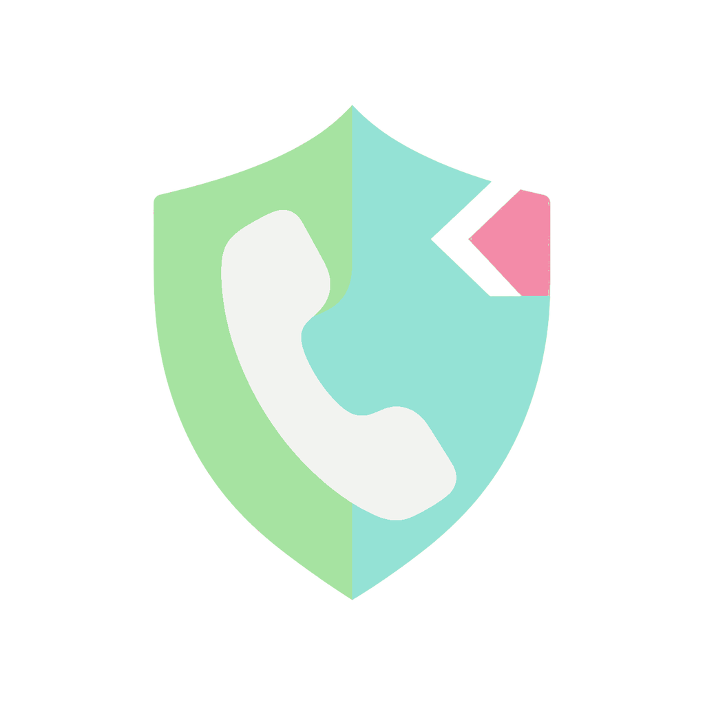
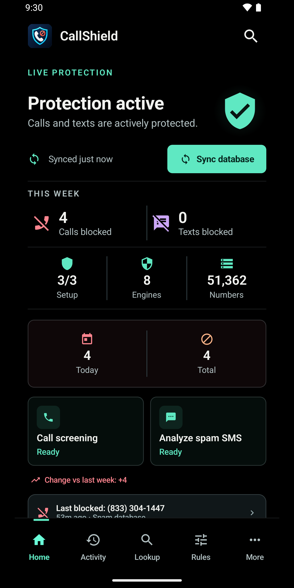
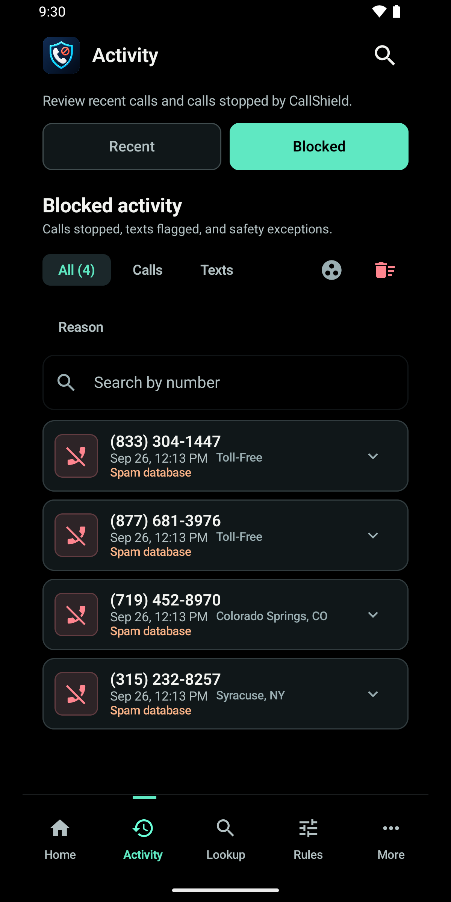
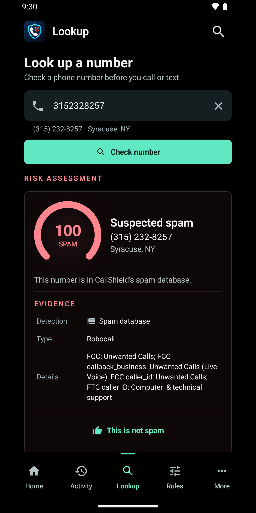
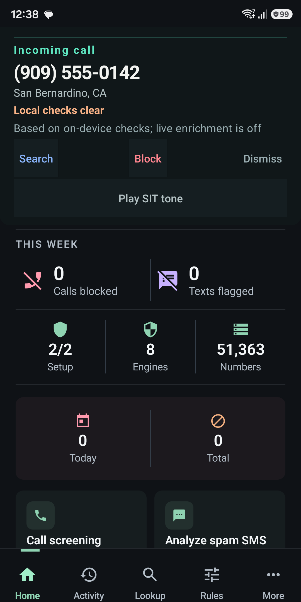
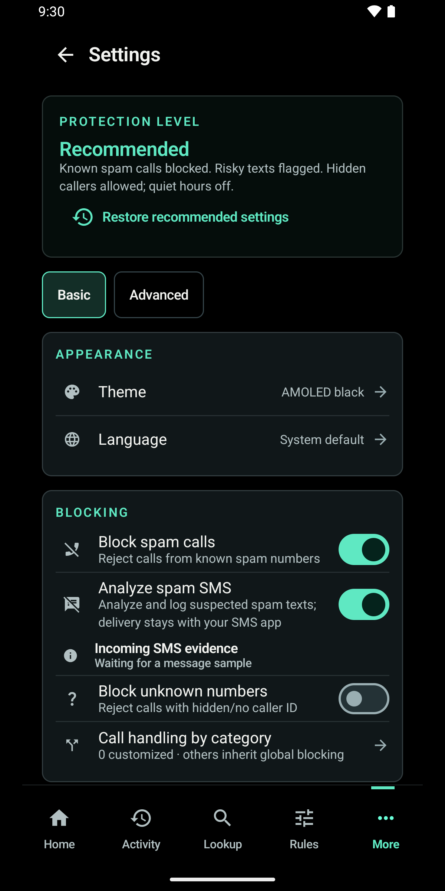
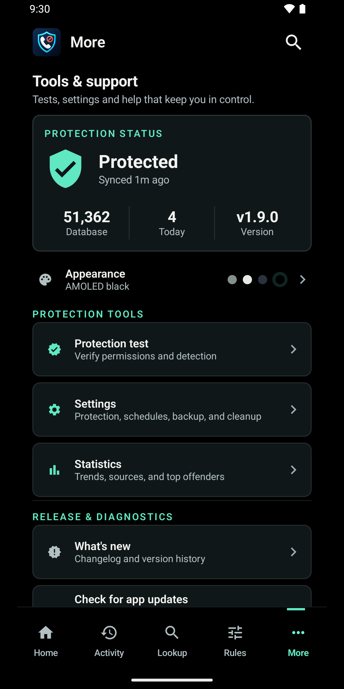

<p align="center">
  
</p>

<h1 align="center">CallShield</h1>

<p align="center">
  <strong>Open-source spam call blocker and text screener for Android</strong><br>
  30+ detection layers with an on-device ML model | 51,362 spam numbers | Real-time caller ID | RCS filter | No API keys
</p>

<p align="center">
  <a href="https://github.com/SysAdminDoc/CallShield/releases/latest"></a>
  
  
  
  
  
</p>

<p align="center">
  <a href="https://ko-fi.com/X8K126YVER">
    
  </a>
</p>

<p align="center">
  <sub><em>If CallShield helps keep spam out of your day, a coffee helps me keep its protection data and app current.</em></sub>
</p>

---

CallShield blocks spam calls and flags spam texts with an on-device engine of more than **30 detection layers**. They include a gradient-boosted tree ML scorer, bounded campaign and churn evidence, conservative carrier identity signals, an RCS notification filter and real-time caller ID. Its 51,362-number database sits alongside a trending-numbers feed the app checks every 30 minutes. There are no accounts and no tracking.

The database keeps `data/spam_numbers.json` as a stable legacy GitHub-raw
endpoint for older clients, while current builds bundle a hash manifest and
256 content-addressed shards. The manifest, the legacy database, the trending
feeds and the model weights each carry a detached ECDSA P-256 signature, and the
app refuses any of them that doesn't verify against a key built into it. Devices
fetch only changed shards, check every shard against the signed manifest before
a transactional Room refresh, and fall back to the legacy snapshot when the
shard service is unavailable.

## Screenshots

<p align="center">
  
  
  
</p>
<p align="center">
  
  
  
</p>

## Getting Started

1. **Install the APK** from the [latest release](https://github.com/SysAdminDoc/CallShield/releases/latest). [Installing](#installing) has the signature details. If a sideloaded install won't take its permissions, see [Permissions look granted but nothing works](#permissions-look-granted-but-nothing-works).
2. **Run the setup wizard.** Phone and SMS access and the Call Screening role are required when Android supports screening. Notifications, Notification Access and Overlay are optional. Notification Access powers the RCS filter, push-alert caller trust and meeting mode, and Overlay shows live caller ID. The review at the end says what each skipped grant turns off.
3. **Pick a protection level.** Setup ends with Recommended, Strict or Contacts only. Recommended keeps the default call and text controls. Strict adds aggressive call checks, blocks hidden callers and turns on quiet hours. Contacts only lets contacts and trusted numbers ring. Home and Settings switch levels later with Undo, and **Run setup again** in Settings walks through everything once more.
4. **Let it sync.** Home runs the first database sync by itself. After that the database is checked every six hours and the trending feeds every 30 minutes.

New installs use the AMOLED theme. Settings opens on Basic, which covers blocking,
safety, notifications and appearance. Advanced holds detection, lists, backup and
the rest. Switch the theme to Graphite, Light or System under Appearance.

For a full walkthrough of every toggle with its default, see [docs/getting-started.md](docs/getting-started.md).

Version highlights for each release are in [CHANGELOG.md](CHANGELOG.md).

## How It Works

1. **51,362 imported spam numbers.** Sources include FCC consumer complaints (2+ reports each), FTC Do Not Call complaints, numbers the maintainer reviewed by hand, and community reports that several people confirmed.
2. **30+ detection layers and ML.** The database, heuristics, bounded campaign and churn detection, an on-device gradient-boosted tree, SMS content and burst analysis, the RCS filter, STIR/SHAKEN and more.
3. **Real-time caller ID overlay.** The local verdict appears as the phone rings. An optional SkipCalls check covers locally suspicious calls, and a SIT tone tells autodialers the line is dead.
4. **Trending feeds.** The app checks for trending spam numbers and campaign ranges every 30 minutes. The maintainer regenerates them by hand from new community reports.
5. **Callback-aware.** It won't block a number you recently called or keep answering, a callback after a local emergency call, or a caller who tries twice in five minutes.
6. **Community-driven.** One-tap anonymous reports go through a Cloudflare Worker, and the maintainer merges them into the database.

## v1.11.0 Highlights

Better at the calls and texts scams lead to, and your own lists survive a damaged database.

- **Calling back a scam text.** The outgoing call check holds a call to a number that appeared in a text CallShield flagged as spam in the last 30 days, and the notice says which day the text came.
- **Codes during a call.** A one-time code that arrives while someone who isn't a contact is on the line, or in the 10 minutes after, brings up a warning not to read it out.
- **Text checks.** "Hi mum, this is my new number" and other reply bait is caught in a dozen languages, and look-alike letters and invisible characters no longer hide spam. In aggressive mode a business's opt-out footer alone doesn't block its text any more.
- **Your lists are safer.** Your blocks, allow list and rules survive a damaged database, and a phone restored from a cloud backup downloads the whole spam list again.
- **Trusted number blocks.** A doctor's office that calls from a different line each time can be allowed by its last 2 or 3 digits.
- **Around the app.** Home shows a card when a new release is out. Clearing the log or blocking an area code happens at once, with Undo. Outside North America, a ten-digit number the phone couldn't place isn't scored by North American rules, and Settings lists recommended blocklists for Colombia, Chile and Turkey.

## v1.10.0 Highlights

Let unknown callers ring when you're waiting for a call, and a fix that keeps the spam database blocking between updates.

- **Expecting a call.** From Home or its own Quick Settings tile, unknown and hidden callers ring for an hour, three hours or until midnight. Your blocked numbers, wildcard rules and a failed caller ID check still block, and a countdown notification offers End now. On a locked phone the tile asks you to unlock first.
- **The database keeps working.** Every number's evidence was due to expire in October, and a phone stops matching a number once that happens. Complaint evidence now lasts a year, and the weekly data check warns a month ahead. Phones on 1.9.0 get this with their next sync.
- **Reviewed numbers.** A number the maintainer checks by hand can join the database when no imported source covers it, starting with a Munich number reported on GitHub.
- **Easier to use.** The caller ID popup works with TalkBack, the Blocked log and Blocklist fit small screens with large text, and a blocked-call alert offers Not spam for a day.
- **Texts and hang-ups.** Texts sent under a carrier's scam label are flagged, and Answer and hang up handles national-format numbers and rejects instead of answering while roaming.

## v1.9.0 Highlights

A new look for every screen, protection levels you can switch in one tap, and a round of fixes from a full review.

- **A darker, calmer design.** Every page uses the AMOLED palette with outlined cards, page headings and real tabs. Light, Graphite and System themes are still in Settings.
- **Protection levels.** Setup ends with Recommended, Strict or Contacts only, and Home and Settings switch levels with an Undo.
- **Settings in two parts.** Basic holds the everyday switches, and Advanced keeps detection, lists and backup.
- **Fixes from the review.** Light can be chosen again. Protection test's ML check passes on a healthy phone. Calls from abroad no longer show US place names, and Region rules block area codes that can't exist. Contacts only mode pauses, and says so, instead of blocking everyone when Contacts permission is off.
- **Fresher data.** The FCC import picks up back-dated complaint batches it used to skip, the trending lists no longer look like an outage to phones, and community reports that three people confirmed stay published.

Earlier releases are in [CHANGELOG.md](CHANGELOG.md).

## Detection Pipeline (v1.11.0)

All detection layers implement a shared `IChecker` interface and run in priority order through `CheckerPipeline.run`. The first layer with a verdict wins, and each layer is tested on its own. Priorities are stable numbers, and the ladder below is the live order.

| Priority | Layer | Verdict | How It Works |
|---------:|-------|---------|-------------|
| 11000 | **Emergency Number Floor** | Allow | Recognized emergency and public-safety numbers always ring, ahead of every rule (calls only) |
| 10900 | **One-Time Code Floor** | Allow | Short texts carrying a verification code are never flagged, so sign-ins keep working (texts only) |
| 10000 | **Manual Whitelist** | Allow | Numbers you marked as always allowed, emergency contacts included, and the number block an entry covers when you chose one |
|  9000 | **Contact Whitelist** | Allow | Numbers in your phone's contacts always pass through |
|  8800 | **Contacts-Only Mode** | Block | Calls outside your contacts and trusted numbers are blocked |
|  8500 | **STIR/SHAKEN Failed** | Block | Carrier-authenticated caller ID failure gets blocked before heuristic layers |
|  7000 | **User Blocklist** | Block | Your own exact blocks, permanent or temporary |
|  6900 | **System Block List** (A4) | Block | Read-only bridge to Android's `BlockedNumberContract`. Respects stock Phone/Messages blocks |
|  5500 | **Wildcard / Regex** | Block | Custom patterns like `+1832555*` or full regex, now with optional schedule |
|  5400 | **Range Patterns** (A5) | Block | Length-locked `#` patterns like `+33162######`, with schedule + coverage safety rail |
|  5360 | **Expecting a Call** | Allow | Opt-in window (1 hour, 3 hours or until midnight) from Home or a Quick Settings tile. Unknown and hidden callers ring, and contacts-only mode and meeting mode step aside. Your own blocks, wildcard and range rules and a failed caller ID check still win |
|  5350 | **Temporary Allow** | Allow | One-off false-positive recovery from the Blocked Log. Beats all downloaded data, never your own rules |
|  5320 | **Prefix Rules** | Block | Downloaded wangiri country codes, US premium rate (+1900), international premium |
|  5310 | **Regulatory Prefix** | Block | Opt-in (Settings > Telemarketing ranges) blocks for ranges regulators set aside for sales calls: Spain 400 (from 17 October 2026), India 140 (TRAI), Brazil 0303 (ANATEL). Matches the number with its country code, and without it on a phone from that country |
|  5300 | **STIR/SHAKEN Authenticated** | Allow | Carrier-authenticated caller ID allows through heuristic/ML suspicion, and through a database match only when that row's newest evidence, community reports included, is over a year old and the number isn't trending right now. Explicit blocks still win first |
|  5250 | **Regulatory Allow** | Allow | Opt-in protected series that rings through past the database and statistics. India 1600 (banks, insurers and government offices, per TRAI) |
|  5200 | **Spam Database** | Block | 51,362 imported spam numbers plus the trending-numbers feed |
|  5150 | **Database Prefix Expansion** | Block | Auto-blocks last-two-digit siblings of confirmed database entries |
|  5000 | **Recently Dialed** | Allow | Numbers you called in the last 24h. They're probably calling back |
|  4980 | **Emergency Callback** | Allow | Unknown callbacks can ring through after a local emergency call during the configured grace window |
|  4950 | **Answered Caller** | Allow | Numbers answered repeatedly inside the configured lookback window |
|  4900 | **Repeated Urgent** | Allow | Same number calls 2x in 5 min → allowed through |
|  4850 | **Caller Name Trust** | Allow | Carrier-presented name matches one of your trust patterns (requires the device to provide a name during screening) |
|  4700 | **Push-Alert Bridge** (A3) | Allow | Uber/DoorDash/Amazon/Gmail notification about an arriving call? Let it through |
|  4500 | *Campaign Recorder* | None | Side effect only. It records the call for the burst detection below |
|  4300 | **Region Rules** | Block | Opt-in offline blocking outside the US/Canadian regions and country calling codes you allow |
|  4000 | **Quiet Hours** | Block | Block all non-contact calls during configurable hours (calls only) |
|  3500 | **Frequency Auto-Block** | Block | With call log access, numbers with 3+ incoming calls that rang in 7 days get auto-blocked. Screened blocks and silences don't count |
|  3000 | **Heuristic Engine** | Block | North American VoIP ranges, neighbor spoofing, toll-free and rapid-fire checks. International risk checks also run |
|  2500 | **Campaign Burst** | Block | NPA-NXX prefix clustering detects coordinated spam waves |
|  2250 | **Caller Name Rules** | Block | Carrier-presented names can match bounded, user-defined `*`/`?` patterns after every allow layer (requires the device to provide a name during screening) |
|  2000 | **ML Spam Scorer** | Block | 20-feature on-device gradient-boosted tree model |
|  1500 | **Meeting Mode** | Silence | Opt-in. While a meeting app you pick shows a call in progress, calls from outside your contacts go quietly to voicemail. Runs on notification access, with no calendar permission |

SMS-specific layers run after the shared chain, in their own priority order: **SMS Keyword Rules** (5400, with schedules) → **Carrier Scam Label** (4750, a sender your carrier renamed to its scam label, such as Singapore's Likely-SCAM) → **SMS Context Trust** (4700, trusted-sender allow) → **SMS Burst Protection** (4650) → **SMS Content Analysis** (1900, with 30+ regex patterns, URL shorteners, suspicious TLDs and the spam-domain list). Both SMS rule layers read the text after fullwidth letters, invisible characters and Cyrillic or Greek letters posing as Latin are undone, and a link or brand name hiding such characters counts against the message. A stranger's first text that fishes for a reply without a link counts too: "Hi mum, this is my new number", "Is this Sarah?", "sorry, wrong number". It has to come from a phone number you've never texted or heard from, and on its own it only blocks in aggressive mode, because a real kid with a new phone writes the same words.

> **A flagged text still reaches your inbox.** Calls are different from
> messages here, and the table above is about verdicts, not delivery. CallShield
> screens calls through Android's `CallScreeningService`, which can actually
> reject a call. For messages it listens on `SMS_RECEIVED_ACTION`, and since
> Android 4.4 that broadcast cannot be aborted by anyone. Only the default SMS
> app receives `SMS_DELIVER_ACTION` and controls what lands in the inbox, and
> becoming the default SMS app would mean replacing your whole messaging app.
> So an SMS or RCS verdict logs the message, notifies you, and feeds the
> statistics. It does not delete the message or stop it arriving.

### Additional Layers
- **Caller ID Overlay**. Suspicious calls (heuristic score 30-59) can use an explicit, default-off live enrichment option that checks SkipCalls. Clean calls never trigger it
- **Region & caller-name rules**. Opt-in offline blocking outside the US states, Canadian provinces, area codes (`+1809`) and country calling codes (`+39`) you allow, plus bounded `*`/`?` trust and block patterns for carrier-presented caller names. Explicit number, system, prefix and wildcard blocks, and all allow layers, keep priority. Area codes absent from the pinned NANP table pass through this regional rule
- **Message notification screening**. Once Notification Access is on, Google Messages and Samsung Messages are screened by default. AOSP Messages, SMS Organizer, Signal, WhatsApp, WhatsApp Business, Gmail, Outlook and Thunderbird can each be turned on. A match in a private messenger or an email app shows a separate warning and leaves the original notification alone.
- **URL Safety**. Local spam-domain checks stay on-device. Optional link checks use PhishTank and a six-hour OpenPhish feed. PhishTank receives only the site's base domain
- **Codes during unknown calls**. When a one-time code arrives during a call from someone who isn't in your contacts, or in the 10 minutes after it, CallShield warns you not to read it out. Bank imposters ask for exactly that code. It warns once per call and never for a contact or a number you've allowed. Silenced calls and calls that rang without a check count too, because you can still pick them up.
- **STIR/SHAKEN**. Blocks calls failing carrier caller ID verification (Android 11+)
- **Outgoing call check**. Opt-in, through Android's call redirection role. A call you start to a number on your blocklist, in the spam database, on a premium-rate line or on a callback-scam country code is held, and a notification tells you why and offers Call anyway. So is a number that showed up in a text CallShield flagged as spam in the last 30 days. The notification names the day that text came in, since "call us back" scams pair a fake text with the number to call. Marking the sender Not spam lets those numbers ring again. Contacts and trusted numbers ring through, and a slow check never delays the call. If you wouldn't see the notification, in car mode or under Do Not Disturb for example, the call goes through.
- **Answer & hang up**. Opt-in. A call CallShield would reject is answered without video and hung up after a delay you set (1 to 10 seconds), so spam can't leave a voicemail. Silent voicemail mode, auto-mute and a meeting-mode silence still go to voicemail, and the short answered call never counts toward trusting the caller. Contributed by tikkamasalla
- **After-Call Feedback**. "Was this spam?" notification after suspicious calls, plus an optional Android 11+ post-call screen for block/report and save-contact actions

### Per-Rule Schedules (A7)
Any wildcard, range, or SMS keyword rule can be time-gated to specific days of the week and an hour window. The hour picker supports overnight wrap. `daysMask = 0` is the "no gating" sentinel, so rules created before v1.6 behave identically.

## Live Caller ID Overlay

With the Overlay permission granted, a caller ID card appears as the phone rings. It shows the number, where it's from and CallShield's own verdict. For a locally suspicious call, the default-off **Live caller enrichment** setting also asks SkipCalls about the number:

```
┌──────────────────────────────────────┐
│ Likely spam                          │
│ (212) 555-1234                       │
│ New York, NY                         │
│ Spam score: 50% (Flagged)            │
│ ⚠ SkipCalls: Flagged                 │
│ All sources checked                  │
│ [Search]      [Block]      [Dismiss] │
│ [          Play SIT tone           ] │
└──────────────────────────────────────┘
```

- The card appears at once with the local verdict, which names its reason (for example "50% risk: High-risk VoIP range"), and updates when SkipCalls answers. A scam, robocall, telemarketer or fraud category flags the call. An answer without one of those categories reads "Reported, no category" and leaves CallShield's own warning in place. SkipCalls gives no report count
- If SkipCalls can't answer, the card keeps CallShield's own warning and says no source returned a definitive result. With enrichment off it says the verdict came from on-device checks
- TalkBack reads the header and the verdict as they change. Text is at least 14sp, every button is a 48dp target, and Search looks the number up in the phone's language
- **SIT tone**. The ITU-T E.180 three-tone sequence makes many autodialers mark your number as out of service
- The score is color-coded: green at 0, yellow above 0, orange from 40 and red from 70

PhoneBlock, OpenCNAM and WhoCalledMe were dropped in September 2026. PhoneBlock and OpenCNAM now require accounts, which CallShield never asks for, and WhoCalledMe's domain is parked. `scripts/probe_live_sources.py` checks that SkipCalls still answers the way the app reads it.

## ML Spam Scorer

An on-device **gradient-boosted tree** of 50 trees over 20 features, with a logistic-regression fallback. It's pure Kotlin with no TFLite or other ML library, and it runs in microseconds.

| Feature | Description |
|---------|------------|
| toll_free | 800/888/877/etc. prefix |
| high_spam_npa | Area code in high FTC/FCC complaint set |
| voip_range | NPA-NXX in known VoIP spam carrier range |
| repeated_digits_ratio | Fraction of most-common digit |
| sequential_asc/desc_ratio | Sequential digit pairs |
| all_same_digit | All 10 digits identical |
| nxx_555 | Exchange is 555 (test numbers) |
| last4_zero | Subscriber is 0000 |
| invalid_nxx | NXX starts with 0 or 1 (NANP-invalid) |
| subscriber_all_same | Last 4 digits all same (9999) |
| alternating_pattern | Even/odd positions uniform (5050505050) |
| nxx_below_200 | Often unassigned ranges |
| low_digit_entropy | Fewer than 4 distinct digits |
| subscriber_sequential | Last 4 form ascending/descending run |
| + 6 additional | Campaign proximity, time-of-day, call frequency, area code density, prefix heat, neighbor spoof score |

The maintainer trains it by hand from the CallShield database (50K positive and 50K negative samples). The scorer uses the threshold stored in the weights file, which is 0.648 for the model that ships today. A quality gate scores the 20% of rows training held out, with the same inference the app runs, and fails when F1 drops below 0.45.

SMS content regressions use a separate CC0 corpus that CallShield wrote itself. It covers eight languages, the three sender forms, each kind of link, legitimate messages and hard negatives, and the test reports precision, recall and false-positive rate by language and message type without shipping personal data. Every spam message it catches is checked again in disguise (zero-width characters between letters, Cyrillic look-alike letters, fullwidth text, a hidden character in its link) and each copy has to be caught too: `./gradlew :app:testDebugUnitTest --tests com.sysadmindoc.callshield.data.SmsEvaluationCorpusTest`.

The same test runs 5,000 real smishing reports sampled from the IMC 2025 dataset (Agarwal, Papasavva, Suarez-Tangil and Vasek, "Fishing for Smishing", CC BY 4.0) in 63 languages. It prints recall for each language, with precision and false alarms taken from the clean messages above, and each large language has a floor it can't drop below. The number is humbling. Content rules alone catch 12% of those reports, and 26% of the wrong number and "hi mum" scams. Part of the gap is the dataset: it replaced every link with a placeholder, so the link rules see a link but never its host. `python scripts/sample_imc25_corpus.py` redraws the sample from a pinned copy of the dataset, and `IMC25-NOTICE.txt` next to it in `app/src/test/resources/sms-corpus/` credits it.

## Features

### Number Lookup
- Instant spam check through every detection layer, with an animated confidence gauge for probabilistic signals
- Auto-paste from clipboard, area code lookup (453 active geographic NANP codes), haptic feedback
- Verdict cards lead with the deciding rule or causal signal, show confidence only for
  probabilistic layers, and keep “This is not spam” / “Remove my rule” actions visible
- On-request SkipCalls spam lookup

### Recent Calls & Blocked Log
- Recent calls with contact names, risk indicators, call type icons and filter chips (All, Incoming, Outgoing, Missed, Spam)
- Blocked log with swipe-to-dismiss and Undo, a Clear log button that offers Undo, grouping with severity-scaled accent bars, and Calls, Texts and Reason filters.
  Swipe actions also have equivalent TalkBack/switch-access actions and 48dp touch targets
- Staggered entrance animations, shimmer loading skeletons

### Assistive Telephony
- RTT calls receive an immediate allow from the screening service. CallShield doesn't reject,
  silence, or launch the caller-ID overlay for an active RTT session.
- Block reasons are spoken as complete plain-English sentences, while swipe-only block, delete,
  and unblock actions remain available through accessibility actions.

### Rules Management (6 tabs)
- Blocked, Wildcards, Ranges, Keywords, Trusted, Database
- Export/import blocklists as JSON, per-rule enable/disable toggles
- Regex validation before adding wildcard rules
- Inline priority-conflict warnings name the whitelist, emergency allow, or block rule that wins before an overlapping rule is saved
- A trusted number can also let its number block through, for an office or a practice that calls from a row of lines. Pick the numbers that differ only in the last 2 or 3 digits and the entry reads `(555) 234-56XX`. It's off until you pick it, and a number in the block that you blocked by itself stays blocked

### Statistics
- Weekly bar chart with daily breakdown
- Detection source donut chart
- Monthly trend line
- Top offenders, area code heatmap, hourly heatmap
- Protection Test shows local WorkManager attempts and Android stop reasons, with a warning when background quota repeatedly defers protection refreshes

### Smart Features
- Expecting a call. From Home or its own Quick Settings tile, unknown callers ring for an hour, three hours or until midnight, with a countdown notification and End now
- Smart suggestions. Detects area code spam patterns, one-tap block of a whole area code, with Undo
- Weekly trend indicator. Shows if spam is increasing or decreasing vs last week
- Last blocked preview card on dashboard with tap-to-inspect
- Blocking profiles: Recommended / Strict / Contacts only / Personal / Sleep / Off, with Undo
- Callback detection + repeated urgent caller allow-through
- FTC Do Not Call complaint filing
- After-call "Was this spam?" feedback notification

### Home Screen Widget
- Today's blocked count with a trend against yesterday, and the all-time total
- How long ago the last block was
- Whether protection is on. Tapping the widget opens the app

### Community
- **One-tap anonymous contribution** via [Cloudflare Worker](https://callshield-reports.snafumatthew.workers.dev). Each number and vote goes out at most once a day, and a report made offline is sent when the connection returns
- "Not spam" reports can put a community-only number up for maintainer review. They never remove a number by themselves
- Share spam warnings to any app

### Data & System
- Selective backup/restore for rules, non-secret settings, and opt-in logs, plus CSV log export and auto-cleanup (7/14/30/90 days)
- Database sync every 6 hours, a trending-feed check every 30 minutes, and a daily digest notification
- External blocklist subscriptions (Settings > External blocklists) take HTTPS CSV, TXT or JSON number lists of up to 1 MB and 20,000 rows. Each list is fetched again once a day, or on the interval it declares in its header (`# Expires: 12 hours`, or `"expires": "12h"` in JSON), never more often than every six hours and at least weekly. A download that comes back empty or with under half the list's numbers isn't applied in the background. The list keeps its last good copy and says why on its row. Each row shows the list's name, the host it comes from, how many numbers it holds and when it last updated, and TalkBack reads it as one item. A row's switch turns its list off or on. Tapping the list's name does nothing. Removing a list takes its numbers out straight away, and Undo puts both back without downloading the list again
- The same card opens with Recommended lists for places the bundled database barely covers: OpenCallShield (Colombia, MIT), SpamChile (Chile, GPL-2.0) and Turkish Spam Numbers (Turkey, GPL-3.0). Each row shows the country and a link to the license next to Add, and nothing is downloaded until you tap it. Adding one fetches it straight from its own repository. None of them is folded into CallShield's database. Each list declares its country's number plan, so a number written the local way (`3131918305`, `03395051735` or `00573390714583` in the Colombian list) is stored as +57 whatever country your phone is in. That holds for the same link typed in by hand, too. The catalog ships in the app and a signed copy is refreshed on every sync, so a list can be added between releases
- If GitHub is blocked where you live, Settings > Feed mirror takes a second address for the protection data. CallShield asks GitHub first, then the mirror, then falls back to the copy bundled with the app. For ten minutes after GitHub couldn't be reached at all, the mirror goes first. One tap fills in jsDelivr (`https://cdn.jsdelivr.net/gh/SysAdminDoc/CallShield@master/`), which serves the same files and can run up to 12 hours behind. Mirrored files go through the same signature check, so a mirror can't alter the data, though it can hold back updates. [data/README.md](data/README.md#mirrors-and-recovery) covers running your own
- Two Quick Settings tiles (protection on or off, and Expecting a call), app shortcuts and a home screen widget
- Protection test validates all layers and permissions, including checker errors and deadline cutoffs
- Rules surface priority conflicts after sync and edits, with the winning rule and a review path
- Home leads with localized blocked-call/text outcomes and collapses completed setup into a review row
- Home shows a card when a newer release is out, read from a signed file that syncs with the spam database, so no extra host is contacted. Optional weekly GitHub Releases update checks are off by default and only offer release/SHA256 links
- Maintainer data regeneration uses the gated `scripts/import_all_sources.py` pipeline. Legacy direct writers aren't supported
- Onboarding wizard with permission requests

## Data Sources

### Database (51,362 numbers + 651 range prefixes, locally maintained)
| Source | Method |
|--------|--------|
| **FCC Consumer Complaints** | Socrata API, 500K records, min 2 reports |
| **FTC Do Not Call** | `api.ftc.gov` (DEMO_KEY) |
| **Saracroche** | French telemarketing ranges, imported as compact prefixes when the maintainer asks for them |
| **PhoneBlock** | Optional authenticated bulk snapshot, maintainer import only |
| **Nomorobo IRS** | Optional carrier-authorized callback-scam CSV feed |
| **ToastedSpam** | Community curated list. It's served over plain HTTP, so the importer skips it unless the maintainer allows insecure sources |
| **Reviewed numbers** | Numbers the maintainer checked by hand, usually after a GitHub report, kept in `data/spam_numbers_approved.json` |
| **Community Reports** | Anonymous via Cloudflare Worker |

The source importer also has optional adapters for **PhoneBlock's** versioned
bulk list. PhoneBlock requires an account for bulk downloads, so that adapter
runs only when the maintainer has access, and the app itself no longer contacts
PhoneBlock. Run `python scripts/import_all_sources.py --include-saracroche` to
refresh the French ranges. Add `--phoneblock-limit 5000` and
`PHONEBLOCK_API_KEY` only when the maintainer has bulk-feed access. Saracroche
range data is published under CC BY-NC-SA 4.0, must retain attribution and
those downstream restrictions, and is accepted only as a `+33` French
allocation. A successful non-empty refresh expires removed Saracroche ranges.
A failed or empty response keeps the last known good set.

Every feed is declared in `data/source-manifest.json` with its access mode,
geography, licence, attribution, parser version, redistribution policy, and
freshness window. Each importer run writes a local `data/source-snapshot.json`
for release review. It's deliberately left out of the APK. After the
community merge, its health section adds per-source freshness, accepted and
quarantine counts, corroboration, and bounded false-positive rates without
copying phone numbers, contacts, SMS, or call audio. Anonymous `not_spam`
votes never change the database by themselves. Once they outnumber a
community-only row's reports, the row becomes a review candidate. After an
operator marks it `approved: true`,
`python scripts/merge_community_reports.py --apply-reviewed-corrections`
can decay or remove only that community-only contribution. FTC and FCC runs
persist bounded high-water cursors in `data/source-cursors.json`, which the
importer creates on its first run. They keep caller-ID and callback-business
evidence as separate roles, and don't promote unverified complaint-only rows
without independent caller corroboration. The importer leaves out complaints
with missing or future dates. `data/source-freshness.json` records the newest
complaint date (for FCC, the day FCC published it), and the weekly check flags an FTC or FCC feed when that date
falls outside its freshness window.

The importer also accepts a carrier-authorized Nomorobo IRS callback-scam CSV
feed without embedding credentials in the app. Pass the HTTPS URL with
`--nomorobo-irs-url` (or `NOMOROBO_IRS_FEED_URL`) and, if required by the feed,
the bearer token with `--nomorobo-irs-token`/`NOMOROBO_IRS_TOKEN`. The adapter
is disabled unless explicitly configured and rejects cleartext URLs. It doesn't
scrape Nomorobo's restricted carrier feed.

### Hot List (checked every 30 minutes, regenerated by hand)
| File | Contents |
|------|----------|
| `hot_numbers.json` | Top 500 trending numbers from the last 24 hours. Each needs 4 reports spread over at least two hours, from 3 reporters on the same UTC day |
| `hot_ranges.json` | NPA-NXX prefixes where at least 4 trending numbers drew reports from at least 6 reporters between them on one UTC day |
| `spam_domains.json` | Phishing/spam domains from community SMS reports |

### Real-Time Lookup (overlay only)
| Source | What It Returns | Auth |
|--------|----------------|------|
| **SkipCalls** | Spam flag and category | None |

### URL Safety (post-decision)
| Source | What It Checks |
|--------|---------------|
| **Local spam-domain list** | Checks known spam domains on the phone |
| **PhishTank** | Optional link lookup. It receives only the site's base domain |
| **OpenPhish** | Optional feed, checked for updates after six hours of use. Matches stay on the phone |

## Security

- **Network security config**. Cleartext traffic disabled in production
- **Signing credentials**. Stored in `local.properties`, not hardcoded in build files
- **Restricted FileProvider paths**. Shares only the export, backup and crash-report folders
- **Scoped backup**. Cloud backup includes non-secret settings only. The
  sensitive database is limited to direct device transfer and explicit
  user-created portable backups
- **Damaged database recovery**. Android deletes a database the moment it finds a
  damaged page. Before it does, CallShield copies out your own blocks, allow list and
  rules, puts them into the fresh database and downloads the spam list again
- **APK privacy gate**. Builds package only the five runtime protection feeds.
  Verification rejects raw community submissions and maintainer files
- **Direct-boot boundary**. A minimal device-encrypted mirror keeps explicit
  user blocks active before first unlock. The full database and settings remain
  credential-encrypted
- **Community report abuse controls**. The Worker requires a Cloudflare client
  identity and separates malformed requests from unavailable or corrupt rate-limit state.
  It counts an IPv6 client by its /64, and trending corroboration takes at most two /64s from one /48, so one
  subscriber can't pass as many reporters by rotating addresses. Each client gets 5 reports a minute, each /48 gets
  20 and the whole Worker gets 30, and a body over 10 KB is refused before it's read in full

## Privacy

Call and message decisions run on the phone. No personal data is collected. CallShield makes these network requests:
- The spam database, trending feeds, the new-release notice and the recommended-list catalog, from this public repository on GitHub, or from the feed mirror if you set one
- Live caller enrichment, which is off by default and runs only for locally suspicious calls. The setting names every destination host before a number is shared
- Community reports to the Cloudflare Worker. Each report is committed as a public JSON file to this repository's `data/reports` folder, and the next merge folds it into the database. It holds the reported number, the report type and time, the report's random id, and two reporter IDs that change every day (keyed HMACs of your network's /48 and /64, so the same network can't be linked across days or turned back into an address). An SMS report adds the linked domains and link labels, never message text. The report never holds your IP address. To stop floods and repeat reports, the Worker's short-lived store keys a duplicate check on your IPv4 address or IPv6 /64 for five minutes, and when Cloudflare's rate limiter is unavailable its fallback counter does the same for one minute. Both expire on their own
- Local spam-domain checks don't disclose SMS or RCS links. Optional PhishTank lookups send only the site's base domain, and the OpenPhish feed is downloaded for local matching. Neither receives message text
- External blocklists you subscribe to, fetched from the addresses you entered or from the recommended lists you added
- The update check, which is off by default. When it's on, it asks GitHub Releases once a week

No API keys. None required, none optional, no credential entry anywhere in the app. No accounts. No analytics. No ads.

## Requirements

- Android 10+ (API 29)
- STIR/SHAKEN requires Android 11+ (API 30)
- Caller ID overlay requires "Display over other apps" permission
- RCS filter requires Notification Access permission

## Installing

Every release from v1.7.37 onward is signed with a new key. The original
keystore password was lost in a machine rebuild, which also meant releases
v1.7.26 through v1.7.29 shipped unsigned and would not install at all, so the
key was rotated rather than recovered.

**Upgrading over an older install can fail with a signature mismatch.** Android
refuses to replace an app with a build signed by a different key, and releases
before v1.7.37 were signed with keys that are no longer available. If the
install fails, you have to uninstall first, which erases your rules and logs,
so export them before you do:

1. Open CallShield, go to **Settings → Advanced → Backup & restore**, and create a portable
   backup. Save it somewhere outside the app, and set a passphrase if the
   backup includes logs.
2. Uninstall CallShield.
3. Install the new APK and restore from that file.

A fresh install is unaffected, and upgrades between v1.7.37 and later releases
work normally.

Verify an APK before installing it:

```bash
apksigner verify --print-certs CallShield-vX.Y.Z.apk
```

The signer certificate SHA-256 must be:

```
920e583ae6ce9f3863a6b3b8847e927d53a66c38a245e12e30ce124c9f4a75f5
```

Every release also ships a `.sha256` sidecar for the APK itself.

### Permissions look granted but nothing works

On Android 13 and later a sideloaded app is put behind **restricted settings**.
The system holds back SMS permissions and notification access from an app that
wasn't installed by an app store, and the permission dialog either never appears or
appears and changes nothing. GrapheneOS and CalyxOS apply this the same way
stock Android does, and it is the most likely reason CallShield sees no
messages after a clean sideload.

To lift it:

1. Long-press the CallShield icon and open **App info** (or Settings → Apps →
   CallShield).
2. Tap the **⋮** menu in the top right and choose **Allow restricted settings**.
3. Confirm with your device PIN or biometric.
4. Reopen CallShield and grant the permissions again. Onboarding rechecks each
   one and will move on by itself once they take.

Setup points you here too. A step you were sent to grant that comes back still
off shows this hint, with a button that opens App info.

If the ⋮ menu has no such entry, the permission is actually denied rather than
restricted. Grant it from **App info → Permissions**. A permission you denied
twice is treated as permanently denied by Android, and CallShield's onboarding
sends you to App info instead of re-prompting, because the prompt would no
longer show.

Installing through a client that registers as the installing package (Obtainium
does) avoids the restriction entirely.

## Building

```bash
./gradlew verifyReleaseMetadata verifyReproducibleBuildInputs verifyReleaseSbom verifyReleaseApkReproducibleMetadata
```

`verifyReleaseMetadata` invokes `scripts/verify_release_drift.py`, which prints
the synchronized app and changelog versions, locked dependency summary,
known-advisory dispositions, and source-snapshot provenance. Run the report
directly with `python scripts/verify_release_drift.py` when reviewing metadata
without building an APK.

Requires JDK 17 or 21. The Gradle 8.14 wrapper won't start on JDK 25, so point
JAVA_HOME at 17 or 21. With release signing properties configured, the signed APK is
at `app/build/outputs/apk/release/app-release.apk`. Without them, the local
verification build emits `app-release-unsigned.apk`.
Generate the release hash sidecar with:

```powershell
.\scripts\write-release-sha256.ps1
```

After `gh release create` has published the tag, write and sign the release notice that older builds show on Home, then commit `data/app_release.json` and its `.sig`:

```powershell
python scripts/write_app_release.py
```

`verifyReleaseSbom` also writes `<release-apk-stem>.cdx.json`,
`<release-apk-stem>.provenance.json`, and `<release-apk-stem>.sha256` beside the
APK. The SBOM contains the exact `releaseRuntimeClasspath` coordinates from
`app/gradle.lockfile`, and the verifier fails if the APK, lockfile, SBOM, or
provenance record drift. CallShield releases are built locally, so the signed APK remains
governed by the maintainer release key and its SHA-256 sidecar. The local JSON
provenance is evidence, not a replacement for that signature.

See `docs/reproducible-builds.md` for the dependency-lock and hash-comparison
runbook.

CallShield ships from GitHub Releases only. There's no Google Play or F-Droid
listing and none is planned. Obtainium can follow the releases for you.

**Signing:** Create `local.properties` in the project root with your keystore credentials:
```properties
RELEASE_STORE_FILE=path/to/keystore.jks
RELEASE_STORE_PASSWORD=...
RELEASE_KEY_ALIAS=...
RELEASE_KEY_PASSWORD=...
```

## Testing

```bash
./gradlew testDebugUnitTest   # 1913 tests
./gradlew connectedDebugAndroidTest -Pandroid.testInstrumentationRunnerArguments.class=com.sysadmindoc.callshield.platform.TargetSdkBehaviorSmokeTest
./gradlew verifyPipelineTests # Cloudflare Worker (node) + data-pipeline and translation checks (python)
```

The suite is **1913 total JVM unit tests**, run with Robolectric wherever a screen, a service or the database is involved.

Two GitHub workflows run without building the app. **Validation** runs the Worker and
pipeline suites on every push except report-only ones (`run-pipeline-tests.ps1 -CorrectnessOnly`),
and the runner fails if any suite changes a file under `data/`. **Pipeline
liveness** runs weekly: it fails when community reports sit unconsumed for over a week
or a daily or weekly upstream source misses its `stale_after_days`, and it keeps one issue
labelled `pipeline-stalled` open until the next passing run. A source that only imports with
an opt-in flag, such as `--include-saracroche`, is held to its limit once it has been imported.

Run tests, lint, release metadata checks, and artifact builds locally before publishing.

## Translations

CallShield ships in English and Simplified Chinese, which covers about four in five strings.
More translations are welcome. See
[docs/TRANSLATING.md](docs/TRANSLATING.md) for the resource layout, the priority
order for partial translations, and `scripts/check_translations.py`, which
verifies format specifiers and plural coverage before a PR lands. Claim a
language in [issue #7](https://github.com/SysAdminDoc/CallShield/issues/7).

## Tech Stack

| Component | Technology |
|-----------|-----------|
| Language | Kotlin 2.3.21 |
| UI | Jetpack Compose BOM 2026.06.01 + Material 3 |
| Theme | System, Light, Graphite, and true-black AMOLED |
| Database | Room 2.8.5 (SQLite), 10 entities |
| Networking | OkHttp 5.4.0 + certificate pinning |
| JSON | Moshi 1.15.2 |
| ML | Pure Kotlin gradient-boosted tree (20 features) |
| Settings | DataStore Preferences 1.2.1 |
| Background | WorkManager 2.12.0 |
| Community API | Cloudflare Workers |
| URL Safety | Local spam-domain data, with optional PhishTank and OpenPhish |
| Verification | Local Gradle, lint, and release-artifact checks |
| Tests | 1913 JVM unit tests (JUnit) |
| Strings | 1768 string resources and 38 plural groups (translation-ready) |
| Accessibility | 100+ content descriptions, 48dp touch targets |
| Min SDK | 29 (Android 10) |
| Target SDK | 36 |

## License

MIT

The IMC 2025 smishing sample in `app/src/test/resources/sms-corpus/` is CC BY 4.0, credited in `IMC25-NOTICE.txt` there.
