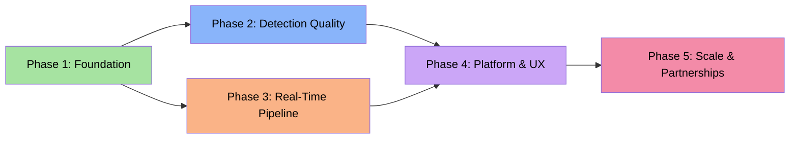
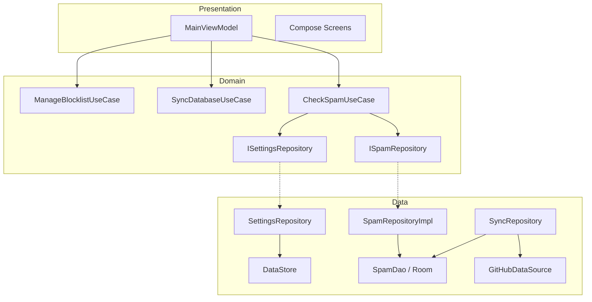
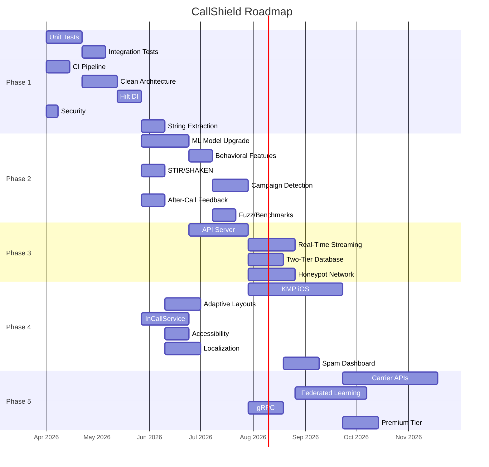

# CallShield Development Roadmap

## Current State (v1.2.8)

Working Android spam call/text blocker with 57 Kotlin files (~9,200 lines), 15-layer detection pipeline, logistic regression ML scorer (15 features), Jetpack Compose UI with Catppuccin Mocha theme, Room database, weekly batch sync from GitHub. Zero test coverage, no dependency injection, monolithic SpamRepository.

---

## Phase 1: Foundation (Testing, Architecture, Security)

**Goal:** Engineering discipline, testability, security hardening. Every subsequent phase depends on this.

**Estimated Duration:** 6-8 weeks

### 1.1 Unit Tests for Detection Engines

| Task | Size | Depends On | Files |
|------|------|-----------|-------|
| 1.1.1 `SpamMLScorer` tests — extractFeatures(), score() boundary at 0.7, parseAndApply() with valid/invalid JSON, sigmoid() edges | M | — | `test/.../SpamMLScorerTest.kt` |
| 1.1.2 `SpamHeuristics` tests — isNeighborSpoof(), isTollFree(), analyze() scoring, hot campaign range matching | L | — | `test/.../SpamHeuristicsTest.kt` |
| 1.1.3 `SmsContentAnalyzer` tests — each of 30+ regex patterns, URL shortener detection, spam domain blocklist, scoring thresholds | L | — | `test/.../SmsContentAnalyzerTest.kt` |
| 1.1.4 `PhoneFormatter` tests — US 10/11-digit, short codes, international, empty/non-digit edge cases | S | — | `test/.../PhoneFormatterTest.kt` |
| 1.1.5 `CallbackDetector` tests — wasRecentlyDialed() window, isRepeatedUrgentCall() threshold counting (mock ContentResolver) | M | 1.6 | `test/.../CallbackDetectorTest.kt` |
| 1.1.6 `SmsContextChecker` tests — normalization to last-10-digits, trust threshold (2+ distinct days), month 0-indexing | M | 1.6 | `test/.../SmsContextCheckerTest.kt` |
| 1.1.7 `LogExporter` tests — RFC 4180 CSV escaping: quotes, embedded quotes, newline stripping | S | — | `test/.../LogExporterTest.kt` |
| 1.1.8 `BackupRestore` tests — v2 serialization/deserialization, v1 backward compat, per-item error tolerance | M | — | `test/.../BackupRestoreTest.kt` |
| 1.1.9 `WildcardRule.matches()` tests — regex validation, crash prevention | S | — | `test/.../WildcardRuleTest.kt` |
| 1.1.10 `BlockingProfiles` tests — profile application verification | S | — | `test/.../BlockingProfilesTest.kt` |

**Architecture note:** `SpamHeuristics`, `SmsContentAnalyzer`, `SpamMLScorer`, `CallbackDetector`, `SmsContextChecker` are `object` singletons with Context dependencies. For testability, make `analyze()` and `isSpam()` accept data as parameters rather than fetching internally. Preserves singleton pattern while making pure logic testable.

### 1.2 Integration Tests

| Task | Size | Depends On | Files |
|------|------|-----------|-------|
| 1.2.1 Full `isSpam()` pipeline with in-memory Room DB — exercise all 15 layers, verify priority ordering (whitelist > blocklist > heuristics) | XL | 1.1, 1.6 | `androidTest/.../SpamPipelineIntegrationTest.kt` |
| 1.2.2 `isSpamSms()` pipeline — SMS context trust bypass, keyword rules, content analysis order | L | 1.2.1 | `androidTest/.../SmsPipelineIntegrationTest.kt` |
| 1.2.3 `syncFromGitHub()` — mock HTTP responses, verify Room populated atomically via @Transaction | M | 1.6 | `androidTest/.../SyncIntegrationTest.kt` |
| 1.2.4 `HotListSyncWorker` — hot_numbers, hot_ranges, spam_domains parsed and stored, per-entry error tolerance | M | 1.6 | `androidTest/.../HotListSyncTest.kt` |

Use `Room.inMemoryDatabaseBuilder()` for speed and isolation. Requires refactoring `AppDatabase.getInstance()` to accept pre-built instance (via Hilt).

### 1.3 Compose UI Tests

| Task | Size | Depends On | Files |
|------|------|-----------|-------|
| 1.3.1 Onboarding flow — 4 pages, permission requests, call screener setup | M | 1.6 | `androidTest/.../ui/OnboardingTest.kt` |
| 1.3.2 Dashboard — hero stats, sync freshness, call screener banner | M | 1.6 | `androidTest/.../ui/DashboardTest.kt` |
| 1.3.3 Blocklist management — add/delete, wildcard validation, swipe-to-delete+undo, dialogs | L | 1.6 | `androidTest/.../ui/BlocklistTest.kt` |
| 1.3.4 Settings — toggle persistence, quiet hours validation | M | 1.6 | `androidTest/.../ui/SettingsTest.kt` |

### 1.4 CI Pipeline

| Task | Size | Depends On | Files |
|------|------|-----------|-------|
| 1.4.1 `test.yml` workflow — compile app, run unit tests on every PR/push | M | — | `.github/workflows/test.yml` |
| 1.4.2 Instrumented test job with Android emulator (API 29) | L | 1.4.1 | `.github/workflows/test.yml` |
| 1.4.3 Lint + ktlint checks | S | 1.4.1 | `.github/workflows/test.yml`, `.editorconfig` |
| 1.4.4 Code coverage (Kover) with ratcheting threshold (start 30%) | M | 1.4.1, 1.1 | `app/build.gradle.kts` |

**Trade-off:** Emulator tests are slow/flaky. Run instrumented tests only on master merges, not every PR.

### 1.5 Clean Architecture Refactor

| Task | Size | Depends On | Files |
|------|------|-----------|-------|
| 1.5.1 Domain use cases: `CheckSpamUseCase`, `CheckSpamSmsUseCase`, `SyncDatabaseUseCase`, `ManageBlocklistUseCase`, `ExportLogsUseCase` | L | — | `domain/usecase/*.kt` |
| 1.5.2 Extract `SpamCheckResult` and settings models to domain layer | S | 1.5.1 | `domain/model/*.kt` |
| 1.5.3 Define repository interfaces in domain layer | M | 1.5.1 | `domain/repository/*.kt` |
| 1.5.4 Split `SpamRepository` (~320 lines) into: `SpamRepositoryImpl`, `SettingsRepository`, `SyncRepository`, `BlocklistRepository` | XL | 1.5.3 | `data/repository/*.kt` |

**Critical:** Write integration tests for the full pipeline BEFORE splitting SpamRepository. Run them after each split step to verify detection ordering is preserved.

### 1.6 Dependency Injection (Hilt)

| Task | Size | Depends On | Files |
|------|------|-----------|-------|
| 1.6.1 Add Hilt dependencies | S | — | `build.gradle.kts`, `libs.versions.toml` |
| 1.6.2 `@HiltAndroidApp` on `CallShieldApp` | S | 1.6.1 | `CallShieldApp.kt` |
| 1.6.3 `DatabaseModule` — provide `AppDatabase` + `SpamDao` singletons | M | 1.6.1 | `di/DatabaseModule.kt` |
| 1.6.4 `RepositoryModule` — bind interfaces to implementations | M | 1.5.4, 1.6.1 | `di/RepositoryModule.kt` |
| 1.6.5 `NetworkModule` — shared `OkHttpClient` with cert pinning | M | 1.6.1, 1.7.2 | `di/NetworkModule.kt` |
| 1.6.6 `MainViewModel` → `@HiltViewModel` with injected use cases | M | 1.6.4 | `MainViewModel.kt` |
| 1.6.7 `CallShieldScreeningService` → `@AndroidEntryPoint` | M | 1.6.4 | `CallShieldScreeningService.kt` |
| 1.6.8 Workers → `@HiltWorker` | M | 1.6.4 | `SyncWorker.kt`, `HotListSyncWorker.kt`, `DigestWorker.kt` |
| 1.6.9 Convert `object` singletons to injectable classes | L | 1.6.1 | Multiple data files |

**Risk:** Migrate services one at a time; keep `getInstance()` fallback until all consumers migrated.

### 1.7 Security Hardening

| Task | Size | Depends On | Files |
|------|------|-----------|-------|
| 1.7.1 Move signing credentials to `local.properties` / env vars | S | — | `build.gradle.kts`, `.gitignore` |
| 1.7.2 Certificate pinning for GitHub CDN + Cloudflare Worker | M | 1.6.5 | `di/NetworkModule.kt` |
| 1.7.3 Encrypt backups with AndroidX Security `EncryptedFile` | M | — | `BackupRestore.kt` |
| 1.7.4 `android:allowBackup="false"` or restrictive backup rules | S | — | `AndroidManifest.xml` |

**Priority:** 1.7.1 is the highest-priority security fix. Hardcoded `CallShield2026` password in `build.gradle.kts` is visible to anyone with repo access.

### 1.8 String Extraction

| Task | Size | Depends On | Files |
|------|------|-----------|-------|
| 1.8.1 Audit all 57 Kotlin files for hardcoded user-facing strings (~200-300 strings) | S | — | Audit doc |
| 1.8.2 Extract UI strings from Compose screens | XL | 1.8.1 | `res/values/strings.xml`, all screens |
| 1.8.3 Extract notification strings | M | 1.8.1 | `NotificationHelper.kt`, `DigestWorker.kt` |
| 1.8.4 Extract detection reason strings | M | 1.8.1 | Data layer files |

---

## Phase 2: Detection Quality

**Goal:** Better ML model, behavioral features, STIR/SHAKEN parsing, feedback loops.

**Estimated Duration:** 8-10 weeks
**Prerequisites:** Phase 1 (testing, DI) substantially complete.

### 2.1 ML Model Upgrade

| Task | Size | Depends On | Files |
|------|------|-----------|-------|
| 2.1.1 Upgrade training to gradient-boosted trees (XGBoost/LightGBM), keep logistic regression as fallback | L | — | `scripts/train_spam_model.py` |
| 2.1.2 On-device GBT inference in pure Kotlin — 50-100 trees, max depth 4, no TFLite needed | L | 2.1.1 | `SpamMLScorer.kt` (rewrite) |
| 2.1.3 Update `spam_model_weights.json` format (version 3) with backward compat to v2 logistic regression | M | 2.1.1, 2.1.2 | Weight JSON schema, `parseAndApply()` |
| 2.1.4 A/B comparison framework — log both old/new model scores for 2 weeks before switching | M | 2.1.2 | `SpamMLScorer.kt`, `SpamDao.kt` |

**Why GBT over neural network:** (a) trivial pure-Kotlin inference, (b) better with binary indicator features, (c) small model (~50KB), (d) no ML library dependency.

### 2.2 Behavioral/Temporal Features

| Task | Size | Depends On | Files |
|------|------|-----------|-------|
| 2.2.1 Time-of-day feature — sin/cos encoding for cyclical continuity | M | 2.1.2 | `SpamMLScorer.extractFeatures()` |
| 2.2.2 Call frequency feature — calls from this number in last 7/30 days | M | 2.1.2 | `SpamMLScorer.extractFeatures()`, `SpamDao.kt` |
| 2.2.3 Ring duration feature — short rings correlate with robocalls | M | 2.1.2 | `CallShieldScreeningService.kt` |
| 2.2.4 Geographic distance feature — area code distance from user | M | 2.1.2 | `SpamMLScorer.extractFeatures()` |
| 2.2.5 Retrain with expanded features (15 original + 4-6 new) | M | 2.2.1-4 | `train_spam_model.py` |

### 2.3 STIR/SHAKEN Enhancement

| Task | Size | Depends On | Files |
|------|------|-----------|-------|
| 2.3.1 Parse full PASSporT token (Android 11+) — attestation level A/B/C, originating carrier | L | — | New `data/StirShakenParser.kt` |
| 2.3.2 Attestation level as ML feature — A reduces score, C increases | M | 2.3.1, 2.1.2 | `SpamMLScorer.extractFeatures()` |
| 2.3.3 Log attestation in call log for statistics | S | 2.3.1 | `SpamDao.kt`, `BlockedCall` model |

### 2.4 Graph-Based Campaign Detection

| Task | Size | Depends On | Files |
|------|------|-----------|-------|
| 2.4.1 Local call graph in Room — track NPA-NXX prefix clusters over time | L | — | New `data/local/CallGraphDao.kt` |
| 2.4.2 Campaign burst detection — 5+ numbers from same NPA-NXX in 1 hour = active campaign | M | 2.4.1 | New `data/CampaignDetector.kt` |
| 2.4.3 Integrate as detection layer 11.5 (between heuristics and overlay) | M | 2.4.2 | `SpamRepositoryImpl.isSpam()` |

### 2.5 After-Call Feedback

| Task | Size | Depends On | Files |
|------|------|-----------|-------|
| 2.5.1 "Was this spam?" notification after allowed unknown calls | M | P1.6 | `NotificationHelper.kt`, `SpamActionReceiver.kt` |
| 2.5.2 Store feedback in Room with positive/negative labels | S | 2.5.1 | `SpamDao.kt`, new `FeedbackEntry` model |
| 2.5.3 Export feedback for training pipeline | M | 2.5.2 | `train_spam_model.py` |
| 2.5.4 Auto-submit to community reports (opt-in) | M | 2.5.2 | `CommunityContributor.kt` |

### 2.6 Quality Assurance

| Task | Size | Depends On | Files |
|------|------|-----------|-------|
| 2.6.1 Fuzz testing on phone number parsing | M | P1.1 | `test/.../PhoneNumberFuzzTest.kt` |
| 2.6.2 Performance benchmark — `isSpam()` must be <50ms | M | P1.4 | `androidTest/.../SpamCheckBenchmark.kt` |
| 2.6.3 ML accuracy metrics (precision/recall/F1) in CI | M | 2.1.1 | `scripts/evaluate_model.py` |

---

## Phase 3: Real-Time Data Pipeline

**Goal:** Replace batch sync with real-time streaming, proper backend, honeypot network.

**Estimated Duration:** 10-14 weeks
**Prerequisites:** Phase 1 complete. Phase 2 at least partially complete.

### 3.1 API Server

| Task | Size | Depends On | Files |
|------|------|-----------|-------|
| 3.1.1 OpenAPI 3.0 spec — `POST /reports`, `GET /reputation/{number}`, `GET /blocklist/delta`, `POST /feedback` | M | — | `server/openapi.yaml` |
| 3.1.2 Ktor server implementation | XL | 3.1.1 | `server/` directory |
| 3.1.3 Migrate Cloudflare Worker to thin proxy for backward compat | L | 3.1.2 | `worker/`, server |
| 3.1.4 Authentication — API keys (anonymous but rate-limited), JWT for admin | L | 3.1.2 | `server/auth/` |
| 3.1.5 Rate limiting via Redis or in-memory token bucket | M | 3.1.2 | `server/middleware/` |
| 3.1.6 Abuse detection — coordinated false reports, report flooding | L | 3.1.5 | `server/abuse/` |

**Why Ktor:** Same Kotlin ecosystem, shares data models with Android, coroutines-native.

### 3.2 Real-Time Streaming

| Task | Size | Depends On | Files |
|------|------|-----------|-------|
| 3.2.1 Delta API — client sends `last_sync_timestamp`, gets only new/changed numbers | L | 3.1.2 | `data/remote/ApiDataSource.kt`, server |
| 3.2.2 SSE push — new hot numbers pushed within 30 seconds of ingestion | XL | 3.1.2 | Server, new `service/RealtimeSyncService.kt` |
| 3.2.3 Fallback polling — keep `HotListSyncWorker` when SSE drops | M | 3.2.2 | `HotListSyncWorker.kt` |

### 3.3 Two-Tier Database

| Task | Size | Depends On | Files |
|------|------|-----------|-------|
| 3.3.1 Bloom filter for 100K+ numbers (FPR <0.1%) + exact-match Room table | L | — | New `data/local/BloomFilter.kt` |
| 3.3.2 Cloud reputation API for numbers not in local filter | M | 3.1.2 | New `data/remote/ReputationApi.kt` |
| 3.3.3 Two-tier lookup in pipeline — local first (μs), cloud fallback | M | 3.3.1, 3.3.2 | `SpamRepositoryImpl.isSpam()` |
| 3.3.4 Offline mode — fully functional with local-only, cloud is enhancement | M | 3.3.3 | Detection pipeline |

### 3.4 Honeypot Network

| Task | Size | Depends On | Files |
|------|------|-----------|-------|
| 3.4.1 Deploy 10 Twilio honeypot numbers across area codes — log all callers | XL | 3.1.2 | `server/honeypot/` |
| 3.4.2 Ground-truth labeling — all honeypot calls are definitively spam → training pipeline | L | 3.4.1 | `train_spam_model.py` |
| 3.4.3 Geographic campaign clustering from honeypot + community data | L | 3.4.1 | `server/analytics/` |

### 3.5 Geographic Clustering

| Task | Size | Depends On | Files |
|------|------|-----------|-------|
| 3.5.1 NPA-NXX geographic mapping from NANPA public data | M | — | `server/data/nanpa_mapping.json` |
| 3.5.2 Spam campaign hot zone identification | L | 3.5.1, 3.1.2 | `server/analytics/` |
| 3.5.3 API endpoint for client-side visualization | M | 3.5.2 | Server |

---

## Phase 4: Platform & UX

**Goal:** iOS via KMP, InCallService, accessibility, localization, spam trends dashboard.

**Estimated Duration:** 12-16 weeks
**Prerequisites:** Phase 1 complete. Phase 2 substantially complete. Phase 3 API server minimum.

### 4.1 Kotlin Multiplatform (iOS)

| Task | Size | Depends On | Files |
|------|------|-----------|-------|
| 4.1.1 Extract shared detection engine to KMP module — `SpamMLScorer`, `SpamHeuristics` (non-Android), `PhoneFormatter`, regex patterns | XL | P1.5, P1.6 | New `shared/` KMP module |
| 4.1.2 `expect`/`actual` for platform APIs — contacts, call log, DataStore/UserDefaults | XL | 4.1.1 | `shared/src/{commonMain,androidMain,iosMain}/` |
| 4.1.3 iOS SwiftUI shell — settings, blocklist, detection toggle | XL | 4.1.2 | `iosApp/` |
| 4.1.4 CallKit integration — `CXCallDirectoryProvider` for blocking, `CXCallDirectoryManager` for reload | XL | 4.1.3 | `iosApp/CallShieldExtension/` |

**Critical iOS constraint:** CallKit requires preloading a block list into an extension — no real-time evaluation. Strategy: sync blocked numbers to CallKit extension periodically.

### 4.2 Adaptive Layouts

| Task | Size | Depends On | Files |
|------|------|-----------|-------|
| 4.2.1 Window size class detection (`calculateWindowSizeClass()`) | S | — | `MainActivity.kt` |
| 4.2.2 Tablet list-detail pane for blocklist/log screens | L | 4.2.1 | Screen files |
| 4.2.3 Foldable support (`FoldingFeature`) | M | 4.2.1 | `MainActivity.kt` |
| 4.2.4 Landscape layout — horizontal stats, wider dialogs | M | 4.2.1 | Various screens |

### 4.3 InCallService Integration

| Task | Size | Depends On | Files |
|------|------|-----------|-------|
| 4.3.1 Custom call screen (Android 12+) — spam score, caller name, location on incoming call UI | XL | P1.6 | New `service/CallShieldInCallService.kt` |
| 4.3.2 Replace overlay with InCallService when available — overlay fallback for Android 10-11 | M | 4.3.1 | `CallerIdOverlayService.kt` |

### 4.4 After-Call Bottom Sheet

| Task | Size | Depends On | Files |
|------|------|-----------|-------|
| 4.4.1 "Was this spam?" bottom sheet after unknown calls — thumbs up/down + type selector | M | P2.5 | New UI, `CallShieldScreeningService.kt` |
| 4.4.2 Skip for contacts/whitelisted numbers | S | 4.4.1 | Service logic |

### 4.5 Contact Enrichment

| Task | Size | Depends On | Files |
|------|------|-----------|-------|
| 4.5.1 Business name lookup (OpenCNAM + Google Places) | M | P3.1 | `data/remote/BusinessLookup.kt` |
| 4.5.2 Business logo (Clearbit/Google Favicon) | M | 4.5.1 | Caller ID UI |
| 4.5.3 Cache enrichment results in Room | M | 4.5.1 | New `data/local/ContactEnrichmentDao.kt` |

### 4.6 Accessibility

| Task | Size | Depends On | Files |
|------|------|-----------|-------|
| 4.6.1 Full TalkBack audit — contentDescription on all elements | L | — | All screens |
| 4.6.2 Dynamic type support — test at 200% font scale | M | — | `Theme.kt`, all screens |
| 4.6.3 WCAG AA color contrast audit against Catppuccin Mocha | M | — | `Theme.kt` |
| 4.6.4 Touch targets ≥ 48dp × 48dp | M | — | All screens |

### 4.7 Localization

| Task | Size | Depends On | Files |
|------|------|-----------|-------|
| 4.7.1 Complete string extraction (Phase 1.8) | XL | P1.8 | `res/values/strings.xml` |
| 4.7.2 Translate to 6 languages: ES, FR, DE, PT, JA, KO | L each | 4.7.1 | `res/values-{lang}/strings.xml` |
| 4.7.3 RTL layout support (Arabic, Hebrew) | M | 4.7.1 | Layout adjustments |
| 4.7.4 Plurals and formatted strings | M | 4.7.1 | `strings.xml` |

### 4.8 Spam Trends Dashboard

| Task | Size | Depends On | Files |
|------|------|-----------|-------|
| 4.8.1 Time-series chart — blocked calls per day/week/month (Vico or custom Canvas) | L | — | `StatsScreen.kt` rewrite |
| 4.8.2 Source breakdown pie/donut chart | M | 4.8.1 | `StatsScreen.kt` |
| 4.8.3 Geographic spam heat map using Phase 3.5 data | XL | P3.5.3 | New `SpamMapScreen.kt` |
| 4.8.4 Trend indicators with historical comparison | M | 4.8.1 | `StatsScreen.kt` |

---

## Phase 5: Scale & Partnerships

**Goal:** Carrier APIs, federated learning, monetization, security audit.

**Estimated Duration:** 16-24 weeks (ongoing)
**Prerequisites:** Phases 1-3 complete. Phase 4 substantially complete.

### 5.1 Carrier Integration

| Task | Size | Depends On | Files |
|------|------|-----------|-------|
| 5.1.1 T-Mobile STIR/SHAKEN Verified Calls API | XL | Partnership | `data/remote/CarrierApi.kt` |
| 5.1.2 AT&T ActiveArmor API | XL | Partnership | `data/remote/CarrierApi.kt` |
| 5.1.3 Abstract carrier differences behind common interface | L | 5.1.1, 5.1.2 | `domain/repository/CarrierRepository.kt` |

### 5.2 Federated Learning

| Task | Size | Depends On | Files |
|------|------|-----------|-------|
| 5.2.1 On-device training — compute gradient updates locally from feedback, no raw data sent | XL | P2.1, P2.5 | New `data/ml/FederatedTrainer.kt` |
| 5.2.2 Secure aggregation server — multi-party computation for gradient aggregation | XL | 5.2.1 | `server/federated/` |
| 5.2.3 Differential privacy — calibrated noise on gradient updates | L | 5.2.2 | `server/federated/privacy.kt` |

### 5.3 gRPC API

| Task | Size | Depends On | Files |
|------|------|-----------|-------|
| 5.3.1 Protobuf contracts for all endpoints | L | P3.1 | `proto/*.proto` |
| 5.3.2 Generate Kotlin/Swift clients | M | 5.3.1 | Generated code |
| 5.3.3 gRPC server alongside REST | L | 5.3.1 | `server/grpc/` |

### 5.4 Monetization & Audit

| Task | Size | Depends On | Files |
|------|------|-----------|-------|
| 5.4.1 Premium tier — Google Play Billing, feature gating | L | — | `data/billing/BillingManager.kt`, `PremiumScreen.kt` |
| 5.4.2 Feature flags for premium features | M | 5.4.1 | `domain/FeatureFlags.kt` |
| 5.4.3 Third-party security audit | XL | P1-P4 | External engagement |
| 5.4.4 White-label SDK for carrier integration | XL | P4.1 | New `sdk/` module |

---

## Cross-Cutting Concerns

### Database Migrations
Current Room DB uses `fallbackToDestructiveMigration()`. Acceptable for spam numbers (re-syncs) but NOT after adding feedback (2.5), call graphs (2.4), and enrichment caches (4.5). **Phase 1 must switch to proper `Migration` objects before Phase 2.**

### Backward Compatibility
Hot list sync and community reports use hardcoded GitHub URLs on `master` branch. Phase 3 API migration must maintain these endpoints for v1.2.x. Staged rollout: new API for new versions, GitHub raw for legacy.

### Privacy Architecture
Phases 2.5 (feedback), 3.4 (honeypot), 5.2 (federated learning) introduce data collection. Each requires: explicit opt-in, clear privacy policy, data retention limits.

---

## Timeline

---

## Total Estimated Effort

| Phase | Tasks | Duration | Key Deliverable |
|-------|-------|----------|-----------------|
| **Phase 1** | 35 tasks | 6-8 weeks | Testable, secure, properly-architected codebase |
| **Phase 2** | 20 tasks | 8-10 weeks | GBT model, behavioral features, feedback loops |
| **Phase 3** | 15 tasks | 10-14 weeks | Real-time API, two-tier DB, honeypot network |
| **Phase 4** | 22 tasks | 12-16 weeks | iOS app, InCallService, accessibility, i18n |
| **Phase 5** | 11 tasks | 16-24 weeks | Carrier APIs, federated learning, premium tier |

**Total: ~103 tasks, ~52-72 weeks end-to-end with parallelization**
