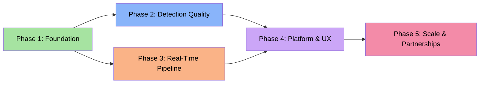
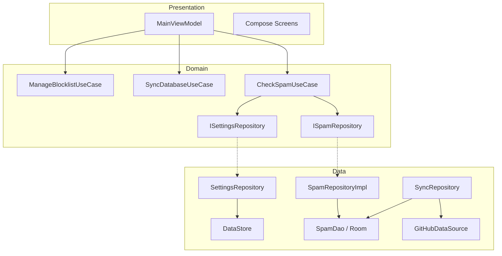
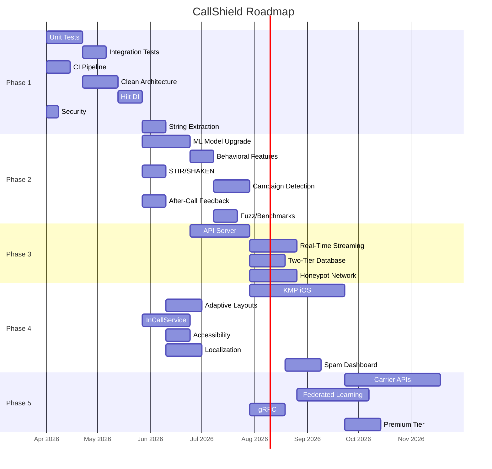

# CallShield Development Roadmap

## Current State (v1.7.0)

Working Android spam call/text blocker with 77 Kotlin files, 15-layer detection pipeline (now a priority-sorted `IChecker` composable registry), logistic regression ML scorer, Jetpack Compose UI with Catppuccin Mocha + AMOLED theme, Room database (6 explicit migrations), WorkManager hot-list + weekly sync from GitHub, RCS notification listener, CallerIdOverlayService, SIT-tone anti-autodialer, URLhaus phishing detection, Cloudflare Worker community reporting. 28 JVM unit tests + 3 instrumented tests. Round-1 architecture refactor (A1-A3: IChecker pipeline + budget-aware race + push-alert bridge) landed in v1.6.x series.



---

## Phase 1: Foundation (Testing, Architecture, Security)

**Goal:** Engineering discipline, testability, security hardening. Every subsequent phase depends on this.

**Estimated Duration:** 6-8 weeks

### 1.1 Unit Tests for Detection Engines

| Task | Size | Depends On | Files |
|------|------|-----------|-------|
| 1.1.1 `SpamMLScorer` tests — extractFeatures(), score() boundary at 0.7, parseAndApply() with valid/invalid JSON, sigmoid() edges | M | — | `test/.../SpamMLScorerTest.kt` |
| 1.1.2 `SpamHeuristics` tests — isNeighborSpoof(), isTollFree(), analyze() scoring, hot campaign range matching | L | — | `test/.../SpamHeuristicsTest.kt` |
| 1.1.3 `SmsContentAnalyzer` tests — each of 30+ regex patterns, URL shortener detection, spam domain blocklist, scoring thresholds | L | — | `test/.../SmsContentAnalyzerTest.kt` |
| 1.1.4 `PhoneFormatter` tests — US 10/11-digit, short codes, international, empty/non-digit edge cases | S | — | `test/.../PhoneFormatterTest.kt` |
| 1.1.5 `CallbackDetector` tests — wasRecentlyDialed() window, isRepeatedUrgentCall() threshold counting (mock ContentResolver) | M | 1.6 | `test/.../CallbackDetectorTest.kt` |
| 1.1.6 `SmsContextChecker` tests — normalization to last-10-digits, trust threshold (2+ distinct days), month 0-indexing | M | 1.6 | `test/.../SmsContextCheckerTest.kt` |
| 1.1.7 `LogExporter` tests — RFC 4180 CSV escaping: quotes, embedded quotes, newline stripping | S | — | `test/.../LogExporterTest.kt` |
| 1.1.8 `BackupRestore` tests — v2 serialization/deserialization, v1 backward compat, per-item error tolerance | M | — | `test/.../BackupRestoreTest.kt` |
| 1.1.9 `WildcardRule.matches()` tests — regex validation, crash prevention | S | — | `test/.../WildcardRuleTest.kt` |
| 1.1.10 `BlockingProfiles` tests — profile application verification | S | — | `test/.../BlockingProfilesTest.kt` |

**Architecture note:** `SpamHeuristics`, `SmsContentAnalyzer`, `SpamMLScorer`, `CallbackDetector`, `SmsContextChecker` are `object` singletons with Context dependencies. For testability, make `analyze()` and `isSpam()` accept data as parameters rather than fetching internally. Preserves singleton pattern while making pure logic testable.

### 1.2 Integration Tests

| Task | Size | Depends On | Files |
|------|------|-----------|-------|
| 1.2.1 Full `isSpam()` pipeline with in-memory Room DB — exercise all 15 layers, verify priority ordering (whitelist > blocklist > heuristics) | XL | 1.1, 1.6 | `androidTest/.../SpamPipelineIntegrationTest.kt` |
| 1.2.2 `isSpamSms()` pipeline — SMS context trust bypass, keyword rules, content analysis order | L | 1.2.1 | `androidTest/.../SmsPipelineIntegrationTest.kt` |
| 1.2.3 `syncFromGitHub()` — mock HTTP responses, verify Room populated atomically via @Transaction | M | 1.6 | `androidTest/.../SyncIntegrationTest.kt` |
| 1.2.4 `HotListSyncWorker` — hot_numbers, hot_ranges, spam_domains parsed and stored, per-entry error tolerance | M | 1.6 | `androidTest/.../HotListSyncTest.kt` |

Use `Room.inMemoryDatabaseBuilder()` for speed and isolation. Requires refactoring `AppDatabase.getInstance()` to accept pre-built instance (via Hilt).

### 1.3 Compose UI Tests

| Task | Size | Depends On | Files |
|------|------|-----------|-------|
| 1.3.1 Onboarding flow — 4 pages, permission requests, call screener setup | M | 1.6 | `androidTest/.../ui/OnboardingTest.kt` |
| 1.3.2 Dashboard — hero stats, sync freshness, call screener banner | M | 1.6 | `androidTest/.../ui/DashboardTest.kt` |
| 1.3.3 Blocklist management — add/delete, wildcard validation, swipe-to-delete+undo, dialogs | L | 1.6 | `androidTest/.../ui/BlocklistTest.kt` |
| 1.3.4 Settings — toggle persistence, quiet hours validation | M | 1.6 | `androidTest/.../ui/SettingsTest.kt` |

### 1.4 CI Pipeline

| Task | Size | Depends On | Files |
|------|------|-----------|-------|
| 1.4.1 `test.yml` workflow — compile app, run unit tests on every PR/push | M | — | `.github/workflows/test.yml` |
| 1.4.2 Instrumented test job with Android emulator (API 29) | L | 1.4.1 | `.github/workflows/test.yml` |
| 1.4.3 Lint + ktlint checks | S | 1.4.1 | `.github/workflows/test.yml`, `.editorconfig` |
| 1.4.4 Code coverage (Kover) with ratcheting threshold (start 30%) | M | 1.4.1, 1.1 | `app/build.gradle.kts` |

**Trade-off:** Emulator tests are slow/flaky. Run instrumented tests only on master merges, not every PR.

### 1.5 Clean Architecture Refactor

| Task | Size | Depends On | Files |
|------|------|-----------|-------|
| 1.5.1 Domain use cases: `CheckSpamUseCase`, `CheckSpamSmsUseCase`, `SyncDatabaseUseCase`, `ManageBlocklistUseCase`, `ExportLogsUseCase` | L | — | `domain/usecase/*.kt` |
| 1.5.2 Extract `SpamCheckResult` and settings models to domain layer | S | 1.5.1 | `domain/model/*.kt` |
| 1.5.3 Define repository interfaces in domain layer | M | 1.5.1 | `domain/repository/*.kt` |
| 1.5.4 Split `SpamRepository` (~320 lines) into: `SpamRepositoryImpl`, `SettingsRepository`, `SyncRepository`, `BlocklistRepository` | XL | 1.5.3 | `data/repository/*.kt` |

**Critical:** Write integration tests for the full pipeline BEFORE splitting SpamRepository. Run them after each split step to verify detection ordering is preserved.



### 1.6 Dependency Injection (Hilt)

| Task | Size | Depends On | Files |
|------|------|-----------|-------|
| 1.6.1 Add Hilt dependencies | S | — | `build.gradle.kts`, `libs.versions.toml` |
| 1.6.2 `@HiltAndroidApp` on `CallShieldApp` | S | 1.6.1 | `CallShieldApp.kt` |
| 1.6.3 `DatabaseModule` — provide `AppDatabase` + `SpamDao` singletons | M | 1.6.1 | `di/DatabaseModule.kt` |
| 1.6.4 `RepositoryModule` — bind interfaces to implementations | M | 1.5.4, 1.6.1 | `di/RepositoryModule.kt` |
| 1.6.5 `NetworkModule` — shared `OkHttpClient` with cert pinning | M | 1.6.1, 1.7.2 | `di/NetworkModule.kt` |
| 1.6.6 `MainViewModel` → `@HiltViewModel` with injected use cases | M | 1.6.4 | `MainViewModel.kt` |
| 1.6.7 `CallShieldScreeningService` → `@AndroidEntryPoint` | M | 1.6.4 | `CallShieldScreeningService.kt` |
| 1.6.8 Workers → `@HiltWorker` | M | 1.6.4 | `SyncWorker.kt`, `HotListSyncWorker.kt`, `DigestWorker.kt` |
| 1.6.9 Convert `object` singletons to injectable classes | L | 1.6.1 | Multiple data files |

**Risk:** Migrate services one at a time; keep `getInstance()` fallback until all consumers migrated.

### 1.7 Security Hardening

| Task | Size | Depends On | Files |
|------|------|-----------|-------|
| 1.7.1 Move signing credentials to `local.properties` / env vars | S | — | `build.gradle.kts`, `.gitignore` |
| 1.7.2 Certificate pinning for GitHub CDN + Cloudflare Worker | M | 1.6.5 | `di/NetworkModule.kt` |
| 1.7.3 Encrypt backups with AndroidX Security `EncryptedFile` | M | — | `BackupRestore.kt` |
| 1.7.4 `android:allowBackup="false"` or restrictive backup rules | S | — | `AndroidManifest.xml` |

**Priority:** 1.7.1 is the highest-priority security fix. Hardcoded `CallShield2026` password in `build.gradle.kts` is visible to anyone with repo access.

### 1.8 String Extraction

| Task | Size | Depends On | Files |
|------|------|-----------|-------|
| 1.8.1 Audit all 57 Kotlin files for hardcoded user-facing strings (~200-300 strings) | S | — | Audit doc |
| 1.8.2 Extract UI strings from Compose screens | XL | 1.8.1 | `res/values/strings.xml`, all screens |
| 1.8.3 Extract notification strings | M | 1.8.1 | `NotificationHelper.kt`, `DigestWorker.kt` |
| 1.8.4 Extract detection reason strings | M | 1.8.1 | Data layer files |

---

## Phase 2: Detection Quality

**Goal:** Better ML model, behavioral features, STIR/SHAKEN parsing, feedback loops.

**Estimated Duration:** 8-10 weeks
**Prerequisites:** Phase 1 (testing, DI) substantially complete.

### 2.1 ML Model Upgrade

| Task | Size | Depends On | Files |
|------|------|-----------|-------|
| 2.1.1 Upgrade training to gradient-boosted trees (XGBoost/LightGBM), keep logistic regression as fallback | L | — | `scripts/train_spam_model.py` |
| 2.1.2 On-device GBT inference in pure Kotlin — 50-100 trees, max depth 4, no TFLite needed | L | 2.1.1 | `SpamMLScorer.kt` (rewrite) |
| 2.1.3 Update `spam_model_weights.json` format (version 3) with backward compat to v2 logistic regression | M | 2.1.1, 2.1.2 | Weight JSON schema, `parseAndApply()` |
| 2.1.4 A/B comparison framework — log both old/new model scores for 2 weeks before switching | M | 2.1.2 | `SpamMLScorer.kt`, `SpamDao.kt` |

**Why GBT over neural network:** (a) trivial pure-Kotlin inference, (b) better with binary indicator features, (c) small model (~50KB), (d) no ML library dependency.

### 2.2 Behavioral/Temporal Features

| Task | Size | Depends On | Files |
|------|------|-----------|-------|
| 2.2.1 Time-of-day feature — sin/cos encoding for cyclical continuity | M | 2.1.2 | `SpamMLScorer.extractFeatures()` |
| 2.2.2 Call frequency feature — calls from this number in last 7/30 days | M | 2.1.2 | `SpamMLScorer.extractFeatures()`, `SpamDao.kt` |
| 2.2.3 Ring duration feature — short rings correlate with robocalls | M | 2.1.2 | `CallShieldScreeningService.kt` |
| 2.2.4 Geographic distance feature — area code distance from user | M | 2.1.2 | `SpamMLScorer.extractFeatures()` |
| 2.2.5 Retrain with expanded features (15 original + 4-6 new) | M | 2.2.1-4 | `train_spam_model.py` |

### 2.3 STIR/SHAKEN Enhancement

| Task | Size | Depends On | Files |
|------|------|-----------|-------|
| 2.3.1 Parse full PASSporT token (Android 11+) — attestation level A/B/C, originating carrier | L | — | New `data/StirShakenParser.kt` |
| 2.3.2 Attestation level as ML feature — A reduces score, C increases | M | 2.3.1, 2.1.2 | `SpamMLScorer.extractFeatures()` |
| 2.3.3 Log attestation in call log for statistics | S | 2.3.1 | `SpamDao.kt`, `BlockedCall` model |

### 2.4 Graph-Based Campaign Detection

| Task | Size | Depends On | Files |
|------|------|-----------|-------|
| 2.4.1 Local call graph in Room — track NPA-NXX prefix clusters over time | L | — | New `data/local/CallGraphDao.kt` |
| 2.4.2 Campaign burst detection — 5+ numbers from same NPA-NXX in 1 hour = active campaign | M | 2.4.1 | New `data/CampaignDetector.kt` |
| 2.4.3 Integrate as detection layer 11.5 (between heuristics and overlay) | M | 2.4.2 | `SpamRepositoryImpl.isSpam()` |

### 2.5 After-Call Feedback

| Task | Size | Depends On | Files |
|------|------|-----------|-------|
| 2.5.1 "Was this spam?" notification after allowed unknown calls | M | P1.6 | `NotificationHelper.kt`, `SpamActionReceiver.kt` |
| 2.5.2 Store feedback in Room with positive/negative labels | S | 2.5.1 | `SpamDao.kt`, new `FeedbackEntry` model |
| 2.5.3 Export feedback for training pipeline | M | 2.5.2 | `train_spam_model.py` |
| 2.5.4 Auto-submit to community reports (opt-in) | M | 2.5.2 | `CommunityContributor.kt` |

### 2.6 Quality Assurance

| Task | Size | Depends On | Files |
|------|------|-----------|-------|
| 2.6.1 Fuzz testing on phone number parsing | M | P1.1 | `test/.../PhoneNumberFuzzTest.kt` |
| 2.6.2 Performance benchmark — `isSpam()` must be <50ms | M | P1.4 | `androidTest/.../SpamCheckBenchmark.kt` |
| 2.6.3 ML accuracy metrics (precision/recall/F1) in CI | M | 2.1.1 | `scripts/evaluate_model.py` |

---

## Phase 3: Real-Time Data Pipeline

**Goal:** Replace batch sync with real-time streaming, proper backend, honeypot network.

**Estimated Duration:** 10-14 weeks
**Prerequisites:** Phase 1 complete. Phase 2 at least partially complete.

### 3.1 API Server

| Task | Size | Depends On | Files |
|------|------|-----------|-------|
| 3.1.1 OpenAPI 3.0 spec — `POST /reports`, `GET /reputation/{number}`, `GET /blocklist/delta`, `POST /feedback` | M | — | `server/openapi.yaml` |
| 3.1.2 Ktor server implementation | XL | 3.1.1 | `server/` directory |
| 3.1.3 Migrate Cloudflare Worker to thin proxy for backward compat | L | 3.1.2 | `worker/`, server |
| 3.1.4 Authentication — API keys (anonymous but rate-limited), JWT for admin | L | 3.1.2 | `server/auth/` |
| 3.1.5 Rate limiting via Redis or in-memory token bucket | M | 3.1.2 | `server/middleware/` |
| 3.1.6 Abuse detection — coordinated false reports, report flooding | L | 3.1.5 | `server/abuse/` |

**Why Ktor:** Same Kotlin ecosystem, shares data models with Android, coroutines-native.

### 3.2 Real-Time Streaming

| Task | Size | Depends On | Files |
|------|------|-----------|-------|
| 3.2.1 Delta API — client sends `last_sync_timestamp`, gets only new/changed numbers | L | 3.1.2 | `data/remote/ApiDataSource.kt`, server |
| 3.2.2 SSE push — new hot numbers pushed within 30 seconds of ingestion | XL | 3.1.2 | Server, new `service/RealtimeSyncService.kt` |
| 3.2.3 Fallback polling — keep `HotListSyncWorker` when SSE drops | M | 3.2.2 | `HotListSyncWorker.kt` |

### 3.3 Two-Tier Database

| Task | Size | Depends On | Files |
|------|------|-----------|-------|
| 3.3.1 Bloom filter for 100K+ numbers (FPR <0.1%) + exact-match Room table | L | — | New `data/local/BloomFilter.kt` |
| 3.3.2 Cloud reputation API for numbers not in local filter | M | 3.1.2 | New `data/remote/ReputationApi.kt` |
| 3.3.3 Two-tier lookup in pipeline — local first (μs), cloud fallback | M | 3.3.1, 3.3.2 | `SpamRepositoryImpl.isSpam()` |
| 3.3.4 Offline mode — fully functional with local-only, cloud is enhancement | M | 3.3.3 | Detection pipeline |

### 3.4 Honeypot Network

| Task | Size | Depends On | Files |
|------|------|-----------|-------|
| 3.4.1 Deploy 10 Twilio honeypot numbers across area codes — log all callers | XL | 3.1.2 | `server/honeypot/` |
| 3.4.2 Ground-truth labeling — all honeypot calls are definitively spam → training pipeline | L | 3.4.1 | `train_spam_model.py` |
| 3.4.3 Geographic campaign clustering from honeypot + community data | L | 3.4.1 | `server/analytics/` |

### 3.5 Geographic Clustering

| Task | Size | Depends On | Files |
|------|------|-----------|-------|
| 3.5.1 NPA-NXX geographic mapping from NANPA public data | M | — | `server/data/nanpa_mapping.json` |
| 3.5.2 Spam campaign hot zone identification | L | 3.5.1, 3.1.2 | `server/analytics/` |
| 3.5.3 API endpoint for client-side visualization | M | 3.5.2 | Server |

---

## Phase 4: Platform & UX

**Goal:** iOS via KMP, InCallService, accessibility, localization, spam trends dashboard.

**Estimated Duration:** 12-16 weeks
**Prerequisites:** Phase 1 complete. Phase 2 substantially complete. Phase 3 API server minimum.

### 4.1 Kotlin Multiplatform (iOS)

| Task | Size | Depends On | Files |
|------|------|-----------|-------|
| 4.1.1 Extract shared detection engine to KMP module — `SpamMLScorer`, `SpamHeuristics` (non-Android), `PhoneFormatter`, regex patterns | XL | P1.5, P1.6 | New `shared/` KMP module |
| 4.1.2 `expect`/`actual` for platform APIs — contacts, call log, DataStore/UserDefaults | XL | 4.1.1 | `shared/src/{commonMain,androidMain,iosMain}/` |
| 4.1.3 iOS SwiftUI shell — settings, blocklist, detection toggle | XL | 4.1.2 | `iosApp/` |
| 4.1.4 CallKit integration — `CXCallDirectoryProvider` for blocking, `CXCallDirectoryManager` for reload | XL | 4.1.3 | `iosApp/CallShieldExtension/` |

**Critical iOS constraint:** CallKit requires preloading a block list into an extension — no real-time evaluation. Strategy: sync blocked numbers to CallKit extension periodically.

### 4.2 Adaptive Layouts

| Task | Size | Depends On | Files |
|------|------|-----------|-------|
| 4.2.1 Window size class detection (`calculateWindowSizeClass()`) | S | — | `MainActivity.kt` |
| 4.2.2 Tablet list-detail pane for blocklist/log screens | L | 4.2.1 | Screen files |
| 4.2.3 Foldable support (`FoldingFeature`) | M | 4.2.1 | `MainActivity.kt` |
| 4.2.4 Landscape layout — horizontal stats, wider dialogs | M | 4.2.1 | Various screens |

### 4.3 InCallService Integration

| Task | Size | Depends On | Files |
|------|------|-----------|-------|
| 4.3.1 Custom call screen (Android 12+) — spam score, caller name, location on incoming call UI | XL | P1.6 | New `service/CallShieldInCallService.kt` |
| 4.3.2 Replace overlay with InCallService when available — overlay fallback for Android 10-11 | M | 4.3.1 | `CallerIdOverlayService.kt` |

### 4.4 After-Call Bottom Sheet

| Task | Size | Depends On | Files |
|------|------|-----------|-------|
| 4.4.1 "Was this spam?" bottom sheet after unknown calls — thumbs up/down + type selector | M | P2.5 | New UI, `CallShieldScreeningService.kt` |
| 4.4.2 Skip for contacts/whitelisted numbers | S | 4.4.1 | Service logic |

### 4.5 Contact Enrichment

| Task | Size | Depends On | Files |
|------|------|-----------|-------|
| 4.5.1 Business name lookup (OpenCNAM + Google Places) | M | P3.1 | `data/remote/BusinessLookup.kt` |
| 4.5.2 Business logo (Clearbit/Google Favicon) | M | 4.5.1 | Caller ID UI |
| 4.5.3 Cache enrichment results in Room | M | 4.5.1 | New `data/local/ContactEnrichmentDao.kt` |

### 4.6 Accessibility

| Task | Size | Depends On | Files |
|------|------|-----------|-------|
| 4.6.1 Full TalkBack audit — contentDescription on all elements | L | — | All screens |
| 4.6.2 Dynamic type support — test at 200% font scale | M | — | `Theme.kt`, all screens |
| 4.6.3 WCAG AA color contrast audit against Catppuccin Mocha | M | — | `Theme.kt` |
| 4.6.4 Touch targets ≥ 48dp × 48dp | M | — | All screens |

### 4.7 Localization

| Task | Size | Depends On | Files |
|------|------|-----------|-------|
| 4.7.1 Complete string extraction (Phase 1.8) | XL | P1.8 | `res/values/strings.xml` |
| 4.7.2 Translate to 6 languages: ES, FR, DE, PT, JA, KO | L each | 4.7.1 | `res/values-{lang}/strings.xml` |
| 4.7.3 RTL layout support (Arabic, Hebrew) | M | 4.7.1 | Layout adjustments |
| 4.7.4 Plurals and formatted strings | M | 4.7.1 | `strings.xml` |

### 4.8 Spam Trends Dashboard

| Task | Size | Depends On | Files |
|------|------|-----------|-------|
| 4.8.1 Time-series chart — blocked calls per day/week/month (Vico or custom Canvas) | L | — | `StatsScreen.kt` rewrite |
| 4.8.2 Source breakdown pie/donut chart | M | 4.8.1 | `StatsScreen.kt` |
| 4.8.3 Geographic spam heat map using Phase 3.5 data | XL | P3.5.3 | New `SpamMapScreen.kt` |
| 4.8.4 Trend indicators with historical comparison | M | 4.8.1 | `StatsScreen.kt` |

---

## Phase 5: Scale & Partnerships

**Goal:** Carrier APIs, federated learning, monetization, security audit.

**Estimated Duration:** 16-24 weeks (ongoing)
**Prerequisites:** Phases 1-3 complete. Phase 4 substantially complete.

### 5.1 Carrier Integration

| Task | Size | Depends On | Files |
|------|------|-----------|-------|
| 5.1.1 T-Mobile STIR/SHAKEN Verified Calls API | XL | Partnership | `data/remote/CarrierApi.kt` |
| 5.1.2 AT&T ActiveArmor API | XL | Partnership | `data/remote/CarrierApi.kt` |
| 5.1.3 Abstract carrier differences behind common interface | L | 5.1.1, 5.1.2 | `domain/repository/CarrierRepository.kt` |

### 5.2 Federated Learning

| Task | Size | Depends On | Files |
|------|------|-----------|-------|
| 5.2.1 On-device training — compute gradient updates locally from feedback, no raw data sent | XL | P2.1, P2.5 | New `data/ml/FederatedTrainer.kt` |
| 5.2.2 Secure aggregation server — multi-party computation for gradient aggregation | XL | 5.2.1 | `server/federated/` |
| 5.2.3 Differential privacy — calibrated noise on gradient updates | L | 5.2.2 | `server/federated/privacy.kt` |

### 5.3 gRPC API

| Task | Size | Depends On | Files |
|------|------|-----------|-------|
| 5.3.1 Protobuf contracts for all endpoints | L | P3.1 | `proto/*.proto` |
| 5.3.2 Generate Kotlin/Swift clients | M | 5.3.1 | Generated code |
| 5.3.3 gRPC server alongside REST | L | 5.3.1 | `server/grpc/` |

### 5.4 Monetization & Audit

| Task | Size | Depends On | Files |
|------|------|-----------|-------|
| 5.4.1 Premium tier — Google Play Billing, feature gating | L | — | `data/billing/BillingManager.kt`, `PremiumScreen.kt` |
| 5.4.2 Feature flags for premium features | M | 5.4.1 | `domain/FeatureFlags.kt` |
| 5.4.3 Third-party security audit | XL | P1-P4 | External engagement |
| 5.4.4 White-label SDK for carrier integration | XL | P4.1 | New `sdk/` module |

---

## Cross-Cutting Concerns

### Database Migrations
Current Room DB uses `fallbackToDestructiveMigration()`. Acceptable for spam numbers (re-syncs) but NOT after adding feedback (2.5), call graphs (2.4), and enrichment caches (4.5). **Phase 1 must switch to proper `Migration` objects before Phase 2.**

### Backward Compatibility
Hot list sync and community reports use hardcoded GitHub URLs on `master` branch. Phase 3 API migration must maintain these endpoints for v1.2.x. Staged rollout: new API for new versions, GitHub raw for legacy.

### Privacy Architecture
Phases 2.5 (feedback), 3.4 (honeypot), 5.2 (federated learning) introduce data collection. Each requires: explicit opt-in, clear privacy policy, data retention limits.

---

## Timeline



---

## Total Estimated Effort

| Phase | Tasks | Duration | Key Deliverable |
|-------|-------|----------|-----------------|
| **Phase 1** | 35 tasks | 6-8 weeks | Testable, secure, properly-architected codebase |
| **Phase 2** | 20 tasks | 8-10 weeks | GBT model, behavioral features, feedback loops |
| **Phase 3** | 15 tasks | 10-14 weeks | Real-time API, two-tier DB, honeypot network |
| **Phase 4** | 22 tasks | 12-16 weeks | iOS app, InCallService, accessibility, i18n |
| **Phase 5** | 11 tasks | 16-24 weeks | Carrier APIs, federated learning, premium tier |

**Total: ~103 tasks, ~52-72 weeks end-to-end with parallelization**

---

## Addendum A — Peer-Inspired Track (April 2026)

Derived from a deep read of SpamBlocker (aj3423), YetAnotherCallBlocker (xynngh), BlackList (kaliturin), Saracroche (cbouvat), spam-call-blocker-app (adamff-dev), and Fossify Phone. These are specific, concrete moves observed in shipping OSS peers, ranked by (user-impact × porting effort).

This track runs **parallel** to the main roadmap — most items have no dependency on Phases 2-5 and land standalone.

### A1. Priority-sorted `IChecker` pipeline — 1-2 days

Replace the 140-line waterfall in [`SpamRepository.isSpam`](app/src/main/java/com/sysadmindoc/callshield/data/SpamRepository.kt) with an ordered `IChecker` list and `firstNotNullOf`. Every existing detection layer becomes a class implementing:

```kotlin
interface IChecker {
    val priority: Int
    suspend fun check(ctx: CheckContext): BlockResult?
}
```

**Wins:** testable in isolation; explicit "why blocked" trail; clean extension point for every other item on this track.

**Files:** new `data/checker/` package (IChecker, CheckContext, BlockResult, CheckerPipeline, 11 concrete checkers). [`SpamRepository.isSpam`](app/src/main/java/com/sysadmindoc/callshield/data/SpamRepository.kt) becomes a 10-line dispatcher.

### A2. Budget-aware parallel race — 1 day

Borrowed from [SpamBlocker](https://github.com/aj3423/SpamBlocker) (`Checker.InstantQuery`) and [adamff-dev](https://github.com/adamff-dev/spam-call-blocker-app) (`isSpamRace`).

Track `startTimeMillis` in `CheckContext`; subtract elapsed from the 4500 ms effective screening budget (5 s OS kill minus 500 ms buffer); race reputation-API calls via `Channel<T>` + `select { onTimeout }`, cancel losers.

**Wins:** hard guarantee against Android's 5-second kill; first-positive decision returns immediately.

**Files:** new `util/Race.kt` + `ExternalLookupChecker` consumer.

### A3. Push-Alert bridge — 3 days (single biggest UX win)

Borrowed from [SpamBlocker](https://github.com/aj3423/SpamBlocker) `NotificationListenerService`. Temporarily allow-through an unknown caller when a messaging/delivery/rideshare app has recently posted a notification matching a user regex (e.g. `"Your driver|Your order|Delivery|Verification code"`).

**Mechanics:**
1. Extend `RcsNotificationListener` to record `(packageName, title, body, timestamp)` for whitelisted sources (Uber, DoorDash, Amazon, USPS, Gmail, etc.) in an in-memory ring buffer.
2. Add `PushAlertChecker` (priority between whitelist and DB) that scans the ring buffer for regex matches within a TTL window.
3. Gotcha: `onScreenCall` must yield (`CoroutineScope(IO).launch` + return) so Android flushes doze-queued notifications to the listener; the checker then `delay(500)` to drain.

**Wins:** kills the #1 false-positive class (legit unknown callers from services the user actively uses).

**Files:** `data/checker/PushAlertChecker.kt`, `data/PushAlertRegistry.kt`, `RcsNotificationListener.kt` (+alert capture), settings UI.

### A4. BlockedNumberContract system-wide mirror — 2-3 days

Borrowed from [Fossify Phone](https://github.com/FossifyOrg/Phone). Mirror the user-block list into Android's system-wide `BlockedNumberContract.BlockedNumbers` so blocks propagate to Google Phone/Messages, survive reinstalls, and unlock Google's "blocked" indicator.

**Requirements:** user must be default dialer *or* default SMS role-holder, *or* we only read (not write) from the system list. Read-only integration is the easy win — add it as an additional `SystemBlockListChecker`.

**Files:** `data/remote/SystemBlockList.kt`, `data/checker/SystemBlockListChecker.kt`.

### A5. Length-locked `#` wildcard patterns — 1 day

Borrowed from [Saracroche](https://codeberg.org/cbouvat/saracroche-android). Patterns like `+33162######` = "11 digits starting with `+33162`, rest anything". No regex JIT, no `LIKE`. Phone stored as `Long`, pattern as `String`, length must match exactly.

Adds a pattern-overlap detector for the rule-add UI ("this pattern is already covered by `+33#######`"). Saracroche exposes "this pattern covers 1,000,000 numbers" — great trust signal.

**Files:** new `data/model/HashWildcardRule.kt` + `data/checker/HashWildcardChecker.kt` + migration v6→v7.

### A6. Bulk-insert batching + source tracking — half day

Borrowed from [SpamBlocker](https://github.com/aj3423/SpamBlocker) `SpamTable`. Batched placeholder strings with `chunked(1000)` on Android 14+, `chunked(200)` below (SQLite 999-variable limit). Add `importSource: String` and `importReason: String` columns so auto-report can target the source that originally flagged the number.

**Files:** `SpamDao` (batch insert method), `SpamNumber` (+2 columns), migration v7→v8.

### A7. Per-rule schedule + SIM-slot gating — 2 days

Borrowed from [SpamBlocker](https://github.com/aj3423/SpamBlocker) `RegexRuleChecker.isEnabled`. Each rule gets optional `TimeSchedule` (day-of-week + hour range) and `simSlot: Int?`. Checked in `IChecker.isEnabled(ctx)` before the regex/ML runs. Includes a brute-force 9-key SIM-slot extractor from SMS intents for vendor quirks.

**Files:** `data/model/TimeSchedule.kt`, schema extension on `WildcardRule` + `SmsKeywordRule`, migration, UI additions on rule-edit screens.

### A8. YACB trie+slice offline DB (deferred) — 5-7 days

Borrowed from [YetAnotherCallBlocker](https://gitlab.com/xynngh/YetAnotherCallBlocker) `AbstractDatabase`. Fixed-width columnar format (~5 bytes per phone number), trie-indexed, daily delta updates via atomic `renameTo`. **Only worth building if we ship >100k bundled numbers** — Room handles <1M rows fine.

Deferred until post-A1-A7; revisit if the bundled spam list crosses 50k entries.

### Execution Order & Estimates

| # | Item | Effort | Target | Blocks |
|---|------|--------|--------|--------|
| A1 | `IChecker` pipeline | 1-2d | v1.6.0 | — |
| A2 | Budget-aware race | 1d | v1.6.0 | A1 |
| A3 | Push-Alert bridge | 3d | v1.6.0 | A1 |
| A5 | `#` wildcard patterns | 1d | v1.7.0 | A1 |
| A4 | BlockedNumberContract | 2-3d | v1.7.0 | A1 |
| A6 | Bulk-insert + source tracking | 0.5d | v1.7.0 | — |
| A7 | Schedule + SIM gating | 2d | v1.8.0 | A1 |
| A8 | YACB trie+slice DB | 5-7d | deferred | — |

**Total through A7:** ~12-14 days of focused work, delivering two releases that hit the top false-positive pain points and set the architecture up for everything else.

### Explicitly Skipped (from research)

- BlackList's reflection-based `endCall` — pre-Android 10 only, irrelevant.
- YACB's `PhoneStateListener` foreground-service fallback — Xiaomi OEM hack; `CallScreeningService` is cleaner.
- TrueCaller API integration — ToS-hostile, not OSS-clean.
- Tranquille — pure YACB fork, no new ideas.

## Open-Source Research (Round 2)

### Related OSS Projects
- **aj3423/SpamBlocker** — https://github.com/aj3423/SpamBlocker — Android 10+ Call/SMS blocker using CallScreeningService; regex rules, STIR attestation, repeated-call detection, time schedules, app-context allow (e.g., allow calls after ordering pizza), DNC / PhoneBlock parallel API queries, manual/auto-report; also on F-Droid
- **adamff-dev/spam-call-blocker-app** — https://github.com/adamff-dev/spam-call-blocker-app — GPLv3 Kotlin blocker; multi-country real-time API checks, STIR/SHAKEN level filtering, auto-mute mode, built-in report dialog, auto-update
- **ma2t/SpamCallBlocker** — https://github.com/ma2t/SpamCallBlocker — French-market-focused; telemarketing and M2M block lists; good locale-specific list management reference
- **andrecurvello/call-blocker** — https://github.com/andrecurvello/call-blocker — older but clean call-blocker reference
- **F-Droid SpamBlocker package** — https://f-droid.org/packages/spam.blocker/ — packaging + F-Droid distribution reference for reproducible builds
- **PhoneBlock** — https://phoneblock.net — crowdsourced spam DB with an API worth integrating (aj3423 uses it)
- **Haraka-style Postfix/rspamd** — https://github.com/rspamd/rspamd — not mobile but the scoring architecture (rules + ML + reputation) is transferrable

### Features to Borrow
- App-context allow rule: "if I opened Doordash in the last 2 hours, allow calls from unknown numbers" (SpamBlocker aj3423)
- "Decline during meeting" auto-rule tied to Calendar/active video-call detection (SpamBlocker aj3423)
- STIR/SHAKEN level-based filter: block "C" (unverified), allow "A/B" (aj3423, adamff-dev) — CallShield already does STIR tones, expand to attestation level gating
- Parallel multi-API lookup: query 3+ spam DBs concurrently, first-hit wins (SpamBlocker aj3423)
- Auto-mute mode instead of outright block, so users can inspect after the fact (adamff-dev)
- Repeated-call detection: allow 2nd call within N minutes from same number (emergency escape hatch) (SpamBlocker aj3423)
- Time-schedule profiles: more aggressive during "work hours" vs evenings (SpamBlocker aj3423)
- Recently-used-app allow: any number allowed if a matching app was foregrounded recently (SpamBlocker aj3423)
- Manual one-tap report that pushes to a crowd-sourced community DB (SpamBlocker, PhoneBlock)
- Regex-on-SMS-content rules with a Rule Marketplace (SpamBlocker aj3423)
- F-Droid reproducible build channel alongside Play/GitHub releases (SpamBlocker F-Droid entry)

### Patterns & Architectures Worth Studying
- CallScreeningService-only architecture: zero background service, app can be killed after setup (SpamBlocker aj3423) — minimizes battery impact and user trust surface
- Rule engine as composable predicates (contact | regex | STIR | schedule | app-recency | DB-hit) with a testable evaluator (SpamBlocker)
- Parallel first-hit-wins API fan-out with short-circuit on any positive hit (SpamBlocker)
- Pluggable data-source pattern: each spam DB is a "Source" with its own fetcher/normalizer; new sources add without touching the rule engine (conceptually similar to Muzei sources)
- Rspamd-style scoring: each signal contributes a float weight, decision is threshold-based — more tunable than binary block rules (rspamd)

## Implementation Deep Dive (Round 3)

### Reference Implementations to Study
- **aj3423/SpamBlocker/app/src/main/kotlin/spam/blocker/service/CallScreeningService.kt** — https://github.com/aj3423/SpamBlocker — canonical CallScreeningService-only architecture; rule engine as composable predicates. Direct blueprint for CallShield's "zero background service" roadmap direction.
- **aj3423/SpamBlocker/wiki/Regex-Workflow-Templates** — https://github.com/aj3423/SpamBlocker/wiki/Regex-Workflow-Templates — community-contributed regex patterns by country/theme. Template for CallShield's "Rule Marketplace" roadmap item.
- **aj3423/SpamBlocker/app/src/main/kotlin/spam/blocker/db/RegexRule.kt** — https://github.com/aj3423/SpamBlocker — rule data model + priority + flags (for-call, for-sms, block/allow). Reference for CallShield's rule schema v2.
- **aosp-mirror/platform_frameworks_base/telecomm/java/android/telecom/CallScreeningService.java** — https://github.com/aosp-mirror/platform_frameworks_base/blob/master/telecomm/java/android/telecom/CallScreeningService.java — canonical CallScreeningService contract. `respondToCall(Details, CallResponse)` within 5s or framework unbinds. Confirms CallShield's hard-deadline mitigations.
- **Skrilltrax/Blockka/app/src/main/java/dev/skrilltrax/blockka/service/CallScreeningService.kt** — https://github.com/Skrilltrax/Blockka — minimal modern Kotlin implementation; good "skeleton" comparison for CallShield's service.
- **joshfriend/GoFCCYourself** — https://github.com/joshfriend/GoFCCYourself — super-basic contacts-only screening; shows minimum viable bindings for Android Q+.
- **URLhaus API docs + client patterns** — https://urlhaus-api.abuse.ch/ — already used by CallShield for phishing URL detection; check their bulk export endpoint (`abuse.ch/downloads/json/`) for 30-min full-list sync alternative to live API calls.
- **rspamd/rspamd/src/plugins/lua/phishing.lua** — https://github.com/rspamd/rspamd/blob/master/src/plugins/lua/phishing.lua — multi-signal scoring in production email filtering. Scoring model template for CallShield's "each signal contributes float weight" roadmap item.
- **PhoneBlock API docs** — https://phoneblock.net/phoneblock/rest — crowdsourced spam DB reference; XML-based, simple. Compare CallShield's current SkipCalls/WhoCalledMe/OpenCNAM stack.

### Known Pitfalls from Similar Projects
- **`CallScreeningService.onScreenCall()` 5s deadline is a hard unbind** — AOSP CallScreeningService.java — over 5s, framework unbinds + ignores response + call rings through. CallShield's `HotListSyncWorker` must never populate the in-memory cache during onScreenCall; ensure prefix/wildcard caches are warm before bind. https://github.com/aosp-mirror/platform_frameworks_base/blob/master/telecomm/java/android/telecom/CallScreeningService.java
- **LineageOS `Service not registered` unbind race** — LineageOS#1934 — `telecomm.CallScreeningServiceFilter` sometimes throws IllegalArgumentException on unbind. Cannot be caught; must handle via `try-catch` around any post-respondToCall state writes. https://gitlab.com/LineageOS/issues/android/-/issues/1934
- **Android Q pre-API 29 has no CallScreeningService at all** — erik-perri/android-call-filter — CallShield already declares `minSdk` ≥ 29; verify the manifest `<queries>` element for legacy phone apps on Android 11 visibility rules.
- **Blocked calls are still visible for 1-2s before dismiss** — justdvnsh/Blocker — CallScreeningService blocks the call but the phone UI has already rendered. Visually unavoidable; add user-facing messaging "incoming call flash is expected".
- **`setRejectCall(true)` + `setSilenceCall(true)` mutually exclusive** — Android Q+ — can't silently pass through AND reject. CallShield's "auto-mute mode" roadmap item requires `setSilenceCall(true)` + `setDisallowCall(false)`.
- **STIR/SHAKEN attestation level only carrier-reported; AT&T/T-Mobile/Verizon vary** — some carriers set everything to "C" (unverified) on wholesale traffic. CallShield must not treat "C" as sole block signal in US roaming scenarios.
- **RCS messages not delivered via SmsReceiver on Messages.google app** — RCS now routes through `NotificationListenerService` only. CallShield handles this via `RcsNotificationListener` — but NotificationAccess must be granted in Settings, and user-opt-in UX must warn that RCS scanning requires this sensitive permission.
- **`BroadcastReceiver` priority 999 cap** — Google Play policy warns against SMS receiver priority > 999. CallShield is already at 999 — pushing higher triggers listing review.
- **WorkManager 30-min minimum for periodic workers** — CallShield's `HotListSyncWorker` claims 30min periodic, which is Android's hard floor. Below 30min requires a foreground-service approach.
- **OpenCNAM free tier 60 req/hr** — bursts during spam-campaigns can exhaust rate. CallShield must cache positive CNAM results for 24h + negative results for 1h, and fail-open (allow, don't block) when rate-limited.

### Library Integration Checklist
- **TensorFlow Lite (on-device GBT ensemble)** — `org.tensorflow:tensorflow-lite:2.16.1` + `tensorflow-lite-metadata` — entry: `Interpreter(modelFileBuffer).run(inputs, outputs)`. Gotcha: CallShield currently uses a hand-rolled GBT evaluator (no TFLite dep); migration to TFLite would add ~3MB to APK but gain quantization support. Evaluate whether the migration is worth APK size budget.
- **WorkManager** — `androidx.work:work-runtime-ktx:2.10.0` (pinned) — entry: `PeriodicWorkRequestBuilder<HotListSyncWorker>(30, TimeUnit.MINUTES).build()` + `WorkManager.getInstance().enqueueUniquePeriodicWork(...)`. Gotcha: OEMs (Xiaomi, Oppo, Samsung) kill WorkManager-scheduled periodic workers after 30min idle. CallShield may need to show a "Battery Optimization" opt-out prompt on these OEMs or prioritize cache warmth via `ACTION_BOOT_COMPLETED` pre-warm.
- **OkHttp + URLhaus bulk feed** — `com.squareup.okhttp3:okhttp:4.12.0` — entry: `httpClient.newCall(Request.Builder().url("https://urlhaus.abuse.ch/downloads/json_recent/").build()).execute()`. Gotcha: URLhaus returns ~50MB JSON; stream parse with Moshi's streaming adapter or hit OOM on low-RAM devices.

## Iteration v1.7.0 — Round-2/3 Borrow & Harden

Checkable P0/P1 backlog distilled from the Round-2/3 research above. Cap: 10 items. Scope guards (rejected at source): no TrueCaller API (ToS-hostile), no sub-30-min WorkManager (platform floor), no hard-block on STIR "C" alone (US wholesale false-positive risk), no PhoneBlock bulk API (requires auth), no cloud sync of user data, no telemetry.

- [x] **v1.7.1** (P0) — STIR/SHAKEN attestation-level gating. Promoted `VERIFICATION_STATUS_PASSED` to an explicit *trust* allow gated by `KEY_STIR_TRUSTED_ALLOW`. **Priority slot 5_300 — below every explicit user rule (whitelist / blocklist / wildcard / prefix) and above heuristic / ML / campaign-burst / frequency.** Landed in v1.7.0 via `StirShakenTrustChecker` in `data/checker/Checkers.kt` + 12 unit tests + Settings toggle + string resources.
- [x] **v1.7.2** (P0) — Auto-mute mode for low-confidence blocks. `KEY_AUTOMUTE_LOW_CONFIDENCE` setting (off by default). When on AND `BlockResult.confidence < 60` AND `KEY_SILENT_VOICEMAIL` off, responds with `setSilenceCall(true)` instead of `setDisallowCall(true)`. Landed in v1.7.0 via `CallShieldScreeningService.buildBlockResponse()` + `shouldSilence()` companion + 6 unit tests + Settings toggle + string resources.
- [~] **v1.7.3** (P0, DEFERRED to v1.7.1+) — Wire `util/Race.kt` into CallerIdOverlayService's lookup warm-up. Scope proved heavier than the iteration budget: overlay rendering is a hot path and the streaming-per-source UX refactor deserves dedicated attention + a playwright-equivalent manual verification pass on real hardware. Tracked here, not forgotten.
- [~] **v1.7.4** (P1, DEFERRED) — Repeated-call escape hatch UX. `RepeatedUrgentChecker` already lets a 2nd call within 5 min through; surfacing this via a one-shot notification requires a new notification channel + persistent "shown-this-session" flag + locale strings. Deferred to keep v1.7.0 focused on the block-decision table overhaul.
- [x] **v1.7.5** (P1) — StirShakenTrustChecker unit tests covering PASSED/FAILED/NOT_VERIFIED/null paths, setting gates, and — critically — a regression suite proving priority-ladder correctness against every user-facing block type. 12 tests total.
- [x] **v1.7.6** (P1) — Auto-mute unit tests covering the boundary at confidence==60 (exclusive), `KEY_SILENT_VOICEMAIL` precedence across every combination, and default hard-reject behavior across the confidence spectrum. 6 tests total.
- [x] **v1.7.7** (P1) — ROADMAP stale-version header fix. Bumped "Current State" from v1.2.8 to v1.6.3 baseline + documented round-1 architecture refactor (IChecker pipeline, Race.kt, PushAlertChecker).
- [x] **v1.7.8** (P1) — Centralized `CallResponse.Builder` decisions into `buildBlockResponse(prefs, confidence)` + pure `shouldSilence()` companion. All three response shapes (silent-voicemail / auto-mute / hard-reject) now share one reviewable decision table in `CallShieldScreeningService`.
- [ ] **v1.7.9** (P2-deferred) — URLhaus bulk-feed ingestion with Moshi streaming adapter. Deferred for this iteration — requires a new WorkManager worker, DB migration for a URL cache table, and UI surfaces for stats. Tracked here so it's not forgotten.
- [ ] **v1.7.10** (P2-deferred) — Rspamd-style float-weight scoring consolidation. Deferred — turning the current binary isSpam verdict into a `List<Signal(weight, source)>` pipeline is a 3-release arc. Placeholder.

### Stop-early criteria for this iteration
- v1.7.1 through v1.7.8 all checked.
- `./gradlew assembleDebug` green.
- `./gradlew testDebugUnitTest` green, test count bumped from 28 → ≥32 (5 STIR + 4 auto-mute new assertions minimum).
- Doc sync verified: `rtk grep -n "1\\.6\\.3"` returns zero non-historical hits.
- Independent code-review pass returns zero P0/P1 findings.

