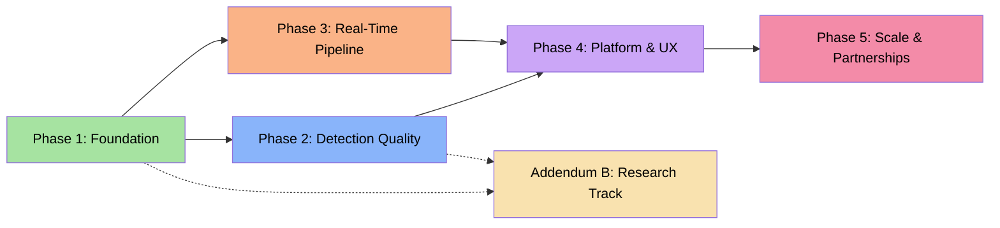

# CallShield Development Roadmap

**Roadmap revision:** 2026-05-14 · **Anchored to:** v1.7.10 (versionCode 38)

This roadmap merges the original Phase 1–5 plan, the Addendum A "peer-inspired track" (round-1/2/3 borrows from SpamBlocker, YACB, BlackList, Saracroche, adamff-dev, Fossify), and a fresh Addendum B harvested from a 30-source research sweep across OSS competitors, commercial competitors, FCC/IETF/ATIS standards, Android 15/16 platform changes, dependency changelogs, and adjacent-domain OSS (NetGuard, Pi-hole, rspamd patterns).

Source-cited. Every Addendum-B item maps to an entry in **Appendix — Source Index**. Anything that contradicts CallShield's stated philosophy (on-device, no accounts, no API keys, no cloud audio, FOSS) is either rejected or flagged.

---

## Current State (v1.7.10)

Working Android spam call/text blocker. **80 main Kotlin files, 35 JVM test files, and 11 instrumented test files.** Post-v1.7.10 work added `AppDatabase`, `SpamDataSource`, and `HotFeedDataSource` seams plus in-memory Room integration tests for the call, SMS, database-sync, and hot-feed pipelines, completed deterministic onboarding, dashboard, blocklist, and settings Compose UI coverage, and added a Kover 0.9.8 debug coverage gate for the JVM-tested data/util core. v1.7.10 upgrades the Compose stack to BOM 2026.05.00, resolves Compose UI/Foundation/Runtime to 1.11.1 and Material 3 to 1.4.0, refreshes locked UI classpaths across debug/release/unit-test configurations, and fixes newly enforced Compose resource-read lint by moving UI copy to `stringResource`, `pluralStringResource`, and `LocalResources`. v1.7.9 upgrades WorkManager to 2.11.2, refreshes locked background-work classpaths, and adds JVM schedule-contract coverage for sync, manual refresh, hot-list, and digest WorkRequests. v1.7.8 upgrades settings to DataStore 1.2.1, confirms there is no deprecated `EncryptedSharedPreferences`/`androidx.security` path to migrate, and moves the optional AbstractAPI enrichment key into a private no-backup DataStore with legacy public-key cleanup. v1.7.7 adds reproducible-build groundwork: Gradle dependency locking, checked-in lockfiles, a `verifyReproducibleBuildInputs` guard against wall-clock build metadata, disabled AGP VCS metadata in release APKs, APK-level metadata verification, release APK SHA256 sidecars for artifact integrity, a ZIP-entry content comparator, and a hash-comparison runbook for signed local releases versus unsigned CI artifacts. v1.7.6 hardens the network stack: AGP 8.10.1, OkHttp 5.3.2, Kotlin/KSP 2.2.21, Room 2.8.4, centralized SPKI certificate pinning for GitHub API/raw data, Cloudflare community reports, URLhaus, AbstractAPI, and caller-ID enrichment hosts, plus regression coverage for pinned-host inventory and pin format. v1.7.5 polished Statistics localization and scan feedback: localized weekday chart labels, resource-backed detection-source labels, corrected "Prefix match" copy, and consistent resource-backed call-log/SMS scan errors. v1.7.4 refined the advanced settings credential flow with masked optional API-key entry, saved/unsaved/not-configured feedback, and clearer local-only trust copy. v1.7.3 added a premium-polish pass across Compose chrome, shared shape/typography rhythm, blocked-log recovery states, trusted-source sheet feedback, lookup/report semantics, and in-app release notes. v1.7.2 added the latest hardening layer: ASCII-only number normalization (anti-spoof), SmsContentAnalyzer/SmsReceiver 16 KB caps, WildcardRule ReDoS guard, OneShotNoticeGate LRU cap, NotificationHelper PendingIntent ID separation, CrashReporter atomic writes, and removal of text-bearing pill/oval backdrops. **620 JVM tests plus instrumented integration/UI/runtime coverage**.

15-layer detection pipeline (priority-sorted `IChecker` registry), GBT v3 ML scorer (20 features, atomic ModelState, pure-Kotlin inference) with logistic-regression v2 fallback, Jetpack Compose UI on Catppuccin Mocha + AMOLED, Room 2.8.4 with explicit migrations v5+, scheduled WorkManager hot-list + weekly sync from GitHub, RCS NotificationListener, CallerIdOverlayService with first-hit-wins lookup race, SIT-tone anti-autodialer, URLhaus phishing detection, Cloudflare Worker community reporting, GitHub Actions CI on every push.

**Stack fingerprint:** AGP 8.10.1 · Kotlin 2.2.21 · Compose BOM 2026.05.00 · Room 2.8.4 · WorkManager 2.11.2 · OkHttp 5.3.2 · Moshi 1.15.1 · DataStore 1.2.1 · Kover 0.9.8 · minSdk 29 · targetSdk 36 · KSP for Room codegen. **No Hilt, no KMP, no Glance, no SQLCipher.**

```mermaid
graph LR
    P1[Phase 1: Foundation] --> P2[Phase 2: Detection Quality]
    P1 --> P3[Phase 3: Real-Time Pipeline]
    P2 --> P4[Phase 4: Platform & UX]
    P3 --> P4
    P4 --> P5[Phase 5: Scale & Partnerships]
    P1 -.-> AB[Addendum B: Research Track]
    P2 -.-> AB

    style P1 fill:#a6e3a1,color:#000
    style P2 fill:#89b4fa,color:#000
    style P3 fill:#fab387,color:#000
    style P4 fill:#cba6f7,color:#000
    style P5 fill:#f38ba8,color:#000
    style AB fill:#f9e2af,color:#000
```

---

## Status Legend

`[DONE]` shipped in a tagged release · `[WIP]` partially landed · `[NOW]` next 1–2 releases · `[NEXT]` 3–6 releases out · `[LATER]` long-horizon · `[?]` under consideration · `[X]` rejected (with reasoning).

---

## Locked Design Philosophy (do not contradict without flagging)

1. **On-device first.** Every detection layer must work offline. Network calls are enrichments, never gating.
2. **No accounts, no sign-in, no telemetry.** Anonymous community reporting via Cloudflare Worker is the maximum ceiling.
3. **No required API keys.** Any third-party API must have a free, no-auth tier or be optional.
4. **No cloud audio.** Voice frames never leave the device. Deepfake / fingerprint detection runs locally or not at all.
5. **FOSS distribution.** Every release must be reproducible-buildable for F-Droid; no GMS-only code paths.
6. **5-second screening deadline.** `CallShieldScreeningService` must respond <5 s. All hot-path code is budget-aware.
7. **Backward compat for hot-list URLs.** GitHub-raw endpoints remain serve-and-respond for v1.2.x clients indefinitely.

Any roadmap item that contradicts these is flagged inline with **⚠ philosophy conflict** and given an explicit case.

---

## Phase 1 — Foundation (Testing, Architecture, Security)

**Goal:** engineering discipline, testability, security hardening. Every later phase depends on this.

### 1.1 Unit Tests for Detection Engines `[DONE]`

Shipped: 30 test files now exist under `app/src/test/`, covering `SpamMLScorer` (logistic + GBT), `SpamHeuristics`, `SmsContentAnalyzer`, `PhoneFormatter`, `CallbackDetector`, `BackupRestore`, `WildcardRule`, `HashWildcardMatcher`, `LogExporter`, `BlockingProfiles`, `BlockReasoning`, `CampaignDetector`, `TimeSchedule`, `PhoneNumberFuzzTest`, `JsonParsingFuzzTest`, `HotPathBenchmarkTest`, `OneShotNoticeGate`, `CrashReporter`, `DashboardStatusModel`, `Race`, plus `CallShieldScreeningServiceAutoMuteTest` and `StirShakenTrustCheckerTest` from v1.7.0.

### 1.2 Integration Tests `[DONE]`

| Task | Size | Depends | Files |
|------|------|---------|-------|
| 1.2.1 Full `isSpam()` pipeline test with in-memory Room — exercise core priority tiers and verify priority ordering | XL | `[DONE]` | `androidTest/.../data/SpamPipelineIntegrationTest.kt` |
| 1.2.2 Full `isSpamSms()` pipeline test — context trust bypass, keyword rules, content-analysis order | L | `[DONE]` | `androidTest/.../data/SmsPipelineIntegrationTest.kt` |
| 1.2.3 `syncFromGitHub()` mocked — verify atomic Room population via `@Transaction` | M | `[DONE]` | `androidTest/.../data/SyncIntegrationTest.kt` |
| 1.2.4 `HotListSyncWorker` — hot_numbers, hot_ranges, spam_domains parsed and stored, per-entry error tolerance | M | `[DONE]` | `androidTest/.../service/HotListSyncIntegrationTest.kt` |

`SpamRepository` now accepts a constructor-provided `AppDatabase` and `SpamDataSource`, and `HotDataSync` accepts a narrow `HotFeedDataSource`, so Android integration tests can use `Room.inMemoryDatabaseBuilder()` plus fake remote/hot-feed snapshots without starting the Hilt refactor.

### 1.3 Compose UI Tests `[DONE]`

Eleven instrumented test files now exist (`CrashReporterInstrumentedTest`, `DashboardStatusBadgeTest`, `ThemePrimitivesTest`, `SpamPipelineIntegrationTest`, `SmsPipelineIntegrationTest`, `SyncIntegrationTest`, `HotListSyncIntegrationTest`, `OnboardingTest`, `DashboardTest`, `BlocklistTest`, `SettingsTest`).

| Task | Size | Status | Files |
|------|------|--------|-------|
| 1.3.1 Onboarding flow — 4 pages, permission requests, call-screener setup | M | `[DONE]` | `androidTest/.../ui/screens/onboarding/OnboardingTest.kt` |
| 1.3.2 Dashboard — hero stats, sync freshness, screener banner | M | `[DONE]` | `androidTest/.../ui/screens/main/DashboardTest.kt` |
| 1.3.3 Blocklist — add/delete, wildcard validation, swipe-to-delete + undo | L | `[DONE]` | `androidTest/.../ui/screens/main/BlocklistTest.kt` |
| 1.3.4 Settings — toggle persistence, quiet-hours validation, schedule picker | M | `[DONE]` | `androidTest/.../ui/screens/settings/SettingsTest.kt` |

### 1.4 CI Pipeline `[WIP]` / `[NOW]` for static-analysis gates

`build.yml`, `instrumented.yml`, `merge-reports.yml`, `test.yml` exist. Kover 0.9.8 now gates the debug JVM unit-test report for the data/util core at a 35% minimum line-coverage threshold; current filtered coverage is 41.06%. The filter intentionally excludes Compose screens, Android services, permission entrypoints, and `data.local` Room classes because Kover only collects local JVM test coverage, while those surfaces are guarded by instrumented integration/UI tests. Ratchet the Kover floor by +5 points per release after new JVM-seamed coverage lands.

| Task | Size | Status | Files |
|------|------|--------|-------|
| 1.4.4 Code-coverage gate via Kover, ratcheting threshold (start 35%, +5% per release) | M | `[DONE]` | `app/build.gradle.kts`, `.github/workflows/test.yml` |
| 1.4.5 Lint + ktlint + detekt as required PR checks | S | `[NOW]` | `.editorconfig`, `.github/workflows/test.yml` |

### 1.5 Clean Architecture Refactor `[WIP]`

`SpamRepository` is still ~320 lines and orchestrates everything. The `IChecker` registry (Addendum A1) split detection logic out cleanly; remaining work is splitting **non-detection** concerns.

| Task | Size | Files |
|------|------|-------|
| 1.5.1 Domain use cases: `CheckSpamUseCase`, `CheckSpamSmsUseCase`, `SyncDatabaseUseCase`, `ManageBlocklistUseCase`, `ExportLogsUseCase` | L | `domain/usecase/*.kt` |
| 1.5.2 Extract `SpamCheckResult` and settings models to domain layer | S | `domain/model/*.kt` |
| 1.5.3 Define repository interfaces in domain | M | `domain/repository/*.kt` |
| 1.5.4 Split `SpamRepository` into `SpamRepositoryImpl`, `SettingsRepository`, `SyncRepository`, `BlocklistRepository` | XL | `data/repository/*.kt` |

**Critical:** the call/SMS pipeline integration tests in 1.2.1/1.2.2, sync integration tests in 1.2.3, and hot-feed integration test in 1.2.4 now exist. Run the full integration set after each split to verify priority ordering and data-refresh behavior.

### 1.6 Dependency Injection (Hilt) `[NOW]`

| Task | Size | Files |
|------|------|-------|
| 1.6.1 Add Hilt 2.52 (full K2 support per release notes [src 7]) | S | `libs.versions.toml`, `build.gradle.kts` |
| 1.6.2 `@HiltAndroidApp` on `CallShieldApp` | S | `CallShieldApp.kt` |
| 1.6.3 `DatabaseModule` providing `AppDatabase` + `SpamDao` singletons | M | `di/DatabaseModule.kt` |
| 1.6.4 `RepositoryModule` binding interfaces to impls | M | `di/RepositoryModule.kt` |
| 1.6.5 `NetworkModule` providing the shared `OkHttpClient` (with cert pinning, see 1.7.2) | M | `di/NetworkModule.kt` |
| 1.6.6 `MainViewModel` → `@HiltViewModel` with injected use cases | M | `MainViewModel.kt` |
| 1.6.7 `CallShieldScreeningService` → `@AndroidEntryPoint` | M | `CallShieldScreeningService.kt` |
| 1.6.8 Workers → `@HiltWorker` | M | `SyncWorker.kt`, `HotListSyncWorker.kt`, `DigestWorker.kt` |
| 1.6.9 Convert `object` singletons (`SpamHeuristics`, `SmsContentAnalyzer`, `SpamMLScorer`, `CallbackDetector`, `SmsContextChecker`, `CampaignDetector`, `HashWildcardMatcher`) to injectable classes | L | data layer |

**Risk:** migrate one consumer at a time; keep `getInstance()` fallback until all consumers migrated.

**Alternate (worth a spike):** Kotlin 2.2 `context(...)` parameters [src 20] could replace some `@Inject` for pure-logic boundaries. Don't do it as the primary DI strategy — Hilt's lifecycle binding is still needed for ViewModel/Worker scoping.

### 1.7 Security Hardening `[WIP]`

| Task | Size | Status | Files |
|------|------|--------|-------|
| 1.7.1 Move signing credentials to `local.properties` / env vars | S | `[DONE]` (`build.gradle.kts:33-47`) | — |
| 1.7.2 Certificate pinning — GitHub raw, Cloudflare Worker, all enrichment APIs. Use OkHttp 5 `CertificatePinner` (post-1.7.5 upgrade). | M | `[DONE]` v1.7.6 | `data/remote/HttpClient.kt`, `HttpClientTest.kt` |
| 1.7.3 Replace any `EncryptedSharedPreferences` with **Tink `AeadSerializer` + DataStore 1.2** [src 21]. AndroidX Security `EncryptedSharedPreferences` is on the deprecated path. | M | `[DONE]` v1.7.8: no `EncryptedSharedPreferences`/`androidx.security` path exists; DataStore upgraded to 1.2.1 and optional key moved to no-backup DataStore instead of adding an unused Tink path | `SpamRepository.kt`, settings layer |
| 1.7.4 Consider `android:allowBackup="false"` or restrict via existing `backup_rules.xml` (currently `allowBackup="true"`) | S | `[DONE]` v1.7.8: backups remain enabled for Room + public settings, while optional credentials now live under `noBackupFilesDir` and migrate out of backed-up DataStore | `backup_rules.xml`, `data_extraction_rules.xml`, `SpamRepository.kt` |
| 1.7.5 OkHttp 4.12 → **OkHttp 5.x** [src 18]. Adds Happy Eyeballs (RFC 8305), ZSTD compression module, JPMS, separate Android artifact, eliminates 4.x cookie-jar SSRF. | M | `[DONE]` v1.7.6 (`OkHttp 5.3.2`) | `data/remote/HttpClient.kt`, version catalog |
| 1.7.6 Glance dependency audit — **CVE-2024-7254 protobuf buffer overflow** [src 22, NVD]. CallShield doesn't use Glance yet, but 4.8.3 home widget is plain RemoteViews; if migrated to Glance, must pin 1.1.1+. Track for the widget-modernization story. | S | `[?]` | n/a |
| 1.7.7 Reproducible-build verification — match SpamBlocker's F-Droid story. Eliminate build-timestamp embedding, enable Gradle `dependencyLocking`, document hash-comparison procedure. [src 1, src 24] | M | `[DONE]` v1.7.7 for source-content groundwork; signed byte-for-byte validation remains a F-Droid signature-copy follow-up | `build.gradle.kts`, CI, `docs/reproducible-builds.md`, `scripts/compare-apk-contents.ps1` |
| 1.7.8 Play Integrity API integration (Standard request, low-latency) for community-report submission only — gates the Cloudflare Worker against poisoning by overlay/screen-capture malware (`appAccessRiskVerdict`) [src 13]. **Keep optional**; client must function without Play Services. ⚠ partial conflict with FOSS philosophy: feature-flag it so non-GMS builds skip integrity gating but still submit reports. | L | `[NEXT]` | `data/CommunityContributor.kt`, server |

### 1.8 String Extraction `[WIP]`

`544+ string resources` are already extracted (per README), but a fresh audit will surface stragglers. Continue.

| Task | Size | Files |
|------|------|-------|
| 1.8.1 Audit all 78 main Kotlin files for hardcoded user-facing strings | S | audit doc |
| 1.8.2 Plurals + parameterized strings for counts ("1 call blocked" / "%d calls blocked") | M | `res/values/strings.xml` |
| 1.8.3 Number-formatting localization — display E.164 numbers in local format ((212) 555-0100 in en-US, +33 1 23 45 67 89 in fr-FR) using `libphonenumber` or `PhoneNumberUtils.formatNumber()` [Addendum B item B.27] | M | `data/PhoneFormatter.kt` |

---

## Phase 2 — Detection Quality

**Goal:** behavioral features, STIR/SHAKEN parsing depth, feedback loops, fuzz/perf gates.

### 2.1 ML Model Upgrade `[DONE]`

GBT v3 (20 features, pure Kotlin inference, ~50 KB model, sigmoid output, atomic ModelState) shipped in v1.6.0. Logistic v2 fallback retained. JSON v3 schema with backward compat to v2. Threshold 0.7.

### 2.2 Behavioral / Temporal Features `[NEXT]`

| Task | Size | Depends | Files |
|------|------|---------|-------|
| 2.2.1 Time-of-day feature — sin/cos cyclical encoding | M | — | `SpamMLScorer.extractFeatures()` |
| 2.2.2 Call frequency feature — calls from this number in 7/30-day windows | M | — | `SpamMLScorer.extractFeatures()`, `SpamDao` |
| 2.2.3 Ring duration feature — short rings correlate with autodialers | M | — | `CallShieldScreeningService` |
| 2.2.4 Geographic distance feature — area-code distance from user's home area code | M | — | `SpamMLScorer.extractFeatures()` |
| 2.2.5 Retrain with expanded features (20 → 24-26) and ship a v4 weights JSON; keep v3 backward compat | M | 2.2.1-4 | `scripts/train_spam_model.py`, weights schema |

### 2.3 STIR/SHAKEN Enhancement `[WIP]`

v1.7.0 shipped the binary trusted-allow / FAIL-block layer. Remaining: **PASSporT JWT depth.**

| Task | Size | Depends | Files |
|------|------|---------|-------|
| 2.3.1 Parse full PASSporT token per **RFC 8225** (header `typ=passport, alg=ES256, x5u=…`; payload `iat`, `orig`, `dest`, optional `mky`) [src 14]. Android exposes the SIP `Identity` header on API 30+ via `Connection.getExtras()`. | L | — | New `data/StirShakenParser.kt` |
| 2.3.2 Per **RFC 8588 SHAKEN profile**: extract `attest` (A/B/C) and `origid` (UUID) claims. Display attestation badge in caller-ID overlay (green=A full, yellow=B partial, gray=C gateway/no opinion). [src 14] | M | 2.3.1 | overlay UI, `BlockedCall` model |
| 2.3.3 `iat` replay-attack guard — reject tokens with `iat` more than 60 s old/skewed [src 14] | S | 2.3.1 | parser |
| 2.3.4 Persist `origid` UUID in BlockedCall for **RFC 9027 traceback** participation. Future-proofs FCC traceback consortium reporting. [src research, RFC 9027] | S | 2.3.1 | `SpamDao`, `BlockedCall` |
| 2.3.5 Attestation level as ML feature (A reduces score, C raises) | M | 2.3.1, 2.2.5 | `SpamMLScorer.extractFeatures()` |

### 2.4 Graph-Based Campaign Detection `[NEXT]`

In-memory `CampaignDetector` exists. Persist to Room and broaden window:

| Task | Size | Files |
|------|------|-------|
| 2.4.1 Persistent call-graph table — track NPA-NXX prefix clusters over 7-day window | L | new `data/local/CallGraphDao.kt` |
| 2.4.2 Burst rule — 5+ distinct numbers from same NPA-NXX in 1 h = active campaign | M | `data/CampaignDetector.kt` |
| 2.4.3 Geographic clustering across users (post-Phase 3 server) | L | server |

### 2.5 After-Call Feedback `[WIP]`

Skeleton ("Was this spam?" notification) shipped in v1.4.x. Remaining:

| Task | Size | Files |
|------|------|-------|
| 2.5.1 Bottom-sheet variant for in-app review (richer options: spam type, severity) | M | new UI, `CallShieldScreeningService` |
| 2.5.2 Persist feedback as labeled rows in Room | S | `SpamDao`, new `FeedbackEntry` |
| 2.5.3 Export feedback to training pipeline (opt-in) | M | `train_spam_model.py` |
| 2.5.4 On-device Bayesian classifier learning from local feedback (per-user) [Addendum B item B.13] | L | new `data/BayesianFeedbackModel.kt` |

### 2.6 Quality Gates `[WIP]`

| Task | Size | Status | Files |
|------|------|--------|-------|
| 2.6.1 Phone-number fuzz tests | `[DONE]` | `PhoneNumberFuzzTest.kt` exists | — |
| 2.6.2 `isSpam()` perf benchmark, hard ceiling 50 ms p99 | `[WIP]` | `HotPathBenchmarkTest.kt` exists; needs CI gate | `androidTest/.../SpamCheckBenchmark.kt` |
| 2.6.3 ML accuracy metrics (precision/recall/F1) in CI | `[NOW]` | — | `scripts/evaluate_model.py` |
| 2.6.4 **Baseline Profile** for screener cold-start [Addendum B item B.30] — first-call latency drops measurably; CallScreeningService has 5 s deadline | M | `[NEXT]` | `app/baselineprofile/` |

---

## Phase 3 — Real-Time Data Pipeline

**Goal:** delta sync, two-tier DB, optional honeypot. **Caveat:** the existing GitHub-raw + 30 min hot-list pipeline already meets the realistic target. A full backend is justified only if community-report volume outgrows GitHub Pages economics.

### 3.1 API Server `[LATER]`

| Task | Size | Files |
|------|------|-------|
| 3.1.1 OpenAPI 3.0 spec — `POST /reports`, `GET /reputation/{number}`, `GET /blocklist/delta`, `POST /feedback` | M | `server/openapi.yaml` |
| 3.1.2 Ktor server impl (Kotlin shared models with Android) | XL | `server/` |
| 3.1.3 Migrate Cloudflare Worker to thin proxy for backward compat | L | `worker/`, server |
| 3.1.4 API-key gate (anonymous, rotating, rate-limited) + JWT for admin | L | `server/auth/` |
| 3.1.5 Token-bucket rate limiting | M | `server/middleware/` |
| 3.1.6 Abuse detection — coordinated false reports, report flooding | L | `server/abuse/` |

### 3.2 Real-Time Streaming `[LATER]`

| Task | Size | Files |
|------|------|-------|
| 3.2.1 Delta API — `last_sync_timestamp` → only-deltas response | L | `data/remote/ApiDataSource.kt`, server |
| 3.2.2 SSE push for new hot numbers within 30 s of ingestion | XL | server, new `service/RealtimeSyncService.kt` |
| 3.2.3 Polling fallback when SSE drops | M | `HotListSyncWorker.kt` |

### 3.3 Two-Tier Database `[NEXT]`

This one is worth doing **without** a backend. The bloom filter alone gives O(μs) negative checks for the 32K → 100K+ growth path.

| Task | Size | Files |
|------|------|-------|
| 3.3.1 Bloom filter for the full DB (FPR < 0.1%) loaded at startup | L | new `data/local/BloomFilter.kt` |
| 3.3.2 Optional cloud-reputation API for filter-positive lookups | M | new `data/remote/ReputationApi.kt` |
| 3.3.3 Two-tier lookup: bloom (μs) → exact Room (ms) → optional cloud (10–100 ms) | M | `SpamRepositoryImpl.isSpam()` |
| 3.3.4 Strict offline mode toggle — disable all network calls including enrichment [Addendum B item B.21] | M | settings |

### 3.4 Honeypot Network `[?]`

⚠ Operational and privacy cost. Justified only at much higher scale. Defer behind Phase 5.

### 3.5 Geographic Clustering `[LATER]` (depends on 3.1)

---

## Phase 4 — Platform & UX

### 4.1 Kotlin Multiplatform → iOS `[LATER]`

| Task | Size | Files |
|------|------|-------|
| 4.1.1 Extract pure-logic into KMP module — `SpamMLScorer`, `SpamHeuristics` core, `PhoneFormatter`, `HashWildcardMatcher`, regex packs | XL | new `shared/` |
| 4.1.2 `expect`/`actual` for contacts, call log, DataStore/UserDefaults | XL | `shared/src/{commonMain,androidMain,iosMain}/` |
| 4.1.3 iOS shell — SwiftUI, settings, blocklist, detection toggle | XL | `iosApp/` |
| 4.1.4 **CallKit `CXCallDirectoryProvider`** + `CXCallDirectoryManager` reload | XL | `iosApp/CallShieldExtension/` |
| 4.1.5 **Saracroche-style 4-target architecture** [src 7]: Main App + Call Directory Extension + Unwanted Communication Reporting + Message Filter Extension | XL | iOS app |

**Constraint:** CallKit is preload-only; no real-time evaluation. Strategy: periodic CallKit reload from local DB; community reports via the shared backend if Phase 3 lands first.

### 4.2 Adaptive Layouts `[NEXT]`

| Task | Size | Files |
|------|------|-------|
| 4.2.1 `calculateWindowSizeClass()` + `androidx.window 1.3+` [src research] | S | `MainActivity.kt` |
| 4.2.2 Tablet list-detail pane for blocklist / log | L | screen files |
| 4.2.3 Foldable `FoldingFeature` support | M | `MainActivity.kt` |
| 4.2.4 Landscape — horizontal stats, wider dialogs | M | screens |

### 4.3 InCallService Integration `[LATER]`

| Task | Size | Files |
|------|------|-------|
| 4.3.1 Custom call screen (Android 12+) — spam score, caller name, location, attestation badge on incoming UI | XL | new `service/CallShieldInCallService.kt` |
| 4.3.2 Replace overlay with InCallService when available; overlay fallback for older devices | M | `CallerIdOverlayService.kt` |

### 4.4 After-Call Bottom Sheet `[NEXT]`

| Task | Size | Files |
|------|------|-------|
| 4.4.1 "Was this spam?" bottom sheet (replaces notification chip for unknown allowed calls) — thumbs up/down + type selector | M | new UI |
| 4.4.2 Skip for contacts and whitelisted numbers | S | service |

### 4.5 Contact Enrichment `[LATER]`

| Task | Size | Files |
|------|------|-------|
| 4.5.1 Business-name lookup (OpenCNAM existing + Google Places optional) | M | `data/remote/BusinessLookup.kt` |
| 4.5.2 Business logo (Clearbit / Google Favicon) — cache aggressively | M | overlay UI |
| 4.5.3 Cache enrichment in Room with TTL | M | new `data/local/ContactEnrichmentDao.kt` |

### 4.6 Accessibility `[NEXT]`

| Task | Size | Files |
|------|------|-------|
| 4.6.1 Full TalkBack audit — `contentDescription` on all interactive elements (claimed 100+, audit to confirm) | L | all screens |
| 4.6.2 Dynamic-type at 200% font scale | M | `Theme.kt`, screens |
| 4.6.3 WCAG AA color-contrast audit on Catppuccin Mocha tokens | M | `Theme.kt` |
| 4.6.4 48 dp × 48 dp touch-target audit (claimed; verify) | M | screens |
| 4.6.5 Predictive-back full preview (Android 14+, polished in 16) [src 28] | M | `MainActivity.kt`, screens |

### 4.7 Localization `[LATER]`

| Task | Size | Files |
|------|------|-------|
| 4.7.1 Plurals + format strings (P1.8.2) | XL | `strings.xml` |
| 4.7.2 Translate to ES, FR, DE, PT, JA, KO. Plus **TR, ES-MX, IT, NL, PL, RU** based on top OSS-app reach. Each L. | many | `res/values-{lang}/strings.xml` |
| 4.7.3 RTL layout (Arabic, Hebrew) | M | layouts |

### 4.8 Spam Trends Dashboard `[NEXT]`

| Task | Size | Files |
|------|------|-------|
| 4.8.1 Time-series chart — daily/weekly/monthly (Vico or custom Canvas) | L | `StatsScreen.kt` rewrite |
| 4.8.2 Source-breakdown pie | M | `StatsScreen.kt` |
| 4.8.3 Geographic heat map (depends on 3.5.3) | XL | new `SpamMapScreen.kt` |
| 4.8.4 Trend indicators with historical comparison | M | `StatsScreen.kt` |

---

## Phase 5 — Scale & Partnerships

### 5.1 Carrier Integration `[LATER]`

T-Mobile Scam Shield, AT&T ActiveArmor, Verizon Call Filter — all require business-development engagement [src 30]. Track but do not staff.

### 5.2 Federated Learning `[?]`

Roadmap retains as long-horizon. **Differential-privacy noise injection** is a hard requirement; small per-user spam-call counts (~20/month [src research]) make naive FL leak. Likely won't ship before 2027.

### 5.3 gRPC API `[LATER]` — depends on 3.1

### 5.4 Monetization & Audit `[?]`

| Task | Size | Files |
|------|------|-------|
| 5.4.1 Premium tier — Google Play Billing, feature gating ⚠ partial conflict with FOSS philosophy: F-Droid build must remain feature-complete; premium = Play-only convenience features (cloud sync, multi-device, priority support) | L | `data/billing/BillingManager.kt` |
| 5.4.2 Feature flags for premium | M | `domain/FeatureFlags.kt` |
| 5.4.3 Third-party security audit | XL | external |
| 5.4.4 White-label SDK for carrier integration | XL | new `sdk/` module |

---

## Cross-Cutting Concerns

### Database Migrations
v5+ are explicit; v1–4 use `fallbackToDestructiveMigration()`. **Acceptable for spam-numbers (re-syncable) but unacceptable** after FeedbackEntry (2.5.2), CallGraph (2.4.1), ContactEnrichment (4.5.3). Add `Migration` objects in lockstep with each new entity.

### Backward Compatibility
Hot-list sync and community reports use hardcoded GitHub-raw URLs on `master`. Phase 3 must keep these endpoints serving for v1.2.x clients indefinitely — that's the legacy contract.

### Privacy Architecture
Phases 2.5 (feedback), 3.4 (honeypot), 5.2 (federated) introduce data collection. Each requires explicit opt-in toggle, plain-language privacy disclosure, and a retention cap. No exceptions.

### Dependency Refresh Cadence
Quarterly dependency audit. v1.7.6 cleared the Kotlin/KSP, AGP, Room, and OkHttp tranche; v1.7.7 locked the resolved dependency graph and added the reproducible-build runbook; v1.7.8 cleared the DataStore 1.2.1 upgrade and optional-key backup boundary; v1.7.9 cleared the WorkManager 2.11.2 refresh with schedule-contract tests; v1.7.10 cleared the Compose BOM 2026.05.00 refresh and the newly enforced Compose resource-read lint. Addendum B.U continues with localization, predictive-back, widget, and Room driver follow-ups.

---

## Addendum A — Peer-Inspired Track (preserved)

Round-1/2/3 borrows from SpamBlocker (aj3423), YetAnotherCallBlocker (xynngh), BlackList (kaliturin), Saracroche (cbouvat), spam-call-blocker-app (adamff-dev), Fossify Phone.

| ID | Item | Status |
|----|------|--------|
| A1 | Priority-sorted `IChecker` pipeline | `[DONE]` v1.6.0 |
| A2 | Budget-aware lookup race (`Race.kt`) | `[DONE]` v1.6.0/1.7.1 |
| A3 | Push-alert / notification-context bridge (`PushAlertChecker`, `PushAlertRegistry`) + allowlist editor + revoke-on-next-ring feedback | `[DONE]` v1.6.0/1.7.1 |
| A4 | System block-list bridge (`BlockedNumberContract` read-only) | `[DONE]` v1.6.0 |
| A5 | Hash-wildcard / range patterns (`#` length-locked) | `[DONE]` v1.6.0 |
| A6 | Schedule-aware rules (days mask + hour window with overnight wrap) | `[DONE]` v1.6.0 |
| A7 | STIR trusted-caller allow + auto-mute low-confidence | `[DONE]` v1.7.0 |

---

## Addendum B — Round-3 Research Track (new, 2026-05-06)

Harvested from a 30-source sweep (see Appendix). Scoped to NEW signal not already covered above. Each item carries impact (1–5), effort (1–5), source ref.

### B.NOW — Now (1–2 releases)

| ID | Item | Impact | Effort | Source | Notes |
|----|------|-------:|-------:|--------|-------|
| B.U.1 | OkHttp 4.12 → **5.x** | 4 | 2 | [18] | `[DONE]` v1.7.6: upgraded to OkHttp 5.3.2 and kept the shared-client/derived-client contract. |
| B.U.2 | Room 2.6 → **2.8.4** | 3 | 2 | [research] | `[DONE]` v1.7.6: upgraded Room to 2.8.4 and updated the legacy destructive-migration overload. |
| B.U.3 | Kotlin 2.1 → **2.2.21** | 3 | 2 | [20] | `[DONE]` v1.7.6: upgraded AGP to 8.10.1 for Kotlin 2.2 R8 compatibility, aligned Kotlin/KSP to 2.2.21, and moved JVM target configuration to the compilerOptions DSL. |
| B.U.4 | DataStore 1.1 → **1.2.1** + Tink `AeadSerializer` | 4 | 3 | [21] | `[DONE]` v1.7.8: upgraded DataStore to 1.2.1; no deprecated encrypted-preferences path exists, so no unused Tink serializer was introduced; optional AbstractAPI key now migrates into private no-backup DataStore |
| B.U.5 | WorkManager 2.10 → **2.11.2** | 2 | 1 | [16] | `[DONE]` v1.7.9: upgraded WorkManager to 2.11.2, refreshed locks, and added schedule-contract tests for `SyncWorker`, `HotListSyncWorker`, and `DigestWorker` |
| B.U.6 | Compose BOM 2024.12 → latest stable (Compose Foundation 1.11+) | 3 | 2 | [17] | `[DONE]` v1.7.10: upgraded to Compose BOM 2026.05.00, refreshed locks across debug/release/unit-test configurations, and fixed Compose resource-read lint with `stringResource`, `pluralStringResource`, and `LocalResources` |
| B.D.1 | **F-Droid submission** — `fastlane/metadata/android/en-US/`, GitLab MR to `fdroiddata`, reproducible-build verification | 5 | 3 | [24] | `[WIP]` Fastlane metadata, fdroiddata draft, release signer/hash handoff, and submission runbook landed after v1.7.10. Remaining: GitLab MR plus fdroidserver/apksigcopier verification. |
| B.D.2 | **IzzyOnDroid** publication (faster cycle than F-Droid; binary-accepted) | 4 | 1 | [research] | Just publish + notify |
| B.D.3 | **Accrescent** submission (GrapheneOS-friendly, key pinning, signed metadata, Android 12+) | 3 | 2 | [23] | Privacy-niche audience but high alignment |
| B.D.4 | **Obtainium** spec — already supported via GitHub Releases; document the workflow + add SHA256 sidecar files to release artifacts | 2 | 1 | [research] | `[DONE]` v1.7.7: CI emits APK `.sha256` sidecars, local signed releases use `scripts/write-release-sha256.ps1`, and the hash workflow is documented. |
| B.S.1 | Reproducible APK build (Gradle `dependencyLocking`, deterministic timestamps, no embedded build metadata) | 4 | 3 | [1, 24] | `[WIP]` v1.7.7: dependency locks, build-metadata guard, AGP VCS metadata exclusion, APK metadata verification, ZIP-entry comparator, and runbook landed. Remaining: F-Droid/apksigcopier validation for full signed-release reproducibility. |
| B.F.1 | **Per-SIM filtering rules** (dual-SIM aware) | 4 | 3 | [SpamBlocker #59] | Top community ask; enables work/personal SIM split |
| B.F.2 | **Rule replay / debug mode** — re-run any logged call/SMS through the current ruleset | 4 | 2 | [SpamBlocker #386] | Power-user feature; cheap to add via `IChecker` registry already present |
| B.F.3 | **Strict (AND) vs Relaxed (OR) rule mode** | 3 | 2 | [SpamBlocker #377] | Replaces Inclusive/Exclusive terminology; clearer semantics |
| B.F.4 | **Auto-add regex-blocked numbers to local DB** for review | 3 | 1 | [SpamBlocker #355] | One-line change in pipeline |
| B.F.5 | **App-foreground context rule** — allow calls when banking / delivery app is active | 4 | 3 | [SpamBlocker #218] | UsageStatsManager + (existing) PushAlertChecker pattern |
| B.F.6 | **System-notification context rule** (delivery notification present → allow) | 3 | 2 | [SpamBlocker #350] | Already partially via PushAlertChecker; broaden source taxonomy |
| B.F.7 | **External blocklist URL subscription** (Pi-hole "gravity" model) — CSV/TXT/JSON URLs, scheduled refresh, merged into local DB with attribution | 5 | 3 | [26] | Architecturally aligns with our hot-list pattern |
| B.F.8 | **Spam-SMS auto-forward to 7726 (SPAM)** — opt-in carrier reporting | 3 | 1 | [15] | Pure UX win; FCC-recommended |
| B.U.7 | **Number formatting localization** via `PhoneNumberUtils.formatNumber()` or `libphonenumber` | 3 | 2 | [research] | Belongs in P1.8.3 |
| B.O.1 | **"Explain this decision" drawer** — tap any log entry to see rules triggered, in priority order, with confidence | 4 | 2 | [research] | Cheap with existing `IChecker` returning `BlockResult` reasons |
| B.U.8 | Predictive back full preview (where missing) | 2 | 2 | [28] | Polish for Android 14+ |
| B.S.2 | Certificate pinning for **all** API endpoints (existing `network_security_config.xml` covers cleartext only) | 4 | 2 | [research] | `[DONE]` v1.7.6: central OkHttp `CertificatePinner` covers GitHub, Cloudflare Worker, URLhaus, AbstractAPI, and caller-ID enrichment hosts. |
| B.U.9 | `androidx.glance` widget rewrite (current widget is `RemoteViews`); pin Glance ≥ 1.1.1 against **CVE-2024-7254** | 3 | 3 | [22] | Widget preview API + adaptive sizing |

### B.NEXT — Next (3–6 releases)

| ID | Item | Impact | Effort | Source | Notes |
|----|------|-------:|-------:|--------|-------|
| B.F.9 | **ICS / iCal calendar-based scheduling** — parse iCal subscription URL into dynamic allow windows (shift workers, on-call) | 3 | 4 | [SpamBlocker #359] | Builds on existing per-rule schedule (A6) |
| B.F.10 | **DID range fuzzy matching** — allow numbers within ±N of a saved contact's number | 2 | 2 | [SpamBlocker #554] | Covers contacts whose business rotates last digits |
| B.F.11 | **Family DB sharing** — opt-in mesh-share local user blocklist with N trusted devices via QR-paired keys | 4 | 4 | [SpamBlocker #549] | ⚠ Privacy: end-to-end encrypted; no server involvement |
| B.F.12 | **Wi-Fi SSID / geofence rule profiles** — corporate SSID = work rules, home SSID = relaxed | 3 | 3 | [research, NetGuard pattern] | Builds on existing BlockingProfiles |
| B.F.13 | **Bidirectional blocklist subscription** — publish your local list as a stable URL others can subscribe to (Pi-hole / OPML model) | 3 | 4 | [26] | Pairs with B.F.7 |
| B.F.14 | **Local REST API on loopback** for Tasker / Macrodroid / automation: `GET /api/stats/summary`, `POST /api/report`, `GET /api/log` | 3 | 3 | [26] | Pi-hole pattern; keep auth-by-shared-secret |
| B.O.2 | **Rule-coverage analytics** — % of incoming calls handled by each rule; identify dead rules | 3 | 2 | [research] | Reuses BlockReasoning |
| B.O.3 | **Advanced call-log filter** — by rule, number pattern, type, date range, confidence, source | 3 | 3 | [research] | Compose pre-existing log refactor |
| B.O.4 | **Diagnostic-report export** — one-tap CSV/JSON of log + rules + model version + device info for bug reports | 3 | 2 | [NetGuard PRO] | Ships with redaction option |
| B.D.5 | **Wear OS / Galaxy Watch tile** — last blocked call + one-tap temporary allow | 3 | 4 | [research] | Reuse Glance widget |
| B.M.1 | **TinyML audio fingerprint** — perceptual hash of first ~2 s of call audio (post-answer if user answers; opt-in only); compare to local hash set of known robocall recordings | 4 | 4 | [research, robocall fingerprinting lit] | ⚠ Audio capture must be opt-in, on-device only, and easy to disable. Aligns with the no-cloud-audio philosophy as long as features stay local |
| B.M.2 | **On-device Bayesian feedback model** — per-user weights learned from "Was this spam?" responses, blends into existing GBT score | 4 | 3 | [research] | Continuous personalization without leaking data |
| B.M.3 | **Campaign-detection alerts** — proactive notification when new burst is detected on user's number range | 3 | 2 | [research, FCC traceback] | Reuses existing CampaignDetector |
| B.S.3 | **Play Integrity Standard request** for community-report submission (`appAccessRiskVerdict` to detect overlay/screen-cap during submit) | 3 | 3 | [13] | ⚠ GMS-only; feature-flag for non-Play builds. Don't gate detection — only contribution |
| B.U.10 | Migrate to **Room SQLiteDriver** path (`room-sqlite-wrapper` from 2.7+) — sets up future KMP support | 3 | 4 | [research] | Lays groundwork for P4.1 |

### B.LATER — Later

| ID | Item | Impact | Effort | Source | Notes |
|----|------|-------:|-------:|--------|-------|
| B.E.1 | **Enterprise / MDM edition** — managed config, zero-touch enrollment, fleet allow/block list, audit-log export | 3 | 5 | [7] | Saracroche's differentiator; valuable revenue path under 5.4 monetization |
| B.E.2 | Android Work Profile awareness — separate rule sets per profile | 2 | 3 | [research] | Pairs with B.E.1 |
| B.S.4 | **Oblivious HTTP (OHTTP) relay** for enrichment lookups — server never sees user IP | 4 | 4 | [research] | Cloudflare/Fastly run public relays. Privacy maxima |
| B.M.4 | **Voice deepfake / synthetic-voice detection** (post-answer, on-device) | 4 | 5 | [Hiya 2025, FCC AI ban] | ⚠ Compute-heavy; only if a usable open model lands. Must run on-device. Otherwise reject |
| B.M.5 | Voice-print similarity scoring across rotating numbers | 3 | 5 | [research] | ⚠ Privacy: voice-print derivation only on opt-in opted calls; never persist raw audio |
| B.M.6 | **Automated call summarization & transcription** for screened calls | 3 | 5 | [Hiya AI Phone] | Only viable on-device with a small Whisper-class model; gate to higher-end devices |

### B.UNDER — Under Consideration (decide before staffing)

| ID | Item | Source | Decision Needed |
|----|------|--------|-----------------|
| B.?.1 | **AI Answer Bot** that engages spam callers to waste their time | [9 RoboKiller] | Legal/ethical: TCPA + state recording-consent laws; harassment exposure. Lean reject for now |
| B.?.2 | **Audio CAPTCHA screening** ("press 1 to connect") | [10 YouMail] | UX cost vs spam-reduction; pilot opt-in for unknown callers |
| B.?.3 | **Visual voicemail with spam-priority sorting** | [10 YouMail] | Scope creep — replaces dialer/voicemail. Keep in mind for a separate sister app |
| B.?.4 | **Auto-attendant / IVR for first-time callers** | [10 YouMail] | Same scope concern as B.?.3 |
| B.?.5 | **Truecaller-style B2B verified-caller display** | [29 Truecaller] | Requires partnerships; conflicts with on-device-first |

---

## Rejected (with reasoning)

| Item | Why rejected |
|------|--------------|
| Cloud upload of address book / contacts (Truecaller core) | Breaks **on-device-first** and **no-accounts** philosophy. |
| Cloud audio analysis for deepfake / transcription | Breaks **no-cloud-audio** philosophy. On-device variants of B.M.4–6 only. |
| Required sign-in / per-user cloud profile | Breaks **no-accounts** philosophy. |
| Always-on cloud reputation gating | Breaks **on-device-first** — every layer must work offline. |
| Hosts-file-style monetary blocklist (paid feeds) | Breaks **FOSS** philosophy. Free user-supplied URLs only (B.F.7 / B.F.13). |
| Built-in ads, ad-supported tier | Hard no — incompatible with sysadmin-grade tool positioning. |
| `fullBackupContent="true"` exposing API keys | Mitigated in v1.7.8 by moving the optional AbstractAPI key out of backed-up public DataStore and into a private DataStore under `noBackupFilesDir`; backups remain enabled for Room data and public settings. |

---

## Effort Summary

| Phase / Track | Tasks | Status |
|---|---|---|
| Phase 1 — Foundation | 35 | ~70% done (1.1, 1.2, 1.3, 1.4, and 1.7.1-7 shipped; 1.6 and 1.7.8 open) |
| Phase 2 — Detection Quality | 22 | 2.1, 2.6.1 shipped; 2.3 partial; rest open |
| Phase 3 — Realtime Pipeline | 15 | open; 3.3 (bloom filter) is the next high-value tranche |
| Phase 4 — Platform & UX | 24 | open; 4.2 + 4.6 are the next high-value tranches |
| Phase 5 — Scale & Partnerships | 11 | open; treat as long-horizon |
| Addendum A — Peer track | 7 | shipped |
| **Addendum B — Research track** | **45** | **new — see B.NOW for the next-release shortlist** |

**Total: ~155 tracked items.** Phase ordering is a guideline; B.NOW items can land in parallel with Phase 1 tasks because most are isolated upgrades or self-contained features.

---

## Appendix — Source Index

| # | Source | Type |
|---|--------|------|
| 1 | https://github.com/aj3423/SpamBlocker | OSS competitor (1,489★, MIT, Kotlin) |
| 2 | https://github.com/aj3423/SpamBlocker/issues?q=sort:comments-desc | Community feature requests |
| 3 | https://gitlab.com/xynngh/YetAnotherCallBlocker | OSS competitor (GPLv3, Java) |
| 4 | https://github.com/adamff-dev/spam-call-blocker-app | OSS competitor (185★, GPLv3, Kotlin) |
| 5 | https://github.com/kaliturin/BlackList | OSS competitor (Apache, unmaintained ~2020) |
| 6 | https://github.com/FossifyOrg/Phone | OSS adjacent (privacy-first dialer, no internet) |
| 7 | https://codeberg.org/cbouvat/saracroche-ios | OSS competitor (4-target, Enterprise/MDM) |
| 8 | https://hiya.com/ | Commercial — Branded Call, AI Phone (deepfake detect, transcription) |
| 9 | https://robokiller.com/ | Commercial — Answer Bot, 1.5 B-number DB |
| 10 | https://youmail.com/ | Commercial — visual voicemail, audio CAPTCHA, auto-attendant |
| 11 | https://nomorobo.com/ | Commercial — 350 K honeypot sensors |
| 12 | https://developer.android.com/reference/android/telecom/CallScreeningService.CallResponse.Builder | Android API surface |
| 13 | https://developer.android.com/google/play/integrity/overview | Play Integrity verdicts (`appAccessRiskVerdict` etc.) |
| 14 | https://www.rfc-editor.org/rfc/rfc8225 | IETF — PASSporT JWT |
| 15 | https://www.fcc.gov/consumers/guides/stop-unwanted-robocalls-and-texts | FCC — STIR/SHAKEN, AI-voice ban, 7726 SPAM |
| 16 | https://developer.android.com/jetpack/androidx/releases/work | WorkManager 2.11.2 changelog |
| 17 | https://developer.android.com/jetpack/androidx/releases/compose-foundation | Compose Foundation 1.11.1 / Compose BOM 2026.05.00 |
| 18 | https://square.github.io/okhttp/changelogs/changelog/ | OkHttp 5.x changelog |
| 19 | https://kotlinlang.org/docs/whatsnew21.html | Kotlin 2.1.0 release |
| 20 | https://kotlinlang.org/docs/whatsnew22.html | Kotlin 2.2.0 release (context parameters, stable Base64) |
| 21 | https://developer.android.com/jetpack/androidx/releases/datastore | DataStore 1.2.1 + Tink `AeadSerializer` |
| 22 | https://developer.android.com/jetpack/androidx/releases/glance | Glance 1.1.1 (CVE-2024-7254) + 1.2 widget preview |
| 23 | https://accrescent.app/ | Distribution channel — key pinning, signed metadata |
| 24 | https://f-droid.org/en/docs/Inclusion_Policy/ | F-Droid inclusion (fastlane, reproducible) |
| 25 | https://github.com/M66B/NetGuard | OSS adjacent — per-app firewall patterns |
| 26 | https://github.com/pi-hole/pi-hole | OSS adjacent — Gravity blocklist subscription, REST API |
| 27 | https://developer.android.com/about/versions/15/features | Android 15 — `FLAG_STOPPED`, Private Space, 16 KB pages |
| 28 | https://developer.android.com/about/versions/16 | Android 16 — `Notification.ProgressStyle`, `SDK_INT_FULL` |
| 29 | https://truecaller.com/ | Commercial — B2B verified-caller, OTP-less verification SDK |
| 30 | https://www.t-mobile.com/scam-shield · https://www.att.com/security/active-armor/ · https://www.verizon.com/solutions-and-services/call-filter/ | Carrier — STIR/SHAKEN integration, paid add-ons |

Plus RFC 8588 (SHAKEN profile), RFC 9027 (Traceback), Apache SpamAssassin / rspamd (architectural pattern), CVE-2024-7254 (NVD), academic robocall-fingerprinting literature (Georgia Tech / Stony Brook 2019–2022) cited inline in research notes.

---

*Roadmap maintained alongside `CHANGELOG.md` and `CLAUDE.md`. Update on every minor release; full re-research pass per major.*
