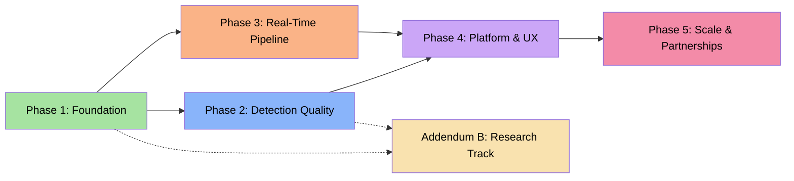

# CallShield Development Roadmap

**Roadmap revision:** 2026-06-27 · **Anchored to:** v1.7.12 (versionCode 40)

This roadmap merges the original Phase 1–5 plan, the Addendum A "peer-inspired track" (round-1/2/3 borrows from SpamBlocker, YACB, BlackList, Saracroche, adamff-dev, Fossify), and a fresh Addendum B harvested from a 30-source research sweep across OSS competitors, commercial competitors, FCC/IETF/ATIS standards, Android 15/16 platform changes, dependency changelogs, and adjacent-domain OSS (NetGuard, Pi-hole, rspamd patterns).

Source-cited. Every Addendum-B item maps to an entry in **Appendix — Source Index**. Anything that contradicts CallShield's stated philosophy (on-device, no accounts, no API keys, no cloud audio, FOSS) is either rejected or flagged.

---

## Current State (v1.7.12)

Working Android spam call/text blocker. **100 main Kotlin files, 37 JVM test files, and 15 instrumented test files.** Post-v1.7.10 work added `AppDatabase`, `SpamDataSource`, and `HotFeedDataSource` seams plus in-memory Room integration tests for the call, SMS, database-sync, and hot-feed pipelines, completed deterministic onboarding, dashboard, blocklist, and settings Compose UI coverage, added a Kover 0.9.8 debug coverage gate for the JVM-tested data/util core, added local lint/ktlint/detekt gates with baselines for existing static-analysis debt, introduced production-used domain use-case wrappers for spam checks, SMS checks, sync, blocklist management, and exports, moved `SpamCheckResult`/`SyncResult` into `domain/model`, added domain repository interfaces with a `SpamRepositoryAdapter` bridge, split the data layer so `SpamRepository` is now a compatibility facade over `data/repository` collaborators, completed Hilt DI for the app, services, workers, repositories, and detection helpers, completed the 1.8.1/1.8.2 localization/plural pass, and added v1.7.12 durable blocked-call logging with Room v10 `logKey` idempotency plus a pending-log retry worker. v1.7.12 also adds Cloudflare Worker rate-limit/dedup tests, Android 429 retry-delay feedback, and shared ASCII-only digit utilities. **645 JVM tests plus instrumented integration/UI/runtime coverage**.

15-layer detection pipeline (priority-sorted `IChecker` registry), GBT v3 ML scorer (20 features, atomic ModelState, pure-Kotlin inference) with logistic-regression v2 fallback, Jetpack Compose UI on Catppuccin Mocha + AMOLED, Room 2.8.4 with explicit migrations v5+, scheduled WorkManager hot-list + weekly sync from GitHub, RCS NotificationListener, CallerIdOverlayService with first-hit-wins lookup race, SIT-tone anti-autodialer, URLhaus phishing detection, Cloudflare Worker community reporting, and local Gradle/lint/release verification.

**Stack fingerprint:** AGP 8.10.1 · Kotlin 2.2.21 · Compose BOM 2026.05.00 · Room 2.8.4 · WorkManager 2.11.2 · OkHttp 5.3.2 · Moshi 1.15.1 · DataStore 1.2.1 · Kover 0.9.8 · ktlint 1.8.0 · detekt 1.23.8 · Hilt 2.58 · AndroidX Hilt Work 1.3.0 · minSdk 29 · targetSdk 36 · KSP for Room/Hilt codegen. **No KMP, no Glance, no SQLCipher.**

```mermaid
graph LR
    P1[Phase 1: Foundation] --> P2[Phase 2: Detection Quality]
    P1 --> P3[Phase 3: Real-Time Pipeline]
    P2 --> P4[Phase 4: Platform & UX]
    P3 --> P4
    P4 --> P5[Phase 5: Scale & Partnerships]
    P1 -.-> AB[Addendum B: Research Track]
    P2 -.-> AB

    style P1 fill:#a6e3a1,color:#000
    style P2 fill:#89b4fa,color:#000
    style P3 fill:#fab387,color:#000
    style P4 fill:#cba6f7,color:#000
    style P5 fill:#f38ba8,color:#000
    style AB fill:#f9e2af,color:#000
```

---

## Status Legend

`[DONE]` shipped in a tagged release · `[WIP]` partially landed · `[NOW]` next 1–2 releases · `[NEXT]` 3–6 releases out · `[LATER]` long-horizon · `[?]` under consideration · `[X]` rejected (with reasoning).

---

## Locked Design Philosophy (do not contradict without flagging)

1. **On-device first.** Every detection layer must work offline. Network calls are enrichments, never gating.
2. **No accounts, no sign-in, no telemetry.** Anonymous community reporting via Cloudflare Worker is the maximum ceiling.
3. **No required API keys.** Any third-party API must have a free, no-auth tier or be optional.
4. **No cloud audio.** Voice frames never leave the device. Deepfake / fingerprint detection runs locally or not at all.
5. **FOSS distribution.** Every release must be reproducible-buildable for F-Droid; no GMS-only code paths.
6. **5-second screening deadline.** `CallShieldScreeningService` must respond <5 s. All hot-path code is budget-aware.
7. **Backward compat for hot-list URLs.** GitHub-raw endpoints remain serve-and-respond for v1.2.x clients indefinitely.

Any roadmap item that contradicts these is flagged inline with **⚠ philosophy conflict** and given an explicit case.

---

## Phase 1 — Foundation (Testing, Architecture, Security)

**Goal:** engineering discipline, testability, security hardening. Every later phase depends on this.

### 1.1 Unit Tests for Detection Engines `[DONE]`

Shipped: 30 test files now exist under `app/src/test/`, covering `SpamMLScorer` (logistic + GBT), `SpamHeuristics`, `SmsContentAnalyzer`, `PhoneFormatter`, `CallbackDetector`, `BackupRestore`, `WildcardRule`, `HashWildcardMatcher`, `LogExporter`, `BlockingProfiles`, `BlockReasoning`, `CampaignDetector`, `TimeSchedule`, `PhoneNumberFuzzTest`, `JsonParsingFuzzTest`, `HotPathBenchmarkTest`, `OneShotNoticeGate`, `CrashReporter`, `DashboardStatusModel`, `Race`, plus `CallShieldScreeningServiceAutoMuteTest` and `StirShakenTrustCheckerTest` from v1.7.0.

### 1.2 Integration Tests `[DONE]`

| Task | Size | Depends | Files |
|------|------|---------|-------|
| 1.2.1 Full `isSpam()` pipeline test with in-memory Room — exercise core priority tiers and verify priority ordering | XL | `[DONE]` | `androidTest/.../data/SpamPipelineIntegrationTest.kt` |
| 1.2.2 Full `isSpamSms()` pipeline test — context trust bypass, keyword rules, content-analysis order | L | `[DONE]` | `androidTest/.../data/SmsPipelineIntegrationTest.kt` |
| 1.2.3 `syncFromGitHub()` mocked — verify atomic Room population via `@Transaction` | M | `[DONE]` | `androidTest/.../data/SyncIntegrationTest.kt` |
| 1.2.4 `HotListSyncWorker` — hot_numbers, hot_ranges, spam_domains parsed and stored, per-entry error tolerance | M | `[DONE]` | `androidTest/.../service/HotListSyncIntegrationTest.kt` |

`SpamRepository` now accepts a constructor-provided `AppDatabase` and `SpamDataSource`, and `HotDataSync` accepts a narrow `HotFeedDataSource`, so Android integration tests can use `Room.inMemoryDatabaseBuilder()` plus fake remote/hot-feed snapshots without starting the Hilt refactor.

### 1.3 Compose UI Tests `[DONE]`

Eleven instrumented test files now exist (`CrashReporterInstrumentedTest`, `DashboardStatusBadgeTest`, `ThemePrimitivesTest`, `SpamPipelineIntegrationTest`, `SmsPipelineIntegrationTest`, `SyncIntegrationTest`, `HotListSyncIntegrationTest`, `OnboardingTest`, `DashboardTest`, `BlocklistTest`, `SettingsTest`).

| Task | Size | Status | Files |
|------|------|--------|-------|
| 1.3.1 Onboarding flow — 4 pages, permission requests, call-screener setup | M | `[DONE]` | `androidTest/.../ui/screens/onboarding/OnboardingTest.kt` |
| 1.3.2 Dashboard — hero stats, sync freshness, screener banner | M | `[DONE]` | `androidTest/.../ui/screens/main/DashboardTest.kt` |
| 1.3.3 Blocklist — add/delete, wildcard validation, swipe-to-delete + undo | L | `[DONE]` | `androidTest/.../ui/screens/main/BlocklistTest.kt` |
| 1.3.4 Settings — toggle persistence, quiet-hours validation, schedule picker | M | `[DONE]` | `androidTest/.../ui/screens/settings/SettingsTest.kt` |

### 1.4 Local Verification Pipeline `[DONE]`

Kover 0.9.8 gates the debug JVM unit-test report for the data/util core at a 35% minimum line-coverage threshold; current filtered coverage is 41.06%. The filter intentionally excludes Compose screens, Android services, permission entrypoints, and `data.local` Room classes because Kover only collects local JVM test coverage, while those surfaces are guarded by instrumented integration/UI tests. Android lint, ktlint, and detekt run locally with baselines for existing style/complexity debt so new violations are visible without forcing a giant reformat/refactor in the same release. Ratchet Kover and reduce baselines as architecture seams land.

| Task | Size | Status | Files |
|------|------|--------|-------|
| 1.4.4 Code-coverage gate via Kover, ratcheting threshold (start 35%, +5% per release) | M | `[DONE]` | `app/build.gradle.kts` |
| 1.4.5 Lint + ktlint + detekt local gates | S | `[DONE]` | `.editorconfig`, `app/build.gradle.kts` |

### 1.5 Clean Architecture Refactor `[DONE]`

`SpamRepository` now preserves the public singleton/facade API while the concrete data responsibilities live under `data/repository`. The `IChecker` registry (Addendum A1) still owns detection ordering, now through `SpamRepositoryImpl`.

`domain/usecase` now contains thin, production-used wrappers: `CheckSpamUseCase`, `CheckSpamSmsUseCase`, `SyncDatabaseUseCase`, `ManageBlocklistUseCase`, and `ExportLogsUseCase`. The wrappers are wired into the live call/SMS screening paths, historical scanners, sync worker, and `MainViewModel` blocklist/export flows. `domain/model` now owns `SpamCheckResult` and `SyncResult`. `domain/repository` defines `SpamCheckRepository`, `SyncRepository`, and `BlocklistRepository`; `data/repository/SpamRepositoryAdapter` bridges those contracts to the facade. `data/repository/SpamRepositoryImpl` owns the 5-second checker path and Room-backed hot caches, `SettingsRepository` owns public/private DataStore reads and writes, `SyncRepository` owns GitHub/bundled/hot-list persistence, and `BlocklistRepository` owns blocklist, whitelist, rule, log, search, and cleanup operations.

| Task | Size | Status | Files |
|------|------|--------|-------|
| 1.5.1 Domain use cases: `CheckSpamUseCase`, `CheckSpamSmsUseCase`, `SyncDatabaseUseCase`, `ManageBlocklistUseCase`, `ExportLogsUseCase` | L | `[DONE]` | `domain/usecase/*.kt` |
| 1.5.2 Extract `SpamCheckResult` and settings models to domain layer | S | `[DONE]` | `domain/model/*.kt` |
| 1.5.3 Define repository interfaces in domain | M | `[DONE]` | `domain/repository/*.kt` |
| 1.5.4 Split `SpamRepository` into `SpamRepositoryImpl`, `SettingsRepository`, `SyncRepository`, `BlocklistRepository` | XL | `[DONE]` | `data/repository/*.kt` |

**Critical:** the call/SMS pipeline integration tests in 1.2.1/1.2.2, sync integration tests in 1.2.3, and hot-feed integration test in 1.2.4 now exist. Run the full integration set after each split to verify priority ordering and data-refresh behavior.

### 1.6 Dependency Injection (Hilt) `[NOW]`

Hilt is pinned to 2.58 for the current AGP 8.10.1 stack: 2.59+ requires AGP 9, while 2.58 explicitly held AGP 9 support back [src 31]. The app uses KSP for the Hilt compiler following the official Gradle setup [src 32], and AndroidX Hilt Work is pinned to the current stable 1.3.0 line [src 33].

| Task | Size | Status | Files |
|------|------|--------|-------|
| 1.6.1 Add Hilt 2.58 (AGP 8-compatible current line [src 31]) | S | `[DONE]` | `libs.versions.toml`, `build.gradle.kts` |
| 1.6.2 `@HiltAndroidApp` on `CallShieldApp` | S | `[DONE]` | `CallShieldApp.kt` |
| 1.6.3 `DatabaseModule` providing `AppDatabase` + `SpamDao` singletons | M | `[DONE]` | `di/DatabaseModule.kt` |
| 1.6.4 `RepositoryModule` binding interfaces to impls | M | `[DONE]` | `di/RepositoryModule.kt` |
| 1.6.5 `NetworkModule` providing the shared `OkHttpClient` (with cert pinning, see 1.7.2) | M | `[DONE]` | `di/NetworkModule.kt` |
| 1.6.6 `MainViewModel` → `@HiltViewModel` with injected use cases | M | `[DONE]` | `MainActivity.kt`, `MainViewModel.kt` |
| 1.6.7 `CallShieldScreeningService` → `@AndroidEntryPoint` | M | `[DONE]` | `CallShieldScreeningService.kt` |
| 1.6.8 Workers → `@HiltWorker` | M | `[DONE]` | `CallShieldApp.kt`, `SyncWorker.kt`, `HotListSyncWorker.kt`, `DigestWorker.kt` |
| 1.6.9 Convert `object` singletons (`SpamHeuristics`, `SmsContentAnalyzer`, `SpamMLScorer`, `CallbackDetector`, `SmsContextChecker`, `CampaignDetector`, `HashWildcardMatcher`) to injectable classes | L | `[DONE]` | data layer |

The helper objects are now constructor-injectable classes. `DetectionModule` provides their shared singleton instances, `CheckerDependencies` routes the live checker chain, screening service, app startup, hot-list sync, and model sync paths through that seam, and companion compatibility facades preserve existing UI/test utility call sites until those lower-risk callers are migrated.

**Risk:** migrate one consumer at a time; keep `getInstance()` fallback until all consumers migrated.

**Alternate (worth a spike):** Kotlin 2.2 `context(...)` parameters [src 20] could replace some `@Inject` for pure-logic boundaries. Don't do it as the primary DI strategy — Hilt's lifecycle binding is still needed for ViewModel/Worker scoping.

### 1.7 Security Hardening `[WIP]`

| Task | Size | Status | Files |
|------|------|--------|-------|
| 1.7.1 Move signing credentials to `local.properties` / env vars | S | `[DONE]` (`build.gradle.kts:33-47`) | — |
| 1.7.2 Certificate pinning — GitHub raw, Cloudflare Worker, all enrichment APIs. Use OkHttp 5 `CertificatePinner` (post-1.7.5 upgrade). | M | `[DONE]` v1.7.6 | `data/remote/HttpClient.kt`, `HttpClientTest.kt` |
| 1.7.3 Replace any `EncryptedSharedPreferences` with **Tink `AeadSerializer` + DataStore 1.2** [src 21]. AndroidX Security `EncryptedSharedPreferences` is on the deprecated path. | M | `[DONE]` v1.7.8: no `EncryptedSharedPreferences`/`androidx.security` path exists; DataStore upgraded to 1.2.1 and optional key moved to no-backup DataStore instead of adding an unused Tink path | `SpamRepository.kt`, settings layer |
| 1.7.4 Consider `android:allowBackup="false"` or restrict via existing `backup_rules.xml` (currently `allowBackup="true"`) | S | `[DONE]` v1.7.8: backups remain enabled for Room + public settings, while optional credentials now live under `noBackupFilesDir` and migrate out of backed-up DataStore | `backup_rules.xml`, `data_extraction_rules.xml`, `SpamRepository.kt` |
| 1.7.5 OkHttp 4.12 → **OkHttp 5.x** [src 18]. Adds Happy Eyeballs (RFC 8305), ZSTD compression module, JPMS, separate Android artifact, eliminates 4.x cookie-jar SSRF. | M | `[DONE]` v1.7.6 (`OkHttp 5.3.2`) | `data/remote/HttpClient.kt`, version catalog |
| 1.7.7 Reproducible-build verification — match SpamBlocker's F-Droid story. Eliminate build-timestamp embedding, enable Gradle `dependencyLocking`, document hash-comparison procedure. [src 1, src 24] | M | `[DONE]` v1.7.7 for source-content groundwork; signed byte-for-byte validation remains a F-Droid signature-copy follow-up | `build.gradle.kts`, CI, `docs/reproducible-builds.md`, `scripts/compare-apk-contents.ps1` |

### 1.8 String Extraction `[WIP]`

`955+ string resources` and 6 plural groups are already extracted (per README), and the 1.8.1 audit now records remaining literal buckets. Continue.

| Task | Size | Files |
|------|------|-------|
| 1.8.1 Audit all main Kotlin files for hardcoded user-facing strings | S | `[DONE]` `docs/hardcoded-string-audit.md`, `res/values/strings.xml` |
| 1.8.3 Number-formatting localization — display E.164 numbers in local format ((212) 555-0100 in en-US, +33 1 23 45 67 89 in fr-FR) using `libphonenumber` or `PhoneNumberUtils.formatNumber()` [Addendum B item B.27] | M | `data/PhoneFormatter.kt` |

---

## Phase 2 — Detection Quality

**Goal:** behavioral features, STIR/SHAKEN parsing depth, feedback loops, fuzz/perf gates.

### 2.1 ML Model Upgrade `[DONE]`

GBT v3 (20 features, pure Kotlin inference, ~50 KB model, sigmoid output, atomic ModelState) shipped in v1.6.0. Logistic v2 fallback retained. JSON v3 schema with backward compat to v2. Threshold 0.7.

### 2.2 Behavioral / Temporal Features `[NEXT]`

| Task | Size | Depends | Files |
|------|------|---------|-------|
| 2.2.1 Time-of-day feature — sin/cos cyclical encoding | M | — | `SpamMLScorer.extractFeatures()` |
| 2.2.2 Call frequency feature — calls from this number in 7/30-day windows | M | — | `SpamMLScorer.extractFeatures()`, `SpamDao` |
| 2.2.3 Ring duration feature — short rings correlate with autodialers | M | — | `CallShieldScreeningService` |
| 2.2.4 Geographic distance feature — area-code distance from user's home area code | M | — | `SpamMLScorer.extractFeatures()` |
| 2.2.5 Retrain with expanded features (20 → 24-26) and ship a v4 weights JSON; keep v3 backward compat | M | 2.2.1-4 | `scripts/train_spam_model.py`, weights schema |

### 2.3 STIR/SHAKEN Enhancement `[WIP]`

v1.7.0 shipped the binary trusted-allow / FAIL-block layer. Remaining: **PASSporT JWT depth.**

| Task | Size | Depends | Files |
|------|------|---------|-------|
| 2.3.1 Parse full PASSporT token per **RFC 8225** (header `typ=passport, alg=ES256, x5u=…`; payload `iat`, `orig`, `dest`, optional `mky`) [src 14]. Android exposes the SIP `Identity` header on API 30+ via `Connection.getExtras()`. | L | — | New `data/StirShakenParser.kt` |
| 2.3.2 Per **RFC 8588 SHAKEN profile**: extract `attest` (A/B/C) and `origid` (UUID) claims. Display neutral carrier-authentication status in caller-ID overlay (A=caller+number authenticated, B=caller authenticated only, C=gateway only/no opinion); never label attestation as safe/trusted caller status. [src 14] | M | 2.3.1 | overlay UI, `BlockedCall` model |
| 2.3.3 `iat` replay-attack guard — reject tokens with `iat` more than 60 s old/skewed [src 14] | S | 2.3.1 | parser |
| 2.3.4 Persist `origid` UUID in BlockedCall for **RFC 9027 traceback** participation. Future-proofs FCC traceback consortium reporting. [src research, RFC 9027] | S | 2.3.1 | `SpamDao`, `BlockedCall` |
| 2.3.5 Attestation level as ML feature (A reduces score, C raises) | M | 2.3.1, 2.2.5 | `SpamMLScorer.extractFeatures()` |

### 2.4 Graph-Based Campaign Detection `[NEXT]`

In-memory `CampaignDetector` exists. Persist to Room and broaden window:

| Task | Size | Files |
|------|------|-------|
| 2.4.1 Persistent call-graph table — track NPA-NXX prefix clusters over 7-day window | L | new `data/local/CallGraphDao.kt` |
| 2.4.2 Burst rule — 5+ distinct numbers from same NPA-NXX in 1 h = active campaign | M | `data/CampaignDetector.kt` |
| 2.4.3 Geographic clustering across users (post-Phase 3 server) | L | server |

### 2.5 After-Call Feedback `[WIP]`

Skeleton ("Was this spam?" notification) shipped in v1.4.x. Remaining:

| Task | Size | Files |
|------|------|-------|
| 2.5.1 Bottom-sheet variant for in-app review (richer options: spam type, severity) | M | new UI, `CallShieldScreeningService` |
| 2.5.2 Persist feedback as labeled rows in Room | S | `SpamDao`, new `FeedbackEntry` |
| 2.5.3 Export feedback to training pipeline (opt-in) | M | `train_spam_model.py` |
| 2.5.4 On-device Bayesian classifier learning from local feedback (per-user) [Addendum B item B.13] | L | new `data/BayesianFeedbackModel.kt` |

### 2.6 Quality Gates `[WIP]`

| Task | Size | Status | Files |
|------|------|--------|-------|
| 2.6.1 Phone-number fuzz tests | `[DONE]` | `PhoneNumberFuzzTest.kt` exists | — |
| 2.6.2 `isSpam()` perf benchmark, hard ceiling 50 ms p99 | `[WIP]` | `HotPathBenchmarkTest.kt` exists; needs local gate | `androidTest/.../SpamCheckBenchmark.kt` |
| 2.6.4 **Baseline Profile** for screener cold-start [Addendum B item B.30] — first-call latency drops measurably; CallScreeningService has 5 s deadline | M | `[NEXT]` | `app/baselineprofile/` |

---

## Phase 3 — Real-Time Data Pipeline

**Goal:** delta sync, two-tier DB, optional honeypot. **Caveat:** the existing GitHub-raw + 30 min hot-list pipeline already meets the realistic target. A full backend is justified only if community-report volume outgrows GitHub Pages economics.

### 3.1 API Server `[LATER]`

| Task | Size | Files |
|------|------|-------|
| 3.1.1 OpenAPI 3.0 spec — `POST /reports`, `GET /reputation/{number}`, `GET /blocklist/delta`, `POST /feedback` | M | `server/openapi.yaml` |
| 3.1.2 Ktor server impl (Kotlin shared models with Android) | XL | `server/` |
| 3.1.3 Migrate Cloudflare Worker to thin proxy for backward compat | L | `worker/`, server |
| 3.1.4 API-key gate (anonymous, rotating, rate-limited) + JWT for admin | L | `server/auth/` |
| 3.1.5 Token-bucket rate limiting | M | `server/middleware/` |
| 3.1.6 Abuse detection — coordinated false reports, report flooding | L | `server/abuse/` |

### 3.2 Real-Time Streaming `[LATER]`

| Task | Size | Files |
|------|------|-------|
| 3.2.1 Delta API — `last_sync_timestamp` → only-deltas response | L | `data/remote/ApiDataSource.kt`, server |
| 3.2.2 SSE push for new hot numbers within 30 s of ingestion | XL | server, new `service/RealtimeSyncService.kt` |
| 3.2.3 Polling fallback when SSE drops | M | `HotListSyncWorker.kt` |

### 3.3 Two-Tier Database `[NEXT]`

This one is worth doing **without** a backend. The bloom filter alone gives O(μs) negative checks for the 32K → 100K+ growth path.

| Task | Size | Files |
|------|------|-------|
| 3.3.1 Bloom filter for the full DB (FPR < 0.1%) loaded at startup | L | new `data/local/BloomFilter.kt` |
| 3.3.2 Optional cloud-reputation API for filter-positive lookups | M | new `data/remote/ReputationApi.kt` |
| 3.3.3 Two-tier lookup: bloom (μs) → exact Room (ms) → optional cloud (10–100 ms) | M | `SpamRepositoryImpl.isSpam()` |
| 3.3.4 Strict offline mode toggle — disable all network calls including enrichment [Addendum B item B.21] | M | settings |

### 3.4 Honeypot Network `[?]`

⚠ Operational and privacy cost. Justified only at much higher scale. Defer behind Phase 5.

### 3.5 Geographic Clustering `[LATER]` (depends on 3.1)

---

## Phase 4 — Platform & UX

### 4.1 Kotlin Multiplatform → iOS `[LATER]`

| Task | Size | Files |
|------|------|-------|
| 4.1.1 Extract pure-logic into KMP module — `SpamMLScorer`, `SpamHeuristics` core, `PhoneFormatter`, `HashWildcardMatcher`, regex packs | XL | new `shared/` |
| 4.1.2 `expect`/`actual` for contacts, call log, DataStore/UserDefaults | XL | `shared/src/{commonMain,androidMain,iosMain}/` |
| 4.1.3 iOS shell — SwiftUI, settings, blocklist, detection toggle | XL | `iosApp/` |
| 4.1.4 **CallKit `CXCallDirectoryProvider`** + `CXCallDirectoryManager` reload | XL | `iosApp/CallShieldExtension/` |
| 4.1.5 **Saracroche-style 4-target architecture** [src 7]: Main App + Call Directory Extension + Unwanted Communication Reporting + Message Filter Extension | XL | iOS app |

**Constraint:** CallKit is preload-only; no real-time evaluation. Strategy: periodic CallKit reload from local DB; community reports via the shared backend if Phase 3 lands first.

### 4.2 Adaptive Layouts `[NEXT]`

| Task | Size | Files |
|------|------|-------|
| 4.2.1 `calculateWindowSizeClass()` + `androidx.window 1.3+` [src research] | S | `MainActivity.kt` |
| 4.2.2 Tablet list-detail pane for blocklist / log | L | screen files |
| 4.2.3 Foldable `FoldingFeature` support | M | `MainActivity.kt` |
| 4.2.4 Landscape — horizontal stats, wider dialogs | M | screens |

### 4.3 InCallService Integration `[LATER]`

| Task | Size | Files |
|------|------|-------|
| 4.3.1 Custom call screen (Android 12+) — spam score, caller name, location, attestation badge on incoming UI | XL | new `service/CallShieldInCallService.kt` |
| 4.3.2 Replace overlay with InCallService when available; overlay fallback for older devices | M | `CallerIdOverlayService.kt` |

### 4.4 After-Call Bottom Sheet `[NEXT]`

| Task | Size | Files |
|------|------|-------|
| 4.4.1 "Was this spam?" bottom sheet (replaces notification chip for unknown allowed calls) — thumbs up/down + type selector | M | new UI |
| 4.4.2 Skip for contacts and whitelisted numbers | S | service |

### 4.5 Contact Enrichment `[LATER]`

| Task | Size | Files |
|------|------|-------|
| 4.5.1 Business-name lookup (OpenCNAM existing + Google Places optional) | M | `data/remote/BusinessLookup.kt` |
| 4.5.2 Business logo (Clearbit / Google Favicon) — cache aggressively | M | overlay UI |
| 4.5.3 Cache enrichment in Room with TTL | M | new `data/local/ContactEnrichmentDao.kt` |

### 4.6 Accessibility `[NEXT]`

| Task | Size | Files |
|------|------|-------|
| 4.6.1 Full TalkBack audit — `contentDescription` on all interactive elements (claimed 100+, audit to confirm) | L | all screens |
| 4.6.2 Dynamic-type at 200% font scale | M | `Theme.kt`, screens |
| 4.6.3 WCAG AA color-contrast audit on Catppuccin Mocha tokens | M | `Theme.kt` |
| 4.6.4 48 dp × 48 dp touch-target audit (claimed; verify) | M | screens |
| 4.6.5 Predictive-back full preview (Android 14+, polished in 16) [src 28] | M | `MainActivity.kt`, screens |

### 4.7 Localization `[LATER]`

| Task | Size | Files |
|------|------|-------|
| 4.7.2 Translate to ES, FR, DE, PT, JA, KO. Plus **TR, ES-MX, IT, NL, PL, RU** based on top OSS-app reach. Each L. | many | `res/values-{lang}/strings.xml` |
| 4.7.3 RTL layout (Arabic, Hebrew) | M | layouts |

### 4.8 Spam Trends Dashboard `[NEXT]`

| Task | Size | Files |
|------|------|-------|
| 4.8.1 Time-series chart — daily/weekly/monthly (Vico or custom Canvas) | L | `StatsScreen.kt` rewrite |
| 4.8.2 Source-breakdown pie | M | `StatsScreen.kt` |
| 4.8.3 Geographic heat map (depends on 3.5.3) | XL | new `SpamMapScreen.kt` |
| 4.8.4 Trend indicators with historical comparison | M | `StatsScreen.kt` |

---

## Phase 5 — Scale & Partnerships

### 5.1 Carrier Integration `[LATER]`

T-Mobile Scam Shield, AT&T ActiveArmor, Verizon Call Filter — all require business-development engagement [src 30]. Track but do not staff.

### 5.2 Federated Learning `[?]`

Roadmap retains as long-horizon. **Differential-privacy noise injection** is a hard requirement; small per-user spam-call counts (~20/month [src research]) make naive FL leak. Likely won't ship before 2027.

### 5.3 gRPC API `[LATER]` — depends on 3.1

### 5.4 Monetization & Audit `[?]`

| Task | Size | Files |
|------|------|-------|
| 5.4.1 Premium tier — Google Play Billing, feature gating ⚠ partial conflict with FOSS philosophy: F-Droid build must remain feature-complete; premium = Play-only convenience features (cloud sync, multi-device, priority support) | L | `data/billing/BillingManager.kt` |
| 5.4.2 Feature flags for premium | M | `domain/FeatureFlags.kt` |
| 5.4.3 Third-party security audit | XL | external |
| 5.4.4 White-label SDK for carrier integration | XL | new `sdk/` module |

---

## Cross-Cutting Concerns

### Database Migrations
v5+ are explicit; v1–4 use `fallbackToDestructiveMigration()`. **Acceptable for spam-numbers (re-syncable) but unacceptable** after FeedbackEntry (2.5.2), CallGraph (2.4.1), ContactEnrichment (4.5.3). Add `Migration` objects in lockstep with each new entity.

### Backward Compatibility
Hot-list sync and community reports use hardcoded GitHub-raw URLs on `master`. Phase 3 must keep these endpoints serving for v1.2.x clients indefinitely — that's the legacy contract.

### Privacy Architecture
Phases 2.5 (feedback), 3.4 (honeypot), 5.2 (federated) introduce data collection. Each requires explicit opt-in toggle, plain-language privacy disclosure, and a retention cap. No exceptions.

### Dependency Refresh Cadence
Quarterly dependency audit. v1.7.6 cleared the Kotlin/KSP, AGP, Room, and OkHttp tranche; v1.7.7 locked the resolved dependency graph and added the reproducible-build runbook; v1.7.8 cleared the DataStore 1.2.1 upgrade and optional-key backup boundary; v1.7.9 cleared the WorkManager 2.11.2 refresh with schedule-contract tests; v1.7.10 cleared the Compose BOM 2026.05.00 refresh and the newly enforced Compose resource-read lint. Addendum B.U continues with localization, predictive-back, widget, and Room driver follow-ups.

---

## Addendum A — Peer-Inspired Track (preserved)

Round-1/2/3 borrows from SpamBlocker (aj3423), YetAnotherCallBlocker (xynngh), BlackList (kaliturin), Saracroche (cbouvat), spam-call-blocker-app (adamff-dev), Fossify Phone.

| ID | Item | Status |
|----|------|--------|
| A1 | Priority-sorted `IChecker` pipeline | `[DONE]` v1.6.0 |
| A2 | Budget-aware lookup race (`Race.kt`) | `[DONE]` v1.6.0/1.7.1 |
| A3 | Push-alert / notification-context bridge (`PushAlertChecker`, `PushAlertRegistry`) + allowlist editor + revoke-on-next-ring feedback | `[DONE]` v1.6.0/1.7.1 |
| A4 | System block-list bridge (`BlockedNumberContract` read-only) | `[DONE]` v1.6.0 |
| A5 | Hash-wildcard / range patterns (`#` length-locked) | `[DONE]` v1.6.0 |
| A6 | Schedule-aware rules (days mask + hour window with overnight wrap) | `[DONE]` v1.6.0 |
| A7 | STIR trusted-caller allow + auto-mute low-confidence | `[DONE]` v1.7.0 |

---

## Addendum B — Round-3 Research Track (new, 2026-05-06)

Harvested from a 30-source sweep (see Appendix). Scoped to NEW signal not already covered above. Each item carries impact (1–5), effort (1–5), source ref.

### B.NOW — Now (1–2 releases)

| ID | Item | Impact | Effort | Source | Notes |
|----|------|-------:|-------:|--------|-------|
| B.U.1 | OkHttp 4.12 → **5.x** | 4 | 2 | [18] | `[DONE]` v1.7.6: upgraded to OkHttp 5.3.2 and kept the shared-client/derived-client contract. |
| B.U.2 | Room 2.6 → **2.8.4** | 3 | 2 | [research] | `[DONE]` v1.7.6: upgraded Room to 2.8.4 and updated the legacy destructive-migration overload. |
| B.U.3 | Kotlin 2.1 → **2.2.21** | 3 | 2 | [20] | `[DONE]` v1.7.6: upgraded AGP to 8.10.1 for Kotlin 2.2 R8 compatibility, aligned Kotlin/KSP to 2.2.21, and moved JVM target configuration to the compilerOptions DSL. |
| B.U.4 | DataStore 1.1 → **1.2.1** + Tink `AeadSerializer` | 4 | 3 | [21] | `[DONE]` v1.7.8: upgraded DataStore to 1.2.1; no deprecated encrypted-preferences path exists, so no unused Tink serializer was introduced; optional AbstractAPI key now migrates into private no-backup DataStore |
| B.U.5 | WorkManager 2.10 → **2.11.2** | 2 | 1 | [16] | `[DONE]` v1.7.9: upgraded WorkManager to 2.11.2, refreshed locks, and added schedule-contract tests for `SyncWorker`, `HotListSyncWorker`, and `DigestWorker` |
| B.U.6 | Compose BOM 2024.12 → latest stable (Compose Foundation 1.11+) | 3 | 2 | [17] | `[DONE]` v1.7.10: upgraded to Compose BOM 2026.05.00, refreshed locks across debug/release/unit-test configurations, and fixed Compose resource-read lint with `stringResource`, `pluralStringResource`, and `LocalResources` |
| B.D.4 | **Obtainium** spec — already supported via GitHub Releases; document the workflow + add SHA256 sidecar files to release artifacts | 2 | 1 | [research] | `[DONE]` v1.7.7: CI emits APK `.sha256` sidecars, local signed releases use `scripts/write-release-sha256.ps1`, and the hash workflow is documented. |
| B.F.1 | **Per-SIM filtering rules** (dual-SIM aware) | 4 | 3 | [SpamBlocker #59] | Top community ask; enables work/personal SIM split |
| B.F.2 | **Rule replay / debug mode** — re-run any logged call/SMS through the current ruleset | 4 | 2 | [SpamBlocker #386] | Power-user feature; cheap to add via `IChecker` registry already present |
| B.F.3 | **Strict (AND) vs Relaxed (OR) rule mode** | 3 | 2 | [SpamBlocker #377] | Replaces Inclusive/Exclusive terminology; clearer semantics |
| B.F.4 | **Auto-add regex-blocked numbers to local DB** for review | 3 | 1 | [SpamBlocker #355] | One-line change in pipeline |
| B.F.5 | **App-foreground context rule** — allow calls when banking / delivery app is active | 4 | 3 | [SpamBlocker #218] | UsageStatsManager + (existing) PushAlertChecker pattern |
| B.F.6 | **System-notification context rule** (delivery notification present → allow) | 3 | 2 | [SpamBlocker #350] | Already partially via PushAlertChecker; broaden source taxonomy |
| B.F.7 | **External blocklist URL subscription** (Pi-hole "gravity" model) — CSV/TXT/JSON URLs, scheduled refresh, merged into local DB with attribution | 5 | 3 | [26] | Architecturally aligns with our hot-list pattern |
| B.F.8 | **Spam-SMS auto-forward to 7726 (SPAM)** — opt-in carrier reporting | 3 | 1 | [15] | Pure UX win; FCC-recommended |
| B.U.7 | **Number formatting localization** via `PhoneNumberUtils.formatNumber()` or `libphonenumber` | 3 | 2 | [research] | Belongs in P1.8.3 |
| B.O.1 | **"Explain this decision" drawer** — tap any log entry to see rules triggered, in priority order, with confidence | 4 | 2 | [research] | Cheap with existing `IChecker` returning `BlockResult` reasons |
| B.U.8 | Predictive back full preview (where missing) | 2 | 2 | [28] | Polish for Android 14+ |
| B.S.2 | Certificate pinning for **all** API endpoints (existing `network_security_config.xml` covers cleartext only) | 4 | 2 | [research] | `[DONE]` v1.7.6: central OkHttp `CertificatePinner` covers GitHub, Cloudflare Worker, URLhaus, AbstractAPI, and caller-ID enrichment hosts. |
| B.U.9 | `androidx.glance` widget rewrite (current widget is `RemoteViews`); pin Glance ≥ 1.1.1 against **CVE-2024-7254** | 3 | 3 | [22] | Widget preview API + adaptive sizing |

### B.NEXT — Next (3–6 releases)

| ID | Item | Impact | Effort | Source | Notes |
|----|------|-------:|-------:|--------|-------|
| B.F.9 | **ICS / iCal calendar-based scheduling** — parse iCal subscription URL into dynamic allow windows (shift workers, on-call) | 3 | 4 | [SpamBlocker #359] | Builds on existing per-rule schedule (A6) |
| B.F.10 | **DID range fuzzy matching** — allow numbers within ±N of a saved contact's number | 2 | 2 | [SpamBlocker #554] | Covers contacts whose business rotates last digits |
| B.F.11 | **Family DB sharing** — opt-in mesh-share local user blocklist with N trusted devices via QR-paired keys | 4 | 4 | [SpamBlocker #549] | ⚠ Privacy: end-to-end encrypted; no server involvement |
| B.F.12 | **Wi-Fi SSID / geofence rule profiles** — corporate SSID = work rules, home SSID = relaxed | 3 | 3 | [research, NetGuard pattern] | Builds on existing BlockingProfiles |
| B.F.13 | **Bidirectional blocklist subscription** — publish your local list as a stable URL others can subscribe to (Pi-hole / OPML model) | 3 | 4 | [26] | Pairs with B.F.7 |
| B.F.14 | **Local REST API on loopback** for Tasker / Macrodroid / automation: `GET /api/stats/summary`, `POST /api/report`, `GET /api/log` | 3 | 3 | [26] | Pi-hole pattern; keep auth-by-shared-secret |
| B.O.2 | **Rule-coverage analytics** — % of incoming calls handled by each rule; identify dead rules | 3 | 2 | [research] | Reuses BlockReasoning |
| B.O.3 | **Advanced call-log filter** — by rule, number pattern, type, date range, confidence, source | 3 | 3 | [research] | Compose pre-existing log refactor |
| B.O.4 | **Diagnostic-report export** — one-tap CSV/JSON of log + rules + model version + device info for bug reports | 3 | 2 | [NetGuard PRO] | Ships with redaction option |
| B.D.5 | **Wear OS / Galaxy Watch tile** — last blocked call + one-tap temporary allow | 3 | 4 | [research] | Reuse Glance widget |
| B.M.1 | **TinyML audio fingerprint** — perceptual hash of first ~2 s of call audio (post-answer if user answers; opt-in only); compare to local hash set of known robocall recordings | 4 | 4 | [research, robocall fingerprinting lit] | ⚠ Audio capture must be opt-in, on-device only, and easy to disable. Aligns with the no-cloud-audio philosophy as long as features stay local |
| B.M.2 | **On-device Bayesian feedback model** — per-user weights learned from "Was this spam?" responses, blends into existing GBT score | 4 | 3 | [research] | Continuous personalization without leaking data |
| B.M.3 | **Campaign-detection alerts** — proactive notification when new burst is detected on user's number range | 3 | 2 | [research, FCC traceback] | Reuses existing CampaignDetector |
| B.S.3 | **Play Integrity Standard request** for community-report submission (`appAccessRiskVerdict` to detect overlay/screen-cap during submit) | 3 | 3 | [13] | ⚠ GMS-only; feature-flag for non-Play builds. Don't gate detection — only contribution |
| B.U.10 | Migrate to **Room SQLiteDriver** path (`room-sqlite-wrapper` from 2.7+) — sets up future KMP support | 3 | 4 | [research] | Lays groundwork for P4.1 |

### B.LATER — Later

| ID | Item | Impact | Effort | Source | Notes |
|----|------|-------:|-------:|--------|-------|
| B.E.1 | **Enterprise / MDM edition** — managed config, zero-touch enrollment, fleet allow/block list, audit-log export | 3 | 5 | [7] | Saracroche's differentiator; valuable revenue path under 5.4 monetization |
| B.E.2 | Android Work Profile awareness — separate rule sets per profile | 2 | 3 | [research] | Pairs with B.E.1 |
| B.S.4 | **Oblivious HTTP (OHTTP) relay** for enrichment lookups — server never sees user IP | 4 | 4 | [research] | Cloudflare/Fastly run public relays. Privacy maxima |
| B.M.4 | **Voice deepfake / synthetic-voice detection** (post-answer, on-device) | 4 | 5 | [Hiya 2025, FCC AI ban] | ⚠ Compute-heavy; only if a usable open model lands. Must run on-device. Otherwise reject |
| B.M.5 | Voice-print similarity scoring across rotating numbers | 3 | 5 | [research] | ⚠ Privacy: voice-print derivation only on opt-in opted calls; never persist raw audio |
| B.M.6 | **Automated call summarization & transcription** for screened calls | 3 | 5 | [Hiya AI Phone] | Only viable on-device with a small Whisper-class model; gate to higher-end devices |

### B.UNDER — Under Consideration (decide before staffing)

| ID | Item | Source | Decision Needed |
|----|------|--------|-----------------|
| B.?.1 | **AI Answer Bot** that engages spam callers to waste their time | [9 RoboKiller] | Legal/ethical: TCPA + state recording-consent laws; harassment exposure. Lean reject for now |
| B.?.2 | **Audio CAPTCHA screening** ("press 1 to connect") | [10 YouMail] | UX cost vs spam-reduction; pilot opt-in for unknown callers |
| B.?.3 | **Visual voicemail with spam-priority sorting** | [10 YouMail] | Scope creep — replaces dialer/voicemail. Keep in mind for a separate sister app |
| B.?.4 | **Auto-attendant / IVR for first-time callers** | [10 YouMail] | Same scope concern as B.?.3 |
| B.?.5 | **Truecaller-style B2B verified-caller display** | [29 Truecaller] | Requires partnerships; conflicts with on-device-first |

---

## Rejected (with reasoning)

| Item | Why rejected |
|------|--------------|
| Cloud upload of address book / contacts (Truecaller core) | Breaks **on-device-first** and **no-accounts** philosophy. |
| Cloud audio analysis for deepfake / transcription | Breaks **no-cloud-audio** philosophy. On-device variants of B.M.4–6 only. |
| Required sign-in / per-user cloud profile | Breaks **no-accounts** philosophy. |
| Always-on cloud reputation gating | Breaks **on-device-first** — every layer must work offline. |
| Hosts-file-style monetary blocklist (paid feeds) | Breaks **FOSS** philosophy. Free user-supplied URLs only (B.F.7 / B.F.13). |
| Built-in ads, ad-supported tier | Hard no — incompatible with sysadmin-grade tool positioning. |
| `fullBackupContent="true"` exposing API keys | Mitigated in v1.7.8 by moving the optional AbstractAPI key out of backed-up public DataStore and into a private DataStore under `noBackupFilesDir`; backups remain enabled for Room data and public settings. |

---

## Effort Summary

| Phase / Track | Tasks | Status |
|---|---|---|
| Phase 1 — Foundation | 35 | 1.1-1.6, 1.7.1-7, and 1.8.1-2 shipped; 1.8.3 remains |
| Phase 2 — Detection Quality | 22 | 2.1, 2.6.1 shipped; 2.3 partial; rest open |
| Phase 3 — Realtime Pipeline | 15 | open; 3.3 (bloom filter) is the next high-value tranche |
| Phase 4 — Platform & UX | 24 | open; 4.2 + 4.6 are the next high-value tranches |
| Phase 5 — Scale & Partnerships | 11 | open; treat as long-horizon |
| Addendum A — Peer track | 7 | shipped |
| **Addendum B — Research track** | **45** | **new — see B.NOW for the next-release shortlist** |

**Total: ~155 tracked items.** Phase ordering is a guideline; B.NOW items can land in parallel with Phase 1 tasks because most are isolated upgrades or self-contained features.

---

## Appendix — Source Index

| # | Source | Type |
|---|--------|------|
| 1 | https://github.com/aj3423/SpamBlocker | OSS competitor (1,489★, MIT, Kotlin) |
| 2 | https://github.com/aj3423/SpamBlocker/issues?q=sort:comments-desc | Community feature requests |
| 3 | https://gitlab.com/xynngh/YetAnotherCallBlocker | OSS competitor (GPLv3, Java) |
| 4 | https://github.com/adamff-dev/spam-call-blocker-app | OSS competitor (185★, GPLv3, Kotlin) |
| 5 | https://github.com/kaliturin/BlackList | OSS competitor (Apache, unmaintained ~2020) |
| 6 | https://github.com/FossifyOrg/Phone | OSS adjacent (privacy-first dialer, no internet) |
| 7 | https://codeberg.org/cbouvat/saracroche-ios | OSS competitor (4-target, Enterprise/MDM) |
| 8 | https://hiya.com/ | Commercial — Branded Call, AI Phone (deepfake detect, transcription) |
| 9 | https://robokiller.com/ | Commercial — Answer Bot, 1.5 B-number DB |
| 10 | https://youmail.com/ | Commercial — visual voicemail, audio CAPTCHA, auto-attendant |
| 11 | https://nomorobo.com/ | Commercial — 350 K honeypot sensors |
| 12 | https://developer.android.com/reference/android/telecom/CallScreeningService.CallResponse.Builder | Android API surface |
| 13 | https://developer.android.com/google/play/integrity/overview | Play Integrity verdicts (`appAccessRiskVerdict` etc.) |
| 14 | https://www.rfc-editor.org/rfc/rfc8225 | IETF — PASSporT JWT |
| 15 | https://www.fcc.gov/consumers/guides/stop-unwanted-robocalls-and-texts | FCC — STIR/SHAKEN, AI-voice ban, 7726 SPAM |
| 16 | https://developer.android.com/jetpack/androidx/releases/work | WorkManager 2.11.2 changelog |
| 17 | https://developer.android.com/jetpack/androidx/releases/compose-foundation | Compose Foundation 1.11.1 / Compose BOM 2026.05.00 |
| 18 | https://square.github.io/okhttp/changelogs/changelog/ | OkHttp 5.x changelog |
| 19 | https://kotlinlang.org/docs/whatsnew21.html | Kotlin 2.1.0 release |
| 20 | https://kotlinlang.org/docs/whatsnew22.html | Kotlin 2.2.0 release (context parameters, stable Base64) |
| 21 | https://developer.android.com/jetpack/androidx/releases/datastore | DataStore 1.2.1 + Tink `AeadSerializer` |
| 22 | https://developer.android.com/jetpack/androidx/releases/glance | Glance 1.1.1 (CVE-2024-7254) + 1.2 widget preview |
| 23 | https://accrescent.app/ | Distribution channel — key pinning, signed metadata |
| 24 | https://f-droid.org/en/docs/Inclusion_Policy/ | F-Droid inclusion (fastlane, reproducible) |
| 25 | https://github.com/M66B/NetGuard | OSS adjacent — per-app firewall patterns |
| 26 | https://github.com/pi-hole/pi-hole | OSS adjacent — Gravity blocklist subscription, REST API |
| 27 | https://developer.android.com/about/versions/15/features | Android 15 — `FLAG_STOPPED`, Private Space, 16 KB pages |
| 28 | https://developer.android.com/about/versions/16 | Android 16 — `Notification.ProgressStyle`, `SDK_INT_FULL` |
| 29 | https://truecaller.com/ | Commercial — B2B verified-caller, OTP-less verification SDK |
| 30 | https://www.t-mobile.com/scam-shield · https://www.att.com/security/active-armor/ · https://www.verizon.com/solutions-and-services/call-filter/ | Carrier — STIR/SHAKEN integration, paid add-ons |
| 31 | https://github.com/google/dagger/releases/tag/dagger-2.58 · https://github.com/google/dagger/releases/tag/dagger-2.59 | Dagger/Hilt — 2.58 held back AGP 9 support; 2.59 requires AGP 9 for the Hilt Gradle plugin |
| 32 | https://dagger.dev/hilt/gradle-setup | Hilt Gradle/KSP setup |
| 33 | https://developer.android.com/jetpack/androidx/releases/hilt · https://developer.android.com/training/dependency-injection/hilt-jetpack | AndroidX Hilt Work — stable 1.3.0 line and WorkManager `HiltWorkerFactory` setup |

Plus RFC 8588 (SHAKEN profile), RFC 9027 (Traceback), Apache SpamAssassin / rspamd (architectural pattern), CVE-2024-7254 (NVD), academic robocall-fingerprinting literature (Georgia Tech / Stony Brook 2019–2022) cited inline in research notes.

---

*Roadmap maintained alongside `CHANGELOG.md`. Update on every minor release; full re-research pass per major.*

## Research-Driven Additions

*No actionable research-driven items remain. See `Roadmap_Blocked.md` for blocked items awaiting external action.*

## Research-Driven Additions

## Research-Driven Additions (2026-07-20 pass — anchored to v1.7.13)

Fresh 30+ source sweep (SpamBlocker 2026 releases + issue tracker, SpamBlocker Extended, Fossify, Hiya/Truecaller, Google Phone/Messages security posts, FCC 2025 branding FNPRM, Android 16/17 behavior changes, dependency changelogs, NVD). Only NEW signal not already covered by Phases 1-5, Addendum A/B, or `Roadmap_Blocked.md`. Prior-pass local trust-hardening backlog (UI digit sanitization, bounded bodies, SMS redaction, URLhaus privacy mode, permission degraded-mode matrix, selective backup, external-blocklist subscription, temp allow/block) is verified SHIPPED and intentionally omitted.

### P1

### P2

### P3

## Research-Driven Additions (2026-07-20 pass 2 — code audit + distribution/a11y/i18n sweep)

Second same-day pass. Adds verified code-correctness bugs (grounded in file:line reads) plus distribution, security-CVE, accessibility, and i18n signal not covered by the earlier pass, Phases 1-5, Addendum A/B, or `Roadmap_Blocked.md`. No duplicates of the pass-1 items above.

### P1

### P2

### P3

## Deep-Audit Findings (2026-07-20 — not fixed this pass)

## Deep-Audit — Considered and Rejected (do not re-investigate)

- Blocking private/loopback/link-local hosts in `ExternalBlocklistParser.validateHttpUrl` (SSRF-shaping): REJECTED — the URL is user-entered and the body is not reflected; blocking private IPs would break the legitimate use case of subscribing to a LAN-hosted blocklist (e.g. a self-hosted NAS at 192.168.x). Impact on a mobile app is negligible.

## Research-Driven Additions (2026-07-21 pass — anchored to v1.7.16)

Fresh sweep on under-covered angles: OEM background-execution survival, distribution policy, service-rebind reliability, and testability. All items verified against current code (v1.7.16). The prior-pass correctness/hardening backlog is now shipped and intentionally omitted. Wear OS (B.D.5) and CNAP name-*trust* (the "Region / CNAP-based rules" item) already exist and are not duplicated; the block-by-name item below is the inverse (blocklist) direction and cross-references it.

### P1

### P2

### P3

## Research-Driven Additions (2026-07-21 pass 3 — distribution survival + detection reality-check, anchored to v1.7.18)

Focus areas not covered by prior passes: the Developer-Verification survival path (Accrescent, which self-registered — the option F-Droid can't offer), release-signing hygiene, model-retrain reproducibility, and closing an infeasible detection tranche. The reliability/survival backlog from the 2026-07-21 (v1.7.16) pass is now shipped (v1.7.17–v1.7.18).

### P1

### P2

### P3

## Research-Driven Additions

### P0

### P1

### P2

## Deep-Audit Backlog (2026-07-22 pass — anchored to v1.7.23; found, not fixed)

- [ ] P2 — Restore has a partial-state window on process death
  Why: Settings commit to DataStore before the Room transaction; an in-process failure compensates, but a process kill mid-transaction leaves restored settings with the old database. Needs a restore-in-progress journal marker reconciled at startup, and rollback scoped to only the keys the backup writes (full-snapshot rollback can clobber concurrent sync prefs).
  Where: data/BackupRestore.kt (restoreSections), data/repository/SettingsRepository.kt (replacePrefsSnapshot)
- [ ] P3 — Export-side caps missing: a backup can exceed its own restore limits
  Why: createBackup has no 100k-row/32MB cap while restore enforces both, so a large device exports a backup the app then refuses to restore (the crash half was fixed in v1.7.23; the cap asymmetry remains).
  Where: data/BackupRestore.kt (createBackup)
- [ ] P3 — Contact-group identity falls back to the group title
  Why: Locally created groups often have no SOURCE_ID, so renaming a selected group silently voids contact trust (fail-closed → contacts get screened). Needs a rename-stable key or a visible degradation warning like isContactsModeDegraded.
  Where: data/ContactGroupCatalog.kt (stableKey, resolveGroupIds)
- [ ] P3 — PostCallActivity accepts spoofed launches
  Why: Any app can start it with a crafted tel: handle; opt-in pref + required user tap + bounded input mitigate, but "Mark spam" should verify a matching recent-call record (or Telecom disconnect extras) before offering a community report.
  Where: ui/PostCallActivity.kt, AndroidManifest.xml
- [ ] P3 — Blocked-summary counter never resets
  Why: NotificationHelper.blockedSinceLastNotif only grows per process lifetime, so "N blocked recently" overstates and the count<=0 cancel branch is dead code. Needs a deleteIntent (or shade-dismiss hook) that zeroes the counter.
  Where: service/NotificationHelper.kt (updateSummary)
- [ ] P3 — English-prefix success sniffing breaks under non-English locales
  Why: SettingsScreen decides success vs error styling by startsWith("Restored ") / "Applied|Disabled|Removed", and LookupScreen does substringAfter(": ") string surgery — all break under the shipped pseudolocales. Carry a typed success flag from MainViewModel instead.
  Where: ui/screens/settings/SettingsScreen.kt, ui/screens/lookup/LookupScreen.kt, ui/MainViewModel.kt
- [ ] P3 — Hardcoded English in schedule labels and stored descriptions
  Why: TimeSchedule day labels ("Mon–Fri", "Weekends") render untranslated in ScheduleControls, and MainViewModel/BlockedLogScreen store English descriptions ("Reported as not spam", "Blocked from log swipe") into the DB.
  Where: data/TimeSchedule.kt, ui/screens/main/ScheduleControls.kt, ui/MainViewModel.kt, ui/screens/main/BlockedLogScreen.kt
- [ ] P3 — Cold-start theme flash for non-AMOLED users
  Why: appTheme StateFlow initializes to Amoled until DataStore emits, flashing black + wrong status-bar icons for Light/Graphite users on every cold start. Needs a synchronous cached read or splash-held first frame.
  Where: ui/MainViewModel.kt (appTheme), ui/MainActivity.kt
- [ ] P3 — Widget ignores the app theme
  Why: RemoteViews layout is permanently AMOLED-dark with palette literals in updateWidget; clashes on Light-themed devices. Needs values-night qualifiers or theme-selected literals (contrast of the fixed palette was fixed in v1.7.23).
  Where: ui/widget/CallShieldWidget.kt, res/layout/widget_callshield.xml
- [ ] P3 — More screen sync label goes stale
  Why: "Synced Xm ago" computes once at composition and never ticks while the screen stays open; Dashboard already solved this with a rolling timeAnchor.
  Where: ui/screens/more/MoreScreen.kt (syncLabel)
- [ ] P3 — PremiumCard.accentColor is a dead parameter
  Why: Call sites across MainActivity/Changelog/PostCall pass accents that never render (@Suppress("UnusedParameter")). Wire it or remove it and clean up call sites.
  Where: ui/theme/Theme.kt (PremiumCard)
- [ ] P3 — Raw e.message surfaced in restore/import failure strings
  Why: "Error: %s" leaks unlocalized exception text (content URIs, SQLite constraint names) into the UI; map to localized reasons like the crypto layer does.
  Where: data/BackupRestore.kt (previewRestoreFromUri/restoreFromPreview catch), data/BlocklistExporter.kt (importFromUri catch)
- [ ] P3 — BackupNumber.source is exported but not round-tripped
  Why: Restore recreates rows as source="user" (which protects them from sync's replaceBySource — defensible), leaving the exported field and its sanitizer dead. Decide: pass source through with sync-safety rules, or stop exporting it.
  Where: data/BackupRestore.kt (createBackup/sanitized), data/repository/BlocklistRepository.kt (blockNumber)

## Audit Findings — 2026-07-28 (anchored to v1.7.23, versionCode 51; found, not fixed)

Baseline at audit time: `testDebugUnitTest`, `ktlintCheck`, `detekt`, `lintDebug` all green (BUILD SUCCESSFUL, zero-baseline gates hold). No pre-existing failures. Every item below was traced to reachable code and cross-checked against the 2026-07-22 backlog, Roadmap_Blocked.md, and recent commits (9d3ce18/3bb393f/139430b etc.) to avoid duplicates. No emulator was available: UI findings marked Likely/Needs-repro need on-device visual confirmation.

### P1

- [ ] P1 — Anonymous `not_spam` reports can delete authoritative FCC/FTC entries from the shared blocklist (de-listing attack)
  Category: security
  Where: scripts/merge_community_reports.py:64-72 (`not_spam` branch); reachable because worker/community-reports-worker.js:241 accepts `not_spam` in VALID_TYPES
  Problem: A `not_spam` report decrements `existing[number]["reports"]` and deletes the row entirely at 0, with no auth, no source check, and no protection for authoritative data. An anonymous attacker can drive any number's count down and remove real spammers from every user's shipped database.
  Evidence: Verified against current data: ~40 community entries have reports==1 (one report deletes them); 11,740 FCC/FTC-sourced entries have reports<=3 (deleted by ≤3 reports each). Worker rate limiting is per-IP burst (5/60s) + per-IP+number 5-min dedup only — mass de-listing across IPs/time is feasible. Distinct from the blocked "threshold-based reputation weighting" item (that weights positive votes; this is unguarded destructive removal).
  Fix: In the merge, never let `not_spam` delete non-community rows (gate on source/description); require a minimum opposing-vote threshold before any removal; floor authoritative entries. Alternatively route `not_spam` to a review queue instead of mutating the shipped DB.
  Acceptance: A stream of `not_spam` reports for an FCC-sourced number cannot remove it from spam_numbers.json; a unit test asserts authoritative rows survive N `not_spam` merges.
  Confidence: Verified
  Effort: M

### P2

- [ ] P2 — SMS shortener/TLD detection uses substring matching, flagging every `*t.com` URL as a shortened link
  Category: correctness
  Where: data/SmsContentAnalyzer.kt:268 (`analyze`), sibling bug at :273; correct logic exists at :207 (`extractReportableIndicators`)
  Problem: `shortenerDomains.any { url.contains(it) }` matches "t.co" inside microsoft.com, reddit.com, walmart.com, target.com, comcast.com → +35 `shortened_url`. A short message (<50 chars) with such a link adds +20 `short_msg_with_url` → 55 ≥ 50 normal threshold → legit SMS blocked. In aggressive mode (25) the +35 alone blocks. :273 runs the TLD check against the whole URL, so a path like `example.com/file.info` triggers `suspicious_tld` (+30).
  Evidence: isSpamSms → SmsContentChecker (Checkers.kt:864-888, default-enabled) → analyze; "microsof**t.co**m" contains "t.co". `extractReportableIndicators` already does it right: `domain == it || domain.endsWith(".$it")` on the extracted domain. SmsContentAnalyzerTest has no negative test for `*t.com` domains.
  Fix: In `analyze`, extract the domain (`extractDomain`) and compare exactly as :207 does; apply the TLD check to the extracted domain (`domain.endsWith(it)`), not the raw URL.
  Acceptance: `analyze("check https://microsoft.com/x")` produces no `shortened_url` reason; `analyze("https://t.co/abc")` still does; regression tests lock both.
  Confidence: Verified
  Effort: S

- [ ] P2 — isSpamSms discards ALLOW verdicts from the shared chain: whitelist/contact allows don't protect senders from sms_burst/sms_content blocks
  Category: correctness
  Where: data/repository/SpamRepositoryImpl.kt:139-159 (`isSpamSms`); data/checker/Checkers.kt:820-842 (SmsBurstChecker), :864-888 (SmsContentChecker)
  Problem: `isSpamSms` keeps the shared-chain result only `if (numberResult.isSpam)` — an ALLOW verdict (manual_whitelist priority 10 000, contact_whitelist, temporary_allow) is thrown away, then the SMS extension chain runs with full blocking power. A manually whitelisted sender with no prior SMS history who sends 3 messages in 30 min is blocked by sms_burst (confidence 85); their content can be blocked by sms_content. Contradicts BlockReasoning's "Always allowed — matched layer 1". SmsContextTrustChecker trusts SMS history only, not the whitelist. (The keyword-rule override of whitelists is intentional and test-locked by SmsPipelineIntegrationTest.smsKeywordRulesStillInspectWhitelistedSenders — preserve it.)
  Evidence: SpamRepositoryImpl.kt:141-142 (`if (numberResult.isSpam) return` — allow falls through to CheckerPipeline.run(smsExtensions) at :156). SmsContextChecker.isTrustedSender (SmsContextChecker.kt:112-115) queries only Telephony history. Note: SmsBurstCheckerTest compares SMS_BURST against call-ladder constants from a different pipeline, so it proves nothing about runtime yielding.
  Fix: When the shared chain returns an explicit user-intent allow (manual_whitelist / emergency_contact / contact_whitelist / temporary_allow), skip the burst/content extension checkers (keep the keyword-rule exception). Simplest: propagate the allow's matchSource into the extension CheckContext and have SmsBurstChecker/SmsContentChecker yield to it.
  Acceptance: Integration test: whitelisted sender + 3 rapid messages → not spam; whitelisted sender + spammy content (no keyword rule) → not spam; existing keyword test still passes.
  Confidence: Verified
  Effort: M

- [ ] P2 — Backup restore never invalidates the hash-wildcard (range-rule) cache
  Category: correctness
  Where: data/SpamRepository.kt:665-668 (`invalidateRestoredRuleCaches`); data/BackupRestore.kt restorePayload (hash rules written via dao.insertHashWildcardRule / cleared via clearHashWildcardRules)
  Problem: `invalidateRestoredRuleCaches()` nulls only cachedWildcardRules and cachedKeywordRules — never cachedHashWildcardRules (SpamRepositoryImpl.kt:42, 56-58). RANGE_RULES is in defaultRestoreSections, so after a restore HashWildcardChecker keeps screening with the stale list: restored `#` rules don't block, and in REPLACE mode deleted rules keep blocking, until process restart or an unrelated hash-rule edit.
  Evidence: Checkers.kt:368 reads getActiveHashWildcardsCachedInternal() (SpamRepositoryImpl.kt:85 returns the stale cache). Only invalidation sites are BlocklistRepository.kt:163/169/177 (CRUD) and SyncRepository's invalidateAllCaches (never runs on restore). Wildcard and keyword rules on the same restore path ARE invalidated.
  Fix: Add `spamRepositoryImpl.invalidateHashWildcardCache()` to `invalidateRestoredRuleCaches()` (or call `invalidateAllCaches()`).
  Acceptance: Test — populate hash cache via a screening check, restore a backup containing a range rule (and a REPLACE restore removing one), assert the next isSpam reflects the restored rule set without restart.
  Confidence: Verified
  Effort: S

- [ ] P2 — Re-applying an external blocklist silently converts a temporary user block to permanent (drops expiresAt)
  Category: correctness
  Where: data/repository/SyncRepository.kt:395-399 (`resolveExternalBlocklistCandidates`, same-source branch)
  Problem: `candidate.copy(id = existing.id, isUserBlocked = existing.isUserBlocked)` does not carry `expiresAt` → null. A feed-owned row can carry `isUserBlocked=true, expiresAt=X` (BlocklistRepository.blockNumber:71-83 keeps the feed's source when the user temp-blocks). replaceBySource keeps the row, then the REPLACE insert overwrites it with expiresAt=null → the user's "block for N hours" becomes a permanent block that clearExpiredSyncedUserBlockFlags never clears.
  Evidence: Both sibling paths preserve expiry explicitly — GitHub sync via preservedUserBlockedNumbers (SpamRepository.kt:776-777, tested SpamRepositorySyncTest.kt:41) and hot-list via mergeHotListNumbers (SpamRepository.kt:799-803, tested :107/:127). No test covers the external-candidate path's expiry. Reachable on subscription refresh/re-enable (MainViewModel.kt:374; SyncRepository:209-211).
  Fix: Copy `expiresAt = existing.expiresAt` alongside isUserBlocked, mirroring mergeHotListNumbers.
  Acceptance: Test — temp-block a number owned by an external feed, re-apply the feed, assert the row still expires on schedule.
  Confidence: Verified
  Effort: S

- [ ] P2 — ~300 corrupt-dated DB entries; the bundled hot list consists entirely of future-dated garbage rows
  Category: correctness
  Where: data/spam_numbers.json (~304 entries with first_seen year < 2000, 7 with last_seen year 2104-2915); data/hot_numbers.json; scripts/generate_hot_list.py:100-102
  Problem: generate_hot_list.py selects "recent" numbers with a lexicographic string compare `last_seen >= yesterday`, so future-dated corrupt entries ("2915-10-15") always qualify. The 5 entries of the shipped hot_numbers.json ("trending in last 24h") are exactly the 5 future-dated rows with reports ≥ 5 (+13042635785/2105, +12054090895/2104, +18442409758/2915, +12107149755/2106, +17862985682/2105). HotDataSync.primeBundled seeds these on first launch as active campaigns, and genuinely trending numbers can never displace them. Distinct from the stalled-pipeline item — a fresh run reproduces this selection.
  Evidence: Verified by JSON analysis this session (counts above reproduce with a 3-line python check). Import scripts perform no date validation.
  Fix: Validate/clamp dates in the import scripts (reject years outside 2000..today); in generate_hot_list.py parse last_seen to a real date and reject future values before the recency filter; regenerate the bundled JSONs.
  Acceptance: Regenerated spam_numbers.json has 0 entries with year < 2000 or > current year; hot_numbers.json contains only entries whose last_seen falls inside the stated window.
  Confidence: Verified
  Effort: M

- [ ] P2 — No plausibility/NANP validation lets fictional, malformed, and junk numbers into the shipped database
  Category: correctness
  Where: worker/community-reports-worker.js:20-22 (`normalizePhoneNumberForReport`); scripts/phone_normalization.py:18-25 (`normalize_report_number`)
  Problem: Both stages accept any 7-15 digit string. Fictional 555-01xx test numbers, leading-zero strings, and invalid-NANP-area-code numbers pass and merge into spam_numbers.json shipped to all users (GitHubDataSource.validateSpamDatabase checks only version/row caps, no per-number plausibility).
  Evidence: Git history: repeated "Community report: +15551234567"/"+15559876543" commits (fictional numbers), "+10275461108" (invalid NANP area code 027). data/reports/ holds junk pending files: 10275461108_*.json, 02489919806_*.json (leading zero), 07001235746_*.json. Worker tests assert only length/Unicode handling — no plausibility test exists.
  Fix: Shared NANP/E.164 plausibility validator (reject 555-01xx, enforce `[2-9]XX[2-9]XX` NANP shape for +1, reject "+1 0…" forms) at the Worker (400) and again in normalize_report_number before merge.
  Acceptance: Posting +15551234567 or +10275461108 returns 400 at the Worker and is skipped by the merge; regression tests cover each class.
  Confidence: Verified
  Effort: M

- [ ] P2 — NumberDetailScreen matches by raw string while all stores hold canonicalized numbers — empty/wrong data when opened from Recent
  Category: correctness
  Where: ui/screens/details/NumberDetailScreen.kt:61-63, 526; ui/screens/recent/RecentCallsScreen.kt:614; ui/MainViewModel.kt:452-454 (openNumberDetail)
  Problem: Detail computes numberCalls/dbEntry/isBlocked via exact `it.number == number`, but blocked-log, blocklist, and spam-DB rows are stored canonicalized (PhoneIdentityCanonicalizer E.164-formats non-`+` national numbers). RecentCallsScreen passes normalizePhoneNumberInput (bare digits, never adds country code): a call-log entry "555-123-4567" opens detail as "5551234567" while stores hold "+15551234567" → statistics show 0 calls, timeline empty, reputation missing, and Block/Unblock shows the wrong state (unblock unreachable). LookupScreen:524 passes the same non-canonical form.
  Evidence: canonicalizePhone (PhoneIdentityCanonicalizer.kt:17-35) verified E.164-formatting; BlocklistRepository.kt:49/189/219 normalize all writes; exact-== comparisons confirmed at NumberDetailScreen:61-63,526.
  Fix: Canonicalize in MainViewModel.openNumberDetail (route through SpamRepository.normalizeNumber before setting _selectedNumber), or compare canonical forms inside the screen.
  Acceptance: Opening detail from Recent for a national-format entry that was previously blocked shows its blocked history, DB reputation, and "Unblock".
  Confidence: Verified
  Effort: S

- [ ] P2 — "Neighbor spoofing" settings toggle is a dead switch: no detection code reads it
  Category: correctness
  Where: ui/screens/settings/SettingsScreen.kt:541; data/repository/SettingsRepository.kt:59,243; data/SpamHeuristics.kt:427 (isNeighborSpoof called unconditionally); data/checker/Checkers.kt:688-699
  Problem: The toggle writes KEY_NEIGHBOR_SPOOF but no engine reads it — HeuristicChecker gates only on KEY_HEURISTICS and SpamHeuristics.analyze runs isNeighborSpoof unconditionally. Turning it off changes nothing; the switch (and the Dashboard "engines active" count that includes it) is cosmetic.
  Evidence: Repo-wide grep for KEY_NEIGHBOR_SPOOF/neighborSpoof matches only settings plumbing, backup round-trip, and UI display — zero checker/heuristics consumers (verified this session).
  Fix: Pass the pref through CheckContext (`ctx.prefs[KEY_NEIGHBOR_SPOOF] ?: true`) and gate the isNeighborSpoof branch in analyze (add an enableNeighborSpoof parameter), mirroring how KEY_SMS_CONTENT gates smsBody at Checkers.kt:692.
  Acceptance: With Heuristics on and Neighbor spoofing off, a same-NPA-NXX number no longer accrues the neighbor_spoof score; unit test asserts the flag path.
  Confidence: Verified
  Effort: S

- [ ] P2 — Notifications reported "Ready" below API 33 even when disabled; the sub-33 settings-deeplink fallbacks are dead code
  Category: correctness
  Where: permissions/CallShieldPermissions.kt:249-251 (`hasNotificationPermission`); ui/screens/onboarding/OnboardingScreen.kt:118-130, 380; ui/screens/settings/SettingsScreen.kt:327-344
  Problem: `hasNotificationPermission` returns true unconditionally below TIRAMISU (never checks NotificationManagerCompat.areNotificationsEnabled()). On Android 10-12 with app notifications disabled in OS settings, Settings and Onboarding show "Ready", blocked-call alerts silently never appear, and the API<33 ACTION_APP_NOTIFICATION_SETTINGS fallbacks added in 3bb393f are unreachable (enable button gated on `!notificationsGranted`, Onboarding additionally on SDK ≥ 33 at line 380).
  Evidence: Verified this session — the function is exactly `SDK < TIRAMISU || isPermissionGranted(POST_NOTIFICATIONS)`.
  Fix: Use `NotificationManagerCompat.from(context).areNotificationsEnabled()` (covers all API levels); drop the extra SDK gate on the onboarding button so the fallback becomes reachable.
  Acceptance: On an API 29-32 emulator with notifications disabled, Settings and Onboarding show the row as not ready with a working Enable action.
  Confidence: Verified (code trace; device repro pending)
  Effort: S

- [ ] P2 — Launch-request (deep link / shortcut) replays on every activity recreation
  Category: correctness
  Where: ui/MainActivity.kt:62-76 (onCreate/onNewIntent), 106-112 (LaunchedEffect(launchRequest.id)), 157-159 (LaunchedEffect(tabRequestId))
  Problem: MainActivity declares no configChanges, so rotation/split-screen recreates it. onCreate rebuilds launchRequest from the original getIntent() and the fresh composition re-runs both LaunchedEffects: (a) SCAN/SCAN_SMS shortcut re-runs a full call-log/SMS scan on every rotation; (b) a tel:/open_number deep link reopens NumberDetailScreen after the user pressed Back; (c) LOOKUP shortcut snaps back to the Lookup tab, discarding the tab the user navigated to. (3bb393f fixed the stale-capture direction, not replay-on-recreation.)
  Evidence: Verified this session at the cited lines — `launchRequest = intent.toLaunchRequest(nextId = 1)` in onCreate; LaunchedEffect keyed on an id that resets to 1 in a fresh composition.
  Fix: Make consumption one-shot and recreation-safe: track the last-handled request id in rememberSaveable (or consume in the ViewModel) and skip when `launchRequest.id <= lastHandledId`; or clear acted-on extras via setIntent after first handling.
  Acceptance: Launch via SCAN shortcut, rotate — no second scan. Open via tel: link, press Back, rotate — detail stays closed. Launch via LOOKUP, switch tab, rotate — tab preserved.
  Confidence: Verified
  Effort: S

- [ ] P2 — Undo after removing a temporary block silently restores it as a permanent block
  Category: correctness
  Where: ui/screens/main/BlocklistScreen.kt:186-205 (removeBlockedNumberWithUndo); ui/MainViewModel.kt:461-467 (blockNumber has no expiresAt)
  Problem: The Blocked tab lists temporary blocks (SpamNumber.expiresAt). Undo re-adds via `viewModel.blockNumber(number.number, number.type, number.description)` → BlocklistRepository.blockNumber defaults expiresAt=null. A "Block for 1 hour" entry swiped away and undone comes back blocked forever with zero indication; reports/firstSeen metadata also reset.
  Evidence: Verified this session — undo call chain never carries expiresAt.
  Fix: Restore the original entity: add a `restoreBlockedNumber(entity: SpamNumber)` VM/use-case path re-inserting the captured row (same pattern as restoreLogEntry, which correctly re-inserts the full BlockedCall).
  Acceptance: Temp-block a number, remove from Blocked tab, tap Undo — row still temporary and expires on schedule.
  Confidence: Verified
  Effort: S

- [ ] P2 — Wildcard-rule ReDoS guard bypassed by sequential quantifiers; glob path has no cap at all (measured 64 s single match)
  Category: security
  Where: data/model/WildcardRule.kt:46-101 (matches), :125-136 (isSafeRegexPattern only guards the isRegex branch); data/repository/BlocklistRepository.kt:111-130 (addWildcardRule only trims); data/BackupRestore.kt:675-682 (restore inserts patterns unvalidated)
  Problem: The glob branch converts each `*` to `\d*` and compiles `^\d*\d*…\d*<literal>$` with no length or star-count limit — sequential unbounded quantifiers backtrack combinatorially without nested groups. Measured (JBR 21): 18 `*` + trailing literal = 6.4 s against a 15-digit non-match; 22 `*` = 64 s — and matches() tries up to ~5 numberVariants, multiplying cost. The regex branch has the same hole: `\d*\d*…\d*a` has no groups so both heuristics pass it (≈60 sequential `\d*` fit in 200 chars). One such rule (user-typed or planted via restored backup) makes every screening blow the 5 s CallScreeningService deadline (CheckerPipeline checks timeLeftMillis only between checkers, IChecker.kt:239) → screening fails open, spam rings through, and each call/SMS burns a CPU core for minutes. RuleConflictAnalyzer.matches hangs the UI path too.
  Evidence: Verified this session — isSafeRegexPattern referenced only inside the isRegex branch; glob branch compiles unbounded (WildcardRule.kt:67-93). Insertion path unvalidated end-to-end.
  Fix: Apply a pattern-length cap (e.g. 32) to globs; collapse consecutive `*` runs to one before conversion (semantically identical); extend isSafeRegexPattern to reject >N total unbounded quantifiers regardless of grouping; validate at addWildcardRule and on restore, not just at match time. Optionally reuse the linear glob matcher from RegionRules.globMatches.
  Acceptance: `WildcardRule(pattern = "*".repeat(20) + "5").matches("+12125551234")` returns <10 ms; `isSafeRegexPattern("\\d*".repeat(20) + "a")` is false; regression test with a wall-clock assertion.
  Confidence: Verified (empirical)
  Effort: M

- [ ] P2 — Cloudflare account identity file tracked in the public repo (worker/.wrangler/cache/wrangler-account.json)
  Category: security
  Where: worker/.wrangler/cache/wrangler-account.json:1-6
  Problem: The tracked wrangler cache file exposes the Cloudflare account ID and the personal identity "Snafumatthew@gmail.com's Account" — a private Gmail identity linked to the public SysAdminDoc repo, aiding targeted phishing/takeover of the account hosting the community-report worker. `.gitignore`'s `.wrangler/` rule was added in the same commit that introduced the file (98a2a5c), so git kept tracking it.
  Evidence: `git ls-files worker/.wrangler` → file tracked (verified this session).
  Fix: `git rm --cached worker/.wrangler/cache/wrangler-account.json`; purge from history with git-filter-repo + force push (no secret material to rotate, but the email exposure should be scrubbed).
  Acceptance: File absent from `git ls-files` and from all reachable history on GitHub.
  Confidence: Verified
  Effort: S

- [ ] P2 — Community-report/hot-list pipeline stalled since 2026-05-25; 163 pending reports unmerged, hot feeds two months stale
  Category: reliability
  Where: data/hot_numbers.json (generated 2026-05-25T09:24:59Z), data/reports/ (163 tracked *.json), scripts/generate_hot_list.py:8 docstring
  Problem: Weekly "Update hot list + merge community reports" commits stopped 2026-05-25 (3e26a56) when the scheduled job was removed (no .github/workflows/, by policy) with no local replacement cadence. The worker keeps auto-committing reports (through July); 163 pending report files sit unmerged; hot_numbers.json/hot_ranges.json served to every install's 30-minute HotListSyncWorker are two months stale; spam_numbers.json (v26, 32,973 rows) hasn't absorbed the reports. generate_hot_list.py's docstring still claims it is "Called by the merge-reports GitHub Action workflow", which no longer exists.
  Evidence: `git log -- data/hot_numbers.json` → last touch 2026-05-25; `git ls-files data/reports | measure` → 163 (verified this session).
  Fix: Run the documented data/README.md regen sequence (merge → hot list → domains → retrain → evaluate) AFTER landing the P1 not_spam guard and the P2 validation/date fixes above; establish a local scheduled task (Windows Task Scheduler) or release-checklist step for the cadence; fix the stale docstring (generate_hot_list.py:8, 143).
  Acceptance: data/reports/ drained, hot_numbers.json current, spam DB version bumped; docstring no longer references GitHub Actions.
  Confidence: Verified
  Effort: S (run) / M (scheduling)

- [ ] P2 — Database tab materializes the entire spam table (SELECT *, unbounded) into a StateFlow list
  Category: perf
  Where: ui/MainViewModel.kt:105-108 (allSpamNumbers); data/local/SpamDao.kt:21-22 (getAllSpamNumbers); ui/screens/main/BlocklistScreen.kt:156, 471-489
  Problem: `SELECT * FROM spam_numbers ORDER BY reports DESC` with no LIMIT/paging, collected unconditionally at screen top (line 156) even when the Database sub-tab is never opened. With external subscriptions the table can reach ~100k rows: the full table deserializes into memory on opening Blocklist, and Room re-runs the full query on every spam_numbers invalidation (each block/unblock re-materializes everything). `workspace.count` uses allSpam.size where `getSpamCount` (COUNT(*)) exists.
  Evidence: DAO query + unconditional collectAsStateWithLifecycle traced; no Paging anywhere in ui/.
  Fix: Paging 3 (Room PagingSource) for the Database tab, or at minimum collect lazily only when tabIndex == BLOCKLIST_TAB_DATABASE and use dao.getSpamCount() for the header count.
  Acceptance: With a 100k-row subscription, opening the Blocklist tab does not allocate the full table; blocking a number does not re-run the full-table query.
  Confidence: Verified
  Effort: L

- [ ] P2 — Primary-surface toggles are unlabeled for TalkBack and not row-toggleable (class fixed in Settings in 3bb393f, missed here)
  Category: a11y
  Where: ui/screens/main/DashboardScreen.kt:1358-1390 (QuickToggle); ui/screens/main/BlocklistScreen.kt:838-846, 887-895, 1508-1516 (rule-item switches); ui/screens/main/ScheduleControls.kt:85-93
  Problem: Each Switch is a bare sibling of the label Text — no merged semantics, no Modifier.toggleable on the row, no stateDescription. TalkBack announces only "On/Off, switch" with no name: the Dashboard "Block calls"/"Block SMS" (the app's two most important controls) are unlabeled, and every Blocklist rule switch is indistinguishable. 3bb393f fixed exactly this pattern for ~25 Settings toggles but didn't touch these primary screens.
  Evidence: `git show 3bb393f --stat` shows no changes to these files; no toggleable/mergeDescendants in the cited composables.
  Fix: Apply the post-3bb393f Settings pattern: row-level `Modifier.toggleable(value, role = Role.Switch, onValueChange)` with the Switch as a merged child (`onCheckedChange = null`).
  Acceptance: TalkBack announces "Block calls, switch, on" as one node; whole row toggles; each rule switch announces its pattern/keyword.
  Confidence: Verified
  Effort: M

- [ ] P2 — Blocked-log swipe actions (delete, permanent block) have no accessible alternative; the block swipe has no undo
  Category: a11y
  Where: ui/screens/main/BlockedLogScreen.kt:215-333 (SwipeToDismissBox + expanded FlowRow actions)
  Problem: Delete-entry exists only as EndToStart swipe; permanent block only as StartToEnd swipe. The expanded action row offers Google/Databases/Copy/Detail/temp Allow/temp Block — no Delete, no permanent Block, and no `semantics { customActions }` — so switch-access and TalkBack users cannot delete an entry at all. The delete swipe gets an Undo snackbar (L226-233) but the block swipe — the more consequential action — gets a plain snackbar (L242-247): one accidental right-swipe permanently blocklists a number.
  Evidence: Full file trace; only expandableStateSemantics present, no custom accessibility actions in the file.
  Fix: Add `Modifier.semantics { customActions = listOf(delete, blockNumber) }` on the item (or Delete/Block buttons in the expanded FlowRow); give the block snackbar an Undo action calling unblockNumber.
  Acceptance: TalkBack actions menu on a log row exposes Delete and Block; block swipe snackbar offers Undo which removes the blocklist entry.
  Confidence: Verified
  Effort: M

- [ ] P2 — verifyReleaseMetadata gate does not cover CHANGELOG.md or the in-app ChangelogScreen
  Category: maintainability
  Where: build.gradle.kts:227-353 (verifyReleaseMetadata) vs CHANGELOG.md and ui/screens/more/ChangelogScreen.kt:27-30
  Problem: The gate checks README highlights/badge/test-count, fastlane changelog for the current versionCode, F-Droid yml/runbook, and retired-claim strings — but never asserts CHANGELOG.md contains `## v${versionName}` or that ChangelogScreen's first VersionEntry (isLatest=true) matches versionName. Both are in sync today only by discipline; a future bump can ship a silently lagging in-app changelog while the gate passes. (Repo memory claims the gate "forces ChangelogScreen sync" — it does not, which makes silent drift more likely. The gaps this already caused are the two P3 changelog-drift items below.)
  Evidence: Full read of build.gradle.kts:227-353 — no reference to CHANGELOG.md or ChangelogScreen; no test enforces it either.
  Fix: Add to verifyReleaseMetadata: `## v${name} — ` must appear in CHANGELOG.md, and `VersionEntry("${name}"` with isLatest=true must appear first in ChangelogScreen.kt.
  Acceptance: Bumping versionName without touching CHANGELOG.md or ChangelogScreen.kt fails verifyReleaseMetadata with a named issue.
  Confidence: Verified
  Effort: S

### P3 — correctness / reliability

- [ ] P3 — HeuristicChecker's caller-ID overlay side effect fires for realtime SMS (missing the isSms guard CampaignRecorder got in v1.7.14)
  Category: correctness
  Where: data/checker/Checkers.kt:714-723 (overlay trigger), :738-755 (showCallerIdOverlay); contrast CampaignRecorderChecker.shouldRecord :622-626
  Problem: The suspicious-but-not-blocked overlay path checks only `ctx.realtimeCall && score in 30 until threshold` — no `ctx.smsBody == null` guard. SmsReceiver → CheckSpamSmsUseCase (realtimeCall defaults true) → shared chain, so an SMS scoring 30..59 starts CallerIdOverlayService (an incoming-call overlay) and kicks off runLiveLookups (network reputation + OpenCNAM) for the sender. With READ_PHONE_STATE the overlay is a brief flash (IDLE state dismisses it, CallerIdOverlayService.kt:427-433); without it, it hovers the full 20 s backstop. Remote lookups fire per suspicious SMS either way.
  Evidence: Traced SmsReceiver.kt:87 → isSpamSms:141 (realtimeCall=true) → HeuristicChecker with smsBody set; no smsBody condition in the overlay branch.
  Fix: Add `ctx.smsBody == null` to the overlay condition (mirror CampaignRecorderChecker.shouldRecord).
  Acceptance: Unit test — HeuristicChecker with smsBody set and score 30..59 does not invoke the overlay launcher (inject the launcher as a lambda like contactLookup).
  Confidence: Verified
  Effort: S

- [ ] P3 — ContactsOnlyChecker applies to SMS despite its calls-only contract, logging every non-contact SMS (OTP shortcodes, banks) as blocked spam
  Category: correctness
  Where: data/checker/Checkers.kt:79-94
  Problem: KDoc says "blocks all calls … only contacts ring through", but isEnabled checks only the pref — unlike RegionBlockChecker (:549-552) and both CNAP checkers which explicitly gate on `ctx.smsBody == null`. With contacts-only enabled, every SMS from a non-contact — including 5-6-digit OTP shortcodes — is marked spam `contacts_only` at priority 8 800 (above SmsContextTrustChecker), polluting the log, inflating counts/notifications, and misleading the user (the SMS is still delivered since CallShield isn't the default SMS app).
  Evidence: isSpamSms routes SMS through the shared chain; isEnabled = `ctx.prefs[KEY_CONTACTS_ONLY] ?: false` only; shortcode "12345" canonicalizes non-blank → chain runs → block.
  Fix: Gate isEnabled on `ctx.smsBody == null` (match the documented semantics), or if SMS coverage is intended, update KDoc/description and yield to SMS-history trust.
  Acceptance: With contacts-only enabled, `isSpamSms("12345", "Your code is 123456")` is not spam; regression test added.
  Confidence: Verified (behavior); Likely (unintended)
  Effort: S

- [ ] P3 — Wangiri international-CC fallback still fires on 7-9-digit local-format numbers (sibling of the v1.7.15 NPA fix)
  Category: correctness
  Where: data/SpamHeuristics.kt:203-219 (isWangiriCountryCode, fallback at :217)
  Problem: A plus-less number that is neither 10 nor 11 digits (nanpAreaCode → null) falls into `internationalWangiriCountryCodes.any { clean.startsWith(it) }`. A 7-digit local-format number starting with 224/248/252/267/269/385/386/672/678 (e.g. legacy CallLog rows scanned by the historical scanners, or user-typed lookups) scores wangiri_country +80 plus invalid_format +40 (7-9 digits, :347-352) = 100 ≥ 60 → hard heuristic block labeled wangiri_scam. E.g. local "248-9876" stored as "2489876" flags as a Seychelles wangiri scam.
  Evidence: Traced: normalizePhoneNumber keeps "2489876"; hasPlus=false; nanpAreaCode null (length 7); :217 startsWith("248") true; analyze totals 120 ≥ threshold 60 (Checkers.kt:702-705).
  Fix: Restrict the plus-less fallback to lengths that plausibly include a country code (≥11 digits), or drop it — international callers on Android telecom arrive with `+`.
  Acceptance: `isWangiriCountryCode("2489876")` false; `("+2489876543")` still true; unit tests next to the v1.7.15 NPA tests.
  Confidence: Verified (logic); Likely (real-device frequency)
  Effort: S

- [ ] P3 — PhoneFormatter NANP-formats 10-digit international numbers; formatWithCountryCode fabricates "+1" on them
  Category: correctness
  Where: data/PhoneFormatter.kt:36-49 (format), :62-74 (formatWithCountryCode)
  Problem: The US/CA branch keys purely on digit count, ignoring a non-+1 country prefix. Any +CC number with exactly 10 total digits (Denmark +45########, Norway +47) renders as "(451) 234-5678", and formatWithCountryCode returns "+1 (451) 234-5678" — mislabeling a Danish number as North American in log rows, notifications, and overlays. PhoneFormatterTest only exercises 12-13-digit international inputs.
  Evidence: format: digits="4512345678" (len 10) → NANP branch; the international pass-through at :55 is unreachable for this shape; same at :64-71.
  Fix: Skip the NANP branch when input starts with `+` but not `+1` (both functions); add 10-digit +45-style regression tests.
  Acceptance: `format("+4512345678")` == "+4512345678"; `formatWithCountryCode("+4512345678")` == "+4512345678"; US tests unchanged.
  Confidence: Verified
  Effort: S

- [ ] P3 — Blocked-call and blocked-SMS notifications for the same number share Block/Report PendingIntents, cross-canceling and misreporting the type
  Category: correctness
  Where: service/NotificationHelper.kt:256-280 (notifyBlocked — blockIntent salt 10, reportIntent salt 20; nid correctly salted 1 vs 2 at :221)
  Problem: Call and SMS blocks post distinct notifications (stableId salts 1/2) but both build Block/Report actions with the same request codes (10/20) and filterEquals-identical intents. With FLAG_UPDATE_CURRENT the second post overwrites the shared PendingIntent's extras (EXTRA_NOTIF_ID, EXTRA_IS_CALL, SMS indicators). When a spammer both calls and texts, tapping Block/Report on the older notification cancels the other notification's ID (SpamActionReceiver.kt:54-56) so the tapped one lingers, and reportType() submits the wrong category ("spam" vs "sms_spam") with wrong indicators to CommunityContributor.
  Evidence: Verified this session — nid salts isCall but the action request codes do not.
  Fix: Fold isCall into the action request-code salts (e.g. 10/11 and 20/21), mirroring the nid split.
  Acceptance: With both notifications visible for one number, tapping Block on either cancels that exact notification and CommunityContributor receives the matching type/indicators; Robolectric test asserts two distinct PendingIntents.
  Confidence: Verified
  Effort: S

- [ ] P3 — NumberDetailScreen shows the previous number's online-lookup and spam-score state when the number changes in place
  Category: correctness
  Where: ui/screens/details/NumberDetailScreen.kt:104, 114-115 (liveResult/webResult/webLoading unkeyed remember; contrast contactName remember(number) at :95)
  Problem: Deep-linking to number B (e.g. tapping a blocked-call notification) while number A's detail is open recomposes the same composable instance: webResult keeps A's multi-source reputation (hiding the "Check sources" button since webResult != null) and liveResult shows A's spam gauge until B's fetch lands — misattributed reputation on a trust-critical screen.
  Evidence: MainActivity:120-126 keeps the selectedNumber branch across openNumberDetail calls; the three states are unkeyed.
  Fix: `remember(number) { mutableStateOf(...) }` for all three (or hoist per-number state into the ViewModel).
  Acceptance: Deep-linking to B while A is open shows no gauge/lookup data until B's own results load; "Check sources" available for B.
  Confidence: Verified
  Effort: S

- [ ] P3 — Recent Calls ignores CallLog BLOCKED_TYPE and VOICEMAIL_TYPE
  Category: correctness
  Where: ui/screens/recent/RecentCallsScreen.kt:156-168 (filter), 365-380 (type mapping); query at :592-596 applies no type filter
  Problem: The mapping handles types 1,2,3,5 only; BLOCKED_TYPE (6, written by the system block list) and VOICEMAIL_TYPE (4) fall to the else branch — generic Phone icon, muted color, counted in no filter but "All". For a spam blocker, system-blocked entries render as anonymous rows and are invisible in the Missed filter.
  Fix: Map BLOCKED_TYPE to a Block glyph/CatRed and include it in Missed (or a dedicated Blocked chip); map VOICEMAIL_TYPE to a voicemail icon.
  Acceptance: A call blocked via the system block list appears with a blocked glyph and is discoverable via a filter chip.
  Confidence: Verified
  Effort: S

- [ ] P3 — Global search does not digit-normalize phone queries: "555-123-4567" matches nothing against E.164-stored numbers
  Category: correctness
  Where: ui/MainViewModel.kt:148-153; data/local/SpamDao.kt:296-302 (LIKE query); ui/MainActivity.kt:560-562
  Problem: The search field passes raw text to `number LIKE '%'||:query||'%'` while DB numbers are stored canonical (+15551234567). Typing/pasting a number with separators — the primary use of this search — returns zero results.
  Evidence: No filterAsciiDigits/normalizePhoneNumberInput anywhere in the search path; stores canonicalize on write (BlocklistRepository.kt:49/189).
  Fix: When the query contains ≥N ASCII digits, additionally match the digit-stripped form (second LIKE clause against digits, keeping raw text for the description LIKE).
  Acceptance: Searching "555-123-4567" finds the entry stored as "+15551234567".
  Confidence: Verified
  Effort: S

- [ ] P3 — Dashboard wall-clock reads frozen at composition: "Just now" and sync-freshness color go stale
  Category: correctness
  Where: ui/screens/main/DashboardScreen.kt:1267-1276 (relativeTimeText), 1278-1291 (syncFreshnessColor), consumed at :461, :955
  Problem: Both compute from System.currentTimeMillis() once and only recompute when inputs change. With the dashboard open, "Just now" never advances and the freshness metric stays green after crossing 24h/48h thresholds. MainViewModel's minute-ticking timeAnchor (MainViewModel.kt:72-82) was built for exactly this class but these consumers don't use it — two additional sites of the class already logged for MoreScreen's sync label.
  Fix: Expose the VM timeAnchor (or a rememberTicker(60s) composable) and pass `now` into both helpers.
  Acceptance: Dashboard open 10 minutes shows "10m ago" without any DB change.
  Confidence: Verified
  Effort: S

- [ ] P3 — App-shell "Setup needed" status pill doesn't refresh after permissions change
  Category: correctness
  Where: ui/MainActivity.kt:213-226 (coreSetupNeeded/shellStatusLabel)
  Problem: coreSetupNeeded calls CallShieldPermissions.missingEnabledProtectionPermissions inline in composition with no ON_RESUME refresh trigger (DashboardScreen has permissionRefreshTick at :152-163; the shell does not). After granting permissions in OS settings and returning, the top-bar pill keeps saying "Setup needed" while the Dashboard checklist below it updates — the two contradict on-screen.
  Fix: Hoist the ON_RESUME permissionRefreshTick pattern into CallShieldApp (or a shared VM StateFlow) and key coreSetupNeeded on it.
  Acceptance: Grant permissions via OS settings, return on Home tab — pill flips to "Protected" without switching tabs.
  Confidence: Verified
  Effort: S

- [ ] P3 — spamCount is a manually-refreshed snapshot: stale after blocklist import, restore, and manual block/unblock
  Category: correctness
  Where: ui/MainViewModel.kt:266-267, 317-323 (init), 618-623 (importBlocklist), 664-677 (applyRestore)
  Problem: _spamCount is set only at init, after sync, and after external-blocklist ops. importBlocklist and applyRestore insert spam_numbers rows but never refresh it, so after importing 5,000 numbers the Dashboard "N numbers" subtitle and the shell coreSetupNeeded (spamCount <= 0) keep the old value — on a fresh install "Setup needed" persists right after a successful restore.
  Fix: Replace the snapshot with a Room-observed flow (`SELECT COUNT(*)` as Flow<Int>) stated into the VM — eliminates the whole manual-refresh class.
  Acceptance: Import a blocklist file; Dashboard count and shell status update immediately.
  Confidence: Verified
  Effort: S

- [ ] P3 — Onboarding progress resets to step 1 on rotation
  Category: ux
  Where: ui/screens/onboarding/OnboardingScreen.kt:169
  Problem: `var currentPage by remember { mutableIntStateOf(0) }` — not rememberSaveable. Rotation on step 3 lands back on the welcome page. Every other nav state in the app correctly uses rememberSaveable.
  Fix: `rememberSaveable { mutableIntStateOf(0) }`.
  Acceptance: Rotate on onboarding step 3 — still on step 3.
  Confidence: Verified
  Effort: S

- [ ] P3 — Onboarding "required 2/2" counter counts the call-screening role on devices where the role doesn't exist
  Category: correctness
  Where: ui/screens/onboarding/OnboardingScreen.kt:170 (requiredReady), 227-228, 466-521, 594-616
  Problem: `requiredReady = listOf(permsGranted, screenerGranted).count { it }` ignores screenerSupported. On ROMs without ROLE_CALL_SCREENING the badge permanently reads "1/2 required", the finish page warns "Call screener needed" for something the device cannot do, and the CTA stays "Continue anyway" instead of "Finish setup". DashboardStatusModel.screenerReadyForCurrentMode (:39-44) already handles the analogous case.
  Fix: `listOf(permsGranted, !screenerSupported || screenerGranted)` and mirror in the finish-page row ("unavailable on this device" instead of a warning).
  Acceptance: On a device without the role, granting core permissions yields "2/2" and "Finish setup".
  Confidence: Verified
  Effort: S

- [ ] P3 — First-launch flash of the main dashboard before onboarding appears (sibling of the logged theme-flash item)
  Category: ux
  Where: ui/MainViewModel.kt:141-143 (onboardingDone initial true); ui/MainActivity.kt:115-118
  Problem: onboardingDone initializes to true "to avoid flash" for returning users — inverting the problem for new installs: the first frame(s) render the full main shell (empty dashboard, "Setup needed") before DataStore emits false and onboarding slides in. The logged cold-start theme-flash backlog item names only appTheme; this is the same first-emission race on a different flow.
  Fix: Same remedy as the theme-flash item — synchronous cached read or splash-screen setKeepOnScreenCondition covering both appTheme and onboardingDone, or a tri-state Boolean? that renders nothing until the first real emission.
  Acceptance: Fresh install shows onboarding as the first visible frame.
  Confidence: Likely (code path certain; race window needs device repro)
  Effort: S

- [ ] P3 — Protection Test's ML health card can show a stale "Model status pending" snapshot
  Category: correctness
  Where: ui/screens/more/ProtectionTestScreen.kt:147 (ModelHealthCard(SpamMLScorer.modelHealth()))
  Problem: modelHealth() is a plain snapshot read once at composition. Opening the screen before the model finishes loading shows "pending" and nothing invalidates the composable when state flips to GBT_ACTIVE.
  Fix: produceState re-reading modelHealth() on a short interval (or expose health as a StateFlow).
  Acceptance: Entering during model load shows "pending" then updates without user interaction.
  Confidence: Likely
  Effort: S

- [ ] P3 — Restore silently drops blocked-SMS log rows from alphanumeric senders (round-trip data loss)
  Category: correctness
  Where: data/BackupRestore.kt:911-925 (toRestorePayload LOGS branch), 1207-1214 (normalizeImportedNumber)
  Problem: call_log.number stores canonical sender identities that aren't phone numbers (e.g. "BANK-ALERT", asserted by AppDatabaseMigrationTest.kt:238, and v1.7.23 hashed identities). Export copies them verbatim, but restore funnels every log number through normalizeImportedNumber (requires 5-15 ASCII digits → null) → mapNotNull drops the row. All lettered/hashed-sender log entries vanish from any round-trip, and the preview count silently under-reports.
  Evidence: Export at :356-373 raw; import filter at :913; filterAsciiDigits("BANK-ALERT") empty → null.
  Fix: In the LOGS branch, accept non-numeric identities: if digit-normalization fails, keep the trimmed original (re-run through canonicalizeIdentity on insert, as logBlockedCall does) with a length cap.
  Acceptance: Round-trip test — export logs with a lettered-sender SMS row, restore into a clean DB, row exists with original identity.
  Confidence: Verified
  Effort: S

- [ ] P3 — Restore preview materializes the entire call_log (including SMS bodies) even when logs aren't selected
  Category: perf
  Where: data/BackupRestore.kt:955-981 (countConflicts); data/local/SpamDao.kt:191-201
  Problem: countConflicts runs on every preview and calls dao.getBlockedCalls().first() — full rows with smsBody — just to compute conflict keys, unconditionally even when payload.logs is empty. The DAO already ships getBlockedCallConflictKeysSync() whose doc claims "restore never materializes full rows"; the apply path honors it (:725-727), the preview path contradicts it. Same pattern for the other five .first() full-table reads when sections are unselected.
  Fix: Use getBlockedCallConflictKeysSync() in countConflicts; skip each table read when its section is unselected/payload empty.
  Acceptance: Preview of a settings-only backup issues no call_log row query (recording DAO fake); conflict counts unchanged.
  Confidence: Verified
  Effort: S

- [ ] P3 — blockNumber / addToWhitelist compound writes are non-atomic outside restore
  Category: reliability
  Where: data/repository/BlocklistRepository.kt:43-86 (blockNumber), 321-349 (addToWhitelist)
  Problem: Each is a check-then-act sequence of independent DAO transactions (cleanup → findWhitelistEntry → deleteWhitelistEntry → findByNumber → insertNumber). Only restore wraps these in runInTransaction (v1.7.22). Process death between deleteWhitelistEntry and insertNumber silently loses the user's whitelist entry without adding the block; concurrent block+allow on one number can interleave and commit both rows.
  Fix: Wrap each body in db.withTransaction (inject the runner like SpamRepository.runInTransaction), which also serializes check-then-act on Room's single write transaction.
  Acceptance: Injected-DAO test throwing after the whitelist delete → whitelist entry survives rollback; parallel block+allow never ends with both an active block flag and a whitelist row.
  Confidence: Verified (path); Likely (window)
  Effort: M

- [ ] P3 — Quick Settings tile toggle can be cancelled mid-write, leaving call/SMS blocking flags split
  Category: reliability
  Where: service/CallShieldTileService.kt:24, 32-45, 65-68
  Problem: onClick performs two independent cancellable DataStore writes (setBlockCalls then setBlockSms) on a service-scoped CoroutineScope that onDestroy cancels. Tap + immediately closing the shade can cancel between the two edits → KEY_BLOCK_CALLS=new but KEY_BLOCK_SMS=old (tile state is calls||sms, so it reads ACTIVE after toggling off), or drop the whole toggle after the tile flashed. Other fire-and-forget paths deliberately use appScope; the tile was missed.
  Fix: Run the read-modify-write on CallShieldApp.appScope (keep the mutex), or collapse both flags into one dataStore.edit; keep only updateTile() on the service scope.
  Acceptance: Killing the TileService immediately after onClick never yields KEY_BLOCK_CALLS != KEY_BLOCK_SMS when equal before; the toggle always lands.
  Confidence: Likely
  Effort: S

- [ ] P3 — No component is direct-boot aware: between reboot and first unlock, call/SMS screening is inert
  Category: reliability
  Where: AndroidManifest.xml:82-136 (no directBootAware; BootReceiver filters only BOOT_COMPLETED)
  Problem: On FBE devices, before first unlock Telecom cannot bind a non-aware CallScreeningService and SMS_RECEIVED isn't delivered — calls ring through unscreened during the window (overnight reboots, OTAs). DataStore + Room live in credential-encrypted storage, so an aware service would also need a device-protected mirror of the decision essentials.
  Evidence: Zero hits for directBootAware/LOCKED_BOOT repo-wide; nothing in CHANGELOG/ROADMAP/Roadmap_Blocked discusses direct boot.
  Fix: Staged: (1) mark CallShieldScreeningService directBootAware with a device-protected mirror of prefs snapshot + user blocklist, fail-open for the rest; (2) add LOCKED_BOOT_COMPLETED to BootReceiver. If judged not worth the cost, record it in Roadmap_Blocked.md as an accepted limitation so future audits stop rediscovering it.
  Acceptance: FBE emulator — a blocklisted call after reboot-before-unlock is rejected (or the limitation is documented as accepted).
  Confidence: Likely (config verified; e2e needs emulator)
  Effort: L

- [ ] P3 — CrashReporter rotation never cleans orphaned .tmp files
  Category: reliability
  Where: service/CrashReporter.kt:152-165 (persistCrash), 184-194 (rotate filters .txt only)
  Problem: If the process dies between tmp.writeText and the rename (exactly the situations a crash handler runs in), the crash_*.txt.tmp orphan is invisible to rotation (endsWith(".txt")) and accumulates forever; only user-facing "Clear crash logs" removes them. Slow but unbounded growth defeating the KEEP_LATEST=5 cap.
  Fix: In rotate() (or install()), delete crash_*.txt.tmp older than a few minutes.
  Acceptance: After a simulated mid-write kill, next app start leaves no stale .tmp files.
  Confidence: Verified
  Effort: S

- [ ] P3 — Merge script: non-atomic 6.6 MB DB rewrite and poison-pill reports retried forever
  Category: reliability
  Where: scripts/merge_community_reports.py:99-100 (truncate-write), :62 (reported_at[:10] on unvalidated type), :91-92 (blanket handler leaves file in place)
  Problem: (a) `open(DB_FILE, "w")` truncates in place; a mid-dump kill leaves truncated JSON that an auto-commit can publish to the raw URL all clients sync (app-side schema/byte caps fail safe, but the feed is broken until manually fixed). (b) A report whose reported_at is a non-string raises TypeError at :62, caught without adding the file to processed_files — it re-errors on every future run, silently and forever.
  Fix: Write to a temp file + os.replace (validate re-parse before swap); validate field types up front and quarantine unparseable reports to reports/rejected/ (counted in the summary).
  Acceptance: Kill mid-merge leaves the original spam_numbers.json intact; a report with `"reported_at": 123` is quarantined on first run.
  Confidence: Verified
  Effort: S

- [ ] P3 — generate_hot_list.py can crash mid-publish on Windows (U+26A0 print between the two JSON writes)
  Category: reliability
  Where: scripts/generate_hot_list.py:146 (⚠ print), writes at :132 and :167
  Problem: The velocity-spike banner prints "⚠", not encodable in cp1252. With redirected stdout on Windows (the rtk tee wrapper this machine uses), print raises UnicodeEncodeError after hot_numbers.json is written but before hot_ranges.json — a fresh hot list committed alongside a stale ranges file. The spike branch triggers on any number with ≥10 reports/24h (real bursts exist in data/reports).
  Fix: Replace "⚠" with ASCII "WARNING:" per the repo ASCII convention, and/or move all prints after both writes; note PYTHONUTF8=1 in the runbook.
  Acceptance: `python scripts/generate_hot_list.py > out.txt` succeeds on Windows with a spike present; both JSONs share the same generated timestamp.
  Confidence: Verified (code path)
  Effort: S

- [ ] P3 — Hot-list velocity signal likely never fires from fresh reports because the merge deletes them first
  Category: correctness
  Where: scripts/generate_hot_list.py:55-89 (reads REPORTS_DIR) vs scripts/merge_community_reports.py:103-111 (deletes all report files)
  Problem: The docstring says the hot list is generated "after each merge run", but the merge deletes every report file first — run in that order the pending-report velocity tally is always empty, so the hot list only reflects DB rows with reports≥5 updated today/yesterday, defeating the "hours before the nightly merge" purpose. No workflow file exists to confirm actual ordering (see also the stalled-pipeline P2).
  Fix: When re-establishing the pipeline cadence, run generate_hot_list.py BEFORE merge_community_reports.py (or archive rather than delete reports, or drive the hot list off a persistent rolling window); document the order in data/README.md.
  Acceptance: A fresh in-window report appears in hot_numbers.json even when merge runs in the same job.
  Confidence: Needs-repro (depends on the re-established orchestration order)
  Effort: S

### P3 — performance / UX / visual

- [ ] P3 — Wildcard rules recompile their Regex per rule per screening call (no compiled-pattern cache on the hot path)
  Category: perf
  Where: data/model/WildcardRule.kt:46-101 (Regex() constructed at :52, :93 on every matches()); invoked from data/checker/Checkers.kt:338-348 per call/SMS
  Problem: SpamRepositoryImpl caches the rule entities precisely to keep the 5-second path fast, but each matchesNow re-escapes the glob, rebuilds the pattern string, and calls Pattern.compile — per rule, per incoming call, compounded by the numberVariants fan-out. SmsKeywordRule.matchesNow shares the shape. Ms-scale repeated work with a few dozen rules.
  Fix: Memoize the compiled Regex per entity (@Ignore lazy val, or a pattern→Regex map alongside the rule cache), invalidated with the existing rule-cache invalidation.
  Acceptance: HotPathBenchmarkTest-style micro-benchmark shows single compile per rule per cache generation.
  Confidence: Verified
  Effort: S

- [ ] P3 — Staggered entrance animation re-runs for every row on scroll and refresh: blank 0-height rows and scroll jumps
  Category: perf
  Where: ui/screens/main/BlockedLogScreen.kt:201-214; ui/screens/recent/RecentCallsScreen.kt:291-303
  Problem: Each LazyColumn item holds remember{false} + LaunchedEffect{delay(index*30, cap ~450ms)} + AnimatedVisibility. Item state is disposed off-screen, so every re-entry replays the delay: rows compose at 0 height then expand, causing gaps and scroll-position shifts on any fast scroll. Aggravator in RecentCalls: keys include $index, so one new call at the top shifts every key → all rows replay on each ON_RESUME refresh.
  Fix: Animate only on first appearance (screen-level "already animated" ids in rememberSaveable, or only initial composition); disambiguate RecentCalls duplicate keys with a per-triple occurrence counter instead of raw index.
  Acceptance: Fast-scrolling a 200-entry log shows fully laid-out rows immediately; a new call does not re-animate existing rows.
  Confidence: Likely (visual severity needs device repro)
  Effort: M

- [ ] P3 — Uncaught ActivityNotFoundException on several primary-surface intents (class 3bb393f fixed only for More-screen Quick Links)
  Category: reliability
  Where: ui/screens/main/BlockedLogScreen.kt:573-576 (Google search); ui/screens/recent/RecentCallsScreen.kt:515-532; ui/screens/details/NumberDetailScreen.kt:540 (GitHub report); ui/screens/main/DashboardScreen.kt:1328-1343 (openOverlaySettings/openNotificationSettings); ui/screens/onboarding/OnboardingScreen.kt:132-139
  Problem: startActivity with ACTION_VIEW https or ACTION_MANAGE_OVERLAY_PERMISSION is uncaught — crashes on browserless devices (the exact scenario 3bb393f fixed for MoreScreen) or ROMs lacking the overlay-settings activity. requestCallScreening already has catch+fallback; the pattern is applied inconsistently.
  Fix: Same try/catch + snackbar fallback as MoreScreen Quick Links; overlay settings fall back to openAppSettings.
  Acceptance: Tapping "Google" on a browserless device shows a toast instead of crashing.
  Confidence: Verified (inconsistency); Likely (crash reachability)
  Effort: S

- [ ] P3 — Hardcoded 12-hour date format ignores the 24-hour preference (widget fixed in v1.7.23; app screens missed)
  Category: ux
  Where: ui/screens/main/BlockedLogScreen.kt:441 (SimpleDateFormat("MMM d, h:mm a")); ui/screens/recent/RecentCallsScreen.kt:362; ui/screens/details/NumberDetailScreen.kt:68
  Problem: "h:mm a" forces AM/PM regardless of device setting/locale — European users see "3:41 PM" instead of "15:41". 3bb393f fixed this for the widget; the three in-app sites still hardcode it.
  Fix: DateFormat.getBestDateTimePattern(locale, if (is24HourFormat) "MMMd Hm" else "MMMd hm a") (or DateUtils.formatDateTime), as the widget now does.
  Acceptance: With system 24-hour on, all three timestamps render 24-hour.
  Confidence: Verified
  Effort: S

- [ ] P3 — Haptics bypass the system touch-feedback setting on every settings toggle and lookup result
  Category: ux
  Where: ui/theme/Theme.kt:765-790 (hapticTick/hapticConfirm); ui/screens/lookup/LookupScreen.kt:766-781 (100 ms buzz on spam result)
  Problem: All three helpers drive the Vibrator directly with VibrationEffect.createOneShot, ignoring the user's "Touch feedback" preference (unlike performHapticFeedback). ~30 toggles, backup buttons, and lookup results vibrate even for users who disabled haptics system-wide.
  Fix: Route through LocalHapticFeedback.current.performHapticFeedback (or gate on Settings.System.HAPTIC_FEEDBACK_ENABLED).
  Acceptance: With system touch feedback off, toggling settings produces no vibration.
  Confidence: Verified (API semantics)
  Effort: S

- [ ] P3 — "Block area code" smart suggestion fires a ~7.9M-number rule with no confirmation, no feedback, no undo (plus a new stored-English site)
  Category: ux
  Where: ui/screens/main/DashboardScreen.kt:859-864
  Problem: One tap on "Block 832" adds wildcard rule `+1$ac*` with no confirm, no snackbar/undo, and no visible state change (the suggestion row persists), so users tap again assuming failure (silently deduped by the pattern unique index + REPLACE). The stored description is the untranslatable English literal "Block $ac ($loc)" — a new site of the logged stored-English-descriptions class (that entry names only MainViewModel/BlockedLogScreen).
  Fix: Confirmation-with-coverage (reuse the AddHashWildcardDialog coverage-pill pattern) or at minimum a snackbar with Undo (deleteWildcardRule); resolve the description at render time from a locale-independent marker.
  Acceptance: Tapping "Block 832" produces visible confirmation and an undo path; the stored description survives locale switch.
  Confidence: Verified
  Effort: M

- [ ] P3 — Repeat-caller threshold is a real, engine-consumed, backed-up setting with no UI — and the toggle copy hardcodes "3+"
  Category: ux
  Where: data/repository/SettingsRepository.kt:115-116, 365 (KEY_FREQ_THRESHOLD, clamped setter, zero UI callers); data/checker/Checkers.kt:671; res/values/strings.xml:551
  Problem: The threshold round-trips through backup/restore, so a restore from another device can silently set it to e.g. 8 while the Settings subtitle still claims "Auto-block numbers that call 3+ times" — visible copy wrong, actual behavior un-inspectable. Comparable knobs got SettingsNumberStepper rows in v1.7.22.
  Fix: Add a SettingsNumberStepper under the Repeat-caller toggle bound to freqThreshold; parameterize the description ("call %d+ times").
  Acceptance: Threshold visible/editable in Settings; description reflects the stored value, including after a restore.
  Confidence: Verified
  Effort: S

- [ ] P3 — "Trusted" vs "Whitelist" terminology mixed within a single flow (3bb393f unification incomplete)
  Category: ux
  Where: res/values/strings.xml:204, 212, 223 ("Trusted"/"Add trusted number") vs :286 ("Number whitelisted"), :336-338 ("Add to Whitelist"/"Whitelist"/"Whitelisted numbers…"); consumed in BlocklistScreen.kt:263-272, 529, 1248-1338
  Problem: User taps a tab named "Trusted" and a FAB "Add trusted number", then gets a dialog titled "Add to Whitelist" with a "Whitelist" confirm button and a "Number whitelisted" snackbar — vocabulary switches mid-interaction.
  Fix: Rename the dialog/snackbar strings to the "trusted" vocabulary; sweep remaining user-facing `*whitelist*` strings on these screens (keep internal identifiers).
  Acceptance: The Trusted tab flow uses one term end-to-end.
  Confidence: Verified
  Effort: S

- [ ] P3 — Stale "API keys" copy in backup UI though the app has been keyless since v1.7.13
  Category: ux
  Where: res/values/strings.xml:597 (settings_backup_includes), :1114 (backup_restore_preview_settings_privacy)
  Problem: Both warn "API keys … are not included" although no keys exist anywhere — confusing copy implying keys exist somewhere. Same stale-claim class as the "15 layers" strings 3bb393f removed.
  Fix: Reword to "External feed URLs are not included." / "Settings restore excludes external subscription URLs."
  Acceptance: No user-facing string references API keys except the "no API keys" trust copy.
  Confidence: Verified
  Effort: S

- [ ] P3 — Settings section/toggle capitalization inconsistent within a single scroll
  Category: ux
  Where: res/values/strings.xml — "Detection engines"/"External blocklists" (sentence case) vs "Power Mode" (:577), "Log Cleanup" (:580), "Quiet Hours" (:571), "Silent Voicemail Mode" (:569), "Aggressive Blocking" (:578); buttons mix "Export Blocked Log as CSV" vs "Commit preview"
  Problem: Adjacent headers and toggle titles mix Title Case and sentence case — reads unpolished, complicates translation review.
  Fix: Normalize the ~8 Title Case outliers to sentence case (majority + M3 guidance).
  Acceptance: All settings section headers and toggle titles share one capitalization scheme.
  Confidence: Verified
  Effort: S

- [ ] P3 — Pipeline Trace verdict labels are hardcoded English literals
  Category: ux
  Where: ui/screens/lookup/LookupScreen.kt:838-877 (PipelineTraceSection — "BLOCK"/"ALLOW"/"OFF"/"PASS" as Text and icon contentDescription); also checkerName.replace("_"," ") token surgery at :867 and raw match-source tokens in DetailRow at :414
  Problem: User-facing verdict copy renders untranslated under the shipped pseudolocales/app-language selector. This surface post-dates the 2026-05-17 hardcoded-string audit, so it isn't in its documented remaining buckets. StatsScreen already has resource-backed labels (friendlyMatchReasonLabel) to reuse for checker names.
  Fix: Four string resources (lookup_trace_block/allow/off/pass); reuse friendlyMatchReasonLabel for checker names.
  Acceptance: Trace verdicts pseudolocalize; no bare English literals in PipelineTraceSection.
  Confidence: Verified
  Effort: S

- [ ] P3 — Raw e.message surfaced in Lookup snackbars/error card (three sites beyond the logged restore/import finding)
  Category: ux
  Where: ui/screens/lookup/LookupScreen.kt:170-175 (lookup_failed %s), :466 (lookup_block_failed), :509 (lookup_report_failed)
  Problem: Same class as the logged "raw e.message in restore/import strings" backlog item but at three un-logged sites: unlocalized exception text (SQLite constraint names, OkHttp messages) surfaces verbatim.
  Fix: Map to typed localized failure reasons as the crypto layer does; keep e in logs only.
  Acceptance: Forced DB/network failures show localized reasons, never exception fragments.
  Confidence: Verified
  Effort: S

- [ ] P3 — Caller-ID overlay uses raw pixel paddings, line heights, and corner radii
  Category: visual
  Where: service/CallerIdOverlayService.kt:146-158, 189, 216, 285, 306, 337, 352 (setPadding(52,40,52,32), 2px accent line, cornerRadii 48f, button setPadding(20,8,20,8))
  Problem: All View-API dimensions are physical pixels, not dp: mdpi devices get ~2-3x oversized paddings; xxxhdpi gets ~25-40% of intended size — cramped buttons, near-invisible accent line, inconsistent rounding. (textSize values are sp and fine.)
  Fix: Convert via resources.displayMetrics.density (Int.dp(ctx) helper) or inflate an XML layout with dp units.
  Acceptance: Overlay renders with identical proportions on mdpi and xxxhdpi emulators.
  Confidence: Verified (px-vs-dp semantics); visual impact Needs-repro
  Effort: S

- [ ] P3 — Onboarding feature-card body hard-clips at 2 lines with no ellipsis
  Category: visual
  Where: ui/screens/onboarding/OnboardingScreen.kt:636-641 (maxLines = 2, default overflow Clip)
  Problem: Longer text (pseudolocale expansion, 200% font scale) cuts mid-glyph with no truncation cue. The parent column scrolls, so the cap isn't needed for layout.
  Fix: Drop maxLines (preferred) or add TextOverflow.Ellipsis.
  Acceptance: At font scale 2.0 in en-XA, the welcome-page feature bodies are fully readable or cleanly ellipsized.
  Confidence: Verified (clip behavior); Needs-repro (whether current strings exceed 2 lines)
  Effort: S

- [ ] P3 — Category call-action chips ellipsize labels at large font scale
  Category: visual
  Where: ui/screens/settings/CategoryCallActionsSheet.kt:131-157 (four FilterChips, weight(1f), maxLines=1 + Ellipsis)
  Problem: At ~78dp per chip on a 360dp screen, "Voicemail"/"Inherit" truncate to "Voicem…" at font scale ≥ ~1.5 — users can't distinguish the actions for all 10 categories.
  Fix: FlowRow wrap or stack full-width segmented options at large font scales; at minimum drop maxLines=1.
  Acceptance: All four labels fully legible at 200% font scale on a 360dp-wide device.
  Confidence: Likely (arithmetic trace; no emulator)
  Effort: S

- [ ] P3 — Forward chevrons don't mirror in RTL (More hub + Dashboard)
  Category: visual
  Where: ui/screens/more/MoreScreen.kt:351; ui/screens/main/DashboardScreen.kt:466, 1205, 1258
  Problem: Icons.Default.ChevronRight used as navigate-forward affordance points backward in RTL (ar-XB pseudolocale, future RTL locales). The codebase already migrated ArrowForward/OpenInNew to AutoMirrored variants; these are stragglers.
  Fix: Icons.AutoMirrored.Filled.ChevronRight.
  Acceptance: In ar-XB, More-hub nav cards and Dashboard rows show left-pointing chevrons.
  Confidence: Verified
  Effort: S

### P3 — accessibility

- [ ] P3 — Icon contentDescription duplicates the visible label: TalkBack announces buttons and nav items twice
  Category: a11y
  Where: ui/theme/Theme.kt:616 (PremiumCompactButton: Icon(contentDescription = label) + Text(label)); ui/MainActivity.kt:725 (NavItem)
  Problem: Inside a merged node, an icon description equal to the visible text makes TalkBack read "Sync, Sync, button" / "Home, Home, tab". PremiumCompactButton is used by every compact action across Dashboard/BlockedLog/Recent/Blocklist. PremiumActionButton gets it right (null default, Theme.kt:525).
  Fix: contentDescription = null when a text label is present (keep an override for icon-only usage).
  Acceptance: TalkBack announces each compact button and bottom-nav item exactly once.
  Confidence: Likely (announcement behavior; duplication Verified)
  Effort: S

- [ ] P3 — ProfileChip selection state is visual-only: not exposed to accessibility
  Category: a11y
  Where: ui/screens/main/DashboardScreen.kt:1392-1422 (ProfileChip — OutlinedButton, check icon contentDescription null, no semantics)
  Problem: The active profile (Work/Personal/Sleep/Maximum/Off) is conveyed only by border alpha/tint/bold/decorative check. No `semantics { selected }` / Role.RadioButton — TalkBack users can't tell which profile is active on the surface whose purpose is showing the active mode.
  Fix: `Modifier.semantics { selected = isActive; role = Role.RadioButton }` (or M3 FilterChip with 8dp shape, within the ≤12dp radius rule).
  Acceptance: TalkBack announces "Maximum, selected" on the active chip, "not selected" on others.
  Confidence: Verified
  Effort: S

- [ ] P3 — Push-alert source switches are unlabeled stateless TalkBack targets (sibling sheet was fixed in 3bb393f)
  Category: a11y
  Where: ui/screens/settings/PushAlertSourcesSheet.kt:240-307 (SourceRow)
  Problem: Each of ~24 source rows keeps a standalone Switch(onCheckedChange = onToggle) with no row-level toggleable and no label association — TalkBack announces only "On/Off, Switch" with no app name. NotificationScreeningSourcesSheet (:176-223) got the merged-row conversion in 3bb393f; this sheet only got the touch-target fix.
  Fix: Same pattern: Modifier.toggleable(value = allowed, enabled = source.installed, role = Role.Switch, onValueChange = onToggle) on the row, Switch(onCheckedChange = null).
  Acceptance: TalkBack reads one node per row ("<App label>, <package>, Active, Switch, On"); double-tap toggles the row.
  Confidence: Verified (code trace)
  Effort: S

- [ ] P3 — Backup encryption toggle row announces no on/off state to TalkBack
  Category: a11y
  Where: ui/screens/settings/SettingsScreen.kt:1076-1108 (BackupProtectionControls)
  Problem: The row uses .clickable(role = Role.Switch) instead of .toggleable(value = form.enabled, ...), and the child Switch has onCheckedChange = null (stripping its own semantics) — TalkBack announces "Encrypt backup … Switch" with no checked state and no change announcement. The SettingsToggle comment at :1872-1875 claims this row follows the merged pattern; it doesn't.
  Fix: Replace clickable(role = Role.Switch) with toggleable(value = form.enabled, role = Role.Switch, onValueChange = …).
  Acceptance: TalkBack reads "Encrypt backup, <desc>, Switch, Off/On" and announces the new state on activation.
  Confidence: Verified (code trace)
  Effort: S

### P3 — maintainability / testing / docs

- [ ] P3 — SpamDao.clearBackupRestorableData is dead and stale (misses hash_wildcard_rules)
  Category: maintainability
  Where: data/local/SpamDao.kt:380-387
  Problem: Zero callers (restore uses clearSelectedBackupSections). It also predates range rules — any future caller reviving it gets a partial clear diverging from real restore semantics.
  Fix: Delete it (or unify clearSelectedBackupSections through it and add clearHashWildcardRules()).
  Acceptance: Symbol removed with no references, or unified and covered by a REPLACE-mode restore test.
  Confidence: Verified
  Effort: S

- [ ] P3 — 14+ orphan string resources (dead microcopy translators would still translate)
  Category: maintainability
  Where: res/values/strings.xml — onboarding_get_started (:916), lookup_not_spam (:377), settings_advanced (:635), more_quick_links (:721), more_trust_summary (:734), onboarding_progress_title/_core/_optional/_optional_badge (:880-884), settings_call_screening/_desc (:437-438), settings_language_desc (:474), settings_permissions_access_desc (:440), stats_last_7_days (:643)
  Problem: Grep across java/test/res finds no consumers for any of these. Once Weblate lands (blocked item), each dead string multiplies across every locale.
  Fix: Delete them and run a full lint UnusedResources pass (this sample was not exhaustive).
  Acceptance: lint UnusedResources (or scripted grep) reports no orphan strings in values/strings.xml.
  Confidence: Verified for the listed IDs
  Effort: S

- [ ] P3 — Kover coverage gate measures only data.*/util.* at a 35% floor; service/UI/permissions surfaces are unmeasured
  Category: testing
  Where: app/build.gradle.kts:138-159
  Problem: The only rule applies to a filter including just data.* and util.* (excluding data.local.*). service/ (the 5-second hot path, NotificationHelper, workers, receivers), permissions/, and ui/ are outside the measured set — deleting every service test would still pass koverVerify. 35% is also far below actual for the measured slice, so the gate protects almost nothing.
  Fix: Add service.*/permissions.* to the include set (excluding pure-Android glue with a comment); ratchet the bound to a few points under measured reality (run koverHtmlReportDebug once).
  Acceptance: Deleting a service-layer test file causes koverVerifyDebug to fail.
  Confidence: Verified
  Effort: S

- [ ] P3 — build-accrescent-apks.ps1 passes keystore/key passwords on the java command line
  Category: security
  Where: scripts/build-accrescent-apks.ps1:123-125
  Problem: `--ks-pass="pass:$KeystorePassword"` puts secrets into the bundletool process command line, visible to any local process (Win32_Process) for the duration of the long build-apks run, and into transcripts. bundletool supports pass:file: indirection.
  Fix: Write passwords to a restrictive-ACL temp file, pass --ks-pass=file:/--key-pass=file:, delete in finally.
  Acceptance: Process command line shows no password material during a build.
  Confidence: Verified
  Effort: S

- [ ] P3 — compare-apk-contents.ps1 is O(n²) over ZIP entries
  Category: maintainability
  Where: scripts/compare-apk-contents.ps1:45-47
  Problem: For each union entry name it re-scans both full entry arrays with Where-Object — millions of pipeline comparisons for a typical APK, making the documented reproducibility check needlessly slow for independent verifiers.
  Fix: Build hashtables keyed by Name once; look up per name.
  Acceptance: Comparison of two 8 MB APKs completes in seconds.
  Confidence: Verified
  Effort: S

- [ ] P3 — README spam-number stat drifted (32,933 claimed vs 32,973 actual) and is outside every gate
  Category: docs
  Where: README.md:9, 14, 23, 238, 254, 387 (six hardcoded "32,933" claims)
  Problem: The count changes on every community merge and verifyReleaseMetadata has no rule for it — it will keep decaying (and jump further once the 163 pending reports merge).
  Fix: Gate rule deriving the count from data/spam_numbers.json and asserting all README occurrences match, or replace point-precision claims with "32,900+" prose plus one gate-checked exact stat.
  Acceptance: README count matches the JSON row count (or a gate-checked floor) after the next data merge.
  Confidence: Verified
  Effort: S

- [ ] P3 — In-app ChangelogScreen silently skips documented releases v1.7.17, v1.7.16, v1.7.7, v1.7.6
  Category: docs
  Where: ui/screens/more/ChangelogScreen.kt:80-104 (1.7.19 → 1.7.13), 152-162 (1.7.8 → 1.7.5); CHANGELOG.md:310, 357, 777, 801
  Problem: CHANGELOG.md documents substantial v1.7.17/v1.7.16 sections (and 1.7.7/1.7.6) that the in-app "What's New" timeline never shows — users see a version hole. Root-cause gate gap is the P2 verifyReleaseMetadata item above.
  Fix: Add VersionEntry blocks for the missing versions, or generate the screen's list from CHANGELOG.md at build time so it cannot drift.
  Acceptance: Every ## v1.7.x in CHANGELOG.md at or above the screen's oldest displayed version appears in ChangelogScreen.
  Confidence: Verified
  Effort: S

- [ ] P3 — CHANGELOG.md contains a second "[Unreleased]" section mid-file holding ~180 lines of shipped work
  Category: docs
  Where: CHANGELOG.md:5 (## Unreleased) and :535-715 (## [Unreleased], between v1.7.11 and v1.7.10)
  Problem: The mid-file block ("Distribution prep after the v1.7.10 release": premium component rollout, ASCII-digit routing, feed guardrails, …) shipped in v1.7.11+ but reads as pending; the reverse-chronological contract is broken and Unreleased-parsing tooling mis-attributes it.
  Fix: Re-head the :535 block as the release(s) it shipped in; keep a single Unreleased section at the top.
  Acceptance: Exactly one Unreleased header, at the top; all other sections carry version + date.
  Confidence: Verified
  Effort: S

- [ ] P3 — Fastlane metadata ships zero screenshots; F-Droid listing will be imageless
  Category: docs
  Where: fastlane/metadata/android/en-US/ (no images/phoneScreenshots/ directory; repo has no app screenshots at all)
  Problem: Full F-Droid submission prep exists (descriptions, per-versionCode changelogs 38-51) but no images tree — the listing renders without screenshots, materially hurting install conversion for a consumer trust app. README also embeds only the logo.
  Fix: Capture 4-6 phone screenshots (dashboard, blocked log, overlay, lookup, settings) into fastlane/metadata/android/en-US/images/phoneScreenshots/ (+ icon.png/featureGraphic.png); reference them from README.
  Acceptance: phoneScreenshots/ contains current-version screenshots; F-Droid picks them up.
  Confidence: Verified
  Effort: M

- [ ] P3 — CLAUDE.md working notes five releases stale (claims v1.7.18/vc46; app is v1.7.23/vc51)
  Category: docs
  Where: CLAUDE.md:6-7 (Version), :81 ("migrations v5-9" vs current schema v12)
  Problem: The living notes every session reads describe v1.7.18 as current and omit the v1.7.19-v1.7.23 passes (identity canonicalization/schema v12, zero-baseline gates, passphrase backups, verifyReleaseMetadata) — actively misleading for the parallel-agent workflow this repo depends on. Untracked file, so no gate can cover it.
  Fix: Rewrite the Version section to v1.7.23 summarizing 1.7.19-1.7.23 from CHANGELOG.md; correct the migration range and gate list.
  Acceptance: CLAUDE.md version header matches app/build.gradle.kts.
  Confidence: Verified
  Effort: S

### Unaudited — needs a pass

- [ ] P3 — Emulator/device verification pass for the UI findings above marked Likely/Needs-repro
  Why: No emulator was available this session; all UI/visual/a11y findings were traced from code. A device pass should confirm: TalkBack announcements (toggle semantics items), entrance-animation jank, overlay px scaling on mdpi/xxxhdpi, font-scale 2.0 clipping, first-frame flashes, and the sub-33 notification row on an API 29-32 image.
- [ ] P3 — Live Cloudflare Worker behavior vs repo source
  Why: worker/community-reports-worker.js was audited as source; the deployed Worker (callshield-reports.workers.dev) was not probed. Confirm the deployed version matches the repo (especially once the P1/P2 validation fixes land) and that KV rate-limit config matches wrangler.toml.
- [ ] P3 — Release-build (minified) backup round-trip and screening smoke test
  Why: The R8 keep-rule P1 was traced statically. Build assembleRelease, create + restore a backup containing settings/range rules/logs on the minified APK, and run a screening smoke test to confirm no other reflection-dependent path regressed.
