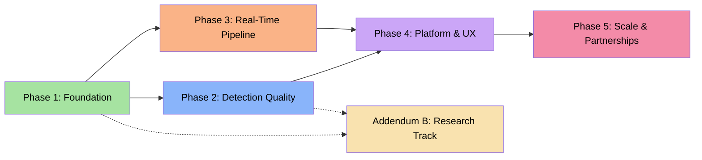

# CallShield Development Roadmap

**Roadmap revision:** 2026-06-27 · **Anchored to:** v1.7.12 (versionCode 40)

This roadmap merges the original Phase 1–5 plan, the Addendum A "peer-inspired track" (round-1/2/3 borrows from SpamBlocker, YACB, BlackList, Saracroche, adamff-dev, Fossify), and a fresh Addendum B harvested from a 30-source research sweep across OSS competitors, commercial competitors, FCC/IETF/ATIS standards, Android 15/16 platform changes, dependency changelogs, and adjacent-domain OSS (NetGuard, Pi-hole, rspamd patterns).

Source-cited. Every Addendum-B item maps to an entry in **Appendix — Source Index**. Anything that contradicts CallShield's stated philosophy (on-device, no accounts, no API keys, no cloud audio, FOSS) is either rejected or flagged.

---

## Current State (v1.7.12)

Working Android spam call/text blocker. **100 main Kotlin files, 37 JVM test files, and 15 instrumented test files.** Post-v1.7.10 work added `AppDatabase`, `SpamDataSource`, and `HotFeedDataSource` seams plus in-memory Room integration tests for the call, SMS, database-sync, and hot-feed pipelines, completed deterministic onboarding, dashboard, blocklist, and settings Compose UI coverage, added a Kover 0.9.8 debug coverage gate for the JVM-tested data/util core, added local lint/ktlint/detekt gates with baselines for existing static-analysis debt, introduced production-used domain use-case wrappers for spam checks, SMS checks, sync, blocklist management, and exports, moved `SpamCheckResult`/`SyncResult` into `domain/model`, added domain repository interfaces with a `SpamRepositoryAdapter` bridge, split the data layer so `SpamRepository` is now a compatibility facade over `data/repository` collaborators, completed Hilt DI for the app, services, workers, repositories, and detection helpers, completed the 1.8.1/1.8.2 localization/plural pass, and added v1.7.12 durable blocked-call logging with Room v10 `logKey` idempotency plus a pending-log retry worker. v1.7.12 also adds Cloudflare Worker rate-limit/dedup tests, Android 429 retry-delay feedback, and shared ASCII-only digit utilities. **645 JVM tests plus instrumented integration/UI/runtime coverage**.

15-layer detection pipeline (priority-sorted `IChecker` registry), GBT v3 ML scorer (20 features, atomic ModelState, pure-Kotlin inference) with logistic-regression v2 fallback, Jetpack Compose UI on Catppuccin Mocha + AMOLED, Room 2.8.4 with explicit migrations v5+, scheduled WorkManager hot-list + weekly sync from GitHub, RCS NotificationListener, CallerIdOverlayService with first-hit-wins lookup race, SIT-tone anti-autodialer, URLhaus phishing detection, Cloudflare Worker community reporting, and local Gradle/lint/release verification.

**Stack fingerprint:** AGP 8.10.1 · Kotlin 2.2.21 · Compose BOM 2026.05.00 · Room 2.8.4 · WorkManager 2.11.2 · OkHttp 5.3.2 · Moshi 1.15.1 · DataStore 1.2.1 · Kover 0.9.8 · ktlint 1.8.0 · detekt 1.23.8 · Hilt 2.58 · AndroidX Hilt Work 1.3.0 · minSdk 29 · targetSdk 36 · KSP for Room/Hilt codegen. **No KMP, no Glance, no SQLCipher.**


```mermaid
graph LR
    P1[Phase 1: Foundation] --> P2[Phase 2: Detection Quality]
    P1 --> P3[Phase 3: Real-Time Pipeline]
    P2 --> P4[Phase 4: Platform & UX]
    P3 --> P4
    P4 --> P5[Phase 5: Scale & Partnerships]
    P1 -.-> AB[Addendum B: Research Track]
    P2 -.-> AB

    style P1 fill:#a6e3a1,color:#000
    style P2 fill:#89b4fa,color:#000
    style P3 fill:#fab387,color:#000
    style P4 fill:#cba6f7,color:#000
    style P5 fill:#f38ba8,color:#000
    style AB fill:#f9e2af,color:#000
```

---

## Status Legend

`[DONE]` shipped in a tagged release · `[WIP]` partially landed · `[NOW]` next 1–2 releases · `[NEXT]` 3–6 releases out · `[LATER]` long-horizon · `[?]` under consideration · `[X]` rejected (with reasoning).

---

## Locked Design Philosophy (do not contradict without flagging)

1. **On-device first.** Every detection layer must work offline. Network calls are enrichments, never gating.
2. **No accounts, no sign-in, no telemetry.** Anonymous community reporting via Cloudflare Worker is the maximum ceiling.
3. **No required API keys.** Any third-party API must have a free, no-auth tier or be optional.
4. **No cloud audio.** Voice frames never leave the device. Deepfake / fingerprint detection runs locally or not at all.
5. **FOSS distribution.** Every release must be reproducible-buildable for F-Droid; no GMS-only code paths.
6. **5-second screening deadline.** `CallShieldScreeningService` must respond <5 s. All hot-path code is budget-aware.
7. **Backward compat for hot-list URLs.** GitHub-raw endpoints remain serve-and-respond for v1.2.x clients indefinitely.

Any roadmap item that contradicts these is flagged inline with **⚠ philosophy conflict** and given an explicit case.

---

## Phase 1 — Foundation (Testing, Architecture, Security)

**Goal:** engineering discipline, testability, security hardening. Every later phase depends on this.

### 1.1 Unit Tests for Detection Engines `[DONE]`

Shipped: 30 test files now exist under `app/src/test/`, covering `SpamMLScorer` (logistic + GBT), `SpamHeuristics`, `SmsContentAnalyzer`, `PhoneFormatter`, `CallbackDetector`, `BackupRestore`, `WildcardRule`, `HashWildcardMatcher`, `LogExporter`, `BlockingProfiles`, `BlockReasoning`, `CampaignDetector`, `TimeSchedule`, `PhoneNumberFuzzTest`, `JsonParsingFuzzTest`, `HotPathBenchmarkTest`, `OneShotNoticeGate`, `CrashReporter`, `DashboardStatusModel`, `Race`, plus `CallShieldScreeningServiceAutoMuteTest` and `StirShakenTrustCheckerTest` from v1.7.0.

### 1.2 Integration Tests `[DONE]`

| Task | Size | Depends | Files |
|------|------|---------|-------|
| 1.2.1 Full `isSpam()` pipeline test with in-memory Room — exercise core priority tiers and verify priority ordering | XL | `[DONE]` | `androidTest/.../data/SpamPipelineIntegrationTest.kt` |
| 1.2.2 Full `isSpamSms()` pipeline test — context trust bypass, keyword rules, content-analysis order | L | `[DONE]` | `androidTest/.../data/SmsPipelineIntegrationTest.kt` |
| 1.2.3 `syncFromGitHub()` mocked — verify atomic Room population via `@Transaction` | M | `[DONE]` | `androidTest/.../data/SyncIntegrationTest.kt` |
| 1.2.4 `HotListSyncWorker` — hot_numbers, hot_ranges, spam_domains parsed and stored, per-entry error tolerance | M | `[DONE]` | `androidTest/.../service/HotListSyncIntegrationTest.kt` |

`SpamRepository` now accepts a constructor-provided `AppDatabase` and `SpamDataSource`, and `HotDataSync` accepts a narrow `HotFeedDataSource`, so Android integration tests can use `Room.inMemoryDatabaseBuilder()` plus fake remote/hot-feed snapshots without starting the Hilt refactor.

### 1.3 Compose UI Tests `[DONE]`

Eleven instrumented test files now exist (`CrashReporterInstrumentedTest`, `DashboardStatusBadgeTest`, `ThemePrimitivesTest`, `SpamPipelineIntegrationTest`, `SmsPipelineIntegrationTest`, `SyncIntegrationTest`, `HotListSyncIntegrationTest`, `OnboardingTest`, `DashboardTest`, `BlocklistTest`, `SettingsTest`).

| Task | Size | Status | Files |
|------|------|--------|-------|
| 1.3.1 Onboarding flow — 4 pages, permission requests, call-screener setup | M | `[DONE]` | `androidTest/.../ui/screens/onboarding/OnboardingTest.kt` |
| 1.3.2 Dashboard — hero stats, sync freshness, screener banner | M | `[DONE]` | `androidTest/.../ui/screens/main/DashboardTest.kt` |
| 1.3.3 Blocklist — add/delete, wildcard validation, swipe-to-delete + undo | L | `[DONE]` | `androidTest/.../ui/screens/main/BlocklistTest.kt` |
| 1.3.4 Settings — toggle persistence, quiet-hours validation, schedule picker | M | `[DONE]` | `androidTest/.../ui/screens/settings/SettingsTest.kt` |

### 1.4 Local Verification Pipeline `[DONE]`

Kover 0.9.8 gates the debug JVM unit-test report for the data/util core at a 35% minimum line-coverage threshold; current filtered coverage is 41.06%. The filter intentionally excludes Compose screens, Android services, permission entrypoints, and `data.local` Room classes because Kover only collects local JVM test coverage, while those surfaces are guarded by instrumented integration/UI tests. Android lint, ktlint, and detekt run locally with baselines for existing style/complexity debt so new violations are visible without forcing a giant reformat/refactor in the same release. Ratchet Kover and reduce baselines as architecture seams land.

| Task | Size | Status | Files |
|------|------|--------|-------|
| 1.4.4 Code-coverage gate via Kover, ratcheting threshold (start 35%, +5% per release) | M | `[DONE]` | `app/build.gradle.kts` |
| 1.4.5 Lint + ktlint + detekt local gates | S | `[DONE]` | `.editorconfig`, `app/build.gradle.kts` |

### 1.5 Clean Architecture Refactor `[DONE]`

`SpamRepository` now preserves the public singleton/facade API while the concrete data responsibilities live under `data/repository`. The `IChecker` registry (Addendum A1) still owns detection ordering, now through `SpamRepositoryImpl`.

`domain/usecase` now contains thin, production-used wrappers: `CheckSpamUseCase`, `CheckSpamSmsUseCase`, `SyncDatabaseUseCase`, `ManageBlocklistUseCase`, and `ExportLogsUseCase`. The wrappers are wired into the live call/SMS screening paths, historical scanners, sync worker, and `MainViewModel` blocklist/export flows. `domain/model` now owns `SpamCheckResult` and `SyncResult`. `domain/repository` defines `SpamCheckRepository`, `SyncRepository`, and `BlocklistRepository`; `data/repository/SpamRepositoryAdapter` bridges those contracts to the facade. `data/repository/SpamRepositoryImpl` owns the 5-second checker path and Room-backed hot caches, `SettingsRepository` owns public/private DataStore reads and writes, `SyncRepository` owns GitHub/bundled/hot-list persistence, and `BlocklistRepository` owns blocklist, whitelist, rule, log, search, and cleanup operations.

| Task | Size | Status | Files |
|------|------|--------|-------|
| 1.5.1 Domain use cases: `CheckSpamUseCase`, `CheckSpamSmsUseCase`, `SyncDatabaseUseCase`, `ManageBlocklistUseCase`, `ExportLogsUseCase` | L | `[DONE]` | `domain/usecase/*.kt` |
| 1.5.2 Extract `SpamCheckResult` and settings models to domain layer | S | `[DONE]` | `domain/model/*.kt` |
| 1.5.3 Define repository interfaces in domain | M | `[DONE]` | `domain/repository/*.kt` |
| 1.5.4 Split `SpamRepository` into `SpamRepositoryImpl`, `SettingsRepository`, `SyncRepository`, `BlocklistRepository` | XL | `[DONE]` | `data/repository/*.kt` |

**Critical:** the call/SMS pipeline integration tests in 1.2.1/1.2.2, sync integration tests in 1.2.3, and hot-feed integration test in 1.2.4 now exist. Run the full integration set after each split to verify priority ordering and data-refresh behavior.

### 1.6 Dependency Injection (Hilt) `[NOW]`

Hilt is pinned to 2.58 for the current AGP 8.10.1 stack: 2.59+ requires AGP 9, while 2.58 explicitly held AGP 9 support back [src 31]. The app uses KSP for the Hilt compiler following the official Gradle setup [src 32], and AndroidX Hilt Work is pinned to the current stable 1.3.0 line [src 33].

| Task | Size | Status | Files |
|------|------|--------|-------|
| 1.6.1 Add Hilt 2.58 (AGP 8-compatible current line [src 31]) | S | `[DONE]` | `libs.versions.toml`, `build.gradle.kts` |
| 1.6.2 `@HiltAndroidApp` on `CallShieldApp` | S | `[DONE]` | `CallShieldApp.kt` |
| 1.6.3 `DatabaseModule` providing `AppDatabase` + `SpamDao` singletons | M | `[DONE]` | `di/DatabaseModule.kt` |
| 1.6.4 `RepositoryModule` binding interfaces to impls | M | `[DONE]` | `di/RepositoryModule.kt` |
| 1.6.5 `NetworkModule` providing the shared `OkHttpClient` (with cert pinning, see 1.7.2) | M | `[DONE]` | `di/NetworkModule.kt` |
| 1.6.6 `MainViewModel` → `@HiltViewModel` with injected use cases | M | `[DONE]` | `MainActivity.kt`, `MainViewModel.kt` |
| 1.6.7 `CallShieldScreeningService` → `@AndroidEntryPoint` | M | `[DONE]` | `CallShieldScreeningService.kt` |
| 1.6.8 Workers → `@HiltWorker` | M | `[DONE]` | `CallShieldApp.kt`, `SyncWorker.kt`, `HotListSyncWorker.kt`, `DigestWorker.kt` |
| 1.6.9 Convert `object` singletons (`SpamHeuristics`, `SmsContentAnalyzer`, `SpamMLScorer`, `CallbackDetector`, `SmsContextChecker`, `CampaignDetector`, `HashWildcardMatcher`) to injectable classes | L | `[DONE]` | data layer |

The helper objects are now constructor-injectable classes. `DetectionModule` provides their shared singleton instances, `CheckerDependencies` routes the live checker chain, screening service, app startup, hot-list sync, and model sync paths through that seam, and companion compatibility facades preserve existing UI/test utility call sites until those lower-risk callers are migrated.

**Risk:** migrate one consumer at a time; keep `getInstance()` fallback until all consumers migrated.

**Alternate (worth a spike):** Kotlin 2.2 `context(...)` parameters [src 20] could replace some `@Inject` for pure-logic boundaries. Don't do it as the primary DI strategy — Hilt's lifecycle binding is still needed for ViewModel/Worker scoping.

### 1.7 Security Hardening `[WIP]`

| Task | Size | Status | Files |
|------|------|--------|-------|
| 1.7.1 Move signing credentials to `local.properties` / env vars | S | `[DONE]` (`build.gradle.kts:33-47`) | — |
| 1.7.2 Certificate pinning — GitHub raw, Cloudflare Worker, all enrichment APIs. Use OkHttp 5 `CertificatePinner` (post-1.7.5 upgrade). | M | `[DONE]` v1.7.6 | `data/remote/HttpClient.kt`, `HttpClientTest.kt` |
| 1.7.3 Replace any `EncryptedSharedPreferences` with **Tink `AeadSerializer` + DataStore 1.2** [src 21]. AndroidX Security `EncryptedSharedPreferences` is on the deprecated path. | M | `[DONE]` v1.7.8: no `EncryptedSharedPreferences`/`androidx.security` path exists; DataStore upgraded to 1.2.1 and optional key moved to no-backup DataStore instead of adding an unused Tink path | `SpamRepository.kt`, settings layer |
| 1.7.4 Consider `android:allowBackup="false"` or restrict via existing `backup_rules.xml` (currently `allowBackup="true"`) | S | `[DONE]` v1.7.8: backups remain enabled for Room + public settings, while optional credentials now live under `noBackupFilesDir` and migrate out of backed-up DataStore | `backup_rules.xml`, `data_extraction_rules.xml`, `SpamRepository.kt` |
| 1.7.5 OkHttp 4.12 → **OkHttp 5.x** [src 18]. Adds Happy Eyeballs (RFC 8305), ZSTD compression module, JPMS, separate Android artifact, eliminates 4.x cookie-jar SSRF. | M | `[DONE]` v1.7.6 (`OkHttp 5.3.2`) | `data/remote/HttpClient.kt`, version catalog |
| 1.7.7 Reproducible-build verification — match SpamBlocker's F-Droid story. Eliminate build-timestamp embedding, enable Gradle `dependencyLocking`, document hash-comparison procedure. [src 1, src 24] | M | `[DONE]` v1.7.7 for source-content groundwork; signed byte-for-byte validation remains a F-Droid signature-copy follow-up | `build.gradle.kts`, CI, `docs/reproducible-builds.md`, `scripts/compare-apk-contents.ps1` |

### 1.8 String Extraction `[WIP]`

`955+ string resources` and 6 plural groups are already extracted (per README), and the 1.8.1 audit now records remaining literal buckets. Continue.

| Task | Size | Files |
|------|------|-------|
| 1.8.1 Audit all main Kotlin files for hardcoded user-facing strings | S | `[DONE]` `docs/hardcoded-string-audit.md`, `res/values/strings.xml` |
| 1.8.3 Number-formatting localization — display E.164 numbers in local format ((212) 555-0100 in en-US, +33 1 23 45 67 89 in fr-FR) using `libphonenumber` or `PhoneNumberUtils.formatNumber()` [Addendum B item B.27] | M | `data/PhoneFormatter.kt` |

> **2026-08-04 research note (1.8.3 / B.U.7):** prefer bundling over the platform API. `PhoneNumberUtils.formatNumber(String, String)` delegates to the OEM's *bundled* libphonenumber, so output varies per device and goes stale on old builds; the single-arg overloads are deprecated since API 21. Use `io.michaelrocks:libphonenumber-android:9.0.36` (tracks upstream within days, loads metadata via `AssetManager` as upstream's own Android guidance asks). Upstream jar is 360,303 bytes; measure the real APK delta with `bundletool` before committing — the size cost is the only open question, not the choice.

---

## Phase 2 — Detection Quality

**Goal:** behavioral features, STIR/SHAKEN parsing depth, feedback loops, fuzz/perf gates.

### 2.1 ML Model Upgrade `[DONE]`

GBT v3 (20 features, pure Kotlin inference, ~50 KB model, sigmoid output, atomic ModelState) shipped in v1.6.0. Logistic v2 fallback retained. JSON v3 schema with backward compat to v2. Threshold 0.7.

### 2.2 Behavioral / Temporal Features `[NEXT]`

| Task | Size | Depends | Files |
|------|------|---------|-------|
| 2.2.1 Time-of-day feature — sin/cos cyclical encoding | M | — | `SpamMLScorer.extractFeatures()` |
| 2.2.2 Call frequency feature — calls from this number in 7/30-day windows | M | — | `SpamMLScorer.extractFeatures()`, `SpamDao` |
| 2.2.3 Ring duration feature — short rings correlate with autodialers | M | — | `CallShieldScreeningService` |
| 2.2.4 Geographic distance feature — area-code distance from user's home area code | M | — | `SpamMLScorer.extractFeatures()` |
| 2.2.5 Retrain with expanded features (20 → 24-26) and ship a v4 weights JSON; keep v3 backward compat | M | 2.2.1-4 | `scripts/train_spam_model.py`, weights schema |

### 2.3 STIR/SHAKEN Enhancement `[WIP]`

v1.7.0 shipped the binary trusted-allow / FAIL-block layer. Remaining: **PASSporT JWT depth.**

| Task | Size | Depends | Files |
|------|------|---------|-------|
| 2.3.1 Parse full PASSporT token per **RFC 8225** (header `typ=passport, alg=ES256, x5u=…`; payload `iat`, `orig`, `dest`, optional `mky`) [src 14]. Android exposes the SIP `Identity` header on API 30+ via `Connection.getExtras()`. | L | — | New `data/StirShakenParser.kt` |
| 2.3.2 Per **RFC 8588 SHAKEN profile**: extract `attest` (A/B/C) and `origid` (UUID) claims. Display neutral carrier-authentication status in caller-ID overlay (A=caller+number authenticated, B=caller authenticated only, C=gateway only/no opinion); never label attestation as safe/trusted caller status. [src 14] | M | 2.3.1 | overlay UI, `BlockedCall` model |
| 2.3.3 `iat` replay-attack guard — reject tokens with `iat` more than 60 s old/skewed [src 14] | S | 2.3.1 | parser |
| 2.3.4 Persist `origid` UUID in BlockedCall for **RFC 9027 traceback** participation. Future-proofs FCC traceback consortium reporting. [src research, RFC 9027] | S | 2.3.1 | `SpamDao`, `BlockedCall` |
| 2.3.5 Attestation level as ML feature (A reduces score, C raises) | M | 2.3.1, 2.2.5 | `SpamMLScorer.extractFeatures()` |

### 2.4 Graph-Based Campaign Detection `[NEXT]`

In-memory `CampaignDetector` exists. Persist to Room and broaden window:

| Task | Size | Files |
|------|------|-------|
| 2.4.1 Persistent call-graph table — track NPA-NXX prefix clusters over 7-day window | L | new `data/local/CallGraphDao.kt` |
| 2.4.2 Burst rule — 5+ distinct numbers from same NPA-NXX in 1 h = active campaign | M | `data/CampaignDetector.kt` |
| 2.4.3 Geographic clustering across users (post-Phase 3 server) | L | server |

### 2.5 After-Call Feedback `[WIP]`

Skeleton ("Was this spam?" notification) shipped in v1.4.x. Remaining:

| Task | Size | Files |
|------|------|-------|
| 2.5.1 Bottom-sheet variant for in-app review (richer options: spam type, severity) | M | new UI, `CallShieldScreeningService` |
| 2.5.2 Persist feedback as labeled rows in Room | S | `SpamDao`, new `FeedbackEntry` |
| 2.5.3 Export feedback to training pipeline (opt-in) | M | `train_spam_model.py` |
| 2.5.4 On-device Bayesian classifier learning from local feedback (per-user) [Addendum B item B.13] | L | new `data/BayesianFeedbackModel.kt` |

### 2.6 Quality Gates `[WIP]`

| Task | Size | Status | Files |
|------|------|--------|-------|
| 2.6.1 Phone-number fuzz tests | `[DONE]` | `PhoneNumberFuzzTest.kt` exists | — |
| 2.6.2 `isSpam()` perf benchmark, hard ceiling 50 ms p99 | `[WIP]` | `HotPathBenchmarkTest.kt` exists; needs local gate | `androidTest/.../SpamCheckBenchmark.kt` |
| 2.6.4 **Baseline Profile** for screener cold-start [Addendum B item B.30] — first-call latency drops measurably; CallScreeningService has 5 s deadline | M | `[NEXT]` | `app/baselineprofile/` |

> **2026-08-04 research note (2.6.4):** profile the **service** path, not the launcher activity. A `StartupMode.COLD` activity benchmark will not cover Hilt graph construction, Room open, or the DataStore snapshot on the `onScreenCall` path after process death, which is the only latency that can drop a call. `androidx.benchmark` stable is 1.4.1 (1.5.0-beta01 2026-07-29); 1.5.0 flips `androidx.benchmark.requireAot` to default-true, which is what you want here.

---

## Phase 3 — Real-Time Data Pipeline

**Goal:** delta sync, two-tier DB, optional honeypot. **Caveat:** the existing GitHub-raw + 30 min hot-list pipeline already meets the realistic target. A full backend is justified only if community-report volume outgrows GitHub Pages economics.

### 3.1 API Server `[LATER]`

| Task | Size | Files |
|------|------|-------|
| 3.1.1 OpenAPI 3.0 spec — `POST /reports`, `GET /reputation/{number}`, `GET /blocklist/delta`, `POST /feedback` | M | `server/openapi.yaml` |
| 3.1.2 Ktor server impl (Kotlin shared models with Android) | XL | `server/` |
| 3.1.3 Migrate Cloudflare Worker to thin proxy for backward compat | L | `worker/`, server |
| 3.1.4 API-key gate (anonymous, rotating, rate-limited) + JWT for admin | L | `server/auth/` |
| 3.1.5 Token-bucket rate limiting | M | `server/middleware/` |
| 3.1.6 Abuse detection — coordinated false reports, report flooding | L | `server/abuse/` |

### 3.2 Real-Time Streaming `[LATER]`

| Task | Size | Files |
|------|------|-------|
| 3.2.1 Delta API — `last_sync_timestamp` → only-deltas response | L | `data/remote/ApiDataSource.kt`, server |

> **2026-08-04 research note (3.2.1):** the transfer problem does not need the server. `data/spam_numbers.json` is 11.1 MB / 413,876 lines / 51,463 numbers, is bundled into the APK by `stageBundledAssets`, is re-downloaded whole whenever its SHA moves (7× in the last 200 commits), and is rewritten wholesale in git each time. A static content-addressed shard set on GitHub raw — a small manifest of shard hashes plus per-shard files, fetch only the shards whose hash changed — gets most of the win with no backend and keeps the legacy full-file URL serving for old clients. See the P1 item in Research-Driven Additions (2026-08-04). YetAnotherCallBlocker's incremental daily deltas are the prior art.
| 3.2.2 SSE push for new hot numbers within 30 s of ingestion | XL | server, new `service/RealtimeSyncService.kt` |
| 3.2.3 Polling fallback when SSE drops | M | `HotListSyncWorker.kt` |

### 3.3 Two-Tier Database `[NEXT]`

This one is worth doing **without** a backend. The bloom filter alone gives O(μs) negative checks for the 32K → 100K+ growth path.

| Task | Size | Files |
|------|------|-------|
| 3.3.1 Bloom filter for the full DB (FPR < 0.1%) loaded at startup | L | new `data/local/BloomFilter.kt` |
| 3.3.2 Optional cloud-reputation API for filter-positive lookups | M | new `data/remote/ReputationApi.kt` |
| 3.3.3 Two-tier lookup: bloom (μs) → exact Room (ms) → optional cloud (10–100 ms) | M | `SpamRepositoryImpl.isSpam()` |
| 3.3.4 Strict offline mode toggle — disable all network calls including enrichment [Addendum B item B.21] | M | settings |

### 3.4 Honeypot Network `[?]`

⚠ Operational and privacy cost. Justified only at much higher scale. Defer behind Phase 5.

### 3.5 Geographic Clustering `[LATER]` (depends on 3.1)

---

## Phase 4 — Platform & UX

### 4.1 Kotlin Multiplatform → iOS `[LATER]`

| Task | Size | Files |
|------|------|-------|
| 4.1.1 Extract pure-logic into KMP module — `SpamMLScorer`, `SpamHeuristics` core, `PhoneFormatter`, `HashWildcardMatcher`, regex packs | XL | new `shared/` |
| 4.1.2 `expect`/`actual` for contacts, call log, DataStore/UserDefaults | XL | `shared/src/{commonMain,androidMain,iosMain}/` |
| 4.1.3 iOS shell — SwiftUI, settings, blocklist, detection toggle | XL | `iosApp/` |
| 4.1.4 **CallKit `CXCallDirectoryProvider`** + `CXCallDirectoryManager` reload | XL | `iosApp/CallShieldExtension/` |
| 4.1.5 **Saracroche-style 4-target architecture** [src 7]: Main App + Call Directory Extension + Unwanted Communication Reporting + Message Filter Extension | XL | iOS app |

**Constraint:** CallKit is preload-only; no real-time evaluation. Strategy: periodic CallKit reload from local DB; community reports via the shared backend if Phase 3 lands first.

### 4.2 Adaptive Layouts `[NEXT]`

| Task | Size | Files |
|------|------|-------|
| 4.2.1 `calculateWindowSizeClass()` + `androidx.window 1.3+` [src research] | S | `MainActivity.kt` |

> **2026-08-04 research note (4.2):** current stable is `androidx.window` **1.5.1**, which adds Large/XLarge breakpoints, `WindowMetrics` from an application `Context`, and direct `WindowLayoutInfo` getters; `WindowSizeClass` stays in androidx.window (no Material3 migration). This tranche also stops being optional at targetSdk 37: the orientation/resizability/aspect-ratio opt-out is removed for `sw >= 600dp` and `PROPERTY_COMPAT_ALLOW_RESTRICTED_RESIZABILITY` stops working. Note there are currently no `values-land` or `sw600dp` resources of any kind.
| 4.2.2 Tablet list-detail pane for blocklist / log | L | screen files |
| 4.2.3 Foldable `FoldingFeature` support | M | `MainActivity.kt` |
| 4.2.4 Landscape — horizontal stats, wider dialogs | M | screens |

### 4.3 InCallService Integration `[LATER]`

| Task | Size | Files |
|------|------|-------|
| 4.3.1 Custom call screen (Android 12+) — spam score, caller name, location, attestation badge on incoming UI | XL | new `service/CallShieldInCallService.kt` |
| 4.3.2 Replace overlay with InCallService when available; overlay fallback for older devices | M | `CallerIdOverlayService.kt` |

### 4.4 After-Call Bottom Sheet `[NEXT]`

| Task | Size | Files |
|------|------|-------|
| 4.4.1 "Was this spam?" bottom sheet (replaces notification chip for unknown allowed calls) — thumbs up/down + type selector | M | new UI |
| 4.4.2 Skip for contacts and whitelisted numbers | S | service |

### 4.5 Contact Enrichment `[LATER]`

| Task | Size | Files |
|------|------|-------|
| 4.5.1 Business-name lookup (OpenCNAM existing + Google Places optional) | M | `data/remote/BusinessLookup.kt` |
| 4.5.2 Business logo (Clearbit / Google Favicon) — cache aggressively | M | overlay UI |
| 4.5.3 Cache enrichment in Room with TTL | M | new `data/local/ContactEnrichmentDao.kt` |

### 4.6 Accessibility `[NEXT]`

| Task | Size | Files |
|------|------|-------|
| 4.6.1 Full TalkBack audit — `contentDescription` on all interactive elements (claimed 100+, audit to confirm) | L | all screens |
| 4.6.2 Dynamic-type at 200% font scale | M | `Theme.kt`, screens |
| 4.6.3 WCAG AA color-contrast audit on Catppuccin Mocha tokens | M | `Theme.kt` |
| 4.6.4 48 dp × 48 dp touch-target audit (claimed; verify) | M | screens |
| 4.6.5 Predictive-back full preview (Android 14+, polished in 16) [src 28] | M | `MainActivity.kt`, screens |

### 4.7 Localization `[LATER]`

| Task | Size | Files |
|------|------|-------|
| 4.7.2 Translate to ES, FR, DE, PT, JA, KO. Plus **TR, ES-MX, IT, NL, PL, RU** based on top OSS-app reach. Each L. | many | `res/values-{lang}/strings.xml` |
| 4.7.3 RTL layout (Arabic, Hebrew) | M | layouts |

> **2026-08-04 research note (4.7 — this is a zero, not a partial):** `res/` contains **no `values-<lang>` directory at all**, and `res/xml/locales_config.xml` lists only `en`. Everything else already exists — 1,103 strings, 30 `<plurals>`, `ui/AppLanguage.kt`, the in-app language picker, `autoStoreLocales`, `docs/TRANSLATING.md`, and `scripts/check_translations.py` wired into `verifyPipelineTests`. So the first locale is a data drop, not an engineering task, and it unblocks the whole tranche. Landing one locale end-to-end also proves the gate: `check_translations.py` fails on format-specifier drift, missing plural quantities, and any locale absent from `locales_config.xml` — none of which can be exercised today. Priority is not cosmetic: "US-centric, useless outside North America" is a recurring reason users abandon this app category (F-Droid forum "Best call blocker" thread).

### 4.8 Spam Trends Dashboard `[NEXT]`

| Task | Size | Files |
|------|------|-------|
| 4.8.1 Time-series chart — daily/weekly/monthly (Vico or custom Canvas) | L | `StatsScreen.kt` rewrite |
| 4.8.2 Source-breakdown pie | M | `StatsScreen.kt` |
| 4.8.3 Geographic heat map (depends on 3.5.3) | XL | new `SpamMapScreen.kt` |
| 4.8.4 Trend indicators with historical comparison | M | `StatsScreen.kt` |

---

## Phase 5 — Scale & Partnerships

### 5.1 Carrier Integration `[LATER]`

T-Mobile Scam Shield, AT&T ActiveArmor, Verizon Call Filter — all require business-development engagement [src 30]. Track but do not staff.

### 5.2 Federated Learning `[?]`

Roadmap retains as long-horizon. **Differential-privacy noise injection** is a hard requirement; small per-user spam-call counts (~20/month [src research]) make naive FL leak. Likely won't ship before 2027.

### 5.3 gRPC API `[LATER]` — depends on 3.1

### 5.4 Monetization & Audit `[?]`

| Task | Size | Files |
|------|------|-------|
| 5.4.1 Premium tier — Google Play Billing, feature gating ⚠ partial conflict with FOSS philosophy: F-Droid build must remain feature-complete; premium = Play-only convenience features (cloud sync, multi-device, priority support) | L | `data/billing/BillingManager.kt` |
| 5.4.2 Feature flags for premium | M | `domain/FeatureFlags.kt` |
| 5.4.3 Third-party security audit | XL | external |
| 5.4.4 White-label SDK for carrier integration | XL | new `sdk/` module |

---

## Cross-Cutting Concerns

### Database Migrations
v5+ are explicit; v1–4 use `fallbackToDestructiveMigration()`. **Acceptable for spam-numbers (re-syncable) but unacceptable** after FeedbackEntry (2.5.2), CallGraph (2.4.1), ContactEnrichment (4.5.3). Add `Migration` objects in lockstep with each new entity.

### Backward Compatibility
Hot-list sync and community reports use hardcoded GitHub-raw URLs on `master`. Phase 3 must keep these endpoints serving for v1.2.x clients indefinitely — that's the legacy contract.

### Privacy Architecture
Phases 2.5 (feedback), 3.4 (honeypot), 5.2 (federated) introduce data collection. Each requires explicit opt-in toggle, plain-language privacy disclosure, and a retention cap. No exceptions.

### Dependency Refresh Cadence
Quarterly dependency audit. v1.7.6 cleared the Kotlin/KSP, AGP, Room, and OkHttp tranche; v1.7.7 locked the resolved dependency graph and added the reproducible-build runbook; v1.7.8 cleared the DataStore 1.2.1 upgrade and optional-key backup boundary; v1.7.9 cleared the WorkManager 2.11.2 refresh with schedule-contract tests; v1.7.10 cleared the Compose BOM 2026.05.00 refresh and the newly enforced Compose resource-read lint. Addendum B.U continues with localization, predictive-back, widget, and Room driver follow-ups.

---

## Addendum A — Peer-Inspired Track (preserved)

Round-1/2/3 borrows from SpamBlocker (aj3423), YetAnotherCallBlocker (xynngh), BlackList (kaliturin), Saracroche (cbouvat), spam-call-blocker-app (adamff-dev), Fossify Phone.

| ID | Item | Status |
|----|------|--------|
| A1 | Priority-sorted `IChecker` pipeline | `[DONE]` v1.6.0 |
| A2 | Budget-aware lookup race (`Race.kt`) | `[DONE]` v1.6.0/1.7.1 |
| A3 | Push-alert / notification-context bridge (`PushAlertChecker`, `PushAlertRegistry`) + allowlist editor + revoke-on-next-ring feedback | `[DONE]` v1.6.0/1.7.1 |
| A4 | System block-list bridge (`BlockedNumberContract` read-only) | `[DONE]` v1.6.0 |
| A5 | Hash-wildcard / range patterns (`#` length-locked) | `[DONE]` v1.6.0 |
| A6 | Schedule-aware rules (days mask + hour window with overnight wrap) | `[DONE]` v1.6.0 |
| A7 | STIR trusted-caller allow + auto-mute low-confidence | `[DONE]` v1.7.0 |

---

## Addendum B — Round-3 Research Track (new, 2026-05-06)

Harvested from a 30-source sweep (see Appendix). Scoped to NEW signal not already covered above. Each item carries impact (1–5), effort (1–5), source ref.

### B.NOW — Now (1–2 releases)

| ID | Item | Impact | Effort | Source | Notes |
|----|------|-------:|-------:|--------|-------|
| B.U.1 | OkHttp 4.12 → **5.x** | 4 | 2 | [18] | `[DONE]` v1.7.6: upgraded to OkHttp 5.3.2 and kept the shared-client/derived-client contract. |
| B.U.2 | Room 2.6 → **2.8.4** | 3 | 2 | [research] | `[DONE]` v1.7.6: upgraded Room to 2.8.4 and updated the legacy destructive-migration overload. |
| B.U.3 | Kotlin 2.1 → **2.2.21** | 3 | 2 | [20] | `[DONE]` v1.7.6: upgraded AGP to 8.10.1 for Kotlin 2.2 R8 compatibility, aligned Kotlin/KSP to 2.2.21, and moved JVM target configuration to the compilerOptions DSL. |
| B.U.4 | DataStore 1.1 → **1.2.1** + Tink `AeadSerializer` | 4 | 3 | [21] | `[DONE]` v1.7.8: upgraded DataStore to 1.2.1; no deprecated encrypted-preferences path exists, so no unused Tink serializer was introduced; optional AbstractAPI key now migrates into private no-backup DataStore |
| B.U.5 | WorkManager 2.10 → **2.11.2** | 2 | 1 | [16] | `[DONE]` v1.7.9: upgraded WorkManager to 2.11.2, refreshed locks, and added schedule-contract tests for `SyncWorker`, `HotListSyncWorker`, and `DigestWorker` |
| B.U.6 | Compose BOM 2024.12 → latest stable (Compose Foundation 1.11+) | 3 | 2 | [17] | `[DONE]` v1.7.10: upgraded to Compose BOM 2026.05.00, refreshed locks across debug/release/unit-test configurations, and fixed Compose resource-read lint with `stringResource`, `pluralStringResource`, and `LocalResources` |
| B.D.4 | **Obtainium** spec — already supported via GitHub Releases; document the workflow + add SHA256 sidecar files to release artifacts | 2 | 1 | [research] | `[DONE]` v1.7.7: CI emits APK `.sha256` sidecars, local signed releases use `scripts/write-release-sha256.ps1`, and the hash workflow is documented. |
| B.F.1 | **Per-SIM filtering rules** (dual-SIM aware) | 4 | 3 | [SpamBlocker #59] | Top community ask; enables work/personal SIM split |
| B.F.2 | **Rule replay / debug mode** — re-run any logged call/SMS through the current ruleset | 4 | 2 | [SpamBlocker #386] | Power-user feature; cheap to add via `IChecker` registry already present |
| B.F.3 | **Strict (AND) vs Relaxed (OR) rule mode** | 3 | 2 | [SpamBlocker #377] | Replaces Inclusive/Exclusive terminology; clearer semantics |
| B.F.4 | **Auto-add regex-blocked numbers to local DB** for review | 3 | 1 | [SpamBlocker #355] | One-line change in pipeline |
| B.F.5 | **App-foreground context rule** — allow calls when banking / delivery app is active | 4 | 3 | [SpamBlocker #218] | UsageStatsManager + (existing) PushAlertChecker pattern |
| B.F.6 | **System-notification context rule** (delivery notification present → allow) | 3 | 2 | [SpamBlocker #350] | Already partially via PushAlertChecker; broaden source taxonomy |
| B.F.7 | **External blocklist URL subscription** (Pi-hole "gravity" model) — CSV/TXT/JSON URLs, scheduled refresh, merged into local DB with attribution | 5 | 3 | [26] | Architecturally aligns with our hot-list pattern |
| B.F.8 | **Spam-SMS auto-forward to 7726 (SPAM)** — opt-in carrier reporting | 3 | 1 | [15] | Pure UX win; FCC-recommended |
| B.U.7 | **Number formatting localization** via `PhoneNumberUtils.formatNumber()` or `libphonenumber` | 3 | 2 | [research] | Belongs in P1.8.3 |
| B.O.1 | **"Explain this decision" drawer** — tap any log entry to see rules triggered, in priority order, with confidence | 4 | 2 | [research] | Cheap with existing `IChecker` returning `BlockResult` reasons |
| B.U.8 | Predictive back full preview (where missing) | 2 | 2 | [28] | Polish for Android 14+ |
| B.S.2 | Certificate pinning for **all** API endpoints (existing `network_security_config.xml` covers cleartext only) | 4 | 2 | [research] | `[DONE]` v1.7.6: central OkHttp `CertificatePinner` covers GitHub, Cloudflare Worker, URLhaus, AbstractAPI, and caller-ID enrichment hosts. |
| B.U.9 | `androidx.glance` widget rewrite (current widget is `RemoteViews`); pin Glance ≥ 1.1.1 against **CVE-2024-7254** | 3 | 3 | [22] | **2026-08-04: defer.** Glance stable is *still* 1.1.1; 1.2.0 has sat at `rc01` since 2025-12-03 with no promotion while 1.3.0-alpha moved on to Wear widgets. Every reason to do the rewrite — `providePreview`/`setWidgetPreview`, `MultiProcessGlanceAppWidget`, `previewSize` — lives only in the RC. An 8-month-stalled RC is not a dependency to ship on. |

### B.NEXT — Next (3–6 releases)

| ID | Item | Impact | Effort | Source | Notes |
|----|------|-------:|-------:|--------|-------|
| B.F.9 | **ICS / iCal calendar-based scheduling** — parse iCal subscription URL into dynamic allow windows (shift workers, on-call) | 3 | 4 | [SpamBlocker #359] | Builds on existing per-rule schedule (A6) |
| B.F.10 | **DID range fuzzy matching** — allow numbers within ±N of a saved contact's number | 2 | 2 | [SpamBlocker #554] | **2026-08-04: raise impact to 4.** SpamBlocker shipped this as "Contact Prefix" in v5.7 (contact `xxxxxxx111` auto-allows `xxxxxxx000–999`). It is the cheapest available cut in the highest-cost false-positive class — clinic/PBX/school switchboards that rotate the last digits — which is one of the best-documented harm classes for call blockers. Prefer the prefix/length-locked form over ±N; it composes with the existing `HashWildcardMatcher`. |
| B.F.11 | **Family DB sharing** — opt-in mesh-share local user blocklist with N trusted devices via QR-paired keys | 4 | 4 | [SpamBlocker #549] | ⚠ Privacy: end-to-end encrypted; no server involvement |
| B.F.12 | **Wi-Fi SSID / geofence rule profiles** — corporate SSID = work rules, home SSID = relaxed | 3 | 3 | [research, NetGuard pattern] | Builds on existing BlockingProfiles |
| B.F.13 | **Bidirectional blocklist subscription** — publish your local list as a stable URL others can subscribe to (Pi-hole / OPML model) | 3 | 4 | [26] | Pairs with B.F.7 |
| B.F.14 | **Local REST API on loopback** for Tasker / Macrodroid / automation: `GET /api/stats/summary`, `POST /api/report`, `GET /api/log` | 3 | 3 | [26] | Pi-hole pattern; keep auth-by-shared-secret |
| B.O.2 | **Rule-coverage analytics** — % of incoming calls handled by each rule; identify dead rules | 3 | 2 | [research] | Reuses BlockReasoning |
| B.O.3 | **Advanced call-log filter** — by rule, number pattern, type, date range, confidence, source | 3 | 3 | [research] | Compose pre-existing log refactor |
| B.O.4 | **Diagnostic-report export** — one-tap CSV/JSON of log + rules + model version + device info for bug reports | 3 | 2 | [NetGuard PRO] | Ships with redaction option |
| B.D.5 | **Wear OS / Galaxy Watch tile** — last blocked call + one-tap temporary allow | 3 | 4 | [research] | Reuse Glance widget |
| B.M.1 | **TinyML audio fingerprint** — perceptual hash of first ~2 s of call audio (post-answer if user answers; opt-in only); compare to local hash set of known robocall recordings | 4 | 4 | [research, robocall fingerprinting lit] | ⚠ Audio capture must be opt-in, on-device only, and easy to disable. Aligns with the no-cloud-audio philosophy as long as features stay local |
| B.M.2 | **On-device Bayesian feedback model** — per-user weights learned from "Was this spam?" responses, blends into existing GBT score | 4 | 3 | [research] | Continuous personalization without leaking data |
| B.M.3 | **Campaign-detection alerts** — proactive notification when new burst is detected on user's number range | 3 | 2 | [research, FCC traceback] | Reuses existing CampaignDetector |
| B.S.3 | **Play Integrity Standard request** for community-report submission (`appAccessRiskVerdict` to detect overlay/screen-cap during submit) | 3 | 3 | [13] | ⚠ GMS-only; feature-flag for non-Play builds. Don't gate detection — only contribution |
| B.U.10 | Migrate to **Room SQLiteDriver** path (`room-sqlite-wrapper` from 2.7+) — sets up future KMP support | 3 | 4 | [research] | Lays groundwork for P4.1 |

### B.LATER — Later

| ID | Item | Impact | Effort | Source | Notes |
|----|------|-------:|-------:|--------|-------|
| B.E.1 | **Enterprise / MDM edition** — managed config, zero-touch enrollment, fleet allow/block list, audit-log export | 3 | 5 | [7] | Saracroche's differentiator; valuable revenue path under 5.4 monetization |
| B.E.2 | Android Work Profile awareness — separate rule sets per profile | 2 | 3 | [research] | Pairs with B.E.1 |
| B.S.4 | **Oblivious HTTP (OHTTP) relay** for enrichment lookups — server never sees user IP | 4 | 4 | [research] | Cloudflare/Fastly run public relays. Privacy maxima |
| B.M.4 | **Voice deepfake / synthetic-voice detection** (post-answer, on-device) | 4 | 5 | [Hiya 2025, FCC AI ban] | ⚠ Compute-heavy; only if a usable open model lands. Must run on-device. Otherwise reject |
| B.M.5 | Voice-print similarity scoring across rotating numbers | 3 | 5 | [research] | ⚠ Privacy: voice-print derivation only on opt-in opted calls; never persist raw audio |
| B.M.6 | **Automated call summarization & transcription** for screened calls | 3 | 5 | [Hiya AI Phone] | Only viable on-device with a small Whisper-class model; gate to higher-end devices |

### B.UNDER — Under Consideration (decide before staffing)

| ID | Item | Source | Decision Needed |
|----|------|--------|-----------------|
| B.?.1 | **AI Answer Bot** that engages spam callers to waste their time | [9 RoboKiller] | Legal/ethical: TCPA + state recording-consent laws; harassment exposure. Lean reject for now |
| B.?.2 | **Audio CAPTCHA screening** ("press 1 to connect") | [10 YouMail] | UX cost vs spam-reduction; pilot opt-in for unknown callers |
| B.?.3 | **Visual voicemail with spam-priority sorting** | [10 YouMail] | Scope creep — replaces dialer/voicemail. Keep in mind for a separate sister app |
| B.?.4 | **Auto-attendant / IVR for first-time callers** | [10 YouMail] | Same scope concern as B.?.3 |
| B.?.5 | **Truecaller-style B2B verified-caller display** | [29 Truecaller] | Requires partnerships; conflicts with on-device-first |

---

## Rejected (with reasoning)

| Item | Why rejected |
|------|--------------|
| Cloud upload of address book / contacts (Truecaller core) | Breaks **on-device-first** and **no-accounts** philosophy. |
| Cloud audio analysis for deepfake / transcription | Breaks **no-cloud-audio** philosophy. On-device variants of B.M.4–6 only. |
| Required sign-in / per-user cloud profile | Breaks **no-accounts** philosophy. |
| Always-on cloud reputation gating | Breaks **on-device-first** — every layer must work offline. |
| Hosts-file-style monetary blocklist (paid feeds) | Breaks **FOSS** philosophy. Free user-supplied URLs only (B.F.7 / B.F.13). |
| Built-in ads, ad-supported tier | Hard no — incompatible with sysadmin-grade tool positioning. |
| `fullBackupContent="true"` exposing API keys | Mitigated in v1.7.8 by moving the optional AbstractAPI key out of backed-up public DataStore and into a private DataStore under `noBackupFilesDir`; backups remain enabled for Room data and public settings. |

---

## Effort Summary

| Phase / Track | Tasks | Status |
|---|---|---|
| Phase 1 — Foundation | 35 | 1.1-1.6, 1.7.1-7, and 1.8.1-2 shipped; 1.8.3 remains |
| Phase 2 — Detection Quality | 22 | 2.1, 2.6.1 shipped; 2.3 partial; rest open |
| Phase 3 — Realtime Pipeline | 15 | open; 3.3 (bloom filter) is the next high-value tranche |
| Phase 4 — Platform & UX | 24 | open; 4.2 + 4.6 are the next high-value tranches |
| Phase 5 — Scale & Partnerships | 11 | open; treat as long-horizon |
| Addendum A — Peer track | 7 | shipped |
| **Addendum B — Research track** | **45** | **new — see B.NOW for the next-release shortlist** |

**Total: ~155 tracked items.** Phase ordering is a guideline; B.NOW items can land in parallel with Phase 1 tasks because most are isolated upgrades or self-contained features.

---

## Appendix — Source Index

| # | Source | Type |
|---|--------|------|
| 1 | https://github.com/aj3423/SpamBlocker | OSS competitor (1,489★, MIT, Kotlin) |
| 2 | https://github.com/aj3423/SpamBlocker/issues?q=sort:comments-desc | Community feature requests |
| 3 | https://gitlab.com/xynngh/YetAnotherCallBlocker | OSS competitor (GPLv3, Java) |
| 4 | https://github.com/adamff-dev/spam-call-blocker-app | OSS competitor (185★, GPLv3, Kotlin) |
| 5 | https://github.com/kaliturin/BlackList | OSS competitor (Apache, unmaintained ~2020) |
| 6 | https://github.com/FossifyOrg/Phone | OSS adjacent (privacy-first dialer, no internet) |
| 7 | https://codeberg.org/cbouvat/saracroche-ios | OSS competitor (4-target, Enterprise/MDM) |
| 8 | https://hiya.com/ | Commercial — Branded Call, AI Phone (deepfake detect, transcription) |
| 9 | https://robokiller.com/ | Commercial — Answer Bot, 1.5 B-number DB |
| 10 | https://youmail.com/ | Commercial — visual voicemail, audio CAPTCHA, auto-attendant |
| 11 | https://nomorobo.com/ | Commercial — 350 K honeypot sensors |
| 12 | https://developer.android.com/reference/android/telecom/CallScreeningService.CallResponse.Builder | Android API surface |
| 13 | https://developer.android.com/google/play/integrity/overview | Play Integrity verdicts (`appAccessRiskVerdict` etc.) |
| 14 | https://www.rfc-editor.org/rfc/rfc8225 | IETF — PASSporT JWT |
| 15 | https://www.fcc.gov/consumers/guides/stop-unwanted-robocalls-and-texts | FCC — STIR/SHAKEN, AI-voice ban, 7726 SPAM |
| 16 | https://developer.android.com/jetpack/androidx/releases/work | WorkManager 2.11.2 changelog |
| 17 | https://developer.android.com/jetpack/androidx/releases/compose-foundation | Compose Foundation 1.11.1 / Compose BOM 2026.05.00 |
| 18 | https://square.github.io/okhttp/changelogs/changelog/ | OkHttp 5.x changelog |
| 19 | https://kotlinlang.org/docs/whatsnew21.html | Kotlin 2.1.0 release |
| 20 | https://kotlinlang.org/docs/whatsnew22.html | Kotlin 2.2.0 release (context parameters, stable Base64) |
| 21 | https://developer.android.com/jetpack/androidx/releases/datastore | DataStore 1.2.1 + Tink `AeadSerializer` |
| 22 | https://developer.android.com/jetpack/androidx/releases/glance | Glance 1.1.1 (CVE-2024-7254) + 1.2 widget preview |
| 23 | https://accrescent.app/ | Distribution channel — key pinning, signed metadata |
| 24 | https://f-droid.org/en/docs/Inclusion_Policy/ | F-Droid inclusion (fastlane, reproducible) |
| 25 | https://github.com/M66B/NetGuard | OSS adjacent — per-app firewall patterns |
| 26 | https://github.com/pi-hole/pi-hole | OSS adjacent — Gravity blocklist subscription, REST API |
| 27 | https://developer.android.com/about/versions/15/features | Android 15 — `FLAG_STOPPED`, Private Space, 16 KB pages |
| 28 | https://developer.android.com/about/versions/16 | Android 16 — `Notification.ProgressStyle`, `SDK_INT_FULL` |
| 29 | https://truecaller.com/ | Commercial — B2B verified-caller, OTP-less verification SDK |
| 30 | https://www.t-mobile.com/scam-shield · https://www.att.com/security/active-armor/ · https://www.verizon.com/solutions-and-services/call-filter/ | Carrier — STIR/SHAKEN integration, paid add-ons |
| 31 | https://github.com/google/dagger/releases/tag/dagger-2.58 · https://github.com/google/dagger/releases/tag/dagger-2.59 | Dagger/Hilt — 2.58 held back AGP 9 support; 2.59 requires AGP 9 for the Hilt Gradle plugin |
| 32 | https://dagger.dev/hilt/gradle-setup | Hilt Gradle/KSP setup |
| 33 | https://developer.android.com/jetpack/androidx/releases/hilt · https://developer.android.com/training/dependency-injection/hilt-jetpack | AndroidX Hilt Work — stable 1.3.0 line and WorkManager `HiltWorkerFactory` setup |

Plus RFC 8588 (SHAKEN profile), RFC 9027 (Traceback), Apache SpamAssassin / rspamd (architectural pattern), CVE-2024-7254 (NVD), academic robocall-fingerprinting literature (Georgia Tech / Stony Brook 2019–2022) cited inline in research notes.

---

*Roadmap maintained alongside `CHANGELOG.md`. Update on every minor release; full re-research pass per major.*

## Research-Driven Additions

*No actionable research-driven items remain. See `Roadmap_Blocked.md` for blocked items awaiting external action.*

## Research-Driven Additions

## Research-Driven Additions (2026-07-20 pass — anchored to v1.7.13)

Fresh 30+ source sweep (SpamBlocker 2026 releases + issue tracker, SpamBlocker Extended, Fossify, Hiya/Truecaller, Google Phone/Messages security posts, FCC 2025 branding FNPRM, Android 16/17 behavior changes, dependency changelogs, NVD). Only NEW signal not already covered by Phases 1-5, Addendum A/B, or `Roadmap_Blocked.md`. Prior-pass local trust-hardening backlog (UI digit sanitization, bounded bodies, SMS redaction, URLhaus privacy mode, permission degraded-mode matrix, selective backup, external-blocklist subscription, temp allow/block) is verified SHIPPED and intentionally omitted.

### P1

### P0 — the deployed Cloudflare Worker is still stale (re-confirmed 2026-08-08)

The public report endpoint still runs a pre-v1.7.29 build. Two things are wrong with the
repo state and both must be fixed in the same pass:

1. `worker/wrangler.toml` still carries `id = "REPLACE_WITH_KV_NAMESPACE_ID"`. With no real
   namespace the rate-limit and dedup guards are permissive rather than merely racy.
2. Every queued report still arrives without `reporter_bucket` and without the `_rand`
   filename segment, which is the observable proof the deployed build predates v1.7.29.
   `generate_hot_list.py` skips bucket-less reports, so the 30-minute hot-list fast path is
   silently dead for **all** community reports.

**Cannot be done unattended.** `wrangler` reports "You are not authenticated", there is no
`wrangler-account.json` or `CLOUDFLARE_*` credential on this machine, and `wrangler login`
is an interactive OAuth flow. Steps once signed in:

```bash
cd worker
npx wrangler login
npx wrangler kv namespace create RATE_LIMIT   # paste the returned id into wrangler.toml
npx wrangler deploy
```

Verify afterwards by posting one report and confirming the queued file has both
`reporter_bucket` and a `_rand` segment.

### P2

### P3

## Research-Driven Additions (2026-07-20 pass 2 — code audit + distribution/a11y/i18n sweep)

Second same-day pass. Adds verified code-correctness bugs (grounded in file:line reads) plus distribution, security-CVE, accessibility, and i18n signal not covered by the earlier pass, Phases 1-5, Addendum A/B, or `Roadmap_Blocked.md`. No duplicates of the pass-1 items above.

### P1

### P2

### P3

## Deep-Audit Findings (2026-07-20 — not fixed this pass)

## Deep-Audit — Considered and Rejected (do not re-investigate)

- Blocking private/loopback/link-local hosts in `ExternalBlocklistParser.validateHttpUrl` (SSRF-shaping): REJECTED — the URL is user-entered and the body is not reflected; blocking private IPs would break the legitimate use case of subscribing to a LAN-hosted blocklist (e.g. a self-hosted NAS at 192.168.x). Impact on a mobile app is negligible.

## Research-Driven Additions (2026-07-21 pass — anchored to v1.7.16)

Fresh sweep on under-covered angles: OEM background-execution survival, distribution policy, service-rebind reliability, and testability. All items verified against current code (v1.7.16). The prior-pass correctness/hardening backlog is now shipped and intentionally omitted. Wear OS (B.D.5) and CNAP name-*trust* (the "Region / CNAP-based rules" item) already exist and are not duplicated; the block-by-name item below is the inverse (blocklist) direction and cross-references it.

### P1

### P2

### P3

## Research-Driven Additions (2026-07-21 pass 3 — distribution survival + detection reality-check, anchored to v1.7.18)

Focus areas not covered by prior passes: the Developer-Verification survival path (Accrescent, which self-registered — the option F-Droid can't offer), release-signing hygiene, model-retrain reproducibility, and closing an infeasible detection tranche. The reliability/survival backlog from the 2026-07-21 (v1.7.16) pass is now shipped (v1.7.17–v1.7.18).

### P1

### P2

### P3

## Research-Driven Additions

### P0

### P1

### P2

## Deep-Audit Backlog (2026-07-22 pass — anchored to v1.7.23; found, not fixed)

## Audit Findings — 2026-07-28 (anchored to v1.7.23, versionCode 51; found, not fixed)

Baseline at audit time: `testDebugUnitTest`, `ktlintCheck`, `detekt`, `lintDebug` all green (BUILD SUCCESSFUL, zero-baseline gates hold). No pre-existing failures. Every item below was traced to reachable code and cross-checked against the 2026-07-22 backlog, Roadmap_Blocked.md, and recent commits (9d3ce18/3bb393f/139430b etc.) to avoid duplicates. No emulator was available: UI findings marked Likely/Needs-repro need on-device visual confirmation.

### P1

### P2

### P3 — correctness / reliability

### P3 — performance / UX / visual

### P3 — maintainability / testing / docs

### Unaudited — needs a pass

## Audit Findings — 2026-07-30 (anchored to v1.7.27, versionCode 55; found, not fixed)

Baseline at audit time: all gates green. This session fixed ~40 findings across the worker, data pipeline, detection core, services, and UI (see CHANGELOG v1.7.27). The items below were verified real but deferred — each needs an operator action, a design decision, or a disproportionate refactor.

## Audit Findings — 2026-07-30 second pass (audit-only; anchored to v1.7.27, versionCode 55; found, NOT fixed)

Baseline at audit time: full JVM suite green at HEAD 2f250f1 (949 tests, exit 0); all static gates were green at this same commit earlier today. No pre-existing failures. Every item below was traced to reachable code (or measured against shipped data) during this pass and cross-checked against all prior audit sections, Roadmap_Blocked.md, CHANGELOG v1.7.27, and git history to avoid duplicates. No device/emulator was available: items needing on-device confirmation are marked Needs-repro or Likely.

### Unaudited this pass — needs a later pass


## Security Scan — 2026-07-30 (anchored to v1.7.29, rev 4bbe71d; found, NOT fixed)

Whole-repository security scan, production code prioritized over tests/fixtures. **The scan was halted before its verification stage ran, so every item below is an unverified researcher candidate — confirm each against the code before acting.** 30 raw candidates deduplicated to 18. One item (the Cloudflare account blob) was independently confirmed against git history during triage and is marked Verified. Items that restate an already-tracked entry are cross-referenced rather than duplicated.

### P1

### P2

### P3

## Research-Driven Additions (2026-08-02 exhaustive source sweep)

Only incomplete, implementation-ready items from the research pass are listed here. Authenticated feeds, deployment credentials, and product-policy decisions remain in `Roadmap_Blocked.md` and are not duplicated.

### P0 — safety and data integrity

- [ ] P0 — Add a source-evidence registry and confidence decay to the importer/database
  Why: FTC/FCC complaints are explicitly unverified; community rows, curated feeds, and verified identity signals have different meanings. A single `reports` count cannot prevent stale or spoofed entries from becoming permanent hard blocks.
  Evidence: `scripts/import_all_sources.py`, `data/spam_numbers.json`, RFC 9424, FTC DNC API/dataset, FCC unwanted-call dataset.
  Touches: importer schema, Room model/migration, sync/merge, lookup explanation, export/backup, pipeline fixtures.
  Acceptance: every imported row retains source ID, evidence type, license/attribution, first/last seen, retrieval timestamp, geographic scope, confidence tier, parser version, and TTL; expired/quarantined rows cannot hard-block; reruns are idempotent and preserve independent evidence.
  Complexity: L

- [ ] P0 — Fault-inject the five-second screening path and direct-boot stores
  Why: Android requires a `CallScreeningService` response within five seconds, and the current baseline still has a Direct Boot test failure. Provider creation, Room startup, cancellation, locked storage, and slow checkers must all prove an explicit fail-open response.
  Evidence: `CallShieldScreeningService.kt`, `DirectBootScreeningStoreTest`, Android `CallScreeningService` reference.
  Touches: service tests, Robolectric shadows, direct-boot fixtures, timing telemetry.
  Acceptance: tests cover cold start, lazy-provider exception, database lock/corruption, cancellation, no-number, contact fast path, and a checker that exceeds the budget; every case responds exactly once and never delays ringing.
  Complexity: M

### P1 — open feeds and explainable detection

- [ ] P1 — Build a permitted-feed adapter registry with health, license, and snapshot manifests
  Why: Adding more URLs without a common contract makes outages, terms violations, and stale data invisible. The registry should support public FTC/FCC, PhoneBlock hash/prefix, Saracroche, and authorized Nomorobo IRS while clearly separating optional commercial adapters.
  Evidence: `scripts/import_all_sources.py`, PhoneBlock API, Saracroche, Nomorobo IRS, F-Droid/redistribution guidance.
  Touches: Python adapters, `data/source-manifest.json` or generated manifest, CI/pipeline checks, README attribution.
  Acceptance: each source declares access mode, geography, license, attribution, cadence, parser version, checksum, accepted/rejected counts, last success/failure, and whether rows may be redistributed; restricted sources fail closed and cannot enter bundled data.
  Complexity: M

- [ ] P1 — Add incremental FTC/FCC ingestion with complaint-role and spoof-aware weighting
  Why: Both datasets expose caller and callback/business fields, but caller ID may be spoofed and complaints are unverified. Incremental windows, pagination/backoff, role retention, and callback-number correlation are more useful than bulk row accumulation.
  Evidence: FTC DNC API and FAQ, FCC Socrata dataset, FCC complaint guidance.
  Touches: importer queries, date cursors, deduplication, provenance fields, regression fixtures.
  Acceptance: incremental runs are bounded and resumable; 429/403 back off; caller-ID and callback numbers remain distinct; unverified complaints never become permanent hard blocks without corroboration; attribution is emitted in the snapshot.
  Complexity: M

- [ ] P1 — Add privacy-preserving PhoneBlock and regional prefix synchronization
  Why: PhoneBlock offers hash lookup, k-anonymous prefix checks, incremental blocklist/report flows; Saracroche and Ofcom/ARCEP numbering data add strong region/range context without requiring full global lists.
  Evidence: PhoneBlock API/site, Saracroche, Ofcom numbering data, ARCEP numbering/spoofing guidance.
  Touches: optional runtime lookup, importer, country/line-type normalization, source settings and privacy copy.
  Acceptance: raw numbers are not uploaded by default; hash/prefix requests are bounded and cached; license/attribution is shown; ranges are validated against country allocation and expire independently of exact-number reports.
  Complexity: L

- [ ] P1 — Persist campaign/churn evidence beyond exact-number matching
  Why: Current campaign work is mainly local/in-memory, while current research and field reports show rotating neighbor numbers, callback reuse, and cross-country campaigns. A number-only list will always lag spoofers.
  Evidence: existing `CampaignDetector`, worldwide robocall analysis, multiple-vantage studies, RFC 9424, FTC spoofing FAQ.
  Touches: Room campaign tables/retention, checker features, sync aggregation, explainability UI, benchmark fixtures.
  Acceptance: bounded time windows track prefix/neighbor velocity, callback reuse, source agreement, and number churn; evidence decays; one noisy report cannot activate a campaign; decisions remain deterministic and within the screening budget.
  Complexity: L

- [ ] P1 — Add STIR/SHAKEN, PASSporT/RCD, DNO, and line-type evidence as calibrated signals
  Why: Attestation and signed identity can reduce false positives, but B/C or missing attestation is not proof of spam and verified businesses can be compromised.
  Evidence: RFC 8224/8225/8588/9795, ATIS SHAKEN, Android call-screening/spoof-prevention guidance, libphonenumber.
  Touches: parser/model fields, checker calibration, lookup explanations, test vectors.
  Acceptance: A/B/C, missing, malformed, DNO/unassigned, VOIP/prepaid, and RCD cases have explicit tests; identity evidence can lower risk without overriding a manual emergency block or campaign verdict.
  Complexity: M

- [ ] P1 — Add Android 15–17 notification/SMS capability detection and degraded-mode UX
  Why: OTP redaction and delayed SMS access can remove content evidence; silently treating missing content as clean creates false negatives, while requesting disallowed roles creates privacy/policy risk.
  Evidence: Android 15/17 behavior-change documentation, `RcsNotificationListener`, `SmsReceiver`, blocked SMS-role item in `Roadmap_Blocked.md`.
  Touches: capability probe, notification classifier, settings/onboarding, instrumentation tests, localized explanations.
  Acceptance: redacted/delayed/unsupported states are detected, logged without message bodies, and shown as degraded—not spam or clean; no permission loop; sender/URL-only checks still work offline.
  Complexity: M

### P2 — SMS, regional, and optional enrichment

- [ ] P2 — Add separate URL/domain threat adapters for URLhaus, PhishTank, OpenPhish, and Safe Browsing/Web Risk
  Why: Scam texts often rotate phone numbers while reusing malicious links. These feeds provide high-value context but have different licenses, rate limits, and commercial terms.
  Evidence: URLhaus API, PhishTank API, OpenPhish feeds, Google Safe Browsing/Web Risk docs.
  Touches: URL canonicalization/cache, SMS verdict model, privacy settings, source manifest, fixtures.
  Acceptance: URL verdicts are cached with TTL and source/version, never upload raw SMS by default, distinguish malware/phishing/unknown, and cannot alone hard-block a call; commercial Safe Browsing use routes to Web Risk.
  Complexity: M

- [ ] P2 — Add sender-ID and regional numbering provenance
  Why: ACMA’s Sender ID Register, Ofcom allocations, ARCEP anti-spoofing, and Scamwatch patterns supply positive and negative regional evidence that a US-only number list cannot.
  Evidence: ACMA Sender ID Register, Ofcom numbering/CLI, ARCEP, Scamwatch, Bundesnetzagentur.
  Touches: SMS sender parser, locale/country settings, source data, explanation strings, regional tests.
  Acceptance: registered/allocated/unverified/unassigned states are modeled per region; unverified is elevated risk but not an automatic block; country-specific rules are disabled when locale/data is unavailable.
  Complexity: M

- [ ] P2 — Add source-health and false-positive review telemetry without collecting raw content
  Why: The last 200 commits are dominated by report churn. Operators need to see stale feeds, disagreement, number churn, and user “not spam” corrections before promoting a source or threshold.
  Evidence: git history, Truecaller positive-feedback decay model, RFC 9424, existing community report pipeline.
  Touches: local/admin export, pipeline report, source registry, calibration fixtures, privacy copy.
  Acceptance: reports show per-source freshness, corroboration, false-positive rate, and quarantine counts; raw contacts/SMS/call audio never leave the device; user corrections can decay or remove a source contribution.
  Complexity: M

- [ ] P2 — Define optional authenticated reputation adapters with strict key isolation
  Why: Hiya, Nomorobo, Tellows, First Orion, TNS, IPQS, Twilio, Call Control, and GSE expose useful risk/identity signals but require contracts, keys, quotas, and privacy review.
  Evidence: official developer portals and API documentation listed in `RESEARCH.md`.
  Touches: runtime adapter interface, encrypted/private settings, caching, consent UI, failure policy, operator docs.
  Acceptance: adapters are disabled by default, keys never enter APK/assets/backups/logs, requests are minimized and cached, outages fail open to local detection, and each provider’s terms/retention/region are displayed before enablement.
  Complexity: L

### P3 — evaluation and maintainability

- [ ] P3 — Build a multilingual, license-tracked SMS scam evaluation corpus
  Why: Research datasets distinguish spam from scam and expose brand/link/infrastructure features, while current regional sources cover different languages and sender conventions.
  Evidence: SmishTank, 153,551-message benchmark, user-report study, Google/Scamwatch/USPS taxonomies.
  Touches: redacted fixtures, dataset manifest, evaluator, hard-negative and locale tests.
  Acceptance: every example has license/provenance, language/category, sender/link metadata, and no personal data; precision/recall and false-positive budgets are reported by locale and message type.
  Complexity: M

- [ ] P3 — Add a reproducible dependency/advisory and release-drift gate
  Why: `CLAUDE.md`, F-Droid metadata, README, and the manifest currently disagree on release state; dependency and distribution drift can invalidate otherwise correct research and builds.
  Evidence: repository metadata audit, AndroidX/OkHttp/Kotlin/Hilt/Compose release pages, F-Droid build metadata guidance.
  Touches: Gradle verification, metadata checker, dependency lock/advisory report, release documentation.
  Acceptance: one command reports synchronized version strings, current source metadata, dependency versions, known advisories, and generated snapshot provenance; stale docs or missing changelog/attribution fail before release.
  Complexity: S

## Research-Driven Additions (2026-08-04 pass — anchored to v1.7.33, versionCode 61, rev 2834d0b)

Sweep focused on angles the 2026-08-02 source/feed pass did not cover: release delivery, the app's own runtime data plane, Android 16/17 behavior changes, OSS competitor releases through SpamBlocker v5.14, dependency currency + advisories, explainability UX prior art, and the FCC/WCAG obligations a blocker inherits. Every item below was verified against code, data files, published artifacts, or a primary source during this pass, and cross-checked against Phases 1-5, Addendum A/B, all prior Research-Driven and Audit sections, and `Roadmap_Blocked.md`. Items that restate a tracked entry are annotated inline above rather than duplicated here. Baseline at audit time: `testDebugUnitTest` = 991 tests, **1 failing** (`DirectBootScreeningStoreTest:27`).

### P0 — delivery and data integrity

- [ ] P0 — Sign every published release artifact with one stable release key, and make the signing gate a build dependency
  Why: the shipped `CallShield-v1.7.29.apk` is unsigned, so Android's PackageManager cannot install it — the current public download is inert, and the same defect blocks F-Droid, IzzyOnDroid and Accrescent at once.
  Evidence: `apksigner verify --print-certs CallShield-v1.7.29.apk` → `DOES NOT VERIFY / ERROR: Missing META-INF/MANIFEST.MF`; no `APK Sig Block 42` magic in the file; sha256 `f61d865c…3e01` and size 8,460,144 match the GitHub release asset byte-for-byte. `app/build.gradle.kts:88-93` sets `signingConfig = null` whenever the four `RELEASE_*` properties are absent instead of failing. `docs/fdroid/com.sysadmindoc.callshield.yml` pins `AllowedAPKSigningKeys: d179d0da…` with a `Binaries:` URL, which can never verify against an unsigned asset. IzzyOnDroid App Inclusion Policy (release-key signed, no debug/testOnly); Accrescent publish requirements (v2/v3 required, v1 and debug certs rejected, single cert).
  Touches: `app/build.gradle.kts` (release `signingConfig`), `scripts/verify-release-signing.ps1`, `scripts/write-release-sha256.ps1`, root `build.gradle.kts` (`verifyReleaseSigningPolicyTests`), `docs/reproducible-builds.md`, release runbook.
  Acceptance: `assembleRelease` fails loudly when release signing properties are missing rather than emitting an unsigned APK; `verify-release-signing.ps1` runs as a `finalizedBy`/`dependsOn` of the release artifact, not as a remembered manual step; `apksigner verify --print-certs` on the published artifact prints exactly one signer whose SHA-256 equals the `AllowedAPKSigningKeys` value in the F-Droid metadata; the runbook states which keystore is canonical and what happens to existing installs signed by a different key.
  Complexity: S (blocked on Open Question 1 in `RESEARCH.md` — which key is canonical)

- [ ] P0 — Stop depending on `android:priority="999"` for SMS ordering
  Why: on Android 16, for all apps regardless of `targetSdk`, ordered-broadcast `android:priority` is honoured only among receivers inside the declaring process. The manifest's stated ordering guarantee is already false on shipping devices, so the SMS path's behaviour relative to the default SMS app is now undefined rather than merely fragile.
  Evidence: `AndroidManifest.xml:101` (`<intent-filter android:priority="999">` on `SMS_RECEIVED`); Android 16 behavior changes for all apps (developer.android.com/about/versions/16/behavior-changes-all).
  Touches: `AndroidManifest.xml`, `service/SmsReceiver.kt`, `permissions/CallShieldPermissions.kt` (capability/degraded-mode matrix), onboarding and Settings copy, `test/.../service/SmsReceiverReassemblyTest.kt` and the Robolectric receiver tests.
  Acceptance: no code path assumes CallShield observed an SMS before another app did; ordering-dependent behaviour (suppression expectations, dedup against the inbox) is either removed or re-expressed as best-effort with an explicit degraded state; the capability matrix reports on Android 16+ that SMS interception is advisory, and user-facing copy no longer promises suppression it cannot deliver; a comment on the manifest attribute records why it is retained (pre-16 devices) rather than trusted.
  Complexity: M

### P1 — safety floors, auditability, and currency

- [ ] P1 — Add never-block floors for verification/OTP messages and emergency numbers, plus a redress-shaped blocked-call export
  Why: nothing in the SMS path exempts one-time-passcode traffic, so a 2FA code from an unfamiliar shortcode can be eaten by content keywords or by `sms_burst` (4650) — a harm class already aggravated by carrier-side A2P filtering. There is likewise no floor stopping any rule from blocking an emergency/PSAP number, and no export shaped like the redress obligation regulators impose on blockers.
  Evidence: grep for `otp` / `verification code` / `one-time` across `data/SmsContentAnalyzer.kt` and `service/SmsReceiver.kt` returns nothing; `EMERGENCY_NUMBERS` in `data/CallbackDetector.kt:328` exists only to recognise *outgoing* emergency calls for the callback grace window. 47 CFR §64.1200(k): a blocking provider may not block emergency calls, must cease erroneous blocking promptly on credible demonstration, and must supply on request a free list of blocked calls with date, time and calling number.
  Touches: new floor checkers above `MANUAL_WHITELIST` in `data/checker/IChecker.kt` + `Checkers.kt`, `data/SmsContentAnalyzer.kt`, `data/LogExporter.kt`, `ui/screens/main/BlockedLogScreen.kt`, `res/values/strings.xml`, checker priority regression tests.
  Acceptance: a message matching a bounded OTP/verification shape is never blocked and is logged as floor-exempted with the rule that *would* have fired; emergency and PSAP-shaped numbers cannot be blocked by any rule including a user rule, and the UI explains the refusal rather than silently ignoring the rule; a one-tap export produces a blocked-call list carrying date, time, number and reason, documented as the redress artefact; priority-ladder regression tests assert the floors outrank every existing checker. Cross-references the tracked Android 15-17 notification/SMS capability item, which handles *missing* evidence; this item handles *present* evidence that must not be acted on.
  Complexity: M

- [ ] P1 — Surface `BackgroundExecutionStatus` in the UI
  Why: the OEM background-kill classifier is fully implemented and unit-tested but has **zero production consumers**, so the app cannot tell a user that Xiaomi Autostart was reset by an OTA or that Samsung has put it to sleep — the failure mode where a blocker appears installed and does nothing.
  Evidence: `grep -rn BackgroundExecutionStatus app/src/main/java` matches only its own file; the only other reference is `test/.../permissions/BackgroundExecutionStatusTest.kt`. v1.7.17 shipped it with "UI surfacing deferred". dontkillmyapp.com documents the Xiaomi/Samsung behaviours; SpamBlocker issue #362 (46 comments) is the canonical "it silently stopped screening" thread.
  Touches: `permissions/BackgroundExecutionStatus.kt`, `ui/screens/main/DashboardScreen.kt` (or the Protection Test surface), `ui/MainViewModel.kt`, `service/ProtectionHealthWorker.kt`, `res/values/strings.xml`, a Compose test.
  Acceptance: when `isAtRisk()` is true the app shows a persistent, dismissible warning naming the specific risk and offering the battery-exemption / MIUI-autostart intent; the state is re-evaluated on resume and after `MY_PACKAGE_REPLACED`; the class has at least one production call site so it cannot silently rot again; the warning is covered by a Compose test.
  Complexity: S

- [ ] P1 — Gate the data pipeline against feed collapse and drain the report queue
  Why: the generated feeds went to zero on 2026-07-30 and nothing failed. `merge_community_reports.py` deletes `data/reports/*.json`, which the hot-list and spam-domain generators read, so running them out of order silently produces exactly the empty files now shipping. 35 reports sit unprocessed, roughly 29 of them fictional `+1555…` test numbers.
  Evidence: `data/hot_numbers.json`, `data/hot_ranges.json`, `data/spam_domains.json` all `count: 0`, `generated: 2026-07-30T17:40`; `data/reports/` holds 35 files; ordering hazard documented in `data/README.md`; `scripts/generate_hot_list.py`, `scripts/extract_spam_domains.py`, `scripts/merge_community_reports.py`.
  Touches: `scripts/generate_hot_list.py`, `scripts/extract_spam_domains.py`, `scripts/merge_community_reports.py`, `scripts/pipeline_io.py`, `scripts/run-pipeline-tests.ps1`, `scripts/test_report_pipeline.py`, `data/README.md`.
  Acceptance: a generator that would write an output smaller than a configured floor (absolute count and/or percentage of the previous run) exits non-zero and leaves the previous file in place unless an explicit `--allow-collapse` flag is passed; the merge refuses to run before the generators in the same cycle, or the generators no longer depend on files the merge deletes; the queued reports are drained and the resulting feeds committed; `data/README.md` documents all six files in `data/`, not just `spam_numbers.json`.
  Complexity: S

- [ ] P1 — Replace free-text `matchReason` with a stable enumerated reason code plus the matching rule ID
  Why: "why was this blocked" is currently a `String` threaded from checkers through Room, `BlockReasoning`, `MatchReasonLabels`, exports and the widget — which is why localizing it, filtering by it and exporting it have each been reworked separately, and why a log row cannot say *which* of your rules fired. Every serious filtering tool stores an enumerated code plus the responsible rule.
  Evidence: Pi-hole's query database stores a 19-value enumerated `status` plus `regex_id` and `additional_info` (docs.pi-hole.net/database/query-database/); NextDNS exposes `status`/`reasons`/`matched_name` in UI, API and CSV; uBlock Origin's logger shows the responsible filter in its own column. In-repo: `data/checker/IChecker.kt` `BlockResult`, `data/BlockReasoning.kt`, `ui/MatchReasonLabels.kt`, `data/model/BlockedCall.kt`, `data/LogExporter.kt`.
  Touches: `data/checker/IChecker.kt` + `Checkers.kt` (all 27 checkers), `data/model/BlockedCall.kt`, Room migration (v13 → v14), `data/BlockReasoning.kt`, `ui/MatchReasonLabels.kt`, `data/LogExporter.kt`, `ui/screens/main/BlockedLogScreen.kt`, `androidTest/.../AppDatabaseMigrationTest.kt`.
  Acceptance: every `BlockResult` carries a stable enum value and, where a user-authored rule matched, that rule's row id; the blocked log can filter by reason code; CSV/JSON export includes both code and rule id; existing rows migrate to their equivalent code without loss; the enum is the only thing tests and the widget switch on, and no consumer parses a human string. Supersedes the string-matching half of B.O.1 (the "explain this decision" drawer keeps its UI scope and becomes cheap once this lands).
  Complexity: M

- [ ] P1 — Extend the automated accessibility harness to every screen and raise its severity threshold
  Why: the harness already exists and already fails tests, but runs on 4 of roughly 21 screens at the default severity, so contrast, touch-target and traversal-order findings — the ones that matter for a red/green verdict UI — are never enforced. Meanwhile only 59 `contentDescription` sites exist across roughly 30 screens and about 16 uses of `semantics{}`/`heading()`/`liveRegion`/`customActions` repo-wide.
  Evidence: `enableAccessibilityChecks()` + `tryPerformAccessibilityChecks()` appear only in `DashboardTest`, `BlocklistTest`, `SettingsTest`, `OnboardingTest`; `libs.androidx.compose.ui.test.junit4.accessibility` is declared in `app/build.gradle.kts:277`. Unchecked: Lookup, NumberDetail, Stats, Activity, BlockedLog, RecentCalls, More, Changelog, ProtectionTest and the four settings sheets. WCAG 2.2 adds 2.5.8 Target Size (Min) and 2.5.7 Dragging Movements — the latter directly implicates swipe-to-unblock and swipe-to-delete.
  Touches: all `app/src/androidTest/.../ui/**` test files, `ui/AccessibilitySemantics.kt`, the screen files that fail, `app/build.gradle.kts` if a shared rule is extracted.
  Acceptance: every Compose screen and bottom sheet has an accessibility-check test; the validator is configured with `setThrowExceptionFor(WARNING)` so contrast and touch-target findings fail rather than log; every swipe action has an equivalent `customActions` entry (WCAG 2.2 2.5.7); no verdict is conveyed by colour alone — each red/green state carries text or a distinct icon. Cross-references 4.6.1-4.6.4, which remain the *manual* TalkBack/contrast/touch-target audits; this item is the automated floor that keeps them from regressing.
  Complexity: M

- [ ] P1 — Take the intermediate dependency refresh that does not require AGP 9
  Why: several pins are 18+ months stale and the whole tranche has been parked behind the blocked AGP-9 session, but AGP has a current **8.x** line (8.13.2) and KSP has decoupled from the Kotlin version, so most of the refresh is available without touching the AGP-9 gate. Recording this separately also corrects a false precondition: the AGP-9 tranche lists "Kotlin ≥ 2.4.20" as the CVE-2026-53914 fix, and 2.4.20 is still Beta2 with GA slated for September 2026 — no stable upgrade closes that CVE today, so the build-cache mitigation must stay in force regardless of when the tranche lands.
  Evidence: `gradle/libs.versions.toml`. Latest stable as of 2026-08-04: AGP 8.13.2 (8.x line; 9.3.1 is the 9.x line and needs Gradle 9.5+/API 37), Kotlin 2.4.10, KSP 2.3.11 (new decoupled versioning since 2.3.0), androidx.core-ktx 1.19.0, lifecycle 2.11.0, activity-compose 1.13.0, navigation 2.9.8, appcompat 1.7.1 (already current), Hilt 2.60.1, androidx.hilt 1.4.0, Compose BOM 2026.06.01 (patch-level: same ui/foundation 1.11.4 and material3 1.4.0), Robolectric 4.16.1, Kover 0.9.9, kotlinx-serialization-json 1.11.0. Already latest and needing no action: Room 2.8.4, WorkManager 2.11.2, DataStore 1.2.1, OkHttp 5.4.0, Moshi 1.15.2, ktlint 1.8.0 / 14.2.0, all `androidx.test` artifacts. GHSA-r937-wjx7-w2jp / CVE-2026-53914 for the Kotlin note.
  Touches: `gradle/libs.versions.toml`, `app/build.gradle.kts`, `build.gradle.kts`, all Gradle lockfiles, `gradle.properties` (keep the build-cache note).
  Acceptance: the refresh lands as one tranche with `:app:dependencies --write-locks` run across *all* configurations (a per-config run leaves stale lines in `debugAndroidTest`/release); every gate green afterwards; anything that genuinely requires AGP 9 is left behind with the version and the reason recorded; the CLAUDE.md claim that core-ktx 1.19.0 requires AGP 9.1 is re-verified against the release notes rather than carried forward. Note Robolectric 4.16.1 covers SDK 36 but SDK 37 needs the 4.17 beta — do not raise `compileSdk` in this tranche.
  Complexity: L

- [ ] P1 — Ship the spam database as content-addressed shards instead of one 11.1 MB file
  Why: `data/spam_numbers.json` is 11.1 MB / 413,876 lines / 51,463 numbers. It is bundled into every APK, re-downloaded in full whenever its SHA moves, and rewritten wholesale in git on each pipeline run — so a handful of new community rows costs every user a full re-download and costs the repository another 11 MB of history. This is the transfer half of the problem 3.3.1's bloom filter does not address.
  Evidence: `data/spam_numbers.json` (11,630,940 bytes); `app/build.gradle.kts:29-40` `stageBundledAssets`; `data/repository/SyncRepository.kt:57` SHA pre-check; the file changed 7 times in the last 200 commits. YetAnotherCallBlocker ships incremental daily deltas as prior art.
  Touches: `scripts/import_all_sources.py`, `scripts/pipeline_io.py`, `data/` layout plus a shard manifest, `data/remote/GitHubDataSource.kt`, `data/repository/SyncRepository.kt`, `service/SyncWorker.kt`, `app/build.gradle.kts` bundling, `androidTest/.../data/SyncIntegrationTest.kt`, `data/README.md`.
  Acceptance: a manifest lists shard ids with per-shard hashes; sync fetches only shards whose hash changed and applies them transactionally; a typical incremental update transfers under roughly 1% of the current bytes; the monolithic legacy URL keeps serving unchanged for existing clients (roadmap backward-compatibility contract); a partial or interrupted shard set never leaves the database in a half-applied state; the APK bundles the shard set, not the monolith. Cross-references 3.2.1, which remains the server-side delta API; this is the serverless form.
  Complexity: L

### P2 — trust surfaces, hygiene, and platform polish

- [ ] P2 — Record and surface checker errors and budget exhaustion
  Why: `CheckerPipeline.run()` abandons the remaining checkers when `ctx.timeLeftMillis() <= 0`, and a checker that throws or times out leaves no trace — so a decision made on partial evidence is indistinguishable in the log from one made on complete evidence. SpamBlocker surfaces exactly this with a per-record warning marker.
  Evidence: `data/checker/IChecker.kt` (`CheckerPipeline.run` budget abort), `data/repository/SpamRepositoryImpl.kt`; SpamBlocker v5.5 release notes (per-call log with an error/timeout indicator).
  Touches: `data/checker/IChecker.kt`, `data/model/BlockedCall.kt` (plus a Room migration, ideally the same one as the reason-code item), `ui/screens/main/BlockedLogScreen.kt`, `ui/screens/details/NumberDetailScreen.kt`, `res/values/strings.xml`.
  Acceptance: a decision reached with unevaluated checkers is flagged in the log with which stage was cut and why; per-checker exceptions are counted and shown in Protection Test; the flag is exported alongside the reason code; a test drives a deliberately slow checker and asserts both the flag and a single on-time response.
  Complexity: M

- [ ] P2 — Audit the existing rule set for conflicts, not just new rules
  Why: `RuleConflictAnalyzer` runs only at creation time from four `BlocklistScreen` call sites, so a rule set can become self-contradictory after a sync adds prefixes or after a whitelist edit, and the user is never told. "Why did it block my doctor" is the single question the product most needs to answer without a support round-trip.
  Evidence: `RuleConflictAnalyzer` referenced only at `ui/screens/main/BlocklistScreen.kt:1153,1243,1355,1681`; `data/RuleConflictAnalyzer.kt`. SpamBlocker v5.10 shipped standing priority-conflict detection with a visual warning.
  Touches: `data/RuleConflictAnalyzer.kt`, `ui/screens/main/BlocklistScreen.kt`, `ui/MainViewModel.kt`, `ui/screens/more/ProtectionTestScreen.kt`, `res/values/strings.xml`.
  Acceptance: the Rules surface shows a standing count of conflicting rules with a tap-through to each conflicting pair and the winning priority; the audit re-runs after sync and after any rule CRUD; resolving or dismissing a conflict persists; a unit test covers whitelist-vs-block, wildcard-vs-exact, and prefix-vs-hash conflicts.
  Complexity: M

- [ ] P2 — Add an in-app update check against the GitHub Releases API
  Why: direct-download users have no way to learn a release exists. F-Droid, IzzyOnDroid and Obtainium all notify their own users; the GitHub-Releases channel — currently the only working channel — notifies nobody.
  Evidence: no `releases/latest` or tag-name consumer exists in `app/src/main/java` (`data/remote/GitHubDataSource.kt:231` `checkForUpdate` is the spam-database SHA check, not an app-version check). `api.github.com` is already in `HttpClient.pinnedEndpointPins`, so no new pinned host is needed. `docs/reproducible-builds.md` already documents the Obtainium/SHA256 workflow for the same audience.
  Touches: `data/remote/GitHubDataSource.kt`, a new use case or `service/ProtectionHealthWorker.kt`, `ui/screens/more/MoreScreen.kt`, `service/NotificationHelper.kt`, `res/values/strings.xml`, a settings toggle, tests.
  Acceptance: an opt-in, default-off-or-clearly-disclosed periodic check compares the latest release tag to `BuildConfig.VERSION_NAME` and offers a link to the release page plus the published sha256; it never auto-downloads or self-installs (IzzyOnDroid forbids self-updating without opt-in); it fails silently offline and never blocks any detection path; a unit test covers newer, older, equal and malformed tags.
  Complexity: S

- [ ] P2 — Declare a Quick Settings tile category
  Why: without the category meta-data the tile lands in the generic "From apps you installed" bucket in the Android 16 QPR2+ tile picker, where users will not find it.
  Evidence: `AndroidManifest.xml:106-110` declares `CallShieldTileService` with icon, label and `BIND_QUICK_SETTINGS_TILE` but no `TILE_CATEGORY` meta-data; developer.android.com/develop/ui/views/quicksettings-tiles.
  Touches: `AndroidManifest.xml`.
  Acceptance: the `TileService` declares `android.service.quicksettings.TILE_CATEGORY`; the tile appears under the named category on an Android 16 QPR2+ device and still appears normally on older releases.
  Complexity: S

- [ ] P2 — Delete the orphaned pipeline scripts, or wire them into a gate
  Why: `scripts/import_blocklists.py` is referenced by nothing, is still runnable, and writes `data/spam_numbers.json` while bypassing the plausibility gate and source registry that `import_all_sources.py` added — a loaded footgun aimed at the one file the whole product depends on. `scripts/capture-pseudolocale-screens.ps1` is referenced by no doc, script or Gradle task.
  Evidence: a repo-wide grep finds no reference to either script outside itself; `scripts/import_all_sources.py` and `scripts/source_registry.py` are the current path; `data/README.md` documents the canonical sequence and does not include `import_blocklists.py`.
  Touches: `scripts/import_blocklists.py`, `scripts/capture-pseudolocale-screens.ps1`, `data/README.md`, `scripts/run-pipeline-tests.ps1`.
  Acceptance: `import_blocklists.py` is deleted (git history is the record) or reduced to a thin wrapper that routes through the registry and plausibility gates; the pseudolocale capture script is either wired into a documented verification step alongside `isPseudoLocalesEnabled` or removed; no script that writes `data/*.json` exists outside the documented sequence.
  Complexity: S

- [ ] P2 — Rebuild the Home screen around outcomes and stop duplicating the setup checklist
  Why: Home's hero is `3/3 Core setup · 8 Engines · Ready Database` over a five-row checklist that reads "Setup complete / Ready" forever, and that checklist restates the Settings "Permissions & access" group verbatim. The primary screen of a spam blocker shows no spam-blocking outcome, and its dominant content is permanently-solved onboarding state.
  Evidence: `fastlane/metadata/android/en-US/images/phoneScreenshots/01-home.png` and `05-settings.png`; `ui/screens/main/DashboardScreen.kt` (1,612 lines), `ui/screens/settings/SettingsScreen.kt` (2,077 lines). Settings additionally shows "Access checks ready: 2/2" above four rows. Home renders `Spam numbers loaded: 32624` with no locale grouping separator. Settings has an "Open app settings" section header with no row beneath it.
  Touches: `ui/screens/main/DashboardScreen.kt`, `ui/screens/main/DashboardStatusModel.kt`, `ui/screens/settings/SettingsScreen.kt`, `res/values/strings.xml`, `androidTest/.../DashboardTest.kt`.
  Acceptance: when setup is complete the checklist collapses to a single row that expands on demand, and the hero leads with blocked-call/text counts over a chosen window; the permissions list has exactly one authoritative home and the other surface links to it; the "2/2" count and the rows it summarises agree or the discrepancy is labelled; all counts render through the localized number formatter; "Open app settings" is a row with an affordance or is removed.
  Complexity: M

- [ ] P2 — Lead the Lookup verdict with the cause, not the confidence number
  Why: Lookup opens with a "100 / SPAM" gauge and "CallShield is 100% confident this number should be blocked", with the actual cause ("Detection: Manual block") below the fold. Reporting a user's own manual block back to them as model confidence is misleading, and a score-first verdict is exactly the pattern the mature comparators avoid.
  Evidence: `fastlane/metadata/android/en-US/images/phoneScreenshots/03-lookup.png`; `ui/screens/lookup/LookupScreen.kt`, `data/BlockReasoning.kt`. Gmail differentiates severity with chrome and always gives a causal sentence rather than a score; Windows Defender Protection History leads with threat name and action taken plus a per-item allow escape.
  Touches: `ui/screens/lookup/LookupScreen.kt`, `ui/screens/details/NumberDetailScreen.kt`, `data/BlockReasoning.kt`, `res/values/strings.xml`.
  Acceptance: the verdict card leads with a plain-language causal sentence naming the layer that decided and, where applicable, the user's own rule; confidence is shown only for genuinely probabilistic layers and never for deterministic ones; severity is distinguished by chrome as well as colour; a reverse action ("this is not spam" / "remove my rule") is reachable from the verdict card itself. Depends on the P1 reason-code item.
  Complexity: M

- [ ] P2 — Harden the Worker's KV state handling and rate-limit keying
  Why: a corrupt KV value throws out of an unguarded `JSON.parse` into the outer handler and is reported to the client as `400 Bad request`, hiding a server-side fault as a client error; and keying limits on `cf-connecting-ip || "unknown"` puts every header-less caller in one shared bucket and behaves badly under mobile CGNAT.
  Evidence: `worker/community-reports-worker.js:252` (unguarded parse), `:129`/`:172`/`:175-176` (rate-limit and dedup keying and windows).
  Touches: `worker/community-reports-worker.js`, `worker/community-reports-worker.test.mjs`.
  Acceptance: unparseable stored state is treated as absent and logged, not surfaced as a client error; a state fault returns 5xx while a malformed request returns 4xx; requests with no `cf-connecting-ip` are rejected or given their own conservative bucket rather than sharing one; tests cover corrupt state, missing IP, and shared-CGNAT-shaped traffic. Cross-references the operator-gated Cloudflare provisioning items in `Roadmap_Blocked.md` — this is the source-side half, which does not need the account.
  Complexity: S

- [ ] P2 — Adopt worker stop-reason diagnostics for background-execution failures
  Why: Android 16 tightened JobScheduler quotas by standby bucket and now counts jobs started while TOP or under a foreground service against quota, which is a plausible new cause of missed 30-minute hot-list and 6-hour syncs — and the app currently cannot distinguish a dropped run from one that never scheduled.
  Evidence: developer.android.com/about/versions/16/behavior-changes-all (JobScheduler quotas, `STOP_REASON_TIMEOUT_ABANDONED`); WorkManager 2.12.0-beta01 (2026-07-29) adds a `work-analytics` artifact and `WorkMetricsInfo` exposing `stopReasonCounts`, `runAttemptCount` and durations.
  Touches: `gradle/libs.versions.toml`, `service/SyncWorker.kt`, `service/HotListSyncWorker.kt`, `service/DigestWorker.kt`, `service/ProtectionHealthWorker.kt`, `ui/screens/more/ProtectionTestScreen.kt`.
  Acceptance: worker stop reasons and attempt counts are recorded locally and shown in Protection Test; a repeatedly quota-dropped worker produces a user-visible warning rather than silent staleness; nothing is transmitted off-device. Note WorkManager 2.12 is beta — prefer recording `WorkInfo.getStopReason()` on the current 2.11.2, which needs no dependency change, and adopt `work-analytics` only once it is stable.
  Complexity: S

### P3 — evaluation, docs, and a longer bet

- [ ] P3 — Reconcile the drifting version and count claims, and delete `PROJECT_CONTEXT.md`
  Why: `verifyReleaseMetadata` gates six files on a version bump but does not cover the claims that have actually drifted, and a file the repo's own `AGENTS.md` forbids is still present and stale in every material respect.
  Evidence: the README badge says 952 tests against an actual 991; `CLAUDE.md`'s header says v1.7.32/versionCode 60 against a build of 1.7.33/61; `data/README.md` documents 1 of 6 files in `data/`; `PROJECT_CONTEXT.md` (dated 2026-06-27) claims 100 Kotlin files vs 168 and Room v10 vs v13, and `AGENTS.md` lists it under "Never create".
  Touches: `README.md`, `CLAUDE.md`, `data/README.md`, `PROJECT_CONTEXT.md`, root `build.gradle.kts` (`verifyReleaseMetadata`).
  Acceptance: `verifyReleaseMetadata` additionally asserts the README test-count badge against the summed `tests="N"` across `test-results/*.xml` and the CLAUDE.md header version against `versionName`/`versionCode`; `data/README.md` documents every file in `data/`; `PROJECT_CONTEXT.md` is deleted.
  Complexity: S

- [ ] P3 — Add accessibility coverage for telephony-specific assistive paths
  Why: a call blocker sits directly in the path of assistive telephony, and two requirements are specific enough that a generic audit will miss them: RTT sessions must not be disrupted, and swipe-only actions must have non-drag equivalents.
  Evidence: source.android.com/docs/core/connect/rtt (RTT replaces TTY from Android 9, shares the voice number, supports 911); WCAG 2.2 2.5.7 Dragging Movements and 2.5.8 Target Size (Min) at w3.org/TR/WCAG22/; W3C COGA "Making Content Usable" for the plain-language requirement. In-repo: swipe-to-unblock and swipe-to-delete in `BlockedLogScreen.kt` / `BlocklistScreen.kt`; `ui/AccessibilitySemantics.kt`.
  Touches: `service/CallShieldScreeningService.kt`, `service/CallerIdOverlayService.kt`, `ui/screens/main/BlockedLogScreen.kt`, `ui/screens/main/BlocklistScreen.kt`, `ui/AccessibilitySemantics.kt`, instrumented tests.
  Acceptance: screening and the overlay are verified not to interfere with an RTT call, and the behaviour is documented; every swipe action has a `customActions` equivalent and a 48 dp or larger target; block reasons read as one plain sentence with no jargon (no bare "attestation C") when spoken by TalkBack. Cross-references 4.6, which owns the broader manual audit.
  Complexity: M

- [ ] P3 — Evaluate a bundled LiteRT text classifier for SMS scam detection
  Why: the current SMS content layer is 30+ regexes plus a spam-domain list, both of which rotate-and-evade cheaply, while the phone-number GBT model cannot see message text at all. A small bundled text classifier is the one detection upgrade that would work identically outside North America, where the 51k-number list is useless.
  Evidence: LiteRT's `CompiledModel` API is explicitly documented as operating independently of Google Play services, with GPU/NPU delegates across Qualcomm, MediaTek, Tensor and Samsung (developers.google.com/edge/litert) — unlike ML Kit GenAI / Gemini Nano, which are AICore-bound and blocked from background use. Published quantized smishing classifiers land around 127 KB with no accuracy loss; BiLSTM SMS-spam TFLite models sit under 1 MB. SpamBlocker's own on-device-AI request (issue #642) is open and unclaimed. Evasion is an active research area (arXiv 2505.18233), so the model must be one signal among several.
  Touches: new `data/SmsTextClassifier.kt`, `data/SmsContentAnalyzer.kt`, `data/checker/Checkers.kt` (a new low-priority SMS checker), `gradle/libs.versions.toml`, `scripts/` training plus evaluation, `app/build.gradle.kts` asset bundling.
  Acceptance: a spike answers, with measurements, whether a bundled classifier fits the APK budget and the SMS path's latency budget on a low-end device; if it proceeds, the model is bundled (never fetched at first use), the checker sits below every deterministic layer and cannot alone hard-block, precision and recall are reported per locale against a licensed corpus with a false-positive budget agreed first, and the model version is visible in Protection Test alongside the existing `ModelHealth`. Depends on the licensed multilingual corpus item from the 2026-08-02 pass.
  Complexity: XL
